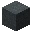
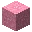

---
<!-- black_concrete__from__crafting_shapeless__use__black_concrete_powder.md -->

<!-- en_us -->

## Black Concrete | Crafting Table: Shapeless | Black Concrete Powder

<table>
	<tablebody>
		<tr>
			<td colspan="5">Crafting Table: Shapeless</td>
		</tr>
		<tr>
			<td></td>
			<td></td>
			<td></td>
			<td colspan="2"></td>
		</tr>
		<tr>
			<td></td>
			<td></td>
			<td></td>
			<td></td>
			<td></td>
		</tr>
		<tr>
			<td></td>
			<td></td>
			<td></td>
			<td colspan="2"></td>
		</tr>
	</tablebody>
</table>
<table>
	<tablebody>
		<tr>
			<td></td>
			<td>ICON</td>
			<td>NAME</td>
			<td>ID</td>
			<td>Count</td>
		</tr>
		<tr>
			<td></td>
			<td></td>
			<td>Black Concrete</td>
			<td>black_concrete</td>
			<td>1</td>
		</tr>
		<tr>
			<td></td>
			<td></td>
			<td>Black Concrete Powder</td>
			<td>black_concrete_powder</td>
			<td>1</td>
		</tr>
	</tablebody>
</table>

---
<!-- blue_concrete__from__crafting_shapeless__use__blue_concrete_powder.md -->

<!-- en_us -->

## Blue Concrete | Crafting Table: Shapeless | Blue Concrete Powder

<table>
	<tablebody>
		<tr>
			<td colspan="5">Crafting Table: Shapeless</td>
		</tr>
		<tr>
			<td></td>
			<td></td>
			<td></td>
			<td colspan="2"></td>
		</tr>
		<tr>
			<td></td>
			<td></td>
			<td></td>
			<td></td>
			<td></td>
		</tr>
		<tr>
			<td></td>
			<td></td>
			<td></td>
			<td colspan="2"></td>
		</tr>
	</tablebody>
</table>
<table>
	<tablebody>
		<tr>
			<td></td>
			<td>ICON</td>
			<td>NAME</td>
			<td>ID</td>
			<td>Count</td>
		</tr>
		<tr>
			<td></td>
			<td></td>
			<td>Blue Concrete</td>
			<td>blue_concrete</td>
			<td>1</td>
		</tr>
		<tr>
			<td></td>
			<td></td>
			<td>Blue Concrete Powder</td>
			<td>blue_concrete_powder</td>
			<td>1</td>
		</tr>
	</tablebody>
</table>

---
<!-- brown_concrete__from__crafting_shapeless__use__brown_concrete_powder.md -->

<!-- en_us -->

## Brown Concrete | Crafting Table: Shapeless | Brown Concrete Powder

<table>
	<tablebody>
		<tr>
			<td colspan="5">Crafting Table: Shapeless</td>
		</tr>
		<tr>
			<td></td>
			<td></td>
			<td></td>
			<td colspan="2"></td>
		</tr>
		<tr>
			<td></td>
			<td></td>
			<td></td>
			<td></td>
			<td></td>
		</tr>
		<tr>
			<td></td>
			<td></td>
			<td></td>
			<td colspan="2"></td>
		</tr>
	</tablebody>
</table>
<table>
	<tablebody>
		<tr>
			<td></td>
			<td>ICON</td>
			<td>NAME</td>
			<td>ID</td>
			<td>Count</td>
		</tr>
		<tr>
			<td></td>
			<td></td>
			<td>Brown Concrete</td>
			<td>brown_concrete</td>
			<td>1</td>
		</tr>
		<tr>
			<td></td>
			<td></td>
			<td>Brown Concrete Powder</td>
			<td>brown_concrete_powder</td>
			<td>1</td>
		</tr>
	</tablebody>
</table>

---
<!-- cyan_concrete__from__crafting_shapeless__use__cyan_concrete_powder.md -->

<!-- en_us -->

## Cyan Concrete | Crafting Table: Shapeless | Cyan Concrete Powder

<table>
	<tablebody>
		<tr>
			<td colspan="5">Crafting Table: Shapeless</td>
		</tr>
		<tr>
			<td></td>
			<td></td>
			<td></td>
			<td colspan="2"></td>
		</tr>
		<tr>
			<td></td>
			<td></td>
			<td></td>
			<td></td>
			<td></td>
		</tr>
		<tr>
			<td></td>
			<td></td>
			<td></td>
			<td colspan="2"></td>
		</tr>
	</tablebody>
</table>
<table>
	<tablebody>
		<tr>
			<td></td>
			<td>ICON</td>
			<td>NAME</td>
			<td>ID</td>
			<td>Count</td>
		</tr>
		<tr>
			<td></td>
			<td></td>
			<td>Cyan Concrete</td>
			<td>cyan_concrete</td>
			<td>1</td>
		</tr>
		<tr>
			<td></td>
			<td></td>
			<td>Cyan Concrete Powder</td>
			<td>cyan_concrete_powder</td>
			<td>1</td>
		</tr>
	</tablebody>
</table>

---
<!-- gray_concrete__from__crafting_shapeless__use__gray_concrete_powder.md -->

<!-- en_us -->

## Gray Concrete | Crafting Table: Shapeless | Gray Concrete Powder

<table>
	<tablebody>
		<tr>
			<td colspan="5">Crafting Table: Shapeless</td>
		</tr>
		<tr>
			<td></td>
			<td></td>
			<td></td>
			<td colspan="2"></td>
		</tr>
		<tr>
			<td></td>
			<td></td>
			<td></td>
			<td></td>
			<td></td>
		</tr>
		<tr>
			<td></td>
			<td></td>
			<td></td>
			<td colspan="2"></td>
		</tr>
	</tablebody>
</table>
<table>
	<tablebody>
		<tr>
			<td></td>
			<td>ICON</td>
			<td>NAME</td>
			<td>ID</td>
			<td>Count</td>
		</tr>
		<tr>
			<td></td>
			<td></td>
			<td>Gray Concrete</td>
			<td>gray_concrete</td>
			<td>1</td>
		</tr>
		<tr>
			<td></td>
			<td></td>
			<td>Gray Concrete Powder</td>
			<td>gray_concrete_powder</td>
			<td>1</td>
		</tr>
	</tablebody>
</table>

---
<!-- green_concrete__from__crafting_shapeless__use__green_concrete_powder.md -->

<!-- en_us -->

## Green Concrete | Crafting Table: Shapeless | Green Concrete Powder

<table>
	<tablebody>
		<tr>
			<td colspan="5">Crafting Table: Shapeless</td>
		</tr>
		<tr>
			<td></td>
			<td></td>
			<td></td>
			<td colspan="2"></td>
		</tr>
		<tr>
			<td></td>
			<td></td>
			<td></td>
			<td></td>
			<td></td>
		</tr>
		<tr>
			<td></td>
			<td></td>
			<td></td>
			<td colspan="2"></td>
		</tr>
	</tablebody>
</table>
<table>
	<tablebody>
		<tr>
			<td></td>
			<td>ICON</td>
			<td>NAME</td>
			<td>ID</td>
			<td>Count</td>
		</tr>
		<tr>
			<td></td>
			<td></td>
			<td>Green Concrete</td>
			<td>green_concrete</td>
			<td>1</td>
		</tr>
		<tr>
			<td></td>
			<td></td>
			<td>Green Concrete Powder</td>
			<td>green_concrete_powder</td>
			<td>1</td>
		</tr>
	</tablebody>
</table>

---
<!-- light_blue_concrete__from__crafting_shapeless__use__light_blue_concrete_powder.md -->

<!-- en_us -->

## Light Blue Concrete | Crafting Table: Shapeless | Light Blue Concrete Powder

<table>
	<tablebody>
		<tr>
			<td colspan="5">Crafting Table: Shapeless</td>
		</tr>
		<tr>
			<td></td>
			<td></td>
			<td></td>
			<td colspan="2"></td>
		</tr>
		<tr>
			<td></td>
			<td></td>
			<td></td>
			<td></td>
			<td></td>
		</tr>
		<tr>
			<td></td>
			<td></td>
			<td></td>
			<td colspan="2"></td>
		</tr>
	</tablebody>
</table>
<table>
	<tablebody>
		<tr>
			<td></td>
			<td>ICON</td>
			<td>NAME</td>
			<td>ID</td>
			<td>Count</td>
		</tr>
		<tr>
			<td></td>
			<td></td>
			<td>Light Blue Concrete</td>
			<td>light_blue_concrete</td>
			<td>1</td>
		</tr>
		<tr>
			<td></td>
			<td></td>
			<td>Light Blue Concrete Powder</td>
			<td>light_blue_concrete_powder</td>
			<td>1</td>
		</tr>
	</tablebody>
</table>

---
<!-- light_gray_concrete__from__crafting_shapeless__use__light_gray_concrete_powder.md -->

<!-- en_us -->

## Light Gray Concrete | Crafting Table: Shapeless | Light Gray Concrete Powder

<table>
	<tablebody>
		<tr>
			<td colspan="5">Crafting Table: Shapeless</td>
		</tr>
		<tr>
			<td></td>
			<td></td>
			<td></td>
			<td colspan="2"></td>
		</tr>
		<tr>
			<td></td>
			<td></td>
			<td></td>
			<td></td>
			<td></td>
		</tr>
		<tr>
			<td></td>
			<td></td>
			<td></td>
			<td colspan="2"></td>
		</tr>
	</tablebody>
</table>
<table>
	<tablebody>
		<tr>
			<td></td>
			<td>ICON</td>
			<td>NAME</td>
			<td>ID</td>
			<td>Count</td>
		</tr>
		<tr>
			<td></td>
			<td></td>
			<td>Light Gray Concrete</td>
			<td>light_gray_concrete</td>
			<td>1</td>
		</tr>
		<tr>
			<td></td>
			<td></td>
			<td>Light Gray Concrete Powder</td>
			<td>light_gray_concrete_powder</td>
			<td>1</td>
		</tr>
	</tablebody>
</table>

---
<!-- lime_concrete__from__crafting_shapeless__use__lime_concrete_powder.md -->

<!-- en_us -->

## Lime Concrete | Crafting Table: Shapeless | Lime Concrete Powder

<table>
	<tablebody>
		<tr>
			<td colspan="5">Crafting Table: Shapeless</td>
		</tr>
		<tr>
			<td></td>
			<td></td>
			<td></td>
			<td colspan="2"></td>
		</tr>
		<tr>
			<td></td>
			<td></td>
			<td></td>
			<td></td>
			<td></td>
		</tr>
		<tr>
			<td></td>
			<td></td>
			<td></td>
			<td colspan="2"></td>
		</tr>
	</tablebody>
</table>
<table>
	<tablebody>
		<tr>
			<td></td>
			<td>ICON</td>
			<td>NAME</td>
			<td>ID</td>
			<td>Count</td>
		</tr>
		<tr>
			<td></td>
			<td></td>
			<td>Lime Concrete</td>
			<td>lime_concrete</td>
			<td>1</td>
		</tr>
		<tr>
			<td></td>
			<td></td>
			<td>Lime Concrete Powder</td>
			<td>lime_concrete_powder</td>
			<td>1</td>
		</tr>
	</tablebody>
</table>

---
<!-- magenta_concrete__from__crafting_shapeless__use__magenta_concrete_powder.md -->

<!-- en_us -->

## Magenta Concrete | Crafting Table: Shapeless | Magenta Concrete Powder

<table>
	<tablebody>
		<tr>
			<td colspan="5">Crafting Table: Shapeless</td>
		</tr>
		<tr>
			<td></td>
			<td></td>
			<td></td>
			<td colspan="2"></td>
		</tr>
		<tr>
			<td></td>
			<td></td>
			<td></td>
			<td></td>
			<td></td>
		</tr>
		<tr>
			<td></td>
			<td></td>
			<td></td>
			<td colspan="2"></td>
		</tr>
	</tablebody>
</table>
<table>
	<tablebody>
		<tr>
			<td></td>
			<td>ICON</td>
			<td>NAME</td>
			<td>ID</td>
			<td>Count</td>
		</tr>
		<tr>
			<td></td>
			<td></td>
			<td>Magenta Concrete</td>
			<td>magenta_concrete</td>
			<td>1</td>
		</tr>
		<tr>
			<td></td>
			<td></td>
			<td>Magenta Concrete Powder</td>
			<td>magenta_concrete_powder</td>
			<td>1</td>
		</tr>
	</tablebody>
</table>

---
<!-- orange_concrete__from__crafting_shapeless__use__orange_concrete_powder.md -->

<!-- en_us -->

## Orange Concrete | Crafting Table: Shapeless | Orange Concrete Powder

<table>
	<tablebody>
		<tr>
			<td colspan="5">Crafting Table: Shapeless</td>
		</tr>
		<tr>
			<td></td>
			<td></td>
			<td></td>
			<td colspan="2"></td>
		</tr>
		<tr>
			<td></td>
			<td></td>
			<td></td>
			<td></td>
			<td></td>
		</tr>
		<tr>
			<td></td>
			<td></td>
			<td></td>
			<td colspan="2"></td>
		</tr>
	</tablebody>
</table>
<table>
	<tablebody>
		<tr>
			<td></td>
			<td>ICON</td>
			<td>NAME</td>
			<td>ID</td>
			<td>Count</td>
		</tr>
		<tr>
			<td></td>
			<td></td>
			<td>Orange Concrete</td>
			<td>orange_concrete</td>
			<td>1</td>
		</tr>
		<tr>
			<td></td>
			<td></td>
			<td>Orange Concrete Powder</td>
			<td>orange_concrete_powder</td>
			<td>1</td>
		</tr>
	</tablebody>
</table>

---
<!-- pink_concrete__from__crafting_shapeless__use__pink_concrete_powder.md -->

<!-- en_us -->

## Pink Concrete | Crafting Table: Shapeless | Pink Concrete Powder

<table>
	<tablebody>
		<tr>
			<td colspan="5">Crafting Table: Shapeless</td>
		</tr>
		<tr>
			<td></td>
			<td></td>
			<td></td>
			<td colspan="2"></td>
		</tr>
		<tr>
			<td></td>
			<td></td>
			<td></td>
			<td></td>
			<td></td>
		</tr>
		<tr>
			<td></td>
			<td></td>
			<td></td>
			<td colspan="2"></td>
		</tr>
	</tablebody>
</table>
<table>
	<tablebody>
		<tr>
			<td></td>
			<td>ICON</td>
			<td>NAME</td>
			<td>ID</td>
			<td>Count</td>
		</tr>
		<tr>
			<td></td>
			<td></td>
			<td>Pink Concrete</td>
			<td>pink_concrete</td>
			<td>1</td>
		</tr>
		<tr>
			<td></td>
			<td></td>
			<td>Pink Concrete Powder</td>
			<td>pink_concrete_powder</td>
			<td>1</td>
		</tr>
	</tablebody>
</table>

---
<!-- purple_concrete__from__crafting_shapeless__use__purple_concrete_powder.md -->

<!-- en_us -->

## Purple Concrete | Crafting Table: Shapeless | Purple Concrete Powder

<table>
	<tablebody>
		<tr>
			<td colspan="5">Crafting Table: Shapeless</td>
		</tr>
		<tr>
			<td></td>
			<td></td>
			<td></td>
			<td colspan="2"></td>
		</tr>
		<tr>
			<td></td>
			<td></td>
			<td></td>
			<td></td>
			<td></td>
		</tr>
		<tr>
			<td></td>
			<td></td>
			<td></td>
			<td colspan="2"></td>
		</tr>
	</tablebody>
</table>
<table>
	<tablebody>
		<tr>
			<td></td>
			<td>ICON</td>
			<td>NAME</td>
			<td>ID</td>
			<td>Count</td>
		</tr>
		<tr>
			<td></td>
			<td></td>
			<td>Purple Concrete</td>
			<td>purple_concrete</td>
			<td>1</td>
		</tr>
		<tr>
			<td></td>
			<td></td>
			<td>Purple Concrete Powder</td>
			<td>purple_concrete_powder</td>
			<td>1</td>
		</tr>
	</tablebody>
</table>

---
<!-- red_concrete__from__crafting_shapeless__use__red_concrete_powder.md -->

<!-- en_us -->

## Red Concrete | Crafting Table: Shapeless | Red Concrete Powder

<table>
	<tablebody>
		<tr>
			<td colspan="5">Crafting Table: Shapeless</td>
		</tr>
		<tr>
			<td></td>
			<td></td>
			<td></td>
			<td colspan="2"></td>
		</tr>
		<tr>
			<td></td>
			<td></td>
			<td></td>
			<td></td>
			<td></td>
		</tr>
		<tr>
			<td></td>
			<td></td>
			<td></td>
			<td colspan="2"></td>
		</tr>
	</tablebody>
</table>
<table>
	<tablebody>
		<tr>
			<td></td>
			<td>ICON</td>
			<td>NAME</td>
			<td>ID</td>
			<td>Count</td>
		</tr>
		<tr>
			<td></td>
			<td></td>
			<td>Red Concrete</td>
			<td>red_concrete</td>
			<td>1</td>
		</tr>
		<tr>
			<td></td>
			<td></td>
			<td>Red Concrete Powder</td>
			<td>red_concrete_powder</td>
			<td>1</td>
		</tr>
	</tablebody>
</table>

---
<!-- white_concrete__from__crafting_shapeless__use__white_concrete_powder.md -->

<!-- en_us -->

## White Concrete | Crafting Table: Shapeless | White Concrete Powder

<table>
	<tablebody>
		<tr>
			<td colspan="5">Crafting Table: Shapeless</td>
		</tr>
		<tr>
			<td></td>
			<td></td>
			<td></td>
			<td colspan="2"></td>
		</tr>
		<tr>
			<td></td>
			<td></td>
			<td></td>
			<td></td>
			<td></td>
		</tr>
		<tr>
			<td></td>
			<td></td>
			<td></td>
			<td colspan="2"></td>
		</tr>
	</tablebody>
</table>
<table>
	<tablebody>
		<tr>
			<td></td>
			<td>ICON</td>
			<td>NAME</td>
			<td>ID</td>
			<td>Count</td>
		</tr>
		<tr>
			<td></td>
			<td></td>
			<td>White Concrete</td>
			<td>white_concrete</td>
			<td>1</td>
		</tr>
		<tr>
			<td></td>
			<td></td>
			<td>White Concrete Powder</td>
			<td>white_concrete_powder</td>
			<td>1</td>
		</tr>
	</tablebody>
</table>

---
<!-- yellow_concrete__from__crafting_shapeless__use__yellow_concrete_powder.md -->

<!-- en_us -->

## Yellow Concrete | Crafting Table: Shapeless | Yellow Concrete Powder

<table>
	<tablebody>
		<tr>
			<td colspan="5">Crafting Table: Shapeless</td>
		</tr>
		<tr>
			<td></td>
			<td></td>
			<td></td>
			<td colspan="2"></td>
		</tr>
		<tr>
			<td></td>
			<td></td>
			<td></td>
			<td></td>
			<td></td>
		</tr>
		<tr>
			<td></td>
			<td></td>
			<td></td>
			<td colspan="2"></td>
		</tr>
	</tablebody>
</table>
<table>
	<tablebody>
		<tr>
			<td></td>
			<td>ICON</td>
			<td>NAME</td>
			<td>ID</td>
			<td>Count</td>
		</tr>
		<tr>
			<td></td>
			<td></td>
			<td>Yellow Concrete</td>
			<td>yellow_concrete</td>
			<td>1</td>
		</tr>
		<tr>
			<td></td>
			<td></td>
			<td>Yellow Concrete Powder</td>
			<td>yellow_concrete_powder</td>
			<td>1</td>
		</tr>
	</tablebody>
</table>

