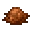

---
<!-- black_concrete_powder__from__crafting_shapeless__use__tag_concrete_powder.md -->

<!-- en_us -->

## Black Concrete Powder | Crafting Table: Shapeless | Concrete Powder

<table>
	<tablebody>
		<tr>
			<td colspan="5">Crafting Table: Shapeless</td>
		</tr>
		<tr>
			<td></td>
			<td></td>
			<td></td>
			<td colspan="2"></td>
		</tr>
		<tr>
			<td></td>
			<td></td>
			<td></td>
			<td></td>
			<td></td>
		</tr>
		<tr>
			<td></td>
			<td></td>
			<td></td>
			<td colspan="2"></td>
		</tr>
	</tablebody>
</table>
<table>
	<tablebody>
		<tr>
			<td></td>
			<td>ICON</td>
			<td>NAME</td>
			<td>ID</td>
			<td>Count</td>
		</tr>
		<tr>
			<td></td>
			<td></td>
			<td>Black Concrete Powder</td>
			<td>black_concrete_powder</td>
			<td>1</td>
		</tr>
		<tr>
			<td></td>
			<td></td>
			<td><a>Concrete Powder</a></td>
			<td><a>concrete_powder</a></td>
			<td>1</td>
		</tr>
		<tr>
			<td></td>
			<td></td>
			<td>Black Dye</td>
			<td>black_dye</td>
			<td>1</td>
		</tr>
	</tablebody>
</table>

[Concrete Powder](../../../en_us/tags/tag__concrete_powder.md)

---
<!-- blue_concrete_powder__from__crafting_shapeless__use__tag_concrete_powder.md -->

<!-- en_us -->

## Blue Concrete Powder | Crafting Table: Shapeless | Concrete Powder

<table>
	<tablebody>
		<tr>
			<td colspan="5">Crafting Table: Shapeless</td>
		</tr>
		<tr>
			<td></td>
			<td></td>
			<td></td>
			<td colspan="2"></td>
		</tr>
		<tr>
			<td></td>
			<td></td>
			<td></td>
			<td></td>
			<td></td>
		</tr>
		<tr>
			<td></td>
			<td></td>
			<td></td>
			<td colspan="2"></td>
		</tr>
	</tablebody>
</table>
<table>
	<tablebody>
		<tr>
			<td></td>
			<td>ICON</td>
			<td>NAME</td>
			<td>ID</td>
			<td>Count</td>
		</tr>
		<tr>
			<td></td>
			<td></td>
			<td>Blue Concrete Powder</td>
			<td>blue_concrete_powder</td>
			<td>1</td>
		</tr>
		<tr>
			<td></td>
			<td></td>
			<td><a>Concrete Powder</a></td>
			<td><a>concrete_powder</a></td>
			<td>1</td>
		</tr>
		<tr>
			<td></td>
			<td></td>
			<td>Blue Dye</td>
			<td>blue_dye</td>
			<td>1</td>
		</tr>
	</tablebody>
</table>

[Concrete Powder](../../../en_us/tags/tag__concrete_powder.md)

---
<!-- brown_concrete_powder__from__crafting_shapeless__use__tag_concrete_powder.md -->

<!-- en_us -->

## Brown Concrete Powder | Crafting Table: Shapeless | Concrete Powder

<table>
	<tablebody>
		<tr>
			<td colspan="5">Crafting Table: Shapeless</td>
		</tr>
		<tr>
			<td></td>
			<td></td>
			<td></td>
			<td colspan="2"></td>
		</tr>
		<tr>
			<td></td>
			<td></td>
			<td></td>
			<td></td>
			<td></td>
		</tr>
		<tr>
			<td></td>
			<td></td>
			<td></td>
			<td colspan="2"></td>
		</tr>
	</tablebody>
</table>
<table>
	<tablebody>
		<tr>
			<td></td>
			<td>ICON</td>
			<td>NAME</td>
			<td>ID</td>
			<td>Count</td>
		</tr>
		<tr>
			<td></td>
			<td></td>
			<td>Brown Concrete Powder</td>
			<td>brown_concrete_powder</td>
			<td>1</td>
		</tr>
		<tr>
			<td></td>
			<td></td>
			<td><a>Concrete Powder</a></td>
			<td><a>concrete_powder</a></td>
			<td>1</td>
		</tr>
		<tr>
			<td></td>
			<td></td>
			<td>Brown Dye</td>
			<td>brown_dye</td>
			<td>1</td>
		</tr>
	</tablebody>
</table>

[Concrete Powder](../../../en_us/tags/tag__concrete_powder.md)

---
<!-- cyan_concrete_powder__from__crafting_shapeless__use__tag_concrete_powder.md -->

<!-- en_us -->

## Cyan Concrete Powder | Crafting Table: Shapeless | Concrete Powder

<table>
	<tablebody>
		<tr>
			<td colspan="5">Crafting Table: Shapeless</td>
		</tr>
		<tr>
			<td></td>
			<td></td>
			<td></td>
			<td colspan="2"></td>
		</tr>
		<tr>
			<td></td>
			<td></td>
			<td></td>
			<td></td>
			<td></td>
		</tr>
		<tr>
			<td></td>
			<td></td>
			<td></td>
			<td colspan="2"></td>
		</tr>
	</tablebody>
</table>
<table>
	<tablebody>
		<tr>
			<td></td>
			<td>ICON</td>
			<td>NAME</td>
			<td>ID</td>
			<td>Count</td>
		</tr>
		<tr>
			<td></td>
			<td></td>
			<td>Cyan Concrete Powder</td>
			<td>cyan_concrete_powder</td>
			<td>1</td>
		</tr>
		<tr>
			<td></td>
			<td></td>
			<td><a>Concrete Powder</a></td>
			<td><a>concrete_powder</a></td>
			<td>1</td>
		</tr>
		<tr>
			<td></td>
			<td></td>
			<td>Cyan Dye</td>
			<td>cyan_dye</td>
			<td>1</td>
		</tr>
	</tablebody>
</table>

[Concrete Powder](../../../en_us/tags/tag__concrete_powder.md)

---
<!-- gray_concrete_powder__from__crafting_shapeless__use__tag_concrete_powder.md -->

<!-- en_us -->

## Gray Concrete Powder | Crafting Table: Shapeless | Concrete Powder

<table>
	<tablebody>
		<tr>
			<td colspan="5">Crafting Table: Shapeless</td>
		</tr>
		<tr>
			<td></td>
			<td></td>
			<td></td>
			<td colspan="2"></td>
		</tr>
		<tr>
			<td></td>
			<td></td>
			<td></td>
			<td></td>
			<td></td>
		</tr>
		<tr>
			<td></td>
			<td></td>
			<td></td>
			<td colspan="2"></td>
		</tr>
	</tablebody>
</table>
<table>
	<tablebody>
		<tr>
			<td></td>
			<td>ICON</td>
			<td>NAME</td>
			<td>ID</td>
			<td>Count</td>
		</tr>
		<tr>
			<td></td>
			<td></td>
			<td>Gray Concrete Powder</td>
			<td>gray_concrete_powder</td>
			<td>1</td>
		</tr>
		<tr>
			<td></td>
			<td></td>
			<td><a>Concrete Powder</a></td>
			<td><a>concrete_powder</a></td>
			<td>1</td>
		</tr>
		<tr>
			<td></td>
			<td></td>
			<td>Gray Dye</td>
			<td>gray_dye</td>
			<td>1</td>
		</tr>
	</tablebody>
</table>

[Concrete Powder](../../../en_us/tags/tag__concrete_powder.md)

---
<!-- green_concrete_powder__from__crafting_shapeless__use__tag_concrete_powder.md -->

<!-- en_us -->

## Green Concrete Powder | Crafting Table: Shapeless | Concrete Powder

<table>
	<tablebody>
		<tr>
			<td colspan="5">Crafting Table: Shapeless</td>
		</tr>
		<tr>
			<td></td>
			<td></td>
			<td></td>
			<td colspan="2"></td>
		</tr>
		<tr>
			<td></td>
			<td></td>
			<td></td>
			<td></td>
			<td></td>
		</tr>
		<tr>
			<td></td>
			<td></td>
			<td></td>
			<td colspan="2"></td>
		</tr>
	</tablebody>
</table>
<table>
	<tablebody>
		<tr>
			<td></td>
			<td>ICON</td>
			<td>NAME</td>
			<td>ID</td>
			<td>Count</td>
		</tr>
		<tr>
			<td></td>
			<td></td>
			<td>Green Concrete Powder</td>
			<td>green_concrete_powder</td>
			<td>1</td>
		</tr>
		<tr>
			<td></td>
			<td></td>
			<td><a>Concrete Powder</a></td>
			<td><a>concrete_powder</a></td>
			<td>1</td>
		</tr>
		<tr>
			<td></td>
			<td></td>
			<td>Green Dye</td>
			<td>green_dye</td>
			<td>1</td>
		</tr>
	</tablebody>
</table>

[Concrete Powder](../../../en_us/tags/tag__concrete_powder.md)

---
<!-- light_blue_concrete_powder__from__crafting_shapeless__use__tag_concrete_powder.md -->

<!-- en_us -->

## Light Blue Concrete Powder | Crafting Table: Shapeless | Concrete Powder

<table>
	<tablebody>
		<tr>
			<td colspan="5">Crafting Table: Shapeless</td>
		</tr>
		<tr>
			<td></td>
			<td></td>
			<td></td>
			<td colspan="2"></td>
		</tr>
		<tr>
			<td></td>
			<td></td>
			<td></td>
			<td></td>
			<td></td>
		</tr>
		<tr>
			<td></td>
			<td></td>
			<td></td>
			<td colspan="2"></td>
		</tr>
	</tablebody>
</table>
<table>
	<tablebody>
		<tr>
			<td></td>
			<td>ICON</td>
			<td>NAME</td>
			<td>ID</td>
			<td>Count</td>
		</tr>
		<tr>
			<td></td>
			<td></td>
			<td>Light Blue Concrete Powder</td>
			<td>light_blue_concrete_powder</td>
			<td>1</td>
		</tr>
		<tr>
			<td></td>
			<td></td>
			<td><a>Concrete Powder</a></td>
			<td><a>concrete_powder</a></td>
			<td>1</td>
		</tr>
		<tr>
			<td></td>
			<td></td>
			<td>Light Blue Dye</td>
			<td>light_blue_dye</td>
			<td>1</td>
		</tr>
	</tablebody>
</table>

[Concrete Powder](../../../en_us/tags/tag__concrete_powder.md)

---
<!-- light_gray_concrete_powder__from__crafting_shapeless__use__tag_concrete_powder.md -->

<!-- en_us -->

## Light Gray Concrete Powder | Crafting Table: Shapeless | Concrete Powder

<table>
	<tablebody>
		<tr>
			<td colspan="5">Crafting Table: Shapeless</td>
		</tr>
		<tr>
			<td></td>
			<td></td>
			<td></td>
			<td colspan="2"></td>
		</tr>
		<tr>
			<td></td>
			<td></td>
			<td></td>
			<td></td>
			<td></td>
		</tr>
		<tr>
			<td></td>
			<td></td>
			<td></td>
			<td colspan="2"></td>
		</tr>
	</tablebody>
</table>
<table>
	<tablebody>
		<tr>
			<td></td>
			<td>ICON</td>
			<td>NAME</td>
			<td>ID</td>
			<td>Count</td>
		</tr>
		<tr>
			<td></td>
			<td></td>
			<td>Light Gray Concrete Powder</td>
			<td>light_gray_concrete_powder</td>
			<td>1</td>
		</tr>
		<tr>
			<td></td>
			<td></td>
			<td><a>Concrete Powder</a></td>
			<td><a>concrete_powder</a></td>
			<td>1</td>
		</tr>
		<tr>
			<td></td>
			<td></td>
			<td>Light Gray Dye</td>
			<td>light_gray_dye</td>
			<td>1</td>
		</tr>
	</tablebody>
</table>

[Concrete Powder](../../../en_us/tags/tag__concrete_powder.md)

---
<!-- lime_concrete_powder__from__crafting_shapeless__use__tag_concrete_powder.md -->

<!-- en_us -->

## Lime Concrete Powder | Crafting Table: Shapeless | Concrete Powder

<table>
	<tablebody>
		<tr>
			<td colspan="5">Crafting Table: Shapeless</td>
		</tr>
		<tr>
			<td></td>
			<td></td>
			<td></td>
			<td colspan="2"></td>
		</tr>
		<tr>
			<td></td>
			<td></td>
			<td></td>
			<td></td>
			<td></td>
		</tr>
		<tr>
			<td></td>
			<td></td>
			<td></td>
			<td colspan="2"></td>
		</tr>
	</tablebody>
</table>
<table>
	<tablebody>
		<tr>
			<td></td>
			<td>ICON</td>
			<td>NAME</td>
			<td>ID</td>
			<td>Count</td>
		</tr>
		<tr>
			<td></td>
			<td></td>
			<td>Lime Concrete Powder</td>
			<td>lime_concrete_powder</td>
			<td>1</td>
		</tr>
		<tr>
			<td></td>
			<td></td>
			<td><a>Concrete Powder</a></td>
			<td><a>concrete_powder</a></td>
			<td>1</td>
		</tr>
		<tr>
			<td></td>
			<td></td>
			<td>Lime Dye</td>
			<td>lime_dye</td>
			<td>1</td>
		</tr>
	</tablebody>
</table>

[Concrete Powder](../../../en_us/tags/tag__concrete_powder.md)

---
<!-- magenta_concrete_powder__from__crafting_shapeless__use__tag_concrete_powder.md -->

<!-- en_us -->

## Magenta Concrete Powder | Crafting Table: Shapeless | Concrete Powder

<table>
	<tablebody>
		<tr>
			<td colspan="5">Crafting Table: Shapeless</td>
		</tr>
		<tr>
			<td></td>
			<td></td>
			<td></td>
			<td colspan="2"></td>
		</tr>
		<tr>
			<td></td>
			<td></td>
			<td></td>
			<td></td>
			<td></td>
		</tr>
		<tr>
			<td></td>
			<td></td>
			<td></td>
			<td colspan="2"></td>
		</tr>
	</tablebody>
</table>
<table>
	<tablebody>
		<tr>
			<td></td>
			<td>ICON</td>
			<td>NAME</td>
			<td>ID</td>
			<td>Count</td>
		</tr>
		<tr>
			<td></td>
			<td></td>
			<td>Magenta Concrete Powder</td>
			<td>magenta_concrete_powder</td>
			<td>1</td>
		</tr>
		<tr>
			<td></td>
			<td></td>
			<td><a>Concrete Powder</a></td>
			<td><a>concrete_powder</a></td>
			<td>1</td>
		</tr>
		<tr>
			<td></td>
			<td></td>
			<td>Magenta Dye</td>
			<td>magenta_dye</td>
			<td>1</td>
		</tr>
	</tablebody>
</table>

[Concrete Powder](../../../en_us/tags/tag__concrete_powder.md)

---
<!-- orange_concrete_powder__from__crafting_shapeless__use__tag_concrete_powder.md -->

<!-- en_us -->

## Orange Concrete Powder | Crafting Table: Shapeless | Concrete Powder

<table>
	<tablebody>
		<tr>
			<td colspan="5">Crafting Table: Shapeless</td>
		</tr>
		<tr>
			<td></td>
			<td></td>
			<td></td>
			<td colspan="2"></td>
		</tr>
		<tr>
			<td></td>
			<td></td>
			<td></td>
			<td></td>
			<td></td>
		</tr>
		<tr>
			<td></td>
			<td></td>
			<td></td>
			<td colspan="2"></td>
		</tr>
	</tablebody>
</table>
<table>
	<tablebody>
		<tr>
			<td></td>
			<td>ICON</td>
			<td>NAME</td>
			<td>ID</td>
			<td>Count</td>
		</tr>
		<tr>
			<td></td>
			<td></td>
			<td>Orange Concrete Powder</td>
			<td>orange_concrete_powder</td>
			<td>1</td>
		</tr>
		<tr>
			<td></td>
			<td></td>
			<td><a>Concrete Powder</a></td>
			<td><a>concrete_powder</a></td>
			<td>1</td>
		</tr>
		<tr>
			<td></td>
			<td></td>
			<td>Orange Dye</td>
			<td>orange_dye</td>
			<td>1</td>
		</tr>
	</tablebody>
</table>

[Concrete Powder](../../../en_us/tags/tag__concrete_powder.md)

---
<!-- pink_concrete_powder__from__crafting_shapeless__use__tag_concrete_powder.md -->

<!-- en_us -->

## Pink Concrete Powder | Crafting Table: Shapeless | Concrete Powder

<table>
	<tablebody>
		<tr>
			<td colspan="5">Crafting Table: Shapeless</td>
		</tr>
		<tr>
			<td></td>
			<td></td>
			<td></td>
			<td colspan="2"></td>
		</tr>
		<tr>
			<td></td>
			<td></td>
			<td></td>
			<td></td>
			<td></td>
		</tr>
		<tr>
			<td></td>
			<td></td>
			<td></td>
			<td colspan="2"></td>
		</tr>
	</tablebody>
</table>
<table>
	<tablebody>
		<tr>
			<td></td>
			<td>ICON</td>
			<td>NAME</td>
			<td>ID</td>
			<td>Count</td>
		</tr>
		<tr>
			<td></td>
			<td></td>
			<td>Pink Concrete Powder</td>
			<td>pink_concrete_powder</td>
			<td>1</td>
		</tr>
		<tr>
			<td></td>
			<td></td>
			<td><a>Concrete Powder</a></td>
			<td><a>concrete_powder</a></td>
			<td>1</td>
		</tr>
		<tr>
			<td></td>
			<td></td>
			<td>Pink Dye</td>
			<td>pink_dye</td>
			<td>1</td>
		</tr>
	</tablebody>
</table>

[Concrete Powder](../../../en_us/tags/tag__concrete_powder.md)

---
<!-- purple_concrete_powder__from__crafting_shapeless__use__tag_concrete_powder.md -->

<!-- en_us -->

## Purple Concrete Powder | Crafting Table: Shapeless | Concrete Powder

<table>
	<tablebody>
		<tr>
			<td colspan="5">Crafting Table: Shapeless</td>
		</tr>
		<tr>
			<td></td>
			<td></td>
			<td></td>
			<td colspan="2"></td>
		</tr>
		<tr>
			<td></td>
			<td></td>
			<td></td>
			<td></td>
			<td></td>
		</tr>
		<tr>
			<td></td>
			<td></td>
			<td></td>
			<td colspan="2"></td>
		</tr>
	</tablebody>
</table>
<table>
	<tablebody>
		<tr>
			<td></td>
			<td>ICON</td>
			<td>NAME</td>
			<td>ID</td>
			<td>Count</td>
		</tr>
		<tr>
			<td></td>
			<td></td>
			<td>Purple Concrete Powder</td>
			<td>purple_concrete_powder</td>
			<td>1</td>
		</tr>
		<tr>
			<td></td>
			<td></td>
			<td><a>Concrete Powder</a></td>
			<td><a>concrete_powder</a></td>
			<td>1</td>
		</tr>
		<tr>
			<td></td>
			<td></td>
			<td>Purple Dye</td>
			<td>purple_dye</td>
			<td>1</td>
		</tr>
	</tablebody>
</table>

[Concrete Powder](../../../en_us/tags/tag__concrete_powder.md)

---
<!-- red_concrete_powder__from__crafting_shapeless__use__tag_concrete_powder.md -->

<!-- en_us -->

## Red Concrete Powder | Crafting Table: Shapeless | Concrete Powder

<table>
	<tablebody>
		<tr>
			<td colspan="5">Crafting Table: Shapeless</td>
		</tr>
		<tr>
			<td></td>
			<td></td>
			<td></td>
			<td colspan="2"></td>
		</tr>
		<tr>
			<td></td>
			<td></td>
			<td></td>
			<td></td>
			<td></td>
		</tr>
		<tr>
			<td></td>
			<td></td>
			<td></td>
			<td colspan="2"></td>
		</tr>
	</tablebody>
</table>
<table>
	<tablebody>
		<tr>
			<td></td>
			<td>ICON</td>
			<td>NAME</td>
			<td>ID</td>
			<td>Count</td>
		</tr>
		<tr>
			<td></td>
			<td></td>
			<td>Red Concrete Powder</td>
			<td>red_concrete_powder</td>
			<td>1</td>
		</tr>
		<tr>
			<td></td>
			<td></td>
			<td><a>Concrete Powder</a></td>
			<td><a>concrete_powder</a></td>
			<td>1</td>
		</tr>
		<tr>
			<td></td>
			<td></td>
			<td>Red Dye</td>
			<td>red_dye</td>
			<td>1</td>
		</tr>
	</tablebody>
</table>

[Concrete Powder](../../../en_us/tags/tag__concrete_powder.md)

---
<!-- white_concrete_powder__from__crafting_shapeless__use__tag_concrete_powder.md -->

<!-- en_us -->

## White Concrete Powder | Crafting Table: Shapeless | Concrete Powder

<table>
	<tablebody>
		<tr>
			<td colspan="5">Crafting Table: Shapeless</td>
		</tr>
		<tr>
			<td></td>
			<td></td>
			<td></td>
			<td colspan="2"></td>
		</tr>
		<tr>
			<td></td>
			<td></td>
			<td></td>
			<td></td>
			<td></td>
		</tr>
		<tr>
			<td></td>
			<td></td>
			<td></td>
			<td colspan="2"></td>
		</tr>
	</tablebody>
</table>
<table>
	<tablebody>
		<tr>
			<td></td>
			<td>ICON</td>
			<td>NAME</td>
			<td>ID</td>
			<td>Count</td>
		</tr>
		<tr>
			<td></td>
			<td></td>
			<td>White Concrete Powder</td>
			<td>white_concrete_powder</td>
			<td>1</td>
		</tr>
		<tr>
			<td></td>
			<td></td>
			<td><a>Concrete Powder</a></td>
			<td><a>concrete_powder</a></td>
			<td>1</td>
		</tr>
		<tr>
			<td></td>
			<td></td>
			<td>White Dye</td>
			<td>white_dye</td>
			<td>1</td>
		</tr>
	</tablebody>
</table>

[Concrete Powder](../../../en_us/tags/tag__concrete_powder.md)

---
<!-- yellow_concrete_powder__from__crafting_shapeless__use__tag_concrete_powder.md -->

<!-- en_us -->

## Yellow Concrete Powder | Crafting Table: Shapeless | Concrete Powder

<table>
	<tablebody>
		<tr>
			<td colspan="5">Crafting Table: Shapeless</td>
		</tr>
		<tr>
			<td></td>
			<td></td>
			<td></td>
			<td colspan="2"></td>
		</tr>
		<tr>
			<td></td>
			<td></td>
			<td></td>
			<td></td>
			<td></td>
		</tr>
		<tr>
			<td></td>
			<td></td>
			<td></td>
			<td colspan="2"></td>
		</tr>
	</tablebody>
</table>
<table>
	<tablebody>
		<tr>
			<td></td>
			<td>ICON</td>
			<td>NAME</td>
			<td>ID</td>
			<td>Count</td>
		</tr>
		<tr>
			<td></td>
			<td></td>
			<td>Yellow Concrete Powder</td>
			<td>yellow_concrete_powder</td>
			<td>1</td>
		</tr>
		<tr>
			<td></td>
			<td></td>
			<td><a>Concrete Powder</a></td>
			<td><a>concrete_powder</a></td>
			<td>1</td>
		</tr>
		<tr>
			<td></td>
			<td></td>
			<td>Yellow Dye</td>
			<td>yellow_dye</td>
			<td>1</td>
		</tr>
	</tablebody>
</table>

[Concrete Powder](../../../en_us/tags/tag__concrete_powder.md)

