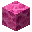
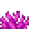

---
<!-- brain_coral_block__from__crafting_shaped__use__brain_coral.md -->

<!-- en_us -->

## Brain Coral Block | Crafting Table: Shaped | Brain Coral

<table>
	<tablebody>
		<tr>
			<td colspan="5">Crafting Table: Shaped</td>
		</tr>
		<tr>
			<td></td>
			<td></td>
			<td></td>
			<td colspan="2"></td>
		</tr>
		<tr>
			<td></td>
			<td></td>
			<td></td>
			<td></td>
			<td></td>
		</tr>
		<tr>
			<td></td>
			<td></td>
			<td></td>
			<td colspan="2"></td>
		</tr>
	</tablebody>
</table>
<table>
	<tablebody>
		<tr>
			<td></td>
			<td>ICON</td>
			<td>NAME</td>
			<td>ID</td>
			<td>Count</td>
		</tr>
		<tr>
			<td></td>
			<td></td>
			<td>Brain Coral Block</td>
			<td>brain_coral_block</td>
			<td>1</td>
		</tr>
		<tr>
			<td rowspan="2"></td>
			<td></td>
			<td>Brain Coral</td>
			<td>brain_coral</td>
			<td rowspan="2">9</td>
		</tr>
		<tr>
			<td></td>
			<td>Brain Coral Fan</td>
			<td>brain_coral_fan</td>
		</tr>
	</tablebody>
</table>

---
<!-- bubble_coral_block__from__crafting_shaped__use__bubble_coral.md -->

<!-- en_us -->

## Bubble Coral Block | Crafting Table: Shaped | Bubble Coral

<table>
	<tablebody>
		<tr>
			<td colspan="5">Crafting Table: Shaped</td>
		</tr>
		<tr>
			<td></td>
			<td></td>
			<td></td>
			<td colspan="2"></td>
		</tr>
		<tr>
			<td></td>
			<td></td>
			<td></td>
			<td></td>
			<td></td>
		</tr>
		<tr>
			<td></td>
			<td></td>
			<td></td>
			<td colspan="2"></td>
		</tr>
	</tablebody>
</table>
<table>
	<tablebody>
		<tr>
			<td></td>
			<td>ICON</td>
			<td>NAME</td>
			<td>ID</td>
			<td>Count</td>
		</tr>
		<tr>
			<td></td>
			<td></td>
			<td>Bubble Coral Block</td>
			<td>bubble_coral_block</td>
			<td>1</td>
		</tr>
		<tr>
			<td rowspan="2"></td>
			<td></td>
			<td>Bubble Coral</td>
			<td>bubble_coral</td>
			<td rowspan="2">9</td>
		</tr>
		<tr>
			<td></td>
			<td>Bubble Coral Fan</td>
			<td>bubble_coral_fan</td>
		</tr>
	</tablebody>
</table>

---
<!-- fire_coral_block__from__crafting_shaped__use__fire_coral.md -->

<!-- en_us -->

## Fire Coral Block | Crafting Table: Shaped | Fire Coral

<table>
	<tablebody>
		<tr>
			<td colspan="5">Crafting Table: Shaped</td>
		</tr>
		<tr>
			<td></td>
			<td></td>
			<td></td>
			<td colspan="2"></td>
		</tr>
		<tr>
			<td></td>
			<td></td>
			<td></td>
			<td></td>
			<td></td>
		</tr>
		<tr>
			<td></td>
			<td></td>
			<td></td>
			<td colspan="2"></td>
		</tr>
	</tablebody>
</table>
<table>
	<tablebody>
		<tr>
			<td></td>
			<td>ICON</td>
			<td>NAME</td>
			<td>ID</td>
			<td>Count</td>
		</tr>
		<tr>
			<td></td>
			<td></td>
			<td>Fire Coral Block</td>
			<td>fire_coral_block</td>
			<td>1</td>
		</tr>
		<tr>
			<td rowspan="2"></td>
			<td></td>
			<td>Fire Coral</td>
			<td>fire_coral</td>
			<td rowspan="2">9</td>
		</tr>
		<tr>
			<td></td>
			<td>Fire Coral Fan</td>
			<td>fire_coral_fan</td>
		</tr>
	</tablebody>
</table>

---
<!-- horn_coral_block__from__crafting_shaped__use__horn_coral.md -->

<!-- en_us -->

## Horn Coral Block | Crafting Table: Shaped | Horn Coral

<table>
	<tablebody>
		<tr>
			<td colspan="5">Crafting Table: Shaped</td>
		</tr>
		<tr>
			<td></td>
			<td></td>
			<td></td>
			<td colspan="2"></td>
		</tr>
		<tr>
			<td></td>
			<td></td>
			<td></td>
			<td></td>
			<td></td>
		</tr>
		<tr>
			<td></td>
			<td></td>
			<td></td>
			<td colspan="2"></td>
		</tr>
	</tablebody>
</table>
<table>
	<tablebody>
		<tr>
			<td></td>
			<td>ICON</td>
			<td>NAME</td>
			<td>ID</td>
			<td>Count</td>
		</tr>
		<tr>
			<td></td>
			<td></td>
			<td>Horn Coral Block</td>
			<td>horn_coral_block</td>
			<td>1</td>
		</tr>
		<tr>
			<td rowspan="2"></td>
			<td></td>
			<td>Horn Coral</td>
			<td>horn_coral</td>
			<td rowspan="2">9</td>
		</tr>
		<tr>
			<td></td>
			<td>Horn Coral Fan</td>
			<td>horn_coral_fan</td>
		</tr>
	</tablebody>
</table>

---
<!-- tube_coral_block__from__crafting_shaped__use__tube_coral.md -->

<!-- en_us -->

## Tube Coral Block | Crafting Table: Shaped | Tube Coral

<table>
	<tablebody>
		<tr>
			<td colspan="5">Crafting Table: Shaped</td>
		</tr>
		<tr>
			<td></td>
			<td></td>
			<td></td>
			<td colspan="2"></td>
		</tr>
		<tr>
			<td></td>
			<td></td>
			<td></td>
			<td></td>
			<td></td>
		</tr>
		<tr>
			<td></td>
			<td></td>
			<td></td>
			<td colspan="2"></td>
		</tr>
	</tablebody>
</table>
<table>
	<tablebody>
		<tr>
			<td></td>
			<td>ICON</td>
			<td>NAME</td>
			<td>ID</td>
			<td>Count</td>
		</tr>
		<tr>
			<td></td>
			<td></td>
			<td>Tube Coral Block</td>
			<td>tube_coral_block</td>
			<td>1</td>
		</tr>
		<tr>
			<td rowspan="2"></td>
			<td></td>
			<td>Tube Coral</td>
			<td>tube_coral</td>
			<td rowspan="2">9</td>
		</tr>
		<tr>
			<td></td>
			<td>Tube Coral Fan</td>
			<td>tube_coral_fan</td>
		</tr>
	</tablebody>
</table>

