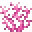
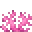
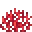

---
<!-- brain_coral_fan__from__crafting_shapeless__use__brain_coral.md -->

<!-- en_us -->

## Brain Coral Fan | Crafting Table: Shapeless | Brain Coral

<table>
	<tablebody>
		<tr>
			<td colspan="5">Crafting Table: Shapeless</td>
		</tr>
		<tr>
			<td></td>
			<td></td>
			<td></td>
			<td colspan="2"></td>
		</tr>
		<tr>
			<td></td>
			<td></td>
			<td></td>
			<td></td>
			<td></td>
		</tr>
		<tr>
			<td></td>
			<td></td>
			<td></td>
			<td colspan="2"></td>
		</tr>
	</tablebody>
</table>
<table>
	<tablebody>
		<tr>
			<td></td>
			<td>ICON</td>
			<td>NAME</td>
			<td>ID</td>
			<td>Count</td>
		</tr>
		<tr>
			<td></td>
			<td></td>
			<td>Brain Coral Fan</td>
			<td>brain_coral_fan</td>
			<td>1</td>
		</tr>
		<tr>
			<td></td>
			<td></td>
			<td>Brain Coral</td>
			<td>brain_coral</td>
			<td>1</td>
		</tr>
	</tablebody>
</table>

---
<!-- bubble_coral_fan__from__crafting_shapeless__use__bubble_coral.md -->

<!-- en_us -->

## Bubble Coral Fan | Crafting Table: Shapeless | Bubble Coral

<table>
	<tablebody>
		<tr>
			<td colspan="5">Crafting Table: Shapeless</td>
		</tr>
		<tr>
			<td></td>
			<td></td>
			<td></td>
			<td colspan="2"></td>
		</tr>
		<tr>
			<td></td>
			<td></td>
			<td></td>
			<td></td>
			<td></td>
		</tr>
		<tr>
			<td></td>
			<td></td>
			<td></td>
			<td colspan="2"></td>
		</tr>
	</tablebody>
</table>
<table>
	<tablebody>
		<tr>
			<td></td>
			<td>ICON</td>
			<td>NAME</td>
			<td>ID</td>
			<td>Count</td>
		</tr>
		<tr>
			<td></td>
			<td></td>
			<td>Bubble Coral Fan</td>
			<td>bubble_coral_fan</td>
			<td>1</td>
		</tr>
		<tr>
			<td></td>
			<td></td>
			<td>Bubble Coral</td>
			<td>bubble_coral</td>
			<td>1</td>
		</tr>
	</tablebody>
</table>

---
<!-- fire_coral_fan__from__crafting_shapeless__use__fire_coral.md -->

<!-- en_us -->

## Fire Coral Fan | Crafting Table: Shapeless | Fire Coral

<table>
	<tablebody>
		<tr>
			<td colspan="5">Crafting Table: Shapeless</td>
		</tr>
		<tr>
			<td></td>
			<td></td>
			<td></td>
			<td colspan="2"></td>
		</tr>
		<tr>
			<td></td>
			<td></td>
			<td></td>
			<td></td>
			<td></td>
		</tr>
		<tr>
			<td></td>
			<td></td>
			<td></td>
			<td colspan="2"></td>
		</tr>
	</tablebody>
</table>
<table>
	<tablebody>
		<tr>
			<td></td>
			<td>ICON</td>
			<td>NAME</td>
			<td>ID</td>
			<td>Count</td>
		</tr>
		<tr>
			<td></td>
			<td></td>
			<td>Fire Coral Fan</td>
			<td>fire_coral_fan</td>
			<td>1</td>
		</tr>
		<tr>
			<td></td>
			<td></td>
			<td>Fire Coral</td>
			<td>fire_coral</td>
			<td>1</td>
		</tr>
	</tablebody>
</table>

---
<!-- horn_coral_fan__from__crafting_shapeless__use__horn_coral.md -->

<!-- en_us -->

## Horn Coral Fan | Crafting Table: Shapeless | Horn Coral

<table>
	<tablebody>
		<tr>
			<td colspan="5">Crafting Table: Shapeless</td>
		</tr>
		<tr>
			<td></td>
			<td></td>
			<td></td>
			<td colspan="2"></td>
		</tr>
		<tr>
			<td></td>
			<td></td>
			<td></td>
			<td></td>
			<td></td>
		</tr>
		<tr>
			<td></td>
			<td></td>
			<td></td>
			<td colspan="2"></td>
		</tr>
	</tablebody>
</table>
<table>
	<tablebody>
		<tr>
			<td></td>
			<td>ICON</td>
			<td>NAME</td>
			<td>ID</td>
			<td>Count</td>
		</tr>
		<tr>
			<td></td>
			<td></td>
			<td>Horn Coral Fan</td>
			<td>horn_coral_fan</td>
			<td>1</td>
		</tr>
		<tr>
			<td></td>
			<td></td>
			<td>Horn Coral</td>
			<td>horn_coral</td>
			<td>1</td>
		</tr>
	</tablebody>
</table>

---
<!-- tube_coral_fan__from__crafting_shapeless__use__tube_coral.md -->

<!-- en_us -->

## Tube Coral Fan | Crafting Table: Shapeless | Tube Coral

<table>
	<tablebody>
		<tr>
			<td colspan="5">Crafting Table: Shapeless</td>
		</tr>
		<tr>
			<td></td>
			<td></td>
			<td></td>
			<td colspan="2"></td>
		</tr>
		<tr>
			<td></td>
			<td></td>
			<td></td>
			<td></td>
			<td></td>
		</tr>
		<tr>
			<td></td>
			<td></td>
			<td></td>
			<td colspan="2"></td>
		</tr>
	</tablebody>
</table>
<table>
	<tablebody>
		<tr>
			<td></td>
			<td>ICON</td>
			<td>NAME</td>
			<td>ID</td>
			<td>Count</td>
		</tr>
		<tr>
			<td></td>
			<td></td>
			<td>Tube Coral Fan</td>
			<td>tube_coral_fan</td>
			<td>1</td>
		</tr>
		<tr>
			<td></td>
			<td></td>
			<td>Tube Coral</td>
			<td>tube_coral</td>
			<td>1</td>
		</tr>
	</tablebody>
</table>

