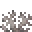
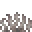

---
<!-- dead_brain_coral_fan__from__crafting_shapeless__use__dead_brain_coral.md -->

<!-- en_us -->

## Dead Brain Coral Fan | Crafting Table: Shapeless | Dead Brain Coral

<table>
	<tablebody>
		<tr>
			<td colspan="5">Crafting Table: Shapeless</td>
		</tr>
		<tr>
			<td></td>
			<td></td>
			<td></td>
			<td colspan="2"></td>
		</tr>
		<tr>
			<td></td>
			<td></td>
			<td></td>
			<td></td>
			<td></td>
		</tr>
		<tr>
			<td></td>
			<td></td>
			<td></td>
			<td colspan="2"></td>
		</tr>
	</tablebody>
</table>
<table>
	<tablebody>
		<tr>
			<td></td>
			<td>ICON</td>
			<td>NAME</td>
			<td>ID</td>
			<td>Count</td>
		</tr>
		<tr>
			<td></td>
			<td></td>
			<td>Dead Brain Coral Fan</td>
			<td>dead_brain_coral_fan</td>
			<td>1</td>
		</tr>
		<tr>
			<td></td>
			<td></td>
			<td>Dead Brain Coral</td>
			<td>dead_brain_coral</td>
			<td>1</td>
		</tr>
	</tablebody>
</table>

---
<!-- dead_bubble_coral_fan__from__crafting_shapeless__use__dead_bubble_coral.md -->

<!-- en_us -->

## Dead Bubble Coral Fan | Crafting Table: Shapeless | Dead Bubble Coral

<table>
	<tablebody>
		<tr>
			<td colspan="5">Crafting Table: Shapeless</td>
		</tr>
		<tr>
			<td></td>
			<td></td>
			<td></td>
			<td colspan="2"></td>
		</tr>
		<tr>
			<td></td>
			<td></td>
			<td></td>
			<td></td>
			<td></td>
		</tr>
		<tr>
			<td></td>
			<td></td>
			<td></td>
			<td colspan="2"></td>
		</tr>
	</tablebody>
</table>
<table>
	<tablebody>
		<tr>
			<td></td>
			<td>ICON</td>
			<td>NAME</td>
			<td>ID</td>
			<td>Count</td>
		</tr>
		<tr>
			<td></td>
			<td></td>
			<td>Dead Bubble Coral Fan</td>
			<td>dead_bubble_coral_fan</td>
			<td>1</td>
		</tr>
		<tr>
			<td></td>
			<td></td>
			<td>Dead Bubble Coral</td>
			<td>dead_bubble_coral</td>
			<td>1</td>
		</tr>
	</tablebody>
</table>

---
<!-- dead_fire_coral_fan__from__crafting_shapeless__use__dead_fire_coral.md -->

<!-- en_us -->

## Dead Fire Coral Fan | Crafting Table: Shapeless | Dead Fire Coral

<table>
	<tablebody>
		<tr>
			<td colspan="5">Crafting Table: Shapeless</td>
		</tr>
		<tr>
			<td></td>
			<td></td>
			<td></td>
			<td colspan="2"></td>
		</tr>
		<tr>
			<td></td>
			<td></td>
			<td></td>
			<td></td>
			<td></td>
		</tr>
		<tr>
			<td></td>
			<td></td>
			<td></td>
			<td colspan="2"></td>
		</tr>
	</tablebody>
</table>
<table>
	<tablebody>
		<tr>
			<td></td>
			<td>ICON</td>
			<td>NAME</td>
			<td>ID</td>
			<td>Count</td>
		</tr>
		<tr>
			<td></td>
			<td></td>
			<td>Dead Fire Coral Fan</td>
			<td>dead_fire_coral_fan</td>
			<td>1</td>
		</tr>
		<tr>
			<td></td>
			<td></td>
			<td>Dead Fire Coral</td>
			<td>dead_fire_coral</td>
			<td>1</td>
		</tr>
	</tablebody>
</table>

---
<!-- dead_horn_coral_fan__from__crafting_shapeless__use__dead_horn_coral.md -->

<!-- en_us -->

## Dead Horn Coral Fan | Crafting Table: Shapeless | Dead Horn Coral

<table>
	<tablebody>
		<tr>
			<td colspan="5">Crafting Table: Shapeless</td>
		</tr>
		<tr>
			<td></td>
			<td></td>
			<td></td>
			<td colspan="2"></td>
		</tr>
		<tr>
			<td></td>
			<td></td>
			<td></td>
			<td></td>
			<td></td>
		</tr>
		<tr>
			<td></td>
			<td></td>
			<td></td>
			<td colspan="2"></td>
		</tr>
	</tablebody>
</table>
<table>
	<tablebody>
		<tr>
			<td></td>
			<td>ICON</td>
			<td>NAME</td>
			<td>ID</td>
			<td>Count</td>
		</tr>
		<tr>
			<td></td>
			<td></td>
			<td>Dead Horn Coral Fan</td>
			<td>dead_horn_coral_fan</td>
			<td>1</td>
		</tr>
		<tr>
			<td></td>
			<td></td>
			<td>Dead Horn Coral</td>
			<td>dead_horn_coral</td>
			<td>1</td>
		</tr>
	</tablebody>
</table>

---
<!-- dead_tube_coral_fan__from__crafting_shapeless__use__dead_tube_coral.md -->

<!-- en_us -->

## Dead Tube Coral Fan | Crafting Table: Shapeless | Dead Tube Coral

<table>
	<tablebody>
		<tr>
			<td colspan="5">Crafting Table: Shapeless</td>
		</tr>
		<tr>
			<td></td>
			<td></td>
			<td></td>
			<td colspan="2"></td>
		</tr>
		<tr>
			<td></td>
			<td></td>
			<td></td>
			<td></td>
			<td></td>
		</tr>
		<tr>
			<td></td>
			<td></td>
			<td></td>
			<td colspan="2"></td>
		</tr>
	</tablebody>
</table>
<table>
	<tablebody>
		<tr>
			<td></td>
			<td>ICON</td>
			<td>NAME</td>
			<td>ID</td>
			<td>Count</td>
		</tr>
		<tr>
			<td></td>
			<td></td>
			<td>Dead Tube Coral Fan</td>
			<td>dead_tube_coral_fan</td>
			<td>1</td>
		</tr>
		<tr>
			<td></td>
			<td></td>
			<td>Dead Tube Coral</td>
			<td>dead_tube_coral</td>
			<td>1</td>
		</tr>
	</tablebody>
</table>

