---
<!-- dirt__from__crafting_shapeless__use__tag_coral_block.md -->

<!-- en_us -->

## Dirt | Crafting Table: Shapeless | Coral Block

<table>
	<tablebody>
		<tr>
			<td colspan="5">Crafting Table: Shapeless</td>
		</tr>
		<tr>
			<td></td>
			<td>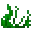</td>
			<td></td>
			<td colspan="2"></td>
		</tr>
		<tr>
			<td></td>
			<td></td>
			<td></td>
			<td></td>
			<td>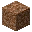</td>
		</tr>
		<tr>
			<td></td>
			<td></td>
			<td></td>
			<td colspan="2"></td>
		</tr>
	</tablebody>
</table>
<table>
	<tablebody>
		<tr>
			<td></td>
			<td>ICON</td>
			<td>NAME</td>
			<td>ID</td>
			<td>Count</td>
		</tr>
		<tr>
			<td></td>
			<td></td>
			<td>Dirt</td>
			<td>dirt</td>
			<td>64</td>
		</tr>
		<tr>
			<td rowspan="2"></td>
			<td></td>
			<td><a>Coral Block</a></td>
			<td><a>coral_block</a></td>
			<td rowspan="2">1</td>
		</tr>
		<tr>
			<td></td>
			<td><a>Dead Coral Block</a></td>
			<td><a>dead_coral_block</a></td>
		</tr>
		<tr>
			<td></td>
			<td></td>
			<td>Seagrass</td>
			<td>seagrass</td>
			<td>1</td>
		</tr>
	</tablebody>
</table>

[Coral Block](../../../en_us/tags/tag__coral_block.md)

[Dead Coral Block](../../../en_us/tags/tag__dead_coral_block.md)

---
<!-- grass_block__from__crafting_shapeless__use__tag_coral_block.md -->

<!-- en_us -->

## Grass Block | Crafting Table: Shapeless | Coral Block

<table>
	<tablebody>
		<tr>
			<td colspan="5">Crafting Table: Shapeless</td>
		</tr>
		<tr>
			<td></td>
			<td>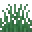</td>
			<td></td>
			<td colspan="2"></td>
		</tr>
		<tr>
			<td></td>
			<td></td>
			<td></td>
			<td></td>
			<td>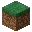</td>
		</tr>
		<tr>
			<td></td>
			<td></td>
			<td></td>
			<td colspan="2"></td>
		</tr>
	</tablebody>
</table>
<table>
	<tablebody>
		<tr>
			<td></td>
			<td>ICON</td>
			<td>NAME</td>
			<td>ID</td>
			<td>Count</td>
		</tr>
		<tr>
			<td></td>
			<td></td>
			<td>Grass Block</td>
			<td>grass_block</td>
			<td>64</td>
		</tr>
		<tr>
			<td rowspan="2"></td>
			<td></td>
			<td><a>Coral Block</a></td>
			<td><a>coral_block</a></td>
			<td rowspan="2">1</td>
		</tr>
		<tr>
			<td></td>
			<td><a>Dead Coral Block</a></td>
			<td><a>dead_coral_block</a></td>
		</tr>
		<tr>
			<td></td>
			<td></td>
			<td>Grass</td>
			<td>grass</td>
			<td>1</td>
		</tr>
	</tablebody>
</table>

[Coral Block](../../../en_us/tags/tag__coral_block.md)

[Dead Coral Block](../../../en_us/tags/tag__dead_coral_block.md)

---
<!-- rooted_dirt__from__crafting_shapeless__use__tag_coral_block.md -->

<!-- en_us -->

## Rooted Dirt | Crafting Table: Shapeless | Coral Block

<table>
	<tablebody>
		<tr>
			<td colspan="5">Crafting Table: Shapeless</td>
		</tr>
		<tr>
			<td></td>
			<td>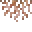</td>
			<td></td>
			<td colspan="2"></td>
		</tr>
		<tr>
			<td></td>
			<td></td>
			<td></td>
			<td></td>
			<td>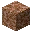</td>
		</tr>
		<tr>
			<td></td>
			<td></td>
			<td></td>
			<td colspan="2"></td>
		</tr>
	</tablebody>
</table>
<table>
	<tablebody>
		<tr>
			<td></td>
			<td>ICON</td>
			<td>NAME</td>
			<td>ID</td>
			<td>Count</td>
		</tr>
		<tr>
			<td></td>
			<td></td>
			<td>Rooted Dirt</td>
			<td>rooted_dirt</td>
			<td>64</td>
		</tr>
		<tr>
			<td rowspan="2"></td>
			<td></td>
			<td><a>Coral Block</a></td>
			<td><a>coral_block</a></td>
			<td rowspan="2">1</td>
		</tr>
		<tr>
			<td></td>
			<td><a>Dead Coral Block</a></td>
			<td><a>dead_coral_block</a></td>
		</tr>
		<tr>
			<td></td>
			<td></td>
			<td>Hanging Roots</td>
			<td>hanging_roots</td>
			<td>1</td>
		</tr>
	</tablebody>
</table>

[Coral Block](../../../en_us/tags/tag__coral_block.md)

[Dead Coral Block](../../../en_us/tags/tag__dead_coral_block.md)

---
<!-- cobblestone__from__crafting_shapeless__use__water_bucket.md -->

<!-- en_us -->

## Cobblestone | Crafting Table: Shapeless | Water Bucket

<table>
	<tablebody>
		<tr>
			<td colspan="5">Crafting Table: Shapeless</td>
		</tr>
		<tr>
			<td></td>
			<td></td>
			<td></td>
			<td colspan="2"></td>
		</tr>
		<tr>
			<td></td>
			<td></td>
			<td></td>
			<td></td>
			<td>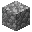</td>
		</tr>
		<tr>
			<td></td>
			<td></td>
			<td></td>
			<td colspan="2"></td>
		</tr>
	</tablebody>
</table>
<table>
	<tablebody>
		<tr>
			<td></td>
			<td>ICON</td>
			<td>NAME</td>
			<td>ID</td>
			<td>Count</td>
		</tr>
		<tr>
			<td></td>
			<td></td>
			<td>Cobblestone</td>
			<td>cobblestone</td>
			<td>64</td>
		</tr>
		<tr>
			<td></td>
			<td></td>
			<td>Water Bucket</td>
			<td>water_bucket</td>
			<td>1</td>
		</tr>
		<tr>
			<td></td>
			<td></td>
			<td>Lava Bucket</td>
			<td>lava_bucket</td>
			<td>1</td>
		</tr>
	</tablebody>
</table>

---
<!-- sand__from__crafting_shapeless__use__tag_coral_block.md -->

<!-- en_us -->

## Sand | Crafting Table: Shapeless | Coral Block

<table>
	<tablebody>
		<tr>
			<td colspan="5">Crafting Table: Shapeless</td>
		</tr>
		<tr>
			<td></td>
			<td></td>
			<td></td>
			<td colspan="2"></td>
		</tr>
		<tr>
			<td></td>
			<td></td>
			<td></td>
			<td></td>
			<td></td>
		</tr>
		<tr>
			<td></td>
			<td></td>
			<td></td>
			<td colspan="2"></td>
		</tr>
	</tablebody>
</table>
<table>
	<tablebody>
		<tr>
			<td></td>
			<td>ICON</td>
			<td>NAME</td>
			<td>ID</td>
			<td>Count</td>
		</tr>
		<tr>
			<td></td>
			<td></td>
			<td>Sand</td>
			<td>sand</td>
			<td>64</td>
		</tr>
		<tr>
			<td rowspan="2"></td>
			<td></td>
			<td><a>Coral Block</a></td>
			<td><a>coral_block</a></td>
			<td rowspan="2">1</td>
		</tr>
		<tr>
			<td></td>
			<td><a>Dead Coral Block</a></td>
			<td><a>dead_coral_block</a></td>
		</tr>
		<tr>
			<td rowspan="3"></td>
			<td></td>
			<td>Amethyst Shard</td>
			<td>amethyst_shard</td>
			<td rowspan="3">1</td>
		</tr>
		<tr>
			<td></td>
			<td><a>Stained Glass Pane</a></td>
			<td><a>stained_glass_pane</a></td>
		</tr>
		<tr>
			<td></td>
			<td>Glass Pane</td>
			<td>glass_pane</td>
		</tr>
	</tablebody>
</table>

[Coral Block](../../../en_us/tags/tag__coral_block.md)

[Dead Coral Block](../../../en_us/tags/tag__dead_coral_block.md)

[Stained Glass Pane](../../../en_us/tags/tag__stained_glass_pane.md)

---
<!-- gravel__from__crafting_shapeless__use__tag_coral_block.md -->

<!-- en_us -->

## Gravel | Crafting Table: Shapeless | Coral Block

<table>
	<tablebody>
		<tr>
			<td colspan="5">Crafting Table: Shapeless</td>
		</tr>
		<tr>
			<td></td>
			<td></td>
			<td></td>
			<td colspan="2"></td>
		</tr>
		<tr>
			<td></td>
			<td></td>
			<td></td>
			<td></td>
			<td>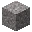</td>
		</tr>
		<tr>
			<td></td>
			<td></td>
			<td></td>
			<td colspan="2"></td>
		</tr>
	</tablebody>
</table>
<table>
	<tablebody>
		<tr>
			<td></td>
			<td>ICON</td>
			<td>NAME</td>
			<td>ID</td>
			<td>Count</td>
		</tr>
		<tr>
			<td></td>
			<td></td>
			<td>Gravel</td>
			<td>gravel</td>
			<td>64</td>
		</tr>
		<tr>
			<td rowspan="2"></td>
			<td></td>
			<td><a>Coral Block</a></td>
			<td><a>coral_block</a></td>
			<td rowspan="2">1</td>
		</tr>
		<tr>
			<td></td>
			<td><a>Dead Coral Block</a></td>
			<td><a>dead_coral_block</a></td>
		</tr>
		<tr>
			<td></td>
			<td></td>
			<td>Cobblestone</td>
			<td>cobblestone</td>
			<td>1</td>
		</tr>
	</tablebody>
</table>

[Coral Block](../../../en_us/tags/tag__coral_block.md)

[Dead Coral Block](../../../en_us/tags/tag__dead_coral_block.md)

---
<!-- calcite__from__crafting_shaped__use__pointed_dripstone.md -->

<!-- en_us -->

## Calcite | Crafting Table: Shaped | Pointed Dripstone

<table>
	<tablebody>
		<tr>
			<td colspan="5">Crafting Table: Shaped</td>
		</tr>
		<tr>
			<td></td>
			<td>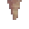</td>
			<td></td>
			<td colspan="2"></td>
		</tr>
		<tr>
			<td></td>
			<td></td>
			<td></td>
			<td></td>
			<td>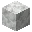</td>
		</tr>
		<tr>
			<td></td>
			<td></td>
			<td></td>
			<td colspan="2"></td>
		</tr>
	</tablebody>
</table>
<table>
	<tablebody>
		<tr>
			<td></td>
			<td>ICON</td>
			<td>NAME</td>
			<td>ID</td>
			<td>Count</td>
		</tr>
		<tr>
			<td></td>
			<td></td>
			<td>Calcite</td>
			<td>calcite</td>
			<td>1</td>
		</tr>
		<tr>
			<td></td>
			<td></td>
			<td>Pointed Dripstone</td>
			<td>pointed_dripstone</td>
			<td>2</td>
		</tr>
		<tr>
			<td></td>
			<td></td>
			<td>Prismarine Shard</td>
			<td>prismarine_shard</td>
			<td>2</td>
		</tr>
	</tablebody>
</table>

---
<!-- sponge__from__crafting_shapeless__use__tag_coral_block.md -->

<!-- en_us -->

## Sponge | Crafting Table: Shapeless | Coral Block

<table>
	<tablebody>
		<tr>
			<td colspan="5">Crafting Table: Shapeless</td>
		</tr>
		<tr>
			<td></td>
			<td>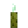</td>
			<td></td>
			<td colspan="2"></td>
		</tr>
		<tr>
			<td></td>
			<td></td>
			<td></td>
			<td></td>
			<td>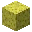</td>
		</tr>
		<tr>
			<td></td>
			<td></td>
			<td></td>
			<td colspan="2"></td>
		</tr>
	</tablebody>
</table>
<table>
	<tablebody>
		<tr>
			<td></td>
			<td>ICON</td>
			<td>NAME</td>
			<td>ID</td>
			<td>Count</td>
		</tr>
		<tr>
			<td></td>
			<td></td>
			<td>Sponge</td>
			<td>sponge</td>
			<td>64</td>
		</tr>
		<tr>
			<td rowspan="2"></td>
			<td></td>
			<td><a>Coral Block</a></td>
			<td><a>coral_block</a></td>
			<td rowspan="2">1</td>
		</tr>
		<tr>
			<td></td>
			<td><a>Dead Coral Block</a></td>
			<td><a>dead_coral_block</a></td>
		</tr>
		<tr>
			<td></td>
			<td></td>
			<td>Sea Pickle</td>
			<td>sea_pickle</td>
			<td>1</td>
		</tr>
	</tablebody>
</table>

[Coral Block](../../../en_us/tags/tag__coral_block.md)

[Dead Coral Block](../../../en_us/tags/tag__dead_coral_block.md)

---
<!-- ancient_debris__from__crafting_shaped__use__dripstone_block.md -->

<!-- en_us -->

## Ancient Debris | Crafting Table: Shaped | Dripstone Block

<table>
	<tablebody>
		<tr>
			<td colspan="5">Crafting Table: Shaped</td>
		</tr>
		<tr>
			<td></td>
			<td>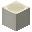</td>
			<td></td>
			<td colspan="2"></td>
		</tr>
		<tr>
			<td></td>
			<td>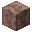</td>
			<td></td>
			<td></td>
			<td>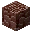</td>
		</tr>
		<tr>
			<td></td>
			<td></td>
			<td></td>
			<td colspan="2"></td>
		</tr>
	</tablebody>
</table>
<table>
	<tablebody>
		<tr>
			<td></td>
			<td>ICON</td>
			<td>NAME</td>
			<td>ID</td>
			<td>Count</td>
		</tr>
		<tr>
			<td></td>
			<td></td>
			<td>Ancient Debris</td>
			<td>ancient_debris</td>
			<td>1</td>
		</tr>
		<tr>
			<td rowspan="2"></td>
			<td></td>
			<td>Dripstone Block</td>
			<td>dripstone_block</td>
			<td rowspan="2">1</td>
		</tr>
		<tr>
			<td>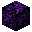</td>
			<td>Crying Obsidian</td>
			<td>crying_obsidian</td>
		</tr>
		<tr>
			<td></td>
			<td></td>
			<td>Bone Block</td>
			<td>bone_block</td>
			<td>4</td>
		</tr>
	</tablebody>
</table>

---
<!-- sea_lantern__from__crafting_shaped__use__prismarine_crystals.md -->

<!-- en_us -->

## Sea Lantern | Crafting Table: Shaped | Prismarine Crystals

<table>
	<tablebody>
		<tr>
			<td colspan="5">Crafting Table: Shaped</td>
		</tr>
		<tr>
			<td></td>
			<td></td>
			<td></td>
			<td colspan="2"></td>
		</tr>
		<tr>
			<td></td>
			<td></td>
			<td></td>
			<td></td>
			<td></td>
		</tr>
		<tr>
			<td></td>
			<td></td>
			<td></td>
			<td colspan="2"></td>
		</tr>
	</tablebody>
</table>
<table>
	<tablebody>
		<tr>
			<td></td>
			<td>ICON</td>
			<td>NAME</td>
			<td>ID</td>
			<td>Count</td>
		</tr>
		<tr>
			<td></td>
			<td></td>
			<td>Sea Lantern</td>
			<td>sea_lantern</td>
			<td>1</td>
		</tr>
		<tr>
			<td></td>
			<td></td>
			<td>Prismarine Crystals</td>
			<td>prismarine_crystals</td>
			<td>9</td>
		</tr>
	</tablebody>
</table>

