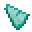
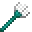

---
<!-- trident__from__crafting_shaped__use__prismarine_crystals.md -->

<!-- en_us -->

## Trident | Crafting Table: Shaped | Prismarine Crystals

<table>
	<tablebody>
		<tr>
			<td colspan="5">Crafting Table: Shaped</td>
		</tr>
		<tr>
			<td></td>
			<td></td>
			<td></td>
			<td colspan="2"></td>
		</tr>
		<tr>
			<td></td>
			<td></td>
			<td></td>
			<td></td>
			<td></td>
		</tr>
		<tr>
			<td></td>
			<td></td>
			<td></td>
			<td colspan="2"></td>
		</tr>
	</tablebody>
</table>
<table>
	<tablebody>
		<tr>
			<td></td>
			<td>ICON</td>
			<td>NAME</td>
			<td>ID</td>
			<td>Count</td>
		</tr>
		<tr>
			<td></td>
			<td></td>
			<td>Trident</td>
			<td>trident</td>
			<td>1</td>
		</tr>
		<tr>
			<td></td>
			<td></td>
			<td>Prismarine Crystals</td>
			<td>prismarine_crystals</td>
			<td>3</td>
		</tr>
		<tr>
			<td></td>
			<td></td>
			<td>Prismarine Shard</td>
			<td>prismarine_shard</td>
			<td>2</td>
		</tr>
	</tablebody>
</table>

