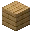
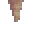

---
<!-- blast_furnace__from__crafting_shaped__use__smooth_stone.md -->

<!-- en_us -->

## Blast Furnace | Crafting Table: Shaped | Smooth Stone

<table>
	<tablebody>
		<tr>
			<td colspan="5">Crafting Table: Shaped</td>
		</tr>
		<tr>
			<td></td>
			<td></td>
			<td></td>
			<td colspan="2"></td>
		</tr>
		<tr>
			<td></td>
			<td></td>
			<td></td>
			<td></td>
			<td></td>
		</tr>
		<tr>
			<td></td>
			<td></td>
			<td></td>
			<td colspan="2"></td>
		</tr>
	</tablebody>
</table>
<table>
	<tablebody>
		<tr>
			<td></td>
			<td>ICON</td>
			<td>NAME</td>
			<td>ID</td>
			<td>Count</td>
		</tr>
		<tr>
			<td></td>
			<td></td>
			<td>Blast Furnace</td>
			<td>blast_furnace</td>
			<td>1</td>
		</tr>
		<tr>
			<td></td>
			<td></td>
			<td>Smooth Stone</td>
			<td>smooth_stone</td>
			<td>3</td>
		</tr>
		<tr>
			<td></td>
			<td></td>
			<td>Furnace</td>
			<td>furnace</td>
			<td>1</td>
		</tr>
		<tr>
			<td rowspan="2"></td>
			<td></td>
			<td>Iron Ingot</td>
			<td>iron_ingot</td>
			<td rowspan="2">5</td>
		</tr>
		<tr>
			<td></td>
			<td>Copper Ingot</td>
			<td>copper_ingot</td>
		</tr>
	</tablebody>
</table>

---
<!-- chest__from__stonecutting__use__trapped_chest.md -->

<!-- en_us -->

## Chest | Stonecutter | Trapped Chest

<table>
	<tablebody>
		<tr>
			<td colspan="6">Stonecutter</td>
		</tr>
		<tr>
			<td colspan="2"></td>
			<td></td>
			<td></td>
			<td></td>
			<td></td>
		</tr>
		<tr>
			<td></td>
			<td></td>
			<td></td>
			<td></td>
			<td></td>
			<td></td>
		</tr>
		<tr>
			<td colspan="2"></td>
			<td></td>
			<td></td>
			<td></td>
			<td></td>
		</tr>
	</tablebody>
</table>
<table>
	<tablebody>
		<tr>
			<td></td>
			<td>ICON</td>
			<td>NAME</td>
			<td>ID</td>
			<td>Count</td>
		</tr>
		<tr>
			<td></td>
			<td></td>
			<td>Trapped Chest</td>
			<td>trapped_chest</td>
			<td>1</td>
		</tr>
		<tr>
			<td></td>
			<td></td>
			<td>Chest</td>
			<td>chest</td>
			<td>1</td>
		</tr>
	</tablebody>
</table>

---
<!-- barrel__from__crafting_shaped__use__tag_planks.md -->

<!-- en_us -->

## Barrel | Crafting Table: Shaped | Planks

<table>
	<tablebody>
		<tr>
			<td colspan="5">Crafting Table: Shaped</td>
		</tr>
		<tr>
			<td></td>
			<td></td>
			<td></td>
			<td colspan="2"></td>
		</tr>
		<tr>
			<td></td>
			<td></td>
			<td></td>
			<td></td>
			<td></td>
		</tr>
		<tr>
			<td></td>
			<td></td>
			<td></td>
			<td colspan="2"></td>
		</tr>
	</tablebody>
</table>
<table>
	<tablebody>
		<tr>
			<td></td>
			<td>ICON</td>
			<td>NAME</td>
			<td>ID</td>
			<td>Count</td>
		</tr>
		<tr>
			<td></td>
			<td></td>
			<td>Barrel</td>
			<td>barrel</td>
			<td>1</td>
		</tr>
		<tr>
			<td rowspan="2"></td>
			<td></td>
			<td><a>Planks</a></td>
			<td><a>planks</a></td>
			<td rowspan="2">6</td>
		</tr>
		<tr>
			<td></td>
			<td>Stick</td>
			<td>stick</td>
		</tr>
		<tr>
			<td></td>
			<td></td>
			<td><a>Wooden Slab</a></td>
			<td><a>wooden_slabs</a></td>
			<td>2</td>
		</tr>
	</tablebody>
</table>

[Wooden Slab](../../../en_us/tags/tag__wooden_slabs.md)

---
<!-- shulker_box__from__crafting_shaped__use__popped_chorus_fruit.md -->

<!-- en_us -->

## Shulker Box | Crafting Table: Shaped | Popped Chorus Fruit

<table>
	<tablebody>
		<tr>
			<td colspan="5">Crafting Table: Shaped</td>
		</tr>
		<tr>
			<td></td>
			<td></td>
			<td></td>
			<td colspan="2"></td>
		</tr>
		<tr>
			<td></td>
			<td></td>
			<td></td>
			<td></td>
			<td></td>
		</tr>
		<tr>
			<td></td>
			<td></td>
			<td></td>
			<td colspan="2"></td>
		</tr>
	</tablebody>
</table>
<table>
	<tablebody>
		<tr>
			<td></td>
			<td>ICON</td>
			<td>NAME</td>
			<td>ID</td>
			<td>Count</td>
		</tr>
		<tr>
			<td></td>
			<td></td>
			<td>Shulker Box</td>
			<td>shulker_box</td>
			<td>1</td>
		</tr>
		<tr>
			<td></td>
			<td></td>
			<td>Popped Chorus Fruit</td>
			<td>popped_chorus_fruit</td>
			<td>8</td>
		</tr>
		<tr>
			<td></td>
			<td></td>
			<td>Barrel</td>
			<td>barrel</td>
			<td>1</td>
		</tr>
	</tablebody>
</table>

---
<!-- scaffolding__from__crafting_shaped__use__string.md -->

<!-- en_us -->

## Scaffolding | Crafting Table: Shaped | String

<table>
	<tablebody>
		<tr>
			<td colspan="5">Crafting Table: Shaped</td>
		</tr>
		<tr>
			<td></td>
			<td></td>
			<td></td>
			<td colspan="2"></td>
		</tr>
		<tr>
			<td></td>
			<td></td>
			<td></td>
			<td></td>
			<td></td>
		</tr>
		<tr>
			<td></td>
			<td></td>
			<td></td>
			<td colspan="2"></td>
		</tr>
	</tablebody>
</table>
<table>
	<tablebody>
		<tr>
			<td></td>
			<td>ICON</td>
			<td>NAME</td>
			<td>ID</td>
			<td>Count</td>
		</tr>
		<tr>
			<td></td>
			<td></td>
			<td>Scaffolding</td>
			<td>scaffolding</td>
			<td>6</td>
		</tr>
		<tr>
			<td></td>
			<td></td>
			<td>String</td>
			<td>string</td>
			<td>1</td>
		</tr>
		<tr>
			<td rowspan="2"></td>
			<td></td>
			<td>Bamboo</td>
			<td>bamboo</td>
			<td rowspan="2">6</td>
		</tr>
		<tr>
			<td></td>
			<td>Stick</td>
			<td>stick</td>
		</tr>
	</tablebody>
</table>

---
<!-- bell__from__crafting_shaped__use__stick.md -->

<!-- en_us -->

## Bell | Crafting Table: Shaped | Stick

<table>
	<tablebody>
		<tr>
			<td colspan="5">Crafting Table: Shaped</td>
		</tr>
		<tr>
			<td></td>
			<td></td>
			<td></td>
			<td colspan="2"></td>
		</tr>
		<tr>
			<td></td>
			<td></td>
			<td></td>
			<td></td>
			<td></td>
		</tr>
		<tr>
			<td></td>
			<td></td>
			<td></td>
			<td colspan="2"></td>
		</tr>
	</tablebody>
</table>
<table>
	<tablebody>
		<tr>
			<td></td>
			<td>ICON</td>
			<td>NAME</td>
			<td>ID</td>
			<td>Count</td>
		</tr>
		<tr>
			<td></td>
			<td></td>
			<td>Bell</td>
			<td>bell</td>
			<td>1</td>
		</tr>
		<tr>
			<td></td>
			<td></td>
			<td>Stick</td>
			<td>stick</td>
			<td>3</td>
		</tr>
		<tr>
			<td></td>
			<td></td>
			<td>Gold Ingot</td>
			<td>gold_ingot</td>
			<td>5</td>
		</tr>
	</tablebody>
</table>

---
<!-- pointed_dripstone__from__crafting_shapeless__use__dripstone_block.md -->

<!-- en_us -->

## Pointed Dripstone | Crafting Table: Shapeless | Dripstone Block

<table>
	<tablebody>
		<tr>
			<td colspan="5">Crafting Table: Shapeless</td>
		</tr>
		<tr>
			<td></td>
			<td></td>
			<td></td>
			<td colspan="2"></td>
		</tr>
		<tr>
			<td></td>
			<td></td>
			<td></td>
			<td></td>
			<td></td>
		</tr>
		<tr>
			<td></td>
			<td></td>
			<td></td>
			<td colspan="2"></td>
		</tr>
	</tablebody>
</table>
<table>
	<tablebody>
		<tr>
			<td></td>
			<td>ICON</td>
			<td>NAME</td>
			<td>ID</td>
			<td>Count</td>
		</tr>
		<tr>
			<td></td>
			<td></td>
			<td>Pointed Dripstone</td>
			<td>pointed_dripstone</td>
			<td>4</td>
		</tr>
		<tr>
			<td></td>
			<td></td>
			<td>Dripstone Block</td>
			<td>dripstone_block</td>
			<td>1</td>
		</tr>
	</tablebody>
</table>

