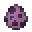

---
<!-- book__from__stonecutting__use__bookshelf.md -->

<!-- en_us -->

## Book | Stonecutter | Bookshelf

<table>
	<tablebody>
		<tr>
			<td colspan="6">Stonecutter</td>
		</tr>
		<tr>
			<td colspan="2"></td>
			<td></td>
			<td></td>
			<td></td>
			<td></td>
		</tr>
		<tr>
			<td></td>
			<td></td>
			<td></td>
			<td></td>
			<td></td>
			<td></td>
		</tr>
		<tr>
			<td colspan="2"></td>
			<td></td>
			<td></td>
			<td></td>
			<td></td>
		</tr>
	</tablebody>
</table>
<table>
	<tablebody>
		<tr>
			<td></td>
			<td>ICON</td>
			<td>NAME</td>
			<td>ID</td>
			<td>Count</td>
		</tr>
		<tr>
			<td></td>
			<td></td>
			<td>Bookshelf</td>
			<td>bookshelf</td>
			<td>1</td>
		</tr>
		<tr>
			<td></td>
			<td></td>
			<td>Book</td>
			<td>book</td>
			<td>3</td>
		</tr>
	</tablebody>
</table>

---
<!-- glowstone_dust__from__crafting_shapeless__use__glowstone.md -->

<!-- en_us -->

## Glowstone Dust | Crafting Table: Shapeless | Glowstone

<table>
	<tablebody>
		<tr>
			<td colspan="5">Crafting Table: Shapeless</td>
		</tr>
		<tr>
			<td></td>
			<td></td>
			<td></td>
			<td colspan="2"></td>
		</tr>
		<tr>
			<td></td>
			<td></td>
			<td></td>
			<td></td>
			<td></td>
		</tr>
		<tr>
			<td></td>
			<td></td>
			<td></td>
			<td colspan="2"></td>
		</tr>
	</tablebody>
</table>
<table>
	<tablebody>
		<tr>
			<td></td>
			<td>ICON</td>
			<td>NAME</td>
			<td>ID</td>
			<td>Count</td>
		</tr>
		<tr>
			<td></td>
			<td></td>
			<td>Glowstone Dust</td>
			<td>glowstone_dust</td>
			<td>4</td>
		</tr>
		<tr>
			<td></td>
			<td></td>
			<td>Glowstone</td>
			<td>glowstone</td>
			<td>1</td>
		</tr>
	</tablebody>
</table>

---
<!-- glowstone_dust__from__crafting_shapeless__use__prismarine_crystals.md -->

<!-- en_us -->

## Glowstone Dust | Crafting Table: Shapeless | Prismarine Crystals

<table>
	<tablebody>
		<tr>
			<td colspan="5">Crafting Table: Shapeless</td>
		</tr>
		<tr>
			<td></td>
			<td></td>
			<td></td>
			<td colspan="2"></td>
		</tr>
		<tr>
			<td></td>
			<td></td>
			<td></td>
			<td></td>
			<td></td>
		</tr>
		<tr>
			<td></td>
			<td></td>
			<td></td>
			<td colspan="2"></td>
		</tr>
	</tablebody>
</table>
<table>
	<tablebody>
		<tr>
			<td></td>
			<td>ICON</td>
			<td>NAME</td>
			<td>ID</td>
			<td>Count</td>
		</tr>
		<tr>
			<td></td>
			<td></td>
			<td>Glowstone Dust</td>
			<td>glowstone_dust</td>
			<td>2</td>
		</tr>
		<tr>
			<td></td>
			<td></td>
			<td>Prismarine Crystals</td>
			<td>prismarine_crystals</td>
			<td>1</td>
		</tr>
		<tr>
			<td></td>
			<td></td>
			<td>Blaze Powder</td>
			<td>blaze_powder</td>
			<td>1</td>
		</tr>
	</tablebody>
</table>

---
<!-- heart_of_the_sea__from__crafting_shaped__use__scute.md -->

<!-- en_us -->

## Heart of the Sea | Crafting Table: Shaped | Scute

<table>
	<tablebody>
		<tr>
			<td colspan="5">Crafting Table: Shaped</td>
		</tr>
		<tr>
			<td></td>
			<td></td>
			<td></td>
			<td colspan="2"></td>
		</tr>
		<tr>
			<td></td>
			<td></td>
			<td></td>
			<td></td>
			<td></td>
		</tr>
		<tr>
			<td></td>
			<td></td>
			<td></td>
			<td colspan="2"></td>
		</tr>
	</tablebody>
</table>
<table>
	<tablebody>
		<tr>
			<td></td>
			<td>ICON</td>
			<td>NAME</td>
			<td>ID</td>
			<td>Count</td>
		</tr>
		<tr>
			<td></td>
			<td></td>
			<td>Heart of the Sea</td>
			<td>heart_of_the_sea</td>
			<td>1</td>
		</tr>
		<tr>
			<td></td>
			<td></td>
			<td>Scute</td>
			<td>scute</td>
			<td>4</td>
		</tr>
		<tr>
			<td></td>
			<td></td>
			<td>Target</td>
			<td>target</td>
			<td>1</td>
		</tr>
	</tablebody>
</table>

---
<!-- shulker_shell__from__stonecutting__use__tag_shulker_box.md -->

<!-- en_us -->

## Shulker Shell | Stonecutter | Shulker Box

<table>
	<tablebody>
		<tr>
			<td colspan="6">Stonecutter</td>
		</tr>
		<tr>
			<td colspan="2"></td>
			<td></td>
			<td></td>
			<td></td>
			<td></td>
		</tr>
		<tr>
			<td></td>
			<td></td>
			<td></td>
			<td></td>
			<td></td>
			<td></td>
		</tr>
		<tr>
			<td colspan="2"></td>
			<td></td>
			<td></td>
			<td></td>
			<td></td>
		</tr>
	</tablebody>
</table>
<table>
	<tablebody>
		<tr>
			<td></td>
			<td>ICON</td>
			<td>NAME</td>
			<td>ID</td>
			<td>Count</td>
		</tr>
		<tr>
			<td></td>
			<td></td>
			<td><a>Colored Shulker Box</a></td>
			<td><a>shulker_box</a></td>
			<td>1</td>
		</tr>
		<tr>
			<td></td>
			<td></td>
			<td>Shulker Shell</td>
			<td>shulker_shell</td>
			<td>2</td>
		</tr>
	</tablebody>
</table>

[Colored Shulker Box](../../../en_us/tags/tag__shulker_box.md)

---
<!-- shulker_spawn_egg__from__crafting_shaped__use__chorus_flower.md -->

<!-- en_us -->

## Shulker Spawn Egg | Crafting Table: Shaped | Chorus Flower

<table>
	<tablebody>
		<tr>
			<td colspan="5">Crafting Table: Shaped</td>
		</tr>
		<tr>
			<td></td>
			<td></td>
			<td></td>
			<td colspan="2"></td>
		</tr>
		<tr>
			<td></td>
			<td></td>
			<td></td>
			<td></td>
			<td></td>
		</tr>
		<tr>
			<td></td>
			<td></td>
			<td></td>
			<td colspan="2"></td>
		</tr>
	</tablebody>
</table>
<table>
	<tablebody>
		<tr>
			<td></td>
			<td>ICON</td>
			<td>NAME</td>
			<td>ID</td>
			<td>Count</td>
		</tr>
		<tr>
			<td></td>
			<td></td>
			<td>Shulker Spawn Egg</td>
			<td>shulker_spawn_egg</td>
			<td>1</td>
		</tr>
		<tr>
			<td></td>
			<td></td>
			<td>Chorus Flower</td>
			<td>chorus_flower</td>
			<td>1</td>
		</tr>
		<tr>
			<td></td>
			<td></td>
			<td>Shulker Shell</td>
			<td>shulker_shell</td>
			<td>2</td>
		</tr>
	</tablebody>
</table>

---
<!-- scute__from__crafting_shapeless__use__turtle_egg.md -->

<!-- en_us -->

## Scute | Crafting Table: Shapeless | Turtle Egg

<table>
	<tablebody>
		<tr>
			<td colspan="5">Crafting Table: Shapeless</td>
		</tr>
		<tr>
			<td></td>
			<td></td>
			<td></td>
			<td colspan="2"></td>
		</tr>
		<tr>
			<td></td>
			<td></td>
			<td></td>
			<td></td>
			<td></td>
		</tr>
		<tr>
			<td></td>
			<td></td>
			<td></td>
			<td colspan="2"></td>
		</tr>
	</tablebody>
</table>
<table>
	<tablebody>
		<tr>
			<td></td>
			<td>ICON</td>
			<td>NAME</td>
			<td>ID</td>
			<td>Count</td>
		</tr>
		<tr>
			<td></td>
			<td></td>
			<td>Scute</td>
			<td>scute</td>
			<td>8</td>
		</tr>
		<tr>
			<td></td>
			<td></td>
			<td>Turtle Egg</td>
			<td>turtle_egg</td>
			<td>1</td>
		</tr>
	</tablebody>
</table>

---
<!-- scute__from__stonecutting__use__turtle_helmet.md -->

<!-- en_us -->

## Scute | Stonecutter | Turtle Shell

<table>
	<tablebody>
		<tr>
			<td colspan="6">Stonecutter</td>
		</tr>
		<tr>
			<td colspan="2"></td>
			<td></td>
			<td></td>
			<td></td>
			<td></td>
		</tr>
		<tr>
			<td></td>
			<td></td>
			<td></td>
			<td></td>
			<td></td>
			<td></td>
		</tr>
		<tr>
			<td colspan="2"></td>
			<td></td>
			<td></td>
			<td></td>
			<td></td>
		</tr>
	</tablebody>
</table>
<table>
	<tablebody>
		<tr>
			<td></td>
			<td>ICON</td>
			<td>NAME</td>
			<td>ID</td>
			<td>Count</td>
		</tr>
		<tr>
			<td></td>
			<td></td>
			<td>Turtle Shell</td>
			<td>turtle_helmet</td>
			<td>1</td>
		</tr>
		<tr>
			<td></td>
			<td></td>
			<td>Scute</td>
			<td>scute</td>
			<td>2</td>
		</tr>
	</tablebody>
</table>

