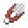
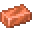
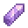
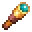

---
<!-- shears__from__crafting_shaped__use__iron_ingot.md -->

<!-- en_us -->

## Shears | Crafting Table: Shaped | Iron Ingot

<table>
	<tablebody>
		<tr>
			<td colspan="5">Crafting Table: Shaped</td>
		</tr>
		<tr>
			<td></td>
			<td></td>
			<td></td>
			<td colspan="2"></td>
		</tr>
		<tr>
			<td></td>
			<td></td>
			<td></td>
			<td></td>
			<td></td>
		</tr>
		<tr>
			<td></td>
			<td></td>
			<td></td>
			<td colspan="2"></td>
		</tr>
	</tablebody>
</table>
<table>
	<tablebody>
		<tr>
			<td></td>
			<td>ICON</td>
			<td>NAME</td>
			<td>ID</td>
			<td>Count</td>
		</tr>
		<tr>
			<td></td>
			<td></td>
			<td>Shears</td>
			<td>shears</td>
			<td>1</td>
		</tr>
		<tr>
			<td rowspan="2"></td>
			<td></td>
			<td>Iron Ingot</td>
			<td>iron_ingot</td>
			<td rowspan="2">2</td>
		</tr>
		<tr>
			<td></td>
			<td>Copper Ingot</td>
			<td>copper_ingot</td>
		</tr>
	</tablebody>
</table>

---
<!-- spyglass__from__crafting_shaped__use__amethyst_shard.md -->

<!-- en_us -->

## Spyglass | Crafting Table: Shaped | Amethyst Shard

<table>
	<tablebody>
		<tr>
			<td colspan="5">Crafting Table: Shaped</td>
		</tr>
		<tr>
			<td></td>
			<td></td>
			<td></td>
			<td colspan="2"></td>
		</tr>
		<tr>
			<td></td>
			<td></td>
			<td></td>
			<td></td>
			<td></td>
		</tr>
		<tr>
			<td></td>
			<td></td>
			<td></td>
			<td colspan="2"></td>
		</tr>
	</tablebody>
</table>
<table>
	<tablebody>
		<tr>
			<td></td>
			<td>ICON</td>
			<td>NAME</td>
			<td>ID</td>
			<td>Count</td>
		</tr>
		<tr>
			<td></td>
			<td></td>
			<td>Spyglass</td>
			<td>spyglass</td>
			<td>1</td>
		</tr>
		<tr>
			<td rowspan="3"></td>
			<td></td>
			<td>Amethyst Shard</td>
			<td>amethyst_shard</td>
			<td rowspan="3">1</td>
		</tr>
		<tr>
			<td></td>
			<td>Glass Pane</td>
			<td>glass_pane</td>
		</tr>
		<tr>
			<td></td>
			<td><a>Stained Glass Pane</a></td>
			<td><a>stained_glass_pane</a></td>
		</tr>
		<tr>
			<td rowspan="3"></td>
			<td></td>
			<td>Iron Ingot</td>
			<td>iron_ingot</td>
			<td rowspan="3">2</td>
		</tr>
		<tr>
			<td></td>
			<td>Copper Ingot</td>
			<td>copper_ingot</td>
		</tr>
		<tr>
			<td></td>
			<td>Gold Ingot</td>
			<td>gold_ingot</td>
		</tr>
	</tablebody>
</table>

[Stained Glass Pane](../../../en_us/tags/tag__stained_glass_pane.md)

