---
<!-- black_stained_glass__from__crafting_shaped__use__tag_stained_glass.md -->

<!-- en_us -->

## Black Stained Glass | Crafting Table: Shaped | Stained Glass

<table>
	<tablebody>
		<tr>
			<td colspan="5">Crafting Table: Shaped</td>
		</tr>
		<tr>
			<td></td>
			<td></td>
			<td></td>
			<td colspan="2"></td>
		</tr>
		<tr>
			<td></td>
			<td>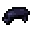</td>
			<td></td>
			<td></td>
			<td></td>
		</tr>
		<tr>
			<td></td>
			<td></td>
			<td></td>
			<td colspan="2"></td>
		</tr>
	</tablebody>
</table>
<table>
	<tablebody>
		<tr>
			<td></td>
			<td>ICON</td>
			<td>NAME</td>
			<td>ID</td>
			<td>Count</td>
		</tr>
		<tr>
			<td></td>
			<td></td>
			<td>Black Stained Glass</td>
			<td>black_stained_glass</td>
			<td>8</td>
		</tr>
		<tr>
			<td rowspan="2"></td>
			<td></td>
			<td><a>Stained Glass</a></td>
			<td><a>stained_glass</a></td>
			<td rowspan="2">8</td>
		</tr>
		<tr>
			<td>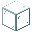</td>
			<td>Glass</td>
			<td>glass</td>
		</tr>
		<tr>
			<td></td>
			<td></td>
			<td>Black Dye</td>
			<td>black_dye</td>
			<td>1</td>
		</tr>
	</tablebody>
</table>

[Stained Glass](../../../en_us/tags/tag__stained_glass.md)

---
<!-- blue_stained_glass__from__crafting_shaped__use__tag_stained_glass.md -->

<!-- en_us -->

## Blue Stained Glass | Crafting Table: Shaped | Stained Glass

<table>
	<tablebody>
		<tr>
			<td colspan="5">Crafting Table: Shaped</td>
		</tr>
		<tr>
			<td></td>
			<td></td>
			<td></td>
			<td colspan="2"></td>
		</tr>
		<tr>
			<td></td>
			<td>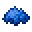</td>
			<td></td>
			<td></td>
			<td></td>
		</tr>
		<tr>
			<td></td>
			<td></td>
			<td></td>
			<td colspan="2"></td>
		</tr>
	</tablebody>
</table>
<table>
	<tablebody>
		<tr>
			<td></td>
			<td>ICON</td>
			<td>NAME</td>
			<td>ID</td>
			<td>Count</td>
		</tr>
		<tr>
			<td></td>
			<td></td>
			<td>Blue Stained Glass</td>
			<td>blue_stained_glass</td>
			<td>8</td>
		</tr>
		<tr>
			<td rowspan="2"></td>
			<td></td>
			<td><a>Stained Glass</a></td>
			<td><a>stained_glass</a></td>
			<td rowspan="2">8</td>
		</tr>
		<tr>
			<td></td>
			<td>Glass</td>
			<td>glass</td>
		</tr>
		<tr>
			<td></td>
			<td></td>
			<td>Blue Dye</td>
			<td>blue_dye</td>
			<td>1</td>
		</tr>
	</tablebody>
</table>

[Stained Glass](../../../en_us/tags/tag__stained_glass.md)

---
<!-- brown_stained_glass__from__crafting_shaped__use__tag_stained_glass.md -->

<!-- en_us -->

## Brown Stained Glass | Crafting Table: Shaped | Stained Glass

<table>
	<tablebody>
		<tr>
			<td colspan="5">Crafting Table: Shaped</td>
		</tr>
		<tr>
			<td></td>
			<td></td>
			<td></td>
			<td colspan="2"></td>
		</tr>
		<tr>
			<td></td>
			<td>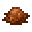</td>
			<td></td>
			<td></td>
			<td>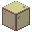</td>
		</tr>
		<tr>
			<td></td>
			<td></td>
			<td></td>
			<td colspan="2"></td>
		</tr>
	</tablebody>
</table>
<table>
	<tablebody>
		<tr>
			<td></td>
			<td>ICON</td>
			<td>NAME</td>
			<td>ID</td>
			<td>Count</td>
		</tr>
		<tr>
			<td></td>
			<td></td>
			<td>Brown Stained Glass</td>
			<td>brown_stained_glass</td>
			<td>8</td>
		</tr>
		<tr>
			<td rowspan="2"></td>
			<td></td>
			<td><a>Stained Glass</a></td>
			<td><a>stained_glass</a></td>
			<td rowspan="2">8</td>
		</tr>
		<tr>
			<td></td>
			<td>Glass</td>
			<td>glass</td>
		</tr>
		<tr>
			<td></td>
			<td></td>
			<td>Brown Dye</td>
			<td>brown_dye</td>
			<td>1</td>
		</tr>
	</tablebody>
</table>

[Stained Glass](../../../en_us/tags/tag__stained_glass.md)

---
<!-- cyan_stained_glass__from__crafting_shaped__use__tag_stained_glass.md -->

<!-- en_us -->

## Cyan Stained Glass | Crafting Table: Shaped | Stained Glass

<table>
	<tablebody>
		<tr>
			<td colspan="5">Crafting Table: Shaped</td>
		</tr>
		<tr>
			<td></td>
			<td></td>
			<td></td>
			<td colspan="2"></td>
		</tr>
		<tr>
			<td></td>
			<td>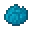</td>
			<td></td>
			<td></td>
			<td></td>
		</tr>
		<tr>
			<td></td>
			<td></td>
			<td></td>
			<td colspan="2"></td>
		</tr>
	</tablebody>
</table>
<table>
	<tablebody>
		<tr>
			<td></td>
			<td>ICON</td>
			<td>NAME</td>
			<td>ID</td>
			<td>Count</td>
		</tr>
		<tr>
			<td></td>
			<td></td>
			<td>Cyan Stained Glass</td>
			<td>cyan_stained_glass</td>
			<td>8</td>
		</tr>
		<tr>
			<td rowspan="2"></td>
			<td></td>
			<td><a>Stained Glass</a></td>
			<td><a>stained_glass</a></td>
			<td rowspan="2">8</td>
		</tr>
		<tr>
			<td></td>
			<td>Glass</td>
			<td>glass</td>
		</tr>
		<tr>
			<td></td>
			<td></td>
			<td>Cyan Dye</td>
			<td>cyan_dye</td>
			<td>1</td>
		</tr>
	</tablebody>
</table>

[Stained Glass](../../../en_us/tags/tag__stained_glass.md)

---
<!-- gray_stained_glass__from__crafting_shaped__use__tag_stained_glass.md -->

<!-- en_us -->

## Gray Stained Glass | Crafting Table: Shaped | Stained Glass

<table>
	<tablebody>
		<tr>
			<td colspan="5">Crafting Table: Shaped</td>
		</tr>
		<tr>
			<td></td>
			<td></td>
			<td></td>
			<td colspan="2"></td>
		</tr>
		<tr>
			<td></td>
			<td>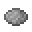</td>
			<td></td>
			<td></td>
			<td></td>
		</tr>
		<tr>
			<td></td>
			<td></td>
			<td></td>
			<td colspan="2"></td>
		</tr>
	</tablebody>
</table>
<table>
	<tablebody>
		<tr>
			<td></td>
			<td>ICON</td>
			<td>NAME</td>
			<td>ID</td>
			<td>Count</td>
		</tr>
		<tr>
			<td></td>
			<td></td>
			<td>Gray Stained Glass</td>
			<td>gray_stained_glass</td>
			<td>8</td>
		</tr>
		<tr>
			<td rowspan="2"></td>
			<td></td>
			<td><a>Stained Glass</a></td>
			<td><a>stained_glass</a></td>
			<td rowspan="2">8</td>
		</tr>
		<tr>
			<td></td>
			<td>Glass</td>
			<td>glass</td>
		</tr>
		<tr>
			<td></td>
			<td></td>
			<td>Gray Dye</td>
			<td>gray_dye</td>
			<td>1</td>
		</tr>
	</tablebody>
</table>

[Stained Glass](../../../en_us/tags/tag__stained_glass.md)

---
<!-- green_stained_glass__from__crafting_shaped__use__tag_stained_glass.md -->

<!-- en_us -->

## Green Stained Glass | Crafting Table: Shaped | Stained Glass

<table>
	<tablebody>
		<tr>
			<td colspan="5">Crafting Table: Shaped</td>
		</tr>
		<tr>
			<td></td>
			<td></td>
			<td></td>
			<td colspan="2"></td>
		</tr>
		<tr>
			<td></td>
			<td>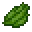</td>
			<td></td>
			<td></td>
			<td>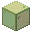</td>
		</tr>
		<tr>
			<td></td>
			<td></td>
			<td></td>
			<td colspan="2"></td>
		</tr>
	</tablebody>
</table>
<table>
	<tablebody>
		<tr>
			<td></td>
			<td>ICON</td>
			<td>NAME</td>
			<td>ID</td>
			<td>Count</td>
		</tr>
		<tr>
			<td></td>
			<td></td>
			<td>Green Stained Glass</td>
			<td>green_stained_glass</td>
			<td>8</td>
		</tr>
		<tr>
			<td rowspan="2"></td>
			<td></td>
			<td><a>Stained Glass</a></td>
			<td><a>stained_glass</a></td>
			<td rowspan="2">8</td>
		</tr>
		<tr>
			<td></td>
			<td>Glass</td>
			<td>glass</td>
		</tr>
		<tr>
			<td></td>
			<td></td>
			<td>Green Dye</td>
			<td>green_dye</td>
			<td>1</td>
		</tr>
	</tablebody>
</table>

[Stained Glass](../../../en_us/tags/tag__stained_glass.md)

---
<!-- light_blue_stained_glass__from__crafting_shaped__use__tag_stained_glass.md -->

<!-- en_us -->

## Light Blue Stained Glass | Crafting Table: Shaped | Stained Glass

<table>
	<tablebody>
		<tr>
			<td colspan="5">Crafting Table: Shaped</td>
		</tr>
		<tr>
			<td></td>
			<td></td>
			<td></td>
			<td colspan="2"></td>
		</tr>
		<tr>
			<td></td>
			<td></td>
			<td></td>
			<td></td>
			<td></td>
		</tr>
		<tr>
			<td></td>
			<td></td>
			<td></td>
			<td colspan="2"></td>
		</tr>
	</tablebody>
</table>
<table>
	<tablebody>
		<tr>
			<td></td>
			<td>ICON</td>
			<td>NAME</td>
			<td>ID</td>
			<td>Count</td>
		</tr>
		<tr>
			<td></td>
			<td></td>
			<td>Light Blue Stained Glass</td>
			<td>light_blue_stained_glass</td>
			<td>8</td>
		</tr>
		<tr>
			<td rowspan="2"></td>
			<td></td>
			<td><a>Stained Glass</a></td>
			<td><a>stained_glass</a></td>
			<td rowspan="2">8</td>
		</tr>
		<tr>
			<td></td>
			<td>Glass</td>
			<td>glass</td>
		</tr>
		<tr>
			<td></td>
			<td></td>
			<td>Light Blue Dye</td>
			<td>light_blue_dye</td>
			<td>1</td>
		</tr>
	</tablebody>
</table>

[Stained Glass](../../../en_us/tags/tag__stained_glass.md)

---
<!-- light_gray_stained_glass__from__crafting_shaped__use__tag_stained_glass.md -->

<!-- en_us -->

## Light Gray Stained Glass | Crafting Table: Shaped | Stained Glass

<table>
	<tablebody>
		<tr>
			<td colspan="5">Crafting Table: Shaped</td>
		</tr>
		<tr>
			<td></td>
			<td></td>
			<td></td>
			<td colspan="2"></td>
		</tr>
		<tr>
			<td></td>
			<td></td>
			<td></td>
			<td></td>
			<td></td>
		</tr>
		<tr>
			<td></td>
			<td></td>
			<td></td>
			<td colspan="2"></td>
		</tr>
	</tablebody>
</table>
<table>
	<tablebody>
		<tr>
			<td></td>
			<td>ICON</td>
			<td>NAME</td>
			<td>ID</td>
			<td>Count</td>
		</tr>
		<tr>
			<td></td>
			<td></td>
			<td>Light Gray Stained Glass</td>
			<td>light_gray_stained_glass</td>
			<td>8</td>
		</tr>
		<tr>
			<td rowspan="2"></td>
			<td></td>
			<td><a>Stained Glass</a></td>
			<td><a>stained_glass</a></td>
			<td rowspan="2">8</td>
		</tr>
		<tr>
			<td></td>
			<td>Glass</td>
			<td>glass</td>
		</tr>
		<tr>
			<td></td>
			<td></td>
			<td>Light Gray Dye</td>
			<td>light_gray_dye</td>
			<td>1</td>
		</tr>
	</tablebody>
</table>

[Stained Glass](../../../en_us/tags/tag__stained_glass.md)

---
<!-- lime_stained_glass__from__crafting_shaped__use__tag_stained_glass.md -->

<!-- en_us -->

## Lime Stained Glass | Crafting Table: Shaped | Stained Glass

<table>
	<tablebody>
		<tr>
			<td colspan="5">Crafting Table: Shaped</td>
		</tr>
		<tr>
			<td></td>
			<td></td>
			<td></td>
			<td colspan="2"></td>
		</tr>
		<tr>
			<td></td>
			<td>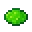</td>
			<td></td>
			<td></td>
			<td></td>
		</tr>
		<tr>
			<td></td>
			<td></td>
			<td></td>
			<td colspan="2"></td>
		</tr>
	</tablebody>
</table>
<table>
	<tablebody>
		<tr>
			<td></td>
			<td>ICON</td>
			<td>NAME</td>
			<td>ID</td>
			<td>Count</td>
		</tr>
		<tr>
			<td></td>
			<td></td>
			<td>Lime Stained Glass</td>
			<td>lime_stained_glass</td>
			<td>8</td>
		</tr>
		<tr>
			<td rowspan="2"></td>
			<td></td>
			<td><a>Stained Glass</a></td>
			<td><a>stained_glass</a></td>
			<td rowspan="2">8</td>
		</tr>
		<tr>
			<td></td>
			<td>Glass</td>
			<td>glass</td>
		</tr>
		<tr>
			<td></td>
			<td></td>
			<td>Lime Dye</td>
			<td>lime_dye</td>
			<td>1</td>
		</tr>
	</tablebody>
</table>

[Stained Glass](../../../en_us/tags/tag__stained_glass.md)

---
<!-- magenta_stained_glass__from__crafting_shaped__use__tag_stained_glass.md -->

<!-- en_us -->

## Magenta Stained Glass | Crafting Table: Shaped | Stained Glass

<table>
	<tablebody>
		<tr>
			<td colspan="5">Crafting Table: Shaped</td>
		</tr>
		<tr>
			<td></td>
			<td></td>
			<td></td>
			<td colspan="2"></td>
		</tr>
		<tr>
			<td></td>
			<td>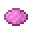</td>
			<td></td>
			<td></td>
			<td></td>
		</tr>
		<tr>
			<td></td>
			<td></td>
			<td></td>
			<td colspan="2"></td>
		</tr>
	</tablebody>
</table>
<table>
	<tablebody>
		<tr>
			<td></td>
			<td>ICON</td>
			<td>NAME</td>
			<td>ID</td>
			<td>Count</td>
		</tr>
		<tr>
			<td></td>
			<td></td>
			<td>Magenta Stained Glass</td>
			<td>magenta_stained_glass</td>
			<td>8</td>
		</tr>
		<tr>
			<td rowspan="2"></td>
			<td></td>
			<td><a>Stained Glass</a></td>
			<td><a>stained_glass</a></td>
			<td rowspan="2">8</td>
		</tr>
		<tr>
			<td></td>
			<td>Glass</td>
			<td>glass</td>
		</tr>
		<tr>
			<td></td>
			<td></td>
			<td>Magenta Dye</td>
			<td>magenta_dye</td>
			<td>1</td>
		</tr>
	</tablebody>
</table>

[Stained Glass](../../../en_us/tags/tag__stained_glass.md)

---
<!-- orange_stained_glass__from__crafting_shaped__use__tag_stained_glass.md -->

<!-- en_us -->

## Orange Stained Glass | Crafting Table: Shaped | Stained Glass

<table>
	<tablebody>
		<tr>
			<td colspan="5">Crafting Table: Shaped</td>
		</tr>
		<tr>
			<td></td>
			<td></td>
			<td></td>
			<td colspan="2"></td>
		</tr>
		<tr>
			<td></td>
			<td>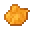</td>
			<td></td>
			<td></td>
			<td>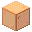</td>
		</tr>
		<tr>
			<td></td>
			<td></td>
			<td></td>
			<td colspan="2"></td>
		</tr>
	</tablebody>
</table>
<table>
	<tablebody>
		<tr>
			<td></td>
			<td>ICON</td>
			<td>NAME</td>
			<td>ID</td>
			<td>Count</td>
		</tr>
		<tr>
			<td></td>
			<td></td>
			<td>Orange Stained Glass</td>
			<td>orange_stained_glass</td>
			<td>8</td>
		</tr>
		<tr>
			<td rowspan="2"></td>
			<td></td>
			<td><a>Stained Glass</a></td>
			<td><a>stained_glass</a></td>
			<td rowspan="2">8</td>
		</tr>
		<tr>
			<td></td>
			<td>Glass</td>
			<td>glass</td>
		</tr>
		<tr>
			<td></td>
			<td></td>
			<td>Orange Dye</td>
			<td>orange_dye</td>
			<td>1</td>
		</tr>
	</tablebody>
</table>

[Stained Glass](../../../en_us/tags/tag__stained_glass.md)

---
<!-- pink_stained_glass__from__crafting_shaped__use__tag_stained_glass.md -->

<!-- en_us -->

## Pink Stained Glass | Crafting Table: Shaped | Stained Glass

<table>
	<tablebody>
		<tr>
			<td colspan="5">Crafting Table: Shaped</td>
		</tr>
		<tr>
			<td></td>
			<td></td>
			<td></td>
			<td colspan="2"></td>
		</tr>
		<tr>
			<td></td>
			<td></td>
			<td></td>
			<td></td>
			<td></td>
		</tr>
		<tr>
			<td></td>
			<td></td>
			<td></td>
			<td colspan="2"></td>
		</tr>
	</tablebody>
</table>
<table>
	<tablebody>
		<tr>
			<td></td>
			<td>ICON</td>
			<td>NAME</td>
			<td>ID</td>
			<td>Count</td>
		</tr>
		<tr>
			<td></td>
			<td></td>
			<td>Pink Stained Glass</td>
			<td>pink_stained_glass</td>
			<td>8</td>
		</tr>
		<tr>
			<td rowspan="2"></td>
			<td></td>
			<td><a>Stained Glass</a></td>
			<td><a>stained_glass</a></td>
			<td rowspan="2">8</td>
		</tr>
		<tr>
			<td></td>
			<td>Glass</td>
			<td>glass</td>
		</tr>
		<tr>
			<td></td>
			<td></td>
			<td>Pink Dye</td>
			<td>pink_dye</td>
			<td>1</td>
		</tr>
	</tablebody>
</table>

[Stained Glass](../../../en_us/tags/tag__stained_glass.md)

---
<!-- purple_stained_glass__from__crafting_shaped__use__tag_stained_glass.md -->

<!-- en_us -->

## Purple Stained Glass | Crafting Table: Shaped | Stained Glass

<table>
	<tablebody>
		<tr>
			<td colspan="5">Crafting Table: Shaped</td>
		</tr>
		<tr>
			<td></td>
			<td></td>
			<td></td>
			<td colspan="2"></td>
		</tr>
		<tr>
			<td></td>
			<td></td>
			<td></td>
			<td></td>
			<td></td>
		</tr>
		<tr>
			<td></td>
			<td></td>
			<td></td>
			<td colspan="2"></td>
		</tr>
	</tablebody>
</table>
<table>
	<tablebody>
		<tr>
			<td></td>
			<td>ICON</td>
			<td>NAME</td>
			<td>ID</td>
			<td>Count</td>
		</tr>
		<tr>
			<td></td>
			<td></td>
			<td>Purple Stained Glass</td>
			<td>purple_stained_glass</td>
			<td>8</td>
		</tr>
		<tr>
			<td rowspan="2"></td>
			<td></td>
			<td><a>Stained Glass</a></td>
			<td><a>stained_glass</a></td>
			<td rowspan="2">8</td>
		</tr>
		<tr>
			<td></td>
			<td>Glass</td>
			<td>glass</td>
		</tr>
		<tr>
			<td></td>
			<td></td>
			<td>Purple Dye</td>
			<td>purple_dye</td>
			<td>1</td>
		</tr>
	</tablebody>
</table>

[Stained Glass](../../../en_us/tags/tag__stained_glass.md)

---
<!-- red_stained_glass__from__crafting_shaped__use__tag_stained_glass.md -->

<!-- en_us -->

## Red Stained Glass | Crafting Table: Shaped | Stained Glass

<table>
	<tablebody>
		<tr>
			<td colspan="5">Crafting Table: Shaped</td>
		</tr>
		<tr>
			<td></td>
			<td></td>
			<td></td>
			<td colspan="2"></td>
		</tr>
		<tr>
			<td></td>
			<td>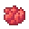</td>
			<td></td>
			<td></td>
			<td></td>
		</tr>
		<tr>
			<td></td>
			<td></td>
			<td></td>
			<td colspan="2"></td>
		</tr>
	</tablebody>
</table>
<table>
	<tablebody>
		<tr>
			<td></td>
			<td>ICON</td>
			<td>NAME</td>
			<td>ID</td>
			<td>Count</td>
		</tr>
		<tr>
			<td></td>
			<td></td>
			<td>Red Stained Glass</td>
			<td>red_stained_glass</td>
			<td>8</td>
		</tr>
		<tr>
			<td rowspan="2"></td>
			<td></td>
			<td><a>Stained Glass</a></td>
			<td><a>stained_glass</a></td>
			<td rowspan="2">8</td>
		</tr>
		<tr>
			<td></td>
			<td>Glass</td>
			<td>glass</td>
		</tr>
		<tr>
			<td></td>
			<td></td>
			<td>Red Dye</td>
			<td>red_dye</td>
			<td>1</td>
		</tr>
	</tablebody>
</table>

[Stained Glass](../../../en_us/tags/tag__stained_glass.md)

---
<!-- white_stained_glass__from__crafting_shaped__use__tag_stained_glass.md -->

<!-- en_us -->

## White Stained Glass | Crafting Table: Shaped | Stained Glass

<table>
	<tablebody>
		<tr>
			<td colspan="5">Crafting Table: Shaped</td>
		</tr>
		<tr>
			<td></td>
			<td></td>
			<td></td>
			<td colspan="2"></td>
		</tr>
		<tr>
			<td></td>
			<td></td>
			<td></td>
			<td></td>
			<td></td>
		</tr>
		<tr>
			<td></td>
			<td></td>
			<td></td>
			<td colspan="2"></td>
		</tr>
	</tablebody>
</table>
<table>
	<tablebody>
		<tr>
			<td></td>
			<td>ICON</td>
			<td>NAME</td>
			<td>ID</td>
			<td>Count</td>
		</tr>
		<tr>
			<td></td>
			<td></td>
			<td>White Stained Glass</td>
			<td>white_stained_glass</td>
			<td>8</td>
		</tr>
		<tr>
			<td rowspan="2"></td>
			<td></td>
			<td><a>Stained Glass</a></td>
			<td><a>stained_glass</a></td>
			<td rowspan="2">8</td>
		</tr>
		<tr>
			<td></td>
			<td>Glass</td>
			<td>glass</td>
		</tr>
		<tr>
			<td></td>
			<td></td>
			<td>White Dye</td>
			<td>white_dye</td>
			<td>1</td>
		</tr>
	</tablebody>
</table>

[Stained Glass](../../../en_us/tags/tag__stained_glass.md)

---
<!-- yellow_stained_glass__from__crafting_shaped__use__tag_stained_glass.md -->

<!-- en_us -->

## Yellow Stained Glass | Crafting Table: Shaped | Stained Glass

<table>
	<tablebody>
		<tr>
			<td colspan="5">Crafting Table: Shaped</td>
		</tr>
		<tr>
			<td></td>
			<td></td>
			<td></td>
			<td colspan="2"></td>
		</tr>
		<tr>
			<td></td>
			<td>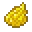</td>
			<td></td>
			<td></td>
			<td>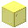</td>
		</tr>
		<tr>
			<td></td>
			<td></td>
			<td></td>
			<td colspan="2"></td>
		</tr>
	</tablebody>
</table>
<table>
	<tablebody>
		<tr>
			<td></td>
			<td>ICON</td>
			<td>NAME</td>
			<td>ID</td>
			<td>Count</td>
		</tr>
		<tr>
			<td></td>
			<td></td>
			<td>Yellow Stained Glass</td>
			<td>yellow_stained_glass</td>
			<td>8</td>
		</tr>
		<tr>
			<td rowspan="2"></td>
			<td></td>
			<td><a>Stained Glass</a></td>
			<td><a>stained_glass</a></td>
			<td rowspan="2">8</td>
		</tr>
		<tr>
			<td></td>
			<td>Glass</td>
			<td>glass</td>
		</tr>
		<tr>
			<td></td>
			<td></td>
			<td>Yellow Dye</td>
			<td>yellow_dye</td>
			<td>1</td>
		</tr>
	</tablebody>
</table>

[Stained Glass](../../../en_us/tags/tag__stained_glass.md)

