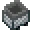
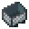

---
<!-- iron_ingot__from__crafting_shapeless__use__hopper_minecart.md -->

<!-- en_us -->

## Iron Ingot | Crafting Table: Shapeless | Minecart with Hopper

<table>
	<tablebody>
		<tr>
			<td colspan="5">Crafting Table: Shapeless</td>
		</tr>
		<tr>
			<td></td>
			<td></td>
			<td></td>
			<td colspan="2"></td>
		</tr>
		<tr>
			<td></td>
			<td></td>
			<td></td>
			<td></td>
			<td></td>
		</tr>
		<tr>
			<td></td>
			<td></td>
			<td></td>
			<td colspan="2"></td>
		</tr>
	</tablebody>
</table>
<table>
	<tablebody>
		<tr>
			<td></td>
			<td>ICON</td>
			<td>NAME</td>
			<td>ID</td>
			<td>Count</td>
		</tr>
		<tr>
			<td></td>
			<td></td>
			<td>Iron Ingot</td>
			<td>iron_ingot</td>
			<td>10</td>
		</tr>
		<tr>
			<td></td>
			<td></td>
			<td>Minecart with Hopper</td>
			<td>hopper_minecart</td>
			<td>1</td>
		</tr>
	</tablebody>
</table>

---
<!-- iron_ingot__from__crafting_shapeless__use__tag_minecart_products.md -->

<!-- en_us -->

## Iron Ingot | Crafting Table: Shapeless | Minecart

<table>
	<tablebody>
		<tr>
			<td colspan="5">Crafting Table: Shapeless</td>
		</tr>
		<tr>
			<td></td>
			<td></td>
			<td></td>
			<td colspan="2"></td>
		</tr>
		<tr>
			<td></td>
			<td></td>
			<td></td>
			<td></td>
			<td></td>
		</tr>
		<tr>
			<td></td>
			<td></td>
			<td></td>
			<td colspan="2"></td>
		</tr>
	</tablebody>
</table>
<table>
	<tablebody>
		<tr>
			<td></td>
			<td>ICON</td>
			<td>NAME</td>
			<td>ID</td>
			<td>Count</td>
		</tr>
		<tr>
			<td></td>
			<td></td>
			<td>Iron Ingot</td>
			<td>iron_ingot</td>
			<td>5</td>
		</tr>
		<tr>
			<td></td>
			<td></td>
			<td><a>Minecart Product</a></td>
			<td><a>minecart_products</a></td>
			<td>1</td>
		</tr>
	</tablebody>
</table>

[Minecart Product](../../../en_us/tags/tag__minecart_products.md)

