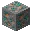
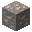
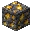
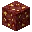
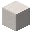
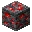
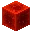
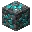
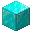

---
<!-- copper_block__from__blasting__use__copper_ore.md -->

<!-- en_us -->

## Block of Copper | Blast Furnace | Copper Ore

<table>
	<tablebody>
		<tr>
			<td colspan="3">Blast Furnace</td>
			<td>Time</td>
			<td>Experience</td>
		</tr>
		<tr>
			<td></td>
			<td></td>
			<td></td>
			<td>100</td>
			<td>7</td>
		</tr>
	</tablebody>
</table>
<table>
	<tablebody>
		<tr>
			<td></td>
			<td>ICON</td>
			<td>NAME</td>
			<td>ID</td>
			<td>Count</td>
		</tr>
		<tr>
			<td></td>
			<td></td>
			<td>Copper Ore</td>
			<td>copper_ore</td>
			<td>1</td>
		</tr>
		<tr>
			<td></td>
			<td></td>
			<td>Block of Copper</td>
			<td>copper_block</td>
			<td>1</td>
		</tr>
	</tablebody>
</table>

---
<!-- copper_block__from__blasting__use__deepslate_copper_ore.md -->

<!-- en_us -->

## Block of Copper | Blast Furnace | Deepslate Copper Ore

<table>
	<tablebody>
		<tr>
			<td colspan="3">Blast Furnace</td>
			<td>Time</td>
			<td>Experience</td>
		</tr>
		<tr>
			<td></td>
			<td></td>
			<td></td>
			<td>100</td>
			<td>7</td>
		</tr>
	</tablebody>
</table>
<table>
	<tablebody>
		<tr>
			<td></td>
			<td>ICON</td>
			<td>NAME</td>
			<td>ID</td>
			<td>Count</td>
		</tr>
		<tr>
			<td></td>
			<td></td>
			<td>Deepslate Copper Ore</td>
			<td>deepslate_copper_ore</td>
			<td>1</td>
		</tr>
		<tr>
			<td></td>
			<td></td>
			<td>Block of Copper</td>
			<td>copper_block</td>
			<td>1</td>
		</tr>
	</tablebody>
</table>

---
<!-- iron_block__from__blasting__use__deepslate_iron_ore.md -->

<!-- en_us -->

## Block of Iron | Blast Furnace | Deepslate Iron Ore

<table>
	<tablebody>
		<tr>
			<td colspan="3">Blast Furnace</td>
			<td>Time</td>
			<td>Experience</td>
		</tr>
		<tr>
			<td></td>
			<td></td>
			<td></td>
			<td>100</td>
			<td>7</td>
		</tr>
	</tablebody>
</table>
<table>
	<tablebody>
		<tr>
			<td></td>
			<td>ICON</td>
			<td>NAME</td>
			<td>ID</td>
			<td>Count</td>
		</tr>
		<tr>
			<td></td>
			<td></td>
			<td>Deepslate Iron Ore</td>
			<td>deepslate_iron_ore</td>
			<td>1</td>
		</tr>
		<tr>
			<td></td>
			<td></td>
			<td>Block of Iron</td>
			<td>iron_block</td>
			<td>1</td>
		</tr>
	</tablebody>
</table>

---
<!-- iron_block__from__blasting__use__iron_ore.md -->

<!-- en_us -->

## Block of Iron | Blast Furnace | Iron Ore

<table>
	<tablebody>
		<tr>
			<td colspan="3">Blast Furnace</td>
			<td>Time</td>
			<td>Experience</td>
		</tr>
		<tr>
			<td></td>
			<td></td>
			<td></td>
			<td>100</td>
			<td>7</td>
		</tr>
	</tablebody>
</table>
<table>
	<tablebody>
		<tr>
			<td></td>
			<td>ICON</td>
			<td>NAME</td>
			<td>ID</td>
			<td>Count</td>
		</tr>
		<tr>
			<td></td>
			<td></td>
			<td>Iron Ore</td>
			<td>iron_ore</td>
			<td>1</td>
		</tr>
		<tr>
			<td></td>
			<td></td>
			<td>Block of Iron</td>
			<td>iron_block</td>
			<td>1</td>
		</tr>
	</tablebody>
</table>

---
<!-- gold_block__from__blasting__use__deepslate_gold_ore.md -->

<!-- en_us -->

## Block of Gold | Blast Furnace | Deepslate Gold Ore

<table>
	<tablebody>
		<tr>
			<td colspan="3">Blast Furnace</td>
			<td>Time</td>
			<td>Experience</td>
		</tr>
		<tr>
			<td></td>
			<td></td>
			<td></td>
			<td>100</td>
			<td>10</td>
		</tr>
	</tablebody>
</table>
<table>
	<tablebody>
		<tr>
			<td></td>
			<td>ICON</td>
			<td>NAME</td>
			<td>ID</td>
			<td>Count</td>
		</tr>
		<tr>
			<td></td>
			<td></td>
			<td>Deepslate Gold Ore</td>
			<td>deepslate_gold_ore</td>
			<td>1</td>
		</tr>
		<tr>
			<td></td>
			<td></td>
			<td>Block of Gold</td>
			<td>gold_block</td>
			<td>1</td>
		</tr>
	</tablebody>
</table>

---
<!-- gold_block__from__blasting__use__gilded_blackstone.md -->

<!-- en_us -->

## Block of Gold | Blast Furnace | Gilded Blackstone

<table>
	<tablebody>
		<tr>
			<td colspan="3">Blast Furnace</td>
			<td>Time</td>
			<td>Experience</td>
		</tr>
		<tr>
			<td></td>
			<td></td>
			<td></td>
			<td>100</td>
			<td>10</td>
		</tr>
	</tablebody>
</table>
<table>
	<tablebody>
		<tr>
			<td></td>
			<td>ICON</td>
			<td>NAME</td>
			<td>ID</td>
			<td>Count</td>
		</tr>
		<tr>
			<td></td>
			<td></td>
			<td>Gilded Blackstone</td>
			<td>gilded_blackstone</td>
			<td>1</td>
		</tr>
		<tr>
			<td></td>
			<td></td>
			<td>Block of Gold</td>
			<td>gold_block</td>
			<td>1</td>
		</tr>
	</tablebody>
</table>

---
<!-- gold_block__from__blasting__use__gold_ore.md -->

<!-- en_us -->

## Block of Gold | Blast Furnace | Gold Ore

<table>
	<tablebody>
		<tr>
			<td colspan="3">Blast Furnace</td>
			<td>Time</td>
			<td>Experience</td>
		</tr>
		<tr>
			<td></td>
			<td></td>
			<td></td>
			<td>100</td>
			<td>10</td>
		</tr>
	</tablebody>
</table>
<table>
	<tablebody>
		<tr>
			<td></td>
			<td>ICON</td>
			<td>NAME</td>
			<td>ID</td>
			<td>Count</td>
		</tr>
		<tr>
			<td></td>
			<td></td>
			<td>Gold Ore</td>
			<td>gold_ore</td>
			<td>1</td>
		</tr>
		<tr>
			<td></td>
			<td></td>
			<td>Block of Gold</td>
			<td>gold_block</td>
			<td>1</td>
		</tr>
	</tablebody>
</table>

---
<!-- gold_block__from__blasting__use__nether_gold_ore.md -->

<!-- en_us -->

## Block of Gold | Blast Furnace | Nether Gold Ore

<table>
	<tablebody>
		<tr>
			<td colspan="3">Blast Furnace</td>
			<td>Time</td>
			<td>Experience</td>
		</tr>
		<tr>
			<td></td>
			<td></td>
			<td></td>
			<td>100</td>
			<td>10</td>
		</tr>
	</tablebody>
</table>
<table>
	<tablebody>
		<tr>
			<td></td>
			<td>ICON</td>
			<td>NAME</td>
			<td>ID</td>
			<td>Count</td>
		</tr>
		<tr>
			<td></td>
			<td></td>
			<td>Nether Gold Ore</td>
			<td>nether_gold_ore</td>
			<td>1</td>
		</tr>
		<tr>
			<td></td>
			<td></td>
			<td>Block of Gold</td>
			<td>gold_block</td>
			<td>1</td>
		</tr>
	</tablebody>
</table>

---
<!-- coal_block__from__blasting__use__coal_ore.md -->

<!-- en_us -->

## Block of Coal | Blast Furnace | Coal Ore

<table>
	<tablebody>
		<tr>
			<td colspan="3">Blast Furnace</td>
			<td>Time</td>
			<td>Experience</td>
		</tr>
		<tr>
			<td></td>
			<td></td>
			<td></td>
			<td>100</td>
			<td>1</td>
		</tr>
	</tablebody>
</table>
<table>
	<tablebody>
		<tr>
			<td></td>
			<td>ICON</td>
			<td>NAME</td>
			<td>ID</td>
			<td>Count</td>
		</tr>
		<tr>
			<td></td>
			<td></td>
			<td>Coal Ore</td>
			<td>coal_ore</td>
			<td>1</td>
		</tr>
		<tr>
			<td></td>
			<td></td>
			<td>Block of Coal</td>
			<td>coal_block</td>
			<td>1</td>
		</tr>
	</tablebody>
</table>

---
<!-- coal_block__from__blasting__use__deepslate_coal_ore.md -->

<!-- en_us -->

## Block of Coal | Blast Furnace | Deepslate Coal Ore

<table>
	<tablebody>
		<tr>
			<td colspan="3">Blast Furnace</td>
			<td>Time</td>
			<td>Experience</td>
		</tr>
		<tr>
			<td></td>
			<td></td>
			<td></td>
			<td>100</td>
			<td>1</td>
		</tr>
	</tablebody>
</table>
<table>
	<tablebody>
		<tr>
			<td></td>
			<td>ICON</td>
			<td>NAME</td>
			<td>ID</td>
			<td>Count</td>
		</tr>
		<tr>
			<td></td>
			<td></td>
			<td>Deepslate Coal Ore</td>
			<td>deepslate_coal_ore</td>
			<td>1</td>
		</tr>
		<tr>
			<td></td>
			<td></td>
			<td>Block of Coal</td>
			<td>coal_block</td>
			<td>1</td>
		</tr>
	</tablebody>
</table>

---
<!-- lapis_block__from__blasting__use__deepslate_lapis_ore.md -->

<!-- en_us -->

## Block of Lapis Lazuli | Blast Furnace | Deepslate Lapis Lazuli Ore

<table>
	<tablebody>
		<tr>
			<td colspan="3">Blast Furnace</td>
			<td>Time</td>
			<td>Experience</td>
		</tr>
		<tr>
			<td></td>
			<td></td>
			<td></td>
			<td>100</td>
			<td>2</td>
		</tr>
	</tablebody>
</table>
<table>
	<tablebody>
		<tr>
			<td></td>
			<td>ICON</td>
			<td>NAME</td>
			<td>ID</td>
			<td>Count</td>
		</tr>
		<tr>
			<td></td>
			<td></td>
			<td>Deepslate Lapis Lazuli Ore</td>
			<td>deepslate_lapis_ore</td>
			<td>1</td>
		</tr>
		<tr>
			<td></td>
			<td></td>
			<td>Block of Lapis Lazuli</td>
			<td>lapis_block</td>
			<td>1</td>
		</tr>
	</tablebody>
</table>

---
<!-- lapis_block__from__blasting__use__lapis_ore.md -->

<!-- en_us -->

## Block of Lapis Lazuli | Blast Furnace | Lapis Lazuli Ore

<table>
	<tablebody>
		<tr>
			<td colspan="3">Blast Furnace</td>
			<td>Time</td>
			<td>Experience</td>
		</tr>
		<tr>
			<td></td>
			<td></td>
			<td></td>
			<td>100</td>
			<td>2</td>
		</tr>
	</tablebody>
</table>
<table>
	<tablebody>
		<tr>
			<td></td>
			<td>ICON</td>
			<td>NAME</td>
			<td>ID</td>
			<td>Count</td>
		</tr>
		<tr>
			<td></td>
			<td></td>
			<td>Lapis Lazuli Ore</td>
			<td>lapis_ore</td>
			<td>1</td>
		</tr>
		<tr>
			<td></td>
			<td></td>
			<td>Block of Lapis Lazuli</td>
			<td>lapis_block</td>
			<td>1</td>
		</tr>
	</tablebody>
</table>

---
<!-- quartz_block__from__blasting__use__nether_quartz_ore.md -->

<!-- en_us -->

## Block of Quartz | Blast Furnace | Nether Quartz Ore

<table>
	<tablebody>
		<tr>
			<td colspan="3">Blast Furnace</td>
			<td>Time</td>
			<td>Experience</td>
		</tr>
		<tr>
			<td></td>
			<td></td>
			<td></td>
			<td>100</td>
			<td>2</td>
		</tr>
	</tablebody>
</table>
<table>
	<tablebody>
		<tr>
			<td></td>
			<td>ICON</td>
			<td>NAME</td>
			<td>ID</td>
			<td>Count</td>
		</tr>
		<tr>
			<td></td>
			<td></td>
			<td>Nether Quartz Ore</td>
			<td>nether_quartz_ore</td>
			<td>1</td>
		</tr>
		<tr>
			<td></td>
			<td></td>
			<td>Block of Quartz</td>
			<td>quartz_block</td>
			<td>1</td>
		</tr>
	</tablebody>
</table>

---
<!-- redstone_block__from__blasting__use__deepslate_redstone_ore.md -->

<!-- en_us -->

## Block of Redstone | Blast Furnace | Deepslate Redstone Ore

<table>
	<tablebody>
		<tr>
			<td colspan="3">Blast Furnace</td>
			<td>Time</td>
			<td>Experience</td>
		</tr>
		<tr>
			<td></td>
			<td></td>
			<td></td>
			<td>100</td>
			<td>7</td>
		</tr>
	</tablebody>
</table>
<table>
	<tablebody>
		<tr>
			<td></td>
			<td>ICON</td>
			<td>NAME</td>
			<td>ID</td>
			<td>Count</td>
		</tr>
		<tr>
			<td></td>
			<td></td>
			<td>Deepslate Redstone Ore</td>
			<td>deepslate_redstone_ore</td>
			<td>1</td>
		</tr>
		<tr>
			<td></td>
			<td></td>
			<td>Block of Redstone</td>
			<td>redstone_block</td>
			<td>1</td>
		</tr>
	</tablebody>
</table>

---
<!-- redstone_block__from__blasting__use__redstone_ore.md -->

<!-- en_us -->

## Block of Redstone | Blast Furnace | Redstone Ore

<table>
	<tablebody>
		<tr>
			<td colspan="3">Blast Furnace</td>
			<td>Time</td>
			<td>Experience</td>
		</tr>
		<tr>
			<td></td>
			<td></td>
			<td></td>
			<td>100</td>
			<td>7</td>
		</tr>
	</tablebody>
</table>
<table>
	<tablebody>
		<tr>
			<td></td>
			<td>ICON</td>
			<td>NAME</td>
			<td>ID</td>
			<td>Count</td>
		</tr>
		<tr>
			<td></td>
			<td></td>
			<td>Redstone Ore</td>
			<td>redstone_ore</td>
			<td>1</td>
		</tr>
		<tr>
			<td></td>
			<td></td>
			<td>Block of Redstone</td>
			<td>redstone_block</td>
			<td>1</td>
		</tr>
	</tablebody>
</table>

---
<!-- emerald_block__from__blasting__use__deepslate_emerald_ore.md -->

<!-- en_us -->

## Block of Emerald | Blast Furnace | Deepslate Emerald Ore

<table>
	<tablebody>
		<tr>
			<td colspan="3">Blast Furnace</td>
			<td>Time</td>
			<td>Experience</td>
		</tr>
		<tr>
			<td></td>
			<td></td>
			<td></td>
			<td>100</td>
			<td>10</td>
		</tr>
	</tablebody>
</table>
<table>
	<tablebody>
		<tr>
			<td></td>
			<td>ICON</td>
			<td>NAME</td>
			<td>ID</td>
			<td>Count</td>
		</tr>
		<tr>
			<td></td>
			<td></td>
			<td>Deepslate Emerald Ore</td>
			<td>deepslate_emerald_ore</td>
			<td>1</td>
		</tr>
		<tr>
			<td></td>
			<td></td>
			<td>Block of Emerald</td>
			<td>emerald_block</td>
			<td>1</td>
		</tr>
	</tablebody>
</table>

---
<!-- emerald_block__from__blasting__use__emerald_ore.md -->

<!-- en_us -->

## Block of Emerald | Blast Furnace | Emerald Ore

<table>
	<tablebody>
		<tr>
			<td colspan="3">Blast Furnace</td>
			<td>Time</td>
			<td>Experience</td>
		</tr>
		<tr>
			<td></td>
			<td></td>
			<td></td>
			<td>100</td>
			<td>10</td>
		</tr>
	</tablebody>
</table>
<table>
	<tablebody>
		<tr>
			<td></td>
			<td>ICON</td>
			<td>NAME</td>
			<td>ID</td>
			<td>Count</td>
		</tr>
		<tr>
			<td></td>
			<td></td>
			<td>Emerald Ore</td>
			<td>emerald_ore</td>
			<td>1</td>
		</tr>
		<tr>
			<td></td>
			<td></td>
			<td>Block of Emerald</td>
			<td>emerald_block</td>
			<td>1</td>
		</tr>
	</tablebody>
</table>

---
<!-- diamond_block__from__blasting__use__deepslate_diamond_ore.md -->

<!-- en_us -->

## Block of Diamond | Blast Furnace | Deepslate Diamond Ore

<table>
	<tablebody>
		<tr>
			<td colspan="3">Blast Furnace</td>
			<td>Time</td>
			<td>Experience</td>
		</tr>
		<tr>
			<td></td>
			<td></td>
			<td></td>
			<td>100</td>
			<td>10</td>
		</tr>
	</tablebody>
</table>
<table>
	<tablebody>
		<tr>
			<td></td>
			<td>ICON</td>
			<td>NAME</td>
			<td>ID</td>
			<td>Count</td>
		</tr>
		<tr>
			<td></td>
			<td></td>
			<td>Deepslate Diamond Ore</td>
			<td>deepslate_diamond_ore</td>
			<td>1</td>
		</tr>
		<tr>
			<td></td>
			<td></td>
			<td>Block of Diamond</td>
			<td>diamond_block</td>
			<td>1</td>
		</tr>
	</tablebody>
</table>

---
<!-- diamond_block__from__blasting__use__diamond_ore.md -->

<!-- en_us -->

## Block of Diamond | Blast Furnace | Diamond Ore

<table>
	<tablebody>
		<tr>
			<td colspan="3">Blast Furnace</td>
			<td>Time</td>
			<td>Experience</td>
		</tr>
		<tr>
			<td></td>
			<td></td>
			<td></td>
			<td>100</td>
			<td>10</td>
		</tr>
	</tablebody>
</table>
<table>
	<tablebody>
		<tr>
			<td></td>
			<td>ICON</td>
			<td>NAME</td>
			<td>ID</td>
			<td>Count</td>
		</tr>
		<tr>
			<td></td>
			<td></td>
			<td>Diamond Ore</td>
			<td>diamond_ore</td>
			<td>1</td>
		</tr>
		<tr>
			<td></td>
			<td></td>
			<td>Block of Diamond</td>
			<td>diamond_block</td>
			<td>1</td>
		</tr>
	</tablebody>
</table>

---
<!-- netherite_block__from__blasting__use__ancient_debris.md -->

<!-- en_us -->

## Block of Netherite | Blast Furnace | Ancient Debris

<table>
	<tablebody>
		<tr>
			<td colspan="3">Blast Furnace</td>
			<td>Time</td>
			<td>Experience</td>
		</tr>
		<tr>
			<td></td>
			<td></td>
			<td></td>
			<td>100</td>
			<td>20</td>
		</tr>
	</tablebody>
</table>
<table>
	<tablebody>
		<tr>
			<td></td>
			<td>ICON</td>
			<td>NAME</td>
			<td>ID</td>
			<td>Count</td>
		</tr>
		<tr>
			<td></td>
			<td></td>
			<td>Ancient Debris</td>
			<td>ancient_debris</td>
			<td>1</td>
		</tr>
		<tr>
			<td></td>
			<td></td>
			<td>Block of Netherite</td>
			<td>netherite_block</td>
			<td>1</td>
		</tr>
	</tablebody>
</table>

