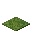
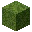
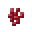

---
<!-- lily_pad__from__crafting_shapeless__use__lily_pad.md -->

<!-- en_us -->

## Lily Pad | Crafting Table: Shapeless | Lily Pad

<table>
	<tablebody>
		<tr>
			<td colspan="5">Crafting Table: Shapeless</td>
		</tr>
		<tr>
			<td></td>
			<td></td>
			<td></td>
			<td colspan="2"></td>
		</tr>
		<tr>
			<td></td>
			<td></td>
			<td></td>
			<td></td>
			<td></td>
		</tr>
		<tr>
			<td></td>
			<td></td>
			<td></td>
			<td colspan="2"></td>
		</tr>
	</tablebody>
</table>
<table>
	<tablebody>
		<tr>
			<td></td>
			<td>ICON</td>
			<td>NAME</td>
			<td>ID</td>
			<td>Count</td>
		</tr>
		<tr>
			<td></td>
			<td></td>
			<td>Lily Pad</td>
			<td>lily_pad</td>
			<td>64</td>
		</tr>
		<tr>
			<td></td>
			<td></td>
			<td>Lily Pad</td>
			<td>lily_pad</td>
			<td>1</td>
		</tr>
		<tr>
			<td></td>
			<td></td>
			<td>Bone Meal</td>
			<td>bone_meal</td>
			<td>1</td>
		</tr>
	</tablebody>
</table>

---
<!-- moss_block__from__crafting_shaped__use__moss_carpet.md -->

<!-- en_us -->

## Moss Block | Crafting Table: Shaped | Moss Carpet

<table>
	<tablebody>
		<tr>
			<td colspan="5">Crafting Table: Shaped</td>
		</tr>
		<tr>
			<td></td>
			<td></td>
			<td></td>
			<td colspan="2"></td>
		</tr>
		<tr>
			<td></td>
			<td></td>
			<td></td>
			<td></td>
			<td></td>
		</tr>
		<tr>
			<td></td>
			<td></td>
			<td></td>
			<td colspan="2"></td>
		</tr>
	</tablebody>
</table>
<table>
	<tablebody>
		<tr>
			<td></td>
			<td>ICON</td>
			<td>NAME</td>
			<td>ID</td>
			<td>Count</td>
		</tr>
		<tr>
			<td></td>
			<td></td>
			<td>Moss Block</td>
			<td>moss_block</td>
			<td>1</td>
		</tr>
		<tr>
			<td></td>
			<td></td>
			<td>Moss Carpet</td>
			<td>moss_carpet</td>
			<td>2</td>
		</tr>
	</tablebody>
</table>

---
<!-- nether_wart__from__crafting_shapeless__use__nether_wart_block.md -->

<!-- en_us -->

## Nether Wart | Crafting Table: Shapeless | Nether Wart Block

<table>
	<tablebody>
		<tr>
			<td colspan="5">Crafting Table: Shapeless</td>
		</tr>
		<tr>
			<td></td>
			<td></td>
			<td></td>
			<td colspan="2"></td>
		</tr>
		<tr>
			<td></td>
			<td></td>
			<td></td>
			<td></td>
			<td></td>
		</tr>
		<tr>
			<td></td>
			<td></td>
			<td></td>
			<td colspan="2"></td>
		</tr>
	</tablebody>
</table>
<table>
	<tablebody>
		<tr>
			<td></td>
			<td>ICON</td>
			<td>NAME</td>
			<td>ID</td>
			<td>Count</td>
		</tr>
		<tr>
			<td></td>
			<td></td>
			<td>Nether Wart</td>
			<td>nether_wart</td>
			<td>9</td>
		</tr>
		<tr>
			<td></td>
			<td></td>
			<td>Nether Wart Block</td>
			<td>nether_wart_block</td>
			<td>1</td>
		</tr>
	</tablebody>
</table>

