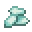

---
<!-- prismarine_crystals__from__crafting_shapeless__use__sea_lantern.md -->

<!-- en_us -->

## Prismarine Crystals | Crafting Table: Shapeless | Sea Lantern

<table>
	<tablebody>
		<tr>
			<td colspan="5">Crafting Table: Shapeless</td>
		</tr>
		<tr>
			<td></td>
			<td></td>
			<td></td>
			<td colspan="2"></td>
		</tr>
		<tr>
			<td></td>
			<td></td>
			<td></td>
			<td></td>
			<td></td>
		</tr>
		<tr>
			<td></td>
			<td></td>
			<td></td>
			<td colspan="2"></td>
		</tr>
	</tablebody>
</table>
<table>
	<tablebody>
		<tr>
			<td></td>
			<td>ICON</td>
			<td>NAME</td>
			<td>ID</td>
			<td>Count</td>
		</tr>
		<tr>
			<td></td>
			<td></td>
			<td>Prismarine Crystals</td>
			<td>prismarine_crystals</td>
			<td>9</td>
		</tr>
		<tr>
			<td></td>
			<td></td>
			<td>Sea Lantern</td>
			<td>sea_lantern</td>
			<td>1</td>
		</tr>
	</tablebody>
</table>

---
<!-- prismarine_crystals__from__crafting_shapeless__use__prismarine_shard.md -->

<!-- en_us -->

## Prismarine Crystals | Crafting Table: Shapeless | Prismarine Shard

<table>
	<tablebody>
		<tr>
			<td colspan="5">Crafting Table: Shapeless</td>
		</tr>
		<tr>
			<td></td>
			<td></td>
			<td></td>
			<td colspan="2"></td>
		</tr>
		<tr>
			<td></td>
			<td></td>
			<td></td>
			<td></td>
			<td></td>
		</tr>
		<tr>
			<td></td>
			<td></td>
			<td></td>
			<td colspan="2"></td>
		</tr>
	</tablebody>
</table>
<table>
	<tablebody>
		<tr>
			<td></td>
			<td>ICON</td>
			<td>NAME</td>
			<td>ID</td>
			<td>Count</td>
		</tr>
		<tr>
			<td></td>
			<td></td>
			<td>Prismarine Crystals</td>
			<td>prismarine_crystals</td>
			<td>1</td>
		</tr>
		<tr>
			<td></td>
			<td></td>
			<td>Prismarine Shard</td>
			<td>prismarine_shard</td>
			<td>1</td>
		</tr>
	</tablebody>
</table>

---
<!-- prismarine_shard__from__smelting__use__prismarine_crystals.md -->

<!-- en_us -->

## Prismarine Shard | Furnace | Prismarine Crystals

<table>
	<tablebody>
		<tr>
			<td colspan="3">Furnace</td>
			<td>Time</td>
			<td>Experience</td>
		</tr>
		<tr>
			<td></td>
			<td></td>
			<td></td>
			<td>100</td>
			<td>1</td>
		</tr>
	</tablebody>
</table>
<table>
	<tablebody>
		<tr>
			<td></td>
			<td>ICON</td>
			<td>NAME</td>
			<td>ID</td>
			<td>Count</td>
		</tr>
		<tr>
			<td></td>
			<td></td>
			<td>Prismarine Crystals</td>
			<td>prismarine_crystals</td>
			<td>1</td>
		</tr>
		<tr>
			<td></td>
			<td></td>
			<td>Prismarine Shard</td>
			<td>prismarine_shard</td>
			<td>1</td>
		</tr>
	</tablebody>
</table>

---
<!-- prismarine_shard__from__blasting__use__prismarine_crystals.md -->

<!-- en_us -->

## Prismarine Shard | Blast Furnace | Prismarine Crystals

<table>
	<tablebody>
		<tr>
			<td colspan="3">Blast Furnace</td>
			<td>Time</td>
			<td>Experience</td>
		</tr>
		<tr>
			<td></td>
			<td></td>
			<td></td>
			<td>50</td>
			<td>1</td>
		</tr>
	</tablebody>
</table>
<table>
	<tablebody>
		<tr>
			<td></td>
			<td>ICON</td>
			<td>NAME</td>
			<td>ID</td>
			<td>Count</td>
		</tr>
		<tr>
			<td></td>
			<td></td>
			<td>Prismarine Crystals</td>
			<td>prismarine_crystals</td>
			<td>1</td>
		</tr>
		<tr>
			<td></td>
			<td></td>
			<td>Prismarine Shard</td>
			<td>prismarine_shard</td>
			<td>1</td>
		</tr>
	</tablebody>
</table>

---
<!-- prismarine_shard__from__crafting_shapeless__use__dark_prismarine.md -->

<!-- en_us -->

## Prismarine Shard | Crafting Table: Shapeless | Dark Prismarine

<table>
	<tablebody>
		<tr>
			<td colspan="5">Crafting Table: Shapeless</td>
		</tr>
		<tr>
			<td></td>
			<td></td>
			<td></td>
			<td colspan="2"></td>
		</tr>
		<tr>
			<td></td>
			<td></td>
			<td></td>
			<td></td>
			<td></td>
		</tr>
		<tr>
			<td></td>
			<td></td>
			<td></td>
			<td colspan="2"></td>
		</tr>
	</tablebody>
</table>
<table>
	<tablebody>
		<tr>
			<td></td>
			<td>ICON</td>
			<td>NAME</td>
			<td>ID</td>
			<td>Count</td>
		</tr>
		<tr>
			<td></td>
			<td></td>
			<td>Prismarine Shard</td>
			<td>prismarine_shard</td>
			<td>8</td>
		</tr>
		<tr>
			<td rowspan="2"></td>
			<td></td>
			<td>Dark Prismarine</td>
			<td>dark_prismarine</td>
			<td rowspan="2">1</td>
		</tr>
		<tr>
			<td></td>
			<td>Dark Prismarine Stairs</td>
			<td>dark_prismarine_stairs</td>
		</tr>
	</tablebody>
</table>

---
<!-- prismarine_shard__from__crafting_shapeless__use__prismarine.md -->

<!-- en_us -->

## Prismarine Shard | Crafting Table: Shapeless | Prismarine

<table>
	<tablebody>
		<tr>
			<td colspan="5">Crafting Table: Shapeless</td>
		</tr>
		<tr>
			<td></td>
			<td></td>
			<td></td>
			<td colspan="2"></td>
		</tr>
		<tr>
			<td></td>
			<td></td>
			<td></td>
			<td></td>
			<td></td>
		</tr>
		<tr>
			<td></td>
			<td></td>
			<td></td>
			<td colspan="2"></td>
		</tr>
	</tablebody>
</table>
<table>
	<tablebody>
		<tr>
			<td></td>
			<td>ICON</td>
			<td>NAME</td>
			<td>ID</td>
			<td>Count</td>
		</tr>
		<tr>
			<td></td>
			<td></td>
			<td>Prismarine Shard</td>
			<td>prismarine_shard</td>
			<td>4</td>
		</tr>
		<tr>
			<td rowspan="5"></td>
			<td></td>
			<td>Prismarine</td>
			<td>prismarine</td>
			<td rowspan="5">1</td>
		</tr>
		<tr>
			<td></td>
			<td>Prismarine Stairs</td>
			<td>prismarine_stairs</td>
		</tr>
		<tr>
			<td></td>
			<td>Prismarine Wall</td>
			<td>prismarine_wall</td>
		</tr>
		<tr>
			<td></td>
			<td>Dark Prismarine Slab</td>
			<td>dark_prismarine_slab</td>
		</tr>
		<tr>
			<td></td>
			<td>Prismarine Brick Slab</td>
			<td>prismarine_brick_slab</td>
		</tr>
	</tablebody>
</table>

---
<!-- prismarine_shard__from__crafting_shapeless__use__prismarine_bricks.md -->

<!-- en_us -->

## Prismarine Shard | Crafting Table: Shapeless | Prismarine Bricks

<table>
	<tablebody>
		<tr>
			<td colspan="5">Crafting Table: Shapeless</td>
		</tr>
		<tr>
			<td></td>
			<td></td>
			<td></td>
			<td colspan="2"></td>
		</tr>
		<tr>
			<td></td>
			<td></td>
			<td></td>
			<td></td>
			<td></td>
		</tr>
		<tr>
			<td></td>
			<td></td>
			<td></td>
			<td colspan="2"></td>
		</tr>
	</tablebody>
</table>
<table>
	<tablebody>
		<tr>
			<td></td>
			<td>ICON</td>
			<td>NAME</td>
			<td>ID</td>
			<td>Count</td>
		</tr>
		<tr>
			<td></td>
			<td></td>
			<td>Prismarine Shard</td>
			<td>prismarine_shard</td>
			<td>9</td>
		</tr>
		<tr>
			<td rowspan="2"></td>
			<td></td>
			<td>Prismarine Bricks</td>
			<td>prismarine_bricks</td>
			<td rowspan="2">1</td>
		</tr>
		<tr>
			<td></td>
			<td>Prismarine Brick Stairs</td>
			<td>prismarine_brick_stairs</td>
		</tr>
	</tablebody>
</table>

---
<!-- prismarine_shard__from__crafting_shapeless__use__prismarine_slab.md -->

<!-- en_us -->

## Prismarine Shard | Crafting Table: Shapeless | Prismarine Slab

<table>
	<tablebody>
		<tr>
			<td colspan="5">Crafting Table: Shapeless</td>
		</tr>
		<tr>
			<td></td>
			<td></td>
			<td></td>
			<td colspan="2"></td>
		</tr>
		<tr>
			<td></td>
			<td></td>
			<td></td>
			<td></td>
			<td></td>
		</tr>
		<tr>
			<td></td>
			<td></td>
			<td></td>
			<td colspan="2"></td>
		</tr>
	</tablebody>
</table>
<table>
	<tablebody>
		<tr>
			<td></td>
			<td>ICON</td>
			<td>NAME</td>
			<td>ID</td>
			<td>Count</td>
		</tr>
		<tr>
			<td></td>
			<td></td>
			<td>Prismarine Shard</td>
			<td>prismarine_shard</td>
			<td>2</td>
		</tr>
		<tr>
			<td></td>
			<td></td>
			<td>Prismarine Slab</td>
			<td>prismarine_slab</td>
			<td>1</td>
		</tr>
	</tablebody>
</table>

