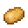

---
<!-- red_sand__from__crafting_shaped__use__sand.md -->

<!-- en_us -->

## Red Sand | Crafting Table: Shaped | Sand

<table>
	<tablebody>
		<tr>
			<td colspan="5">Crafting Table: Shaped</td>
		</tr>
		<tr>
			<td></td>
			<td></td>
			<td></td>
			<td colspan="2"></td>
		</tr>
		<tr>
			<td></td>
			<td></td>
			<td></td>
			<td></td>
			<td></td>
		</tr>
		<tr>
			<td></td>
			<td></td>
			<td></td>
			<td colspan="2"></td>
		</tr>
	</tablebody>
</table>
<table>
	<tablebody>
		<tr>
			<td></td>
			<td>ICON</td>
			<td>NAME</td>
			<td>ID</td>
			<td>Count</td>
		</tr>
		<tr>
			<td></td>
			<td></td>
			<td>Red Sand</td>
			<td>red_sand</td>
			<td>8</td>
		</tr>
		<tr>
			<td></td>
			<td></td>
			<td>Sand</td>
			<td>sand</td>
			<td>8</td>
		</tr>
		<tr>
			<td></td>
			<td></td>
			<td>Iron Nugget</td>
			<td>iron_nugget</td>
			<td>1</td>
		</tr>
	</tablebody>
</table>

---
<!-- sand__from__crafting_shaped__use__red_sand.md -->

<!-- en_us -->

## Sand | Crafting Table: Shaped | Red Sand

<table>
	<tablebody>
		<tr>
			<td colspan="5">Crafting Table: Shaped</td>
		</tr>
		<tr>
			<td></td>
			<td></td>
			<td></td>
			<td colspan="2"></td>
		</tr>
		<tr>
			<td></td>
			<td></td>
			<td></td>
			<td></td>
			<td></td>
		</tr>
		<tr>
			<td></td>
			<td></td>
			<td></td>
			<td colspan="2"></td>
		</tr>
	</tablebody>
</table>
<table>
	<tablebody>
		<tr>
			<td></td>
			<td>ICON</td>
			<td>NAME</td>
			<td>ID</td>
			<td>Count</td>
		</tr>
		<tr>
			<td></td>
			<td></td>
			<td>Sand</td>
			<td>sand</td>
			<td>8</td>
		</tr>
		<tr>
			<td></td>
			<td></td>
			<td>Red Sand</td>
			<td>red_sand</td>
			<td>8</td>
		</tr>
		<tr>
			<td></td>
			<td></td>
			<td>Potato</td>
			<td>potato</td>
			<td>1</td>
		</tr>
	</tablebody>
</table>

