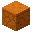
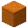
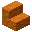
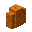
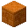
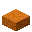
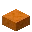
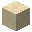
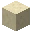

---
<!-- red_sand__from__stonecutting__use__red_sandstone.md -->

<!-- en_us -->

## Red Sand | Stonecutter | Red Sandstone

<table>
	<tablebody>
		<tr>
			<td colspan="6">Stonecutter</td>
		</tr>
		<tr>
			<td colspan="2"></td>
			<td></td>
			<td></td>
			<td></td>
			<td></td>
		</tr>
		<tr>
			<td></td>
			<td></td>
			<td></td>
			<td></td>
			<td></td>
			<td></td>
		</tr>
		<tr>
			<td colspan="2"></td>
			<td></td>
			<td></td>
			<td></td>
			<td></td>
		</tr>
	</tablebody>
</table>
<table>
	<tablebody>
		<tr>
			<td></td>
			<td>ICON</td>
			<td>NAME</td>
			<td>ID</td>
			<td>Count</td>
		</tr>
		<tr>
			<td></td>
			<td></td>
			<td>Red Sandstone</td>
			<td>red_sandstone</td>
			<td>1</td>
		</tr>
		<tr>
			<td></td>
			<td></td>
			<td>Cut Red Sandstone</td>
			<td>cut_red_sandstone</td>
			<td>1</td>
		</tr>
		<tr>
			<td></td>
			<td></td>
			<td>Red Sandstone Stairs</td>
			<td>red_sandstone_stairs</td>
			<td>1</td>
		</tr>
		<tr>
			<td></td>
			<td></td>
			<td>Red Sandstone Wall</td>
			<td>red_sandstone_wall</td>
			<td>1</td>
		</tr>
		<tr>
			<td></td>
			<td></td>
			<td>Chiseled Red Sandstone</td>
			<td>chiseled_red_sandstone</td>
			<td>1</td>
		</tr>
		<tr>
			<td></td>
			<td></td>
			<td>Smooth Red Sandstone</td>
			<td>smooth_red_sandstone</td>
			<td>1</td>
		</tr>
		<tr>
			<td></td>
			<td></td>
			<td>Smooth Red Sandstone Stairs</td>
			<td>smooth_red_sandstone_stairs</td>
			<td>1</td>
		</tr>
		<tr>
			<td></td>
			<td></td>
			<td>Red Sand</td>
			<td>red_sand</td>
			<td>4</td>
		</tr>
	</tablebody>
</table>

---
<!-- red_sand__from__stonecutting__use__red_sandstone_slab.md -->

<!-- en_us -->

## Red Sand | Stonecutter | Red Sandstone Slab

<table>
	<tablebody>
		<tr>
			<td colspan="6">Stonecutter</td>
		</tr>
		<tr>
			<td colspan="2"></td>
			<td></td>
			<td></td>
			<td></td>
			<td></td>
		</tr>
		<tr>
			<td></td>
			<td></td>
			<td></td>
			<td></td>
			<td></td>
			<td></td>
		</tr>
		<tr>
			<td colspan="2"></td>
			<td></td>
			<td></td>
			<td></td>
			<td></td>
		</tr>
	</tablebody>
</table>
<table>
	<tablebody>
		<tr>
			<td></td>
			<td>ICON</td>
			<td>NAME</td>
			<td>ID</td>
			<td>Count</td>
		</tr>
		<tr>
			<td></td>
			<td></td>
			<td>Red Sandstone Slab</td>
			<td>red_sandstone_slab</td>
			<td>1</td>
		</tr>
		<tr>
			<td></td>
			<td></td>
			<td>Cut Red Sandstone Slab</td>
			<td>cut_red_sandstone_slab</td>
			<td>1</td>
		</tr>
		<tr>
			<td></td>
			<td></td>
			<td>Smooth Red Sandstone Slab</td>
			<td>smooth_red_sandstone_slab</td>
			<td>1</td>
		</tr>
		<tr>
			<td></td>
			<td></td>
			<td>Red Sand</td>
			<td>red_sand</td>
			<td>2</td>
		</tr>
	</tablebody>
</table>

---
<!-- sand__from__stonecutting__use__sandstone.md -->

<!-- en_us -->

## Sand | Stonecutter | Sandstone

<table>
	<tablebody>
		<tr>
			<td colspan="6">Stonecutter</td>
		</tr>
		<tr>
			<td colspan="2"></td>
			<td></td>
			<td></td>
			<td></td>
			<td></td>
		</tr>
		<tr>
			<td></td>
			<td></td>
			<td></td>
			<td></td>
			<td></td>
			<td></td>
		</tr>
		<tr>
			<td colspan="2"></td>
			<td></td>
			<td></td>
			<td></td>
			<td></td>
		</tr>
	</tablebody>
</table>
<table>
	<tablebody>
		<tr>
			<td></td>
			<td>ICON</td>
			<td>NAME</td>
			<td>ID</td>
			<td>Count</td>
		</tr>
		<tr>
			<td></td>
			<td></td>
			<td>Sandstone</td>
			<td>sandstone</td>
			<td>1</td>
		</tr>
		<tr>
			<td></td>
			<td></td>
			<td>Cut Sandstone</td>
			<td>cut_sandstone</td>
			<td>1</td>
		</tr>
		<tr>
			<td></td>
			<td></td>
			<td>Sandstone Stairs</td>
			<td>sandstone_stairs</td>
			<td>1</td>
		</tr>
		<tr>
			<td></td>
			<td></td>
			<td>Sandstone Wall</td>
			<td>sandstone_wall</td>
			<td>1</td>
		</tr>
		<tr>
			<td></td>
			<td></td>
			<td>Chiseled Sandstone</td>
			<td>chiseled_sandstone</td>
			<td>1</td>
		</tr>
		<tr>
			<td></td>
			<td></td>
			<td>Smooth Sandstone</td>
			<td>smooth_sandstone</td>
			<td>1</td>
		</tr>
		<tr>
			<td></td>
			<td></td>
			<td>Smooth Sandstone Stairs</td>
			<td>smooth_sandstone_stairs</td>
			<td>1</td>
		</tr>
		<tr>
			<td></td>
			<td></td>
			<td>Sand</td>
			<td>sand</td>
			<td>4</td>
		</tr>
	</tablebody>
</table>

---
<!-- sand__from__stonecutting__use__sandstone_slab.md -->

<!-- en_us -->

## Sand | Stonecutter | Sandstone Slab

<table>
	<tablebody>
		<tr>
			<td colspan="6">Stonecutter</td>
		</tr>
		<tr>
			<td colspan="2"></td>
			<td></td>
			<td></td>
			<td></td>
			<td></td>
		</tr>
		<tr>
			<td></td>
			<td></td>
			<td></td>
			<td></td>
			<td></td>
			<td></td>
		</tr>
		<tr>
			<td colspan="2"></td>
			<td></td>
			<td></td>
			<td></td>
			<td></td>
		</tr>
	</tablebody>
</table>
<table>
	<tablebody>
		<tr>
			<td></td>
			<td>ICON</td>
			<td>NAME</td>
			<td>ID</td>
			<td>Count</td>
		</tr>
		<tr>
			<td></td>
			<td></td>
			<td>Sandstone Slab</td>
			<td>sandstone_slab</td>
			<td>1</td>
		</tr>
		<tr>
			<td></td>
			<td></td>
			<td>Cut Sandstone Slab</td>
			<td>cut_sandstone_slab</td>
			<td>1</td>
		</tr>
		<tr>
			<td></td>
			<td></td>
			<td>Smooth Sandstone Slab</td>
			<td>smooth_sandstone_slab</td>
			<td>1</td>
		</tr>
		<tr>
			<td></td>
			<td></td>
			<td>Sand</td>
			<td>sand</td>
			<td>2</td>
		</tr>
	</tablebody>
</table>

