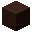

---
<!-- black_terracotta__from__crafting_shaped__use__tag_colored_terracotta.md -->

<!-- en_us -->

## Black Terracotta | Crafting Table: Shaped | Colored Terracotta

<table>
	<tablebody>
		<tr>
			<td colspan="5">Crafting Table: Shaped</td>
		</tr>
		<tr>
			<td></td>
			<td></td>
			<td></td>
			<td colspan="2"></td>
		</tr>
		<tr>
			<td></td>
			<td></td>
			<td></td>
			<td></td>
			<td></td>
		</tr>
		<tr>
			<td></td>
			<td></td>
			<td></td>
			<td colspan="2"></td>
		</tr>
	</tablebody>
</table>
<table>
	<tablebody>
		<tr>
			<td></td>
			<td>ICON</td>
			<td>NAME</td>
			<td>ID</td>
			<td>Count</td>
		</tr>
		<tr>
			<td></td>
			<td></td>
			<td>Black Terracotta</td>
			<td>black_terracotta</td>
			<td>8</td>
		</tr>
		<tr>
			<td></td>
			<td></td>
			<td><a>Colored Terracotta</a></td>
			<td><a>colored_terracotta</a></td>
			<td>8</td>
		</tr>
		<tr>
			<td></td>
			<td></td>
			<td>Black Dye</td>
			<td>black_dye</td>
			<td>1</td>
		</tr>
	</tablebody>
</table>

[Colored Terracotta](../../../en_us/tags/tag__colored_terracotta.md)

---
<!-- blue_terracotta__from__crafting_shaped__use__tag_colored_terracotta.md -->

<!-- en_us -->

## Blue Terracotta | Crafting Table: Shaped | Colored Terracotta

<table>
	<tablebody>
		<tr>
			<td colspan="5">Crafting Table: Shaped</td>
		</tr>
		<tr>
			<td></td>
			<td></td>
			<td></td>
			<td colspan="2"></td>
		</tr>
		<tr>
			<td></td>
			<td></td>
			<td></td>
			<td></td>
			<td></td>
		</tr>
		<tr>
			<td></td>
			<td></td>
			<td></td>
			<td colspan="2"></td>
		</tr>
	</tablebody>
</table>
<table>
	<tablebody>
		<tr>
			<td></td>
			<td>ICON</td>
			<td>NAME</td>
			<td>ID</td>
			<td>Count</td>
		</tr>
		<tr>
			<td></td>
			<td></td>
			<td>Blue Terracotta</td>
			<td>blue_terracotta</td>
			<td>8</td>
		</tr>
		<tr>
			<td></td>
			<td></td>
			<td><a>Colored Terracotta</a></td>
			<td><a>colored_terracotta</a></td>
			<td>8</td>
		</tr>
		<tr>
			<td></td>
			<td></td>
			<td>Blue Dye</td>
			<td>blue_dye</td>
			<td>1</td>
		</tr>
	</tablebody>
</table>

[Colored Terracotta](../../../en_us/tags/tag__colored_terracotta.md)

---
<!-- brown_terracotta__from__crafting_shaped__use__tag_colored_terracotta.md -->

<!-- en_us -->

## Brown Terracotta | Crafting Table: Shaped | Colored Terracotta

<table>
	<tablebody>
		<tr>
			<td colspan="5">Crafting Table: Shaped</td>
		</tr>
		<tr>
			<td></td>
			<td></td>
			<td></td>
			<td colspan="2"></td>
		</tr>
		<tr>
			<td></td>
			<td></td>
			<td></td>
			<td></td>
			<td></td>
		</tr>
		<tr>
			<td></td>
			<td></td>
			<td></td>
			<td colspan="2"></td>
		</tr>
	</tablebody>
</table>
<table>
	<tablebody>
		<tr>
			<td></td>
			<td>ICON</td>
			<td>NAME</td>
			<td>ID</td>
			<td>Count</td>
		</tr>
		<tr>
			<td></td>
			<td></td>
			<td>Brown Terracotta</td>
			<td>brown_terracotta</td>
			<td>8</td>
		</tr>
		<tr>
			<td></td>
			<td></td>
			<td><a>Colored Terracotta</a></td>
			<td><a>colored_terracotta</a></td>
			<td>8</td>
		</tr>
		<tr>
			<td></td>
			<td></td>
			<td>Brown Dye</td>
			<td>brown_dye</td>
			<td>1</td>
		</tr>
	</tablebody>
</table>

[Colored Terracotta](../../../en_us/tags/tag__colored_terracotta.md)

---
<!-- cyan_terracotta__from__crafting_shaped__use__tag_colored_terracotta.md -->

<!-- en_us -->

## Cyan Terracotta | Crafting Table: Shaped | Colored Terracotta

<table>
	<tablebody>
		<tr>
			<td colspan="5">Crafting Table: Shaped</td>
		</tr>
		<tr>
			<td></td>
			<td></td>
			<td></td>
			<td colspan="2"></td>
		</tr>
		<tr>
			<td></td>
			<td></td>
			<td></td>
			<td></td>
			<td></td>
		</tr>
		<tr>
			<td></td>
			<td></td>
			<td></td>
			<td colspan="2"></td>
		</tr>
	</tablebody>
</table>
<table>
	<tablebody>
		<tr>
			<td></td>
			<td>ICON</td>
			<td>NAME</td>
			<td>ID</td>
			<td>Count</td>
		</tr>
		<tr>
			<td></td>
			<td></td>
			<td>Cyan Terracotta</td>
			<td>cyan_terracotta</td>
			<td>8</td>
		</tr>
		<tr>
			<td></td>
			<td></td>
			<td><a>Colored Terracotta</a></td>
			<td><a>colored_terracotta</a></td>
			<td>8</td>
		</tr>
		<tr>
			<td></td>
			<td></td>
			<td>Cyan Dye</td>
			<td>cyan_dye</td>
			<td>1</td>
		</tr>
	</tablebody>
</table>

[Colored Terracotta](../../../en_us/tags/tag__colored_terracotta.md)

---
<!-- gray_terracotta__from__crafting_shaped__use__tag_colored_terracotta.md -->

<!-- en_us -->

## Gray Terracotta | Crafting Table: Shaped | Colored Terracotta

<table>
	<tablebody>
		<tr>
			<td colspan="5">Crafting Table: Shaped</td>
		</tr>
		<tr>
			<td></td>
			<td></td>
			<td></td>
			<td colspan="2"></td>
		</tr>
		<tr>
			<td></td>
			<td></td>
			<td></td>
			<td></td>
			<td></td>
		</tr>
		<tr>
			<td></td>
			<td></td>
			<td></td>
			<td colspan="2"></td>
		</tr>
	</tablebody>
</table>
<table>
	<tablebody>
		<tr>
			<td></td>
			<td>ICON</td>
			<td>NAME</td>
			<td>ID</td>
			<td>Count</td>
		</tr>
		<tr>
			<td></td>
			<td></td>
			<td>Gray Terracotta</td>
			<td>gray_terracotta</td>
			<td>8</td>
		</tr>
		<tr>
			<td></td>
			<td></td>
			<td><a>Colored Terracotta</a></td>
			<td><a>colored_terracotta</a></td>
			<td>8</td>
		</tr>
		<tr>
			<td></td>
			<td></td>
			<td>Gray Dye</td>
			<td>gray_dye</td>
			<td>1</td>
		</tr>
	</tablebody>
</table>

[Colored Terracotta](../../../en_us/tags/tag__colored_terracotta.md)

---
<!-- green_terracotta__from__crafting_shaped__use__tag_colored_terracotta.md -->

<!-- en_us -->

## Green Terracotta | Crafting Table: Shaped | Colored Terracotta

<table>
	<tablebody>
		<tr>
			<td colspan="5">Crafting Table: Shaped</td>
		</tr>
		<tr>
			<td></td>
			<td></td>
			<td></td>
			<td colspan="2"></td>
		</tr>
		<tr>
			<td></td>
			<td></td>
			<td></td>
			<td></td>
			<td></td>
		</tr>
		<tr>
			<td></td>
			<td></td>
			<td></td>
			<td colspan="2"></td>
		</tr>
	</tablebody>
</table>
<table>
	<tablebody>
		<tr>
			<td></td>
			<td>ICON</td>
			<td>NAME</td>
			<td>ID</td>
			<td>Count</td>
		</tr>
		<tr>
			<td></td>
			<td></td>
			<td>Green Terracotta</td>
			<td>green_terracotta</td>
			<td>8</td>
		</tr>
		<tr>
			<td></td>
			<td></td>
			<td><a>Colored Terracotta</a></td>
			<td><a>colored_terracotta</a></td>
			<td>8</td>
		</tr>
		<tr>
			<td></td>
			<td></td>
			<td>Green Dye</td>
			<td>green_dye</td>
			<td>1</td>
		</tr>
	</tablebody>
</table>

[Colored Terracotta](../../../en_us/tags/tag__colored_terracotta.md)

---
<!-- light_blue_terracotta__from__crafting_shaped__use__tag_colored_terracotta.md -->

<!-- en_us -->

## Light Blue Terracotta | Crafting Table: Shaped | Colored Terracotta

<table>
	<tablebody>
		<tr>
			<td colspan="5">Crafting Table: Shaped</td>
		</tr>
		<tr>
			<td></td>
			<td></td>
			<td></td>
			<td colspan="2"></td>
		</tr>
		<tr>
			<td></td>
			<td></td>
			<td></td>
			<td></td>
			<td></td>
		</tr>
		<tr>
			<td></td>
			<td></td>
			<td></td>
			<td colspan="2"></td>
		</tr>
	</tablebody>
</table>
<table>
	<tablebody>
		<tr>
			<td></td>
			<td>ICON</td>
			<td>NAME</td>
			<td>ID</td>
			<td>Count</td>
		</tr>
		<tr>
			<td></td>
			<td></td>
			<td>Light Blue Terracotta</td>
			<td>light_blue_terracotta</td>
			<td>8</td>
		</tr>
		<tr>
			<td></td>
			<td></td>
			<td><a>Colored Terracotta</a></td>
			<td><a>colored_terracotta</a></td>
			<td>8</td>
		</tr>
		<tr>
			<td></td>
			<td></td>
			<td>Light Blue Dye</td>
			<td>light_blue_dye</td>
			<td>1</td>
		</tr>
	</tablebody>
</table>

[Colored Terracotta](../../../en_us/tags/tag__colored_terracotta.md)

---
<!-- light_gray_terracotta__from__crafting_shaped__use__tag_colored_terracotta.md -->

<!-- en_us -->

## Light Gray Terracotta | Crafting Table: Shaped | Colored Terracotta

<table>
	<tablebody>
		<tr>
			<td colspan="5">Crafting Table: Shaped</td>
		</tr>
		<tr>
			<td></td>
			<td></td>
			<td></td>
			<td colspan="2"></td>
		</tr>
		<tr>
			<td></td>
			<td></td>
			<td></td>
			<td></td>
			<td></td>
		</tr>
		<tr>
			<td></td>
			<td></td>
			<td></td>
			<td colspan="2"></td>
		</tr>
	</tablebody>
</table>
<table>
	<tablebody>
		<tr>
			<td></td>
			<td>ICON</td>
			<td>NAME</td>
			<td>ID</td>
			<td>Count</td>
		</tr>
		<tr>
			<td></td>
			<td></td>
			<td>Light Gray Terracotta</td>
			<td>light_gray_terracotta</td>
			<td>8</td>
		</tr>
		<tr>
			<td></td>
			<td></td>
			<td><a>Colored Terracotta</a></td>
			<td><a>colored_terracotta</a></td>
			<td>8</td>
		</tr>
		<tr>
			<td></td>
			<td></td>
			<td>Light Gray Dye</td>
			<td>light_gray_dye</td>
			<td>1</td>
		</tr>
	</tablebody>
</table>

[Colored Terracotta](../../../en_us/tags/tag__colored_terracotta.md)

---
<!-- lime_terracotta__from__crafting_shaped__use__tag_colored_terracotta.md -->

<!-- en_us -->

## Lime Terracotta | Crafting Table: Shaped | Colored Terracotta

<table>
	<tablebody>
		<tr>
			<td colspan="5">Crafting Table: Shaped</td>
		</tr>
		<tr>
			<td></td>
			<td></td>
			<td></td>
			<td colspan="2"></td>
		</tr>
		<tr>
			<td></td>
			<td></td>
			<td></td>
			<td></td>
			<td></td>
		</tr>
		<tr>
			<td></td>
			<td></td>
			<td></td>
			<td colspan="2"></td>
		</tr>
	</tablebody>
</table>
<table>
	<tablebody>
		<tr>
			<td></td>
			<td>ICON</td>
			<td>NAME</td>
			<td>ID</td>
			<td>Count</td>
		</tr>
		<tr>
			<td></td>
			<td></td>
			<td>Lime Terracotta</td>
			<td>lime_terracotta</td>
			<td>8</td>
		</tr>
		<tr>
			<td></td>
			<td></td>
			<td><a>Colored Terracotta</a></td>
			<td><a>colored_terracotta</a></td>
			<td>8</td>
		</tr>
		<tr>
			<td></td>
			<td></td>
			<td>Lime Dye</td>
			<td>lime_dye</td>
			<td>1</td>
		</tr>
	</tablebody>
</table>

[Colored Terracotta](../../../en_us/tags/tag__colored_terracotta.md)

---
<!-- magenta_terracotta__from__crafting_shaped__use__tag_colored_terracotta.md -->

<!-- en_us -->

## Magenta Terracotta | Crafting Table: Shaped | Colored Terracotta

<table>
	<tablebody>
		<tr>
			<td colspan="5">Crafting Table: Shaped</td>
		</tr>
		<tr>
			<td></td>
			<td></td>
			<td></td>
			<td colspan="2"></td>
		</tr>
		<tr>
			<td></td>
			<td></td>
			<td></td>
			<td></td>
			<td></td>
		</tr>
		<tr>
			<td></td>
			<td></td>
			<td></td>
			<td colspan="2"></td>
		</tr>
	</tablebody>
</table>
<table>
	<tablebody>
		<tr>
			<td></td>
			<td>ICON</td>
			<td>NAME</td>
			<td>ID</td>
			<td>Count</td>
		</tr>
		<tr>
			<td></td>
			<td></td>
			<td>Magenta Terracotta</td>
			<td>magenta_terracotta</td>
			<td>8</td>
		</tr>
		<tr>
			<td></td>
			<td></td>
			<td><a>Colored Terracotta</a></td>
			<td><a>colored_terracotta</a></td>
			<td>8</td>
		</tr>
		<tr>
			<td></td>
			<td></td>
			<td>Magenta Dye</td>
			<td>magenta_dye</td>
			<td>1</td>
		</tr>
	</tablebody>
</table>

[Colored Terracotta](../../../en_us/tags/tag__colored_terracotta.md)

---
<!-- orange_terracotta__from__crafting_shaped__use__tag_colored_terracotta.md -->

<!-- en_us -->

## Orange Terracotta | Crafting Table: Shaped | Colored Terracotta

<table>
	<tablebody>
		<tr>
			<td colspan="5">Crafting Table: Shaped</td>
		</tr>
		<tr>
			<td></td>
			<td></td>
			<td></td>
			<td colspan="2"></td>
		</tr>
		<tr>
			<td></td>
			<td></td>
			<td></td>
			<td></td>
			<td></td>
		</tr>
		<tr>
			<td></td>
			<td></td>
			<td></td>
			<td colspan="2"></td>
		</tr>
	</tablebody>
</table>
<table>
	<tablebody>
		<tr>
			<td></td>
			<td>ICON</td>
			<td>NAME</td>
			<td>ID</td>
			<td>Count</td>
		</tr>
		<tr>
			<td></td>
			<td></td>
			<td>Orange Terracotta</td>
			<td>orange_terracotta</td>
			<td>8</td>
		</tr>
		<tr>
			<td></td>
			<td></td>
			<td><a>Colored Terracotta</a></td>
			<td><a>colored_terracotta</a></td>
			<td>8</td>
		</tr>
		<tr>
			<td></td>
			<td></td>
			<td>Orange Dye</td>
			<td>orange_dye</td>
			<td>1</td>
		</tr>
	</tablebody>
</table>

[Colored Terracotta](../../../en_us/tags/tag__colored_terracotta.md)

---
<!-- pink_terracotta__from__crafting_shaped__use__tag_colored_terracotta.md -->

<!-- en_us -->

## Pink Terracotta | Crafting Table: Shaped | Colored Terracotta

<table>
	<tablebody>
		<tr>
			<td colspan="5">Crafting Table: Shaped</td>
		</tr>
		<tr>
			<td></td>
			<td></td>
			<td></td>
			<td colspan="2"></td>
		</tr>
		<tr>
			<td></td>
			<td></td>
			<td></td>
			<td></td>
			<td></td>
		</tr>
		<tr>
			<td></td>
			<td></td>
			<td></td>
			<td colspan="2"></td>
		</tr>
	</tablebody>
</table>
<table>
	<tablebody>
		<tr>
			<td></td>
			<td>ICON</td>
			<td>NAME</td>
			<td>ID</td>
			<td>Count</td>
		</tr>
		<tr>
			<td></td>
			<td></td>
			<td>Pink Terracotta</td>
			<td>pink_terracotta</td>
			<td>8</td>
		</tr>
		<tr>
			<td></td>
			<td></td>
			<td><a>Colored Terracotta</a></td>
			<td><a>colored_terracotta</a></td>
			<td>8</td>
		</tr>
		<tr>
			<td></td>
			<td></td>
			<td>Pink Dye</td>
			<td>pink_dye</td>
			<td>1</td>
		</tr>
	</tablebody>
</table>

[Colored Terracotta](../../../en_us/tags/tag__colored_terracotta.md)

---
<!-- purple_terracotta__from__crafting_shaped__use__tag_colored_terracotta.md -->

<!-- en_us -->

## Purple Terracotta | Crafting Table: Shaped | Colored Terracotta

<table>
	<tablebody>
		<tr>
			<td colspan="5">Crafting Table: Shaped</td>
		</tr>
		<tr>
			<td></td>
			<td></td>
			<td></td>
			<td colspan="2"></td>
		</tr>
		<tr>
			<td></td>
			<td></td>
			<td></td>
			<td></td>
			<td></td>
		</tr>
		<tr>
			<td></td>
			<td></td>
			<td></td>
			<td colspan="2"></td>
		</tr>
	</tablebody>
</table>
<table>
	<tablebody>
		<tr>
			<td></td>
			<td>ICON</td>
			<td>NAME</td>
			<td>ID</td>
			<td>Count</td>
		</tr>
		<tr>
			<td></td>
			<td></td>
			<td>Purple Terracotta</td>
			<td>purple_terracotta</td>
			<td>8</td>
		</tr>
		<tr>
			<td></td>
			<td></td>
			<td><a>Colored Terracotta</a></td>
			<td><a>colored_terracotta</a></td>
			<td>8</td>
		</tr>
		<tr>
			<td></td>
			<td></td>
			<td>Purple Dye</td>
			<td>purple_dye</td>
			<td>1</td>
		</tr>
	</tablebody>
</table>

[Colored Terracotta](../../../en_us/tags/tag__colored_terracotta.md)

---
<!-- red_terracotta__from__crafting_shaped__use__tag_colored_terracotta.md -->

<!-- en_us -->

## Red Terracotta | Crafting Table: Shaped | Colored Terracotta

<table>
	<tablebody>
		<tr>
			<td colspan="5">Crafting Table: Shaped</td>
		</tr>
		<tr>
			<td></td>
			<td></td>
			<td></td>
			<td colspan="2"></td>
		</tr>
		<tr>
			<td></td>
			<td></td>
			<td></td>
			<td></td>
			<td></td>
		</tr>
		<tr>
			<td></td>
			<td></td>
			<td></td>
			<td colspan="2"></td>
		</tr>
	</tablebody>
</table>
<table>
	<tablebody>
		<tr>
			<td></td>
			<td>ICON</td>
			<td>NAME</td>
			<td>ID</td>
			<td>Count</td>
		</tr>
		<tr>
			<td></td>
			<td></td>
			<td>Red Terracotta</td>
			<td>red_terracotta</td>
			<td>8</td>
		</tr>
		<tr>
			<td></td>
			<td></td>
			<td><a>Colored Terracotta</a></td>
			<td><a>colored_terracotta</a></td>
			<td>8</td>
		</tr>
		<tr>
			<td></td>
			<td></td>
			<td>Red Dye</td>
			<td>red_dye</td>
			<td>1</td>
		</tr>
	</tablebody>
</table>

[Colored Terracotta](../../../en_us/tags/tag__colored_terracotta.md)

---
<!-- white_terracotta__from__crafting_shaped__use__tag_colored_terracotta.md -->

<!-- en_us -->

## White Terracotta | Crafting Table: Shaped | Colored Terracotta

<table>
	<tablebody>
		<tr>
			<td colspan="5">Crafting Table: Shaped</td>
		</tr>
		<tr>
			<td></td>
			<td></td>
			<td></td>
			<td colspan="2"></td>
		</tr>
		<tr>
			<td></td>
			<td></td>
			<td></td>
			<td></td>
			<td></td>
		</tr>
		<tr>
			<td></td>
			<td></td>
			<td></td>
			<td colspan="2"></td>
		</tr>
	</tablebody>
</table>
<table>
	<tablebody>
		<tr>
			<td></td>
			<td>ICON</td>
			<td>NAME</td>
			<td>ID</td>
			<td>Count</td>
		</tr>
		<tr>
			<td></td>
			<td></td>
			<td>White Terracotta</td>
			<td>white_terracotta</td>
			<td>8</td>
		</tr>
		<tr>
			<td></td>
			<td></td>
			<td><a>Colored Terracotta</a></td>
			<td><a>colored_terracotta</a></td>
			<td>8</td>
		</tr>
		<tr>
			<td></td>
			<td></td>
			<td>White Dye</td>
			<td>white_dye</td>
			<td>1</td>
		</tr>
	</tablebody>
</table>

[Colored Terracotta](../../../en_us/tags/tag__colored_terracotta.md)

---
<!-- yellow_terracotta__from__crafting_shaped__use__tag_colored_terracotta.md -->

<!-- en_us -->

## Yellow Terracotta | Crafting Table: Shaped | Colored Terracotta

<table>
	<tablebody>
		<tr>
			<td colspan="5">Crafting Table: Shaped</td>
		</tr>
		<tr>
			<td></td>
			<td></td>
			<td></td>
			<td colspan="2"></td>
		</tr>
		<tr>
			<td></td>
			<td></td>
			<td></td>
			<td></td>
			<td></td>
		</tr>
		<tr>
			<td></td>
			<td></td>
			<td></td>
			<td colspan="2"></td>
		</tr>
	</tablebody>
</table>
<table>
	<tablebody>
		<tr>
			<td></td>
			<td>ICON</td>
			<td>NAME</td>
			<td>ID</td>
			<td>Count</td>
		</tr>
		<tr>
			<td></td>
			<td></td>
			<td>Yellow Terracotta</td>
			<td>yellow_terracotta</td>
			<td>8</td>
		</tr>
		<tr>
			<td></td>
			<td></td>
			<td><a>Colored Terracotta</a></td>
			<td><a>colored_terracotta</a></td>
			<td>8</td>
		</tr>
		<tr>
			<td></td>
			<td></td>
			<td>Yellow Dye</td>
			<td>yellow_dye</td>
			<td>1</td>
		</tr>
	</tablebody>
</table>

[Colored Terracotta](../../../en_us/tags/tag__colored_terracotta.md)

