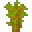
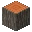
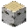
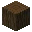
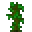
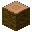
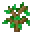
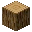
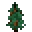
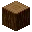

---
<!-- acacia_log__from__crafting_shapeless__use__acacia_sapling.md -->

<!-- en_us -->

## Acacia Log | Crafting Table: Shapeless | Acacia Sapling

<table>
	<tablebody>
		<tr>
			<td colspan="5">Crafting Table: Shapeless</td>
		</tr>
		<tr>
			<td></td>
			<td></td>
			<td></td>
			<td colspan="2"></td>
		</tr>
		<tr>
			<td></td>
			<td></td>
			<td></td>
			<td></td>
			<td></td>
		</tr>
		<tr>
			<td></td>
			<td></td>
			<td></td>
			<td colspan="2"></td>
		</tr>
	</tablebody>
</table>
<table>
	<tablebody>
		<tr>
			<td></td>
			<td>ICON</td>
			<td>NAME</td>
			<td>ID</td>
			<td>Count</td>
		</tr>
		<tr>
			<td></td>
			<td></td>
			<td>Acacia Log</td>
			<td>acacia_log</td>
			<td>64</td>
		</tr>
		<tr>
			<td></td>
			<td></td>
			<td>Acacia Sapling</td>
			<td>acacia_sapling</td>
			<td>1</td>
		</tr>
		<tr>
			<td></td>
			<td></td>
			<td>Bone Meal</td>
			<td>bone_meal</td>
			<td>1</td>
		</tr>
	</tablebody>
</table>

---
<!-- birch_log__from__crafting_shapeless__use__birch_sapling.md -->

<!-- en_us -->

## Birch Log | Crafting Table: Shapeless | Birch Sapling

<table>
	<tablebody>
		<tr>
			<td colspan="5">Crafting Table: Shapeless</td>
		</tr>
		<tr>
			<td></td>
			<td></td>
			<td></td>
			<td colspan="2"></td>
		</tr>
		<tr>
			<td></td>
			<td></td>
			<td></td>
			<td></td>
			<td></td>
		</tr>
		<tr>
			<td></td>
			<td></td>
			<td></td>
			<td colspan="2"></td>
		</tr>
	</tablebody>
</table>
<table>
	<tablebody>
		<tr>
			<td></td>
			<td>ICON</td>
			<td>NAME</td>
			<td>ID</td>
			<td>Count</td>
		</tr>
		<tr>
			<td></td>
			<td></td>
			<td>Birch Log</td>
			<td>birch_log</td>
			<td>64</td>
		</tr>
		<tr>
			<td></td>
			<td></td>
			<td>Birch Sapling</td>
			<td>birch_sapling</td>
			<td>1</td>
		</tr>
		<tr>
			<td></td>
			<td></td>
			<td>Bone Meal</td>
			<td>bone_meal</td>
			<td>1</td>
		</tr>
	</tablebody>
</table>

---
<!-- dark_oak_log__from__crafting_shapeless__use__dark_oak_sapling.md -->

<!-- en_us -->

## Dark Oak Log | Crafting Table: Shapeless | Dark Oak Sapling

<table>
	<tablebody>
		<tr>
			<td colspan="5">Crafting Table: Shapeless</td>
		</tr>
		<tr>
			<td></td>
			<td></td>
			<td></td>
			<td colspan="2"></td>
		</tr>
		<tr>
			<td></td>
			<td></td>
			<td></td>
			<td></td>
			<td></td>
		</tr>
		<tr>
			<td></td>
			<td></td>
			<td></td>
			<td colspan="2"></td>
		</tr>
	</tablebody>
</table>
<table>
	<tablebody>
		<tr>
			<td></td>
			<td>ICON</td>
			<td>NAME</td>
			<td>ID</td>
			<td>Count</td>
		</tr>
		<tr>
			<td></td>
			<td></td>
			<td>Dark Oak Log</td>
			<td>dark_oak_log</td>
			<td>64</td>
		</tr>
		<tr>
			<td></td>
			<td></td>
			<td>Dark Oak Sapling</td>
			<td>dark_oak_sapling</td>
			<td>1</td>
		</tr>
		<tr>
			<td></td>
			<td></td>
			<td>Bone Meal</td>
			<td>bone_meal</td>
			<td>1</td>
		</tr>
	</tablebody>
</table>

---
<!-- jungle_log__from__crafting_shapeless__use__jungle_sapling.md -->

<!-- en_us -->

## Jungle Log | Crafting Table: Shapeless | Jungle Sapling

<table>
	<tablebody>
		<tr>
			<td colspan="5">Crafting Table: Shapeless</td>
		</tr>
		<tr>
			<td></td>
			<td></td>
			<td></td>
			<td colspan="2"></td>
		</tr>
		<tr>
			<td></td>
			<td></td>
			<td></td>
			<td></td>
			<td></td>
		</tr>
		<tr>
			<td></td>
			<td></td>
			<td></td>
			<td colspan="2"></td>
		</tr>
	</tablebody>
</table>
<table>
	<tablebody>
		<tr>
			<td></td>
			<td>ICON</td>
			<td>NAME</td>
			<td>ID</td>
			<td>Count</td>
		</tr>
		<tr>
			<td></td>
			<td></td>
			<td>Jungle Log</td>
			<td>jungle_log</td>
			<td>64</td>
		</tr>
		<tr>
			<td></td>
			<td></td>
			<td>Jungle Sapling</td>
			<td>jungle_sapling</td>
			<td>1</td>
		</tr>
		<tr>
			<td></td>
			<td></td>
			<td>Bone Meal</td>
			<td>bone_meal</td>
			<td>1</td>
		</tr>
	</tablebody>
</table>

---
<!-- oak_log__from__crafting_shapeless__use__oak_sapling.md -->

<!-- en_us -->

## Oak Log | Crafting Table: Shapeless | Oak Sapling

<table>
	<tablebody>
		<tr>
			<td colspan="5">Crafting Table: Shapeless</td>
		</tr>
		<tr>
			<td></td>
			<td></td>
			<td></td>
			<td colspan="2"></td>
		</tr>
		<tr>
			<td></td>
			<td></td>
			<td></td>
			<td></td>
			<td></td>
		</tr>
		<tr>
			<td></td>
			<td></td>
			<td></td>
			<td colspan="2"></td>
		</tr>
	</tablebody>
</table>
<table>
	<tablebody>
		<tr>
			<td></td>
			<td>ICON</td>
			<td>NAME</td>
			<td>ID</td>
			<td>Count</td>
		</tr>
		<tr>
			<td></td>
			<td></td>
			<td>Oak Log</td>
			<td>oak_log</td>
			<td>64</td>
		</tr>
		<tr>
			<td></td>
			<td></td>
			<td>Oak Sapling</td>
			<td>oak_sapling</td>
			<td>1</td>
		</tr>
		<tr>
			<td></td>
			<td></td>
			<td>Bone Meal</td>
			<td>bone_meal</td>
			<td>1</td>
		</tr>
	</tablebody>
</table>

---
<!-- spruce_log__from__crafting_shapeless__use__spruce_sapling.md -->

<!-- en_us -->

## Spruce Log | Crafting Table: Shapeless | Spruce Sapling

<table>
	<tablebody>
		<tr>
			<td colspan="5">Crafting Table: Shapeless</td>
		</tr>
		<tr>
			<td></td>
			<td></td>
			<td></td>
			<td colspan="2"></td>
		</tr>
		<tr>
			<td></td>
			<td></td>
			<td></td>
			<td></td>
			<td></td>
		</tr>
		<tr>
			<td></td>
			<td></td>
			<td></td>
			<td colspan="2"></td>
		</tr>
	</tablebody>
</table>
<table>
	<tablebody>
		<tr>
			<td></td>
			<td>ICON</td>
			<td>NAME</td>
			<td>ID</td>
			<td>Count</td>
		</tr>
		<tr>
			<td></td>
			<td></td>
			<td>Spruce Log</td>
			<td>spruce_log</td>
			<td>64</td>
		</tr>
		<tr>
			<td></td>
			<td></td>
			<td>Spruce Sapling</td>
			<td>spruce_sapling</td>
			<td>1</td>
		</tr>
		<tr>
			<td></td>
			<td></td>
			<td>Bone Meal</td>
			<td>bone_meal</td>
			<td>1</td>
		</tr>
	</tablebody>
</table>

