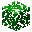
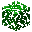

---
<!-- acacia_sapling__from__crafting_shapeless__use__acacia_leaves.md -->

<!-- en_us -->

## Acacia Sapling | Crafting Table: Shapeless | Acacia Leaves

<table>
	<tablebody>
		<tr>
			<td colspan="5">Crafting Table: Shapeless</td>
		</tr>
		<tr>
			<td></td>
			<td></td>
			<td></td>
			<td colspan="2"></td>
		</tr>
		<tr>
			<td></td>
			<td></td>
			<td></td>
			<td></td>
			<td></td>
		</tr>
		<tr>
			<td></td>
			<td></td>
			<td></td>
			<td colspan="2"></td>
		</tr>
	</tablebody>
</table>
<table>
	<tablebody>
		<tr>
			<td></td>
			<td>ICON</td>
			<td>NAME</td>
			<td>ID</td>
			<td>Count</td>
		</tr>
		<tr>
			<td></td>
			<td></td>
			<td>Acacia Sapling</td>
			<td>acacia_sapling</td>
			<td>1</td>
		</tr>
		<tr>
			<td></td>
			<td></td>
			<td>Acacia Leaves</td>
			<td>acacia_leaves</td>
			<td>1</td>
		</tr>
		<tr>
			<td></td>
			<td></td>
			<td>Stick</td>
			<td>stick</td>
			<td>1</td>
		</tr>
	</tablebody>
</table>

---
<!-- birch_sapling__from__crafting_shapeless__use__birch_leaves.md -->

<!-- en_us -->

## Birch Sapling | Crafting Table: Shapeless | Birch Leaves

<table>
	<tablebody>
		<tr>
			<td colspan="5">Crafting Table: Shapeless</td>
		</tr>
		<tr>
			<td></td>
			<td></td>
			<td></td>
			<td colspan="2"></td>
		</tr>
		<tr>
			<td></td>
			<td></td>
			<td></td>
			<td></td>
			<td></td>
		</tr>
		<tr>
			<td></td>
			<td></td>
			<td></td>
			<td colspan="2"></td>
		</tr>
	</tablebody>
</table>
<table>
	<tablebody>
		<tr>
			<td></td>
			<td>ICON</td>
			<td>NAME</td>
			<td>ID</td>
			<td>Count</td>
		</tr>
		<tr>
			<td></td>
			<td></td>
			<td>Birch Sapling</td>
			<td>birch_sapling</td>
			<td>1</td>
		</tr>
		<tr>
			<td></td>
			<td></td>
			<td>Birch Leaves</td>
			<td>birch_leaves</td>
			<td>1</td>
		</tr>
		<tr>
			<td></td>
			<td></td>
			<td>Stick</td>
			<td>stick</td>
			<td>1</td>
		</tr>
	</tablebody>
</table>

---
<!-- dark_oak_sapling__from__crafting_shapeless__use__dark_oak_leaves.md -->

<!-- en_us -->

## Dark Oak Sapling | Crafting Table: Shapeless | Dark Oak Leaves

<table>
	<tablebody>
		<tr>
			<td colspan="5">Crafting Table: Shapeless</td>
		</tr>
		<tr>
			<td></td>
			<td></td>
			<td></td>
			<td colspan="2"></td>
		</tr>
		<tr>
			<td></td>
			<td></td>
			<td></td>
			<td></td>
			<td></td>
		</tr>
		<tr>
			<td></td>
			<td></td>
			<td></td>
			<td colspan="2"></td>
		</tr>
	</tablebody>
</table>
<table>
	<tablebody>
		<tr>
			<td></td>
			<td>ICON</td>
			<td>NAME</td>
			<td>ID</td>
			<td>Count</td>
		</tr>
		<tr>
			<td></td>
			<td></td>
			<td>Dark Oak Sapling</td>
			<td>dark_oak_sapling</td>
			<td>1</td>
		</tr>
		<tr>
			<td></td>
			<td></td>
			<td>Dark Oak Leaves</td>
			<td>dark_oak_leaves</td>
			<td>1</td>
		</tr>
		<tr>
			<td></td>
			<td></td>
			<td>Stick</td>
			<td>stick</td>
			<td>1</td>
		</tr>
	</tablebody>
</table>

---
<!-- jungle_sapling__from__crafting_shapeless__use__jungle_leaves.md -->

<!-- en_us -->

## Jungle Sapling | Crafting Table: Shapeless | Jungle Leaves

<table>
	<tablebody>
		<tr>
			<td colspan="5">Crafting Table: Shapeless</td>
		</tr>
		<tr>
			<td></td>
			<td></td>
			<td></td>
			<td colspan="2"></td>
		</tr>
		<tr>
			<td></td>
			<td></td>
			<td></td>
			<td></td>
			<td></td>
		</tr>
		<tr>
			<td></td>
			<td></td>
			<td></td>
			<td colspan="2"></td>
		</tr>
	</tablebody>
</table>
<table>
	<tablebody>
		<tr>
			<td></td>
			<td>ICON</td>
			<td>NAME</td>
			<td>ID</td>
			<td>Count</td>
		</tr>
		<tr>
			<td></td>
			<td></td>
			<td>Jungle Sapling</td>
			<td>jungle_sapling</td>
			<td>1</td>
		</tr>
		<tr>
			<td></td>
			<td></td>
			<td>Jungle Leaves</td>
			<td>jungle_leaves</td>
			<td>1</td>
		</tr>
		<tr>
			<td></td>
			<td></td>
			<td>Stick</td>
			<td>stick</td>
			<td>1</td>
		</tr>
	</tablebody>
</table>

---
<!-- oak_sapling__from__crafting_shapeless__use__oak_leaves.md -->

<!-- en_us -->

## Oak Sapling | Crafting Table: Shapeless | Oak Leaves

<table>
	<tablebody>
		<tr>
			<td colspan="5">Crafting Table: Shapeless</td>
		</tr>
		<tr>
			<td></td>
			<td></td>
			<td></td>
			<td colspan="2"></td>
		</tr>
		<tr>
			<td></td>
			<td></td>
			<td></td>
			<td></td>
			<td></td>
		</tr>
		<tr>
			<td></td>
			<td></td>
			<td></td>
			<td colspan="2"></td>
		</tr>
	</tablebody>
</table>
<table>
	<tablebody>
		<tr>
			<td></td>
			<td>ICON</td>
			<td>NAME</td>
			<td>ID</td>
			<td>Count</td>
		</tr>
		<tr>
			<td></td>
			<td></td>
			<td>Oak Sapling</td>
			<td>oak_sapling</td>
			<td>1</td>
		</tr>
		<tr>
			<td></td>
			<td></td>
			<td>Oak Leaves</td>
			<td>oak_leaves</td>
			<td>1</td>
		</tr>
		<tr>
			<td></td>
			<td></td>
			<td>Stick</td>
			<td>stick</td>
			<td>1</td>
		</tr>
	</tablebody>
</table>

---
<!-- spruce_sapling__from__crafting_shapeless__use__spruce_leaves.md -->

<!-- en_us -->

## Spruce Sapling | Crafting Table: Shapeless | Spruce Leaves

<table>
	<tablebody>
		<tr>
			<td colspan="5">Crafting Table: Shapeless</td>
		</tr>
		<tr>
			<td></td>
			<td></td>
			<td></td>
			<td colspan="2"></td>
		</tr>
		<tr>
			<td></td>
			<td></td>
			<td></td>
			<td></td>
			<td></td>
		</tr>
		<tr>
			<td></td>
			<td></td>
			<td></td>
			<td colspan="2"></td>
		</tr>
	</tablebody>
</table>
<table>
	<tablebody>
		<tr>
			<td></td>
			<td>ICON</td>
			<td>NAME</td>
			<td>ID</td>
			<td>Count</td>
		</tr>
		<tr>
			<td></td>
			<td></td>
			<td>Spruce Sapling</td>
			<td>spruce_sapling</td>
			<td>1</td>
		</tr>
		<tr>
			<td></td>
			<td></td>
			<td>Spruce Leaves</td>
			<td>spruce_leaves</td>
			<td>1</td>
		</tr>
		<tr>
			<td></td>
			<td></td>
			<td>Stick</td>
			<td>stick</td>
			<td>1</td>
		</tr>
	</tablebody>
</table>

---
<!-- crimson_stem__from__crafting_shapeless__use__crimson_fungus.md -->

<!-- en_us -->

## Crimson Stem | Crafting Table: Shapeless | Crimson Fungus

<table>
	<tablebody>
		<tr>
			<td colspan="5">Crafting Table: Shapeless</td>
		</tr>
		<tr>
			<td></td>
			<td></td>
			<td></td>
			<td colspan="2"></td>
		</tr>
		<tr>
			<td></td>
			<td></td>
			<td></td>
			<td></td>
			<td></td>
		</tr>
		<tr>
			<td></td>
			<td></td>
			<td></td>
			<td colspan="2"></td>
		</tr>
	</tablebody>
</table>
<table>
	<tablebody>
		<tr>
			<td></td>
			<td>ICON</td>
			<td>NAME</td>
			<td>ID</td>
			<td>Count</td>
		</tr>
		<tr>
			<td></td>
			<td></td>
			<td>Crimson Stem</td>
			<td>crimson_stem</td>
			<td>64</td>
		</tr>
		<tr>
			<td></td>
			<td></td>
			<td>Crimson Fungus</td>
			<td>crimson_fungus</td>
			<td>1</td>
		</tr>
		<tr>
			<td></td>
			<td></td>
			<td>Bone Meal</td>
			<td>bone_meal</td>
			<td>1</td>
		</tr>
	</tablebody>
</table>

---
<!-- warped_stem__from__crafting_shapeless__use__warped_fungus.md -->

<!-- en_us -->

## Warped Stem | Crafting Table: Shapeless | Warped Fungus

<table>
	<tablebody>
		<tr>
			<td colspan="5">Crafting Table: Shapeless</td>
		</tr>
		<tr>
			<td></td>
			<td></td>
			<td></td>
			<td colspan="2"></td>
		</tr>
		<tr>
			<td></td>
			<td></td>
			<td></td>
			<td></td>
			<td></td>
		</tr>
		<tr>
			<td></td>
			<td></td>
			<td></td>
			<td colspan="2"></td>
		</tr>
	</tablebody>
</table>
<table>
	<tablebody>
		<tr>
			<td></td>
			<td>ICON</td>
			<td>NAME</td>
			<td>ID</td>
			<td>Count</td>
		</tr>
		<tr>
			<td></td>
			<td></td>
			<td>Warped Stem</td>
			<td>warped_stem</td>
			<td>64</td>
		</tr>
		<tr>
			<td></td>
			<td></td>
			<td>Warped Fungus</td>
			<td>warped_fungus</td>
			<td>1</td>
		</tr>
		<tr>
			<td></td>
			<td></td>
			<td>Bone Meal</td>
			<td>bone_meal</td>
			<td>1</td>
		</tr>
	</tablebody>
</table>

