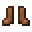

---
<!-- golden_helmet__from__smithing__use__leather_helmet.md -->

<!-- en_us -->

## Golden Helmet | Smithing Table | Leather Cap

<table>
	<tablebody>
		<tr>
			<td colspan="5">Smithing Table</td>
		</tr>
		<tr>
			<td></td>
			<td></td>
			<td></td>
			<td></td>
			<td></td>
		</tr>
	</tablebody>
</table>
<table>
	<tablebody>
		<tr>
			<td></td>
			<td>ICON</td>
			<td>NAME</td>
			<td>ID</td>
			<td>Count</td>
		</tr>
		<tr>
			<td></td>
			<td></td>
			<td>Leather Cap</td>
			<td>leather_helmet</td>
			<td>1</td>
		</tr>
		<tr>
			<td></td>
			<td></td>
			<td>Gold Ingot</td>
			<td>gold_ingot</td>
			<td>1</td>
		</tr>
		<tr>
			<td></td>
			<td></td>
			<td>Golden Helmet</td>
			<td>golden_helmet</td>
			<td>1</td>
		</tr>
	</tablebody>
</table>

---
<!-- golden_helmet__from__smithing__use__turtle_helmet.md -->

<!-- en_us -->

## Golden Helmet | Smithing Table | Turtle Shell

<table>
	<tablebody>
		<tr>
			<td colspan="5">Smithing Table</td>
		</tr>
		<tr>
			<td></td>
			<td></td>
			<td></td>
			<td></td>
			<td></td>
		</tr>
	</tablebody>
</table>
<table>
	<tablebody>
		<tr>
			<td></td>
			<td>ICON</td>
			<td>NAME</td>
			<td>ID</td>
			<td>Count</td>
		</tr>
		<tr>
			<td></td>
			<td></td>
			<td>Turtle Shell</td>
			<td>turtle_helmet</td>
			<td>1</td>
		</tr>
		<tr>
			<td></td>
			<td></td>
			<td>Gold Ingot</td>
			<td>gold_ingot</td>
			<td>1</td>
		</tr>
		<tr>
			<td></td>
			<td></td>
			<td>Golden Helmet</td>
			<td>golden_helmet</td>
			<td>1</td>
		</tr>
	</tablebody>
</table>

---
<!-- golden_chestplate__from__smithing__use__leather_chestplate.md -->

<!-- en_us -->

## Golden Chestplate | Smithing Table | Leather Tunic

<table>
	<tablebody>
		<tr>
			<td colspan="5">Smithing Table</td>
		</tr>
		<tr>
			<td></td>
			<td></td>
			<td></td>
			<td></td>
			<td></td>
		</tr>
	</tablebody>
</table>
<table>
	<tablebody>
		<tr>
			<td></td>
			<td>ICON</td>
			<td>NAME</td>
			<td>ID</td>
			<td>Count</td>
		</tr>
		<tr>
			<td></td>
			<td></td>
			<td>Leather Tunic</td>
			<td>leather_chestplate</td>
			<td>1</td>
		</tr>
		<tr>
			<td></td>
			<td></td>
			<td>Gold Ingot</td>
			<td>gold_ingot</td>
			<td>1</td>
		</tr>
		<tr>
			<td></td>
			<td></td>
			<td>Golden Chestplate</td>
			<td>golden_chestplate</td>
			<td>1</td>
		</tr>
	</tablebody>
</table>

---
<!-- golden_leggings__from__smithing__use__leather_leggings.md -->

<!-- en_us -->

## Golden Leggings | Smithing Table | Leather Pants

<table>
	<tablebody>
		<tr>
			<td colspan="5">Smithing Table</td>
		</tr>
		<tr>
			<td></td>
			<td></td>
			<td></td>
			<td></td>
			<td></td>
		</tr>
	</tablebody>
</table>
<table>
	<tablebody>
		<tr>
			<td></td>
			<td>ICON</td>
			<td>NAME</td>
			<td>ID</td>
			<td>Count</td>
		</tr>
		<tr>
			<td></td>
			<td></td>
			<td>Leather Pants</td>
			<td>leather_leggings</td>
			<td>1</td>
		</tr>
		<tr>
			<td></td>
			<td></td>
			<td>Gold Ingot</td>
			<td>gold_ingot</td>
			<td>1</td>
		</tr>
		<tr>
			<td></td>
			<td></td>
			<td>Golden Leggings</td>
			<td>golden_leggings</td>
			<td>1</td>
		</tr>
	</tablebody>
</table>

---
<!-- golden_boots__from__smithing__use__leather_boots.md -->

<!-- en_us -->

## Golden Boots | Smithing Table | Leather Boots

<table>
	<tablebody>
		<tr>
			<td colspan="5">Smithing Table</td>
		</tr>
		<tr>
			<td></td>
			<td></td>
			<td></td>
			<td></td>
			<td></td>
		</tr>
	</tablebody>
</table>
<table>
	<tablebody>
		<tr>
			<td></td>
			<td>ICON</td>
			<td>NAME</td>
			<td>ID</td>
			<td>Count</td>
		</tr>
		<tr>
			<td></td>
			<td></td>
			<td>Leather Boots</td>
			<td>leather_boots</td>
			<td>1</td>
		</tr>
		<tr>
			<td></td>
			<td></td>
			<td>Gold Ingot</td>
			<td>gold_ingot</td>
			<td>1</td>
		</tr>
		<tr>
			<td></td>
			<td></td>
			<td>Golden Boots</td>
			<td>golden_boots</td>
			<td>1</td>
		</tr>
	</tablebody>
</table>

