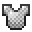

---
<!-- iron_helmet__from__smithing__use__chainmail_helmet.md -->

<!-- en_us -->

## Iron Helmet | Smithing Table | Chainmail Helmet

<table>
	<tablebody>
		<tr>
			<td colspan="5">Smithing Table</td>
		</tr>
		<tr>
			<td></td>
			<td></td>
			<td></td>
			<td></td>
			<td></td>
		</tr>
	</tablebody>
</table>
<table>
	<tablebody>
		<tr>
			<td></td>
			<td>ICON</td>
			<td>NAME</td>
			<td>ID</td>
			<td>Count</td>
		</tr>
		<tr>
			<td></td>
			<td></td>
			<td>Chainmail Helmet</td>
			<td>chainmail_helmet</td>
			<td>1</td>
		</tr>
		<tr>
			<td></td>
			<td></td>
			<td>Iron Ingot</td>
			<td>iron_ingot</td>
			<td>1</td>
		</tr>
		<tr>
			<td></td>
			<td></td>
			<td>Iron Helmet</td>
			<td>iron_helmet</td>
			<td>1</td>
		</tr>
	</tablebody>
</table>

---
<!-- iron_chestplate__from__smithing__use__chainmail_chestplate.md -->

<!-- en_us -->

## Iron Chestplate | Smithing Table | Chainmail Chestplate

<table>
	<tablebody>
		<tr>
			<td colspan="5">Smithing Table</td>
		</tr>
		<tr>
			<td></td>
			<td></td>
			<td></td>
			<td></td>
			<td></td>
		</tr>
	</tablebody>
</table>
<table>
	<tablebody>
		<tr>
			<td></td>
			<td>ICON</td>
			<td>NAME</td>
			<td>ID</td>
			<td>Count</td>
		</tr>
		<tr>
			<td></td>
			<td></td>
			<td>Chainmail Chestplate</td>
			<td>chainmail_chestplate</td>
			<td>1</td>
		</tr>
		<tr>
			<td></td>
			<td></td>
			<td>Iron Ingot</td>
			<td>iron_ingot</td>
			<td>1</td>
		</tr>
		<tr>
			<td></td>
			<td></td>
			<td>Iron Chestplate</td>
			<td>iron_chestplate</td>
			<td>1</td>
		</tr>
	</tablebody>
</table>

---
<!-- iron_leggings__from__smithing__use__chainmail_leggings.md -->

<!-- en_us -->

## Iron Leggings | Smithing Table | Chainmail Leggings

<table>
	<tablebody>
		<tr>
			<td colspan="5">Smithing Table</td>
		</tr>
		<tr>
			<td></td>
			<td></td>
			<td></td>
			<td></td>
			<td></td>
		</tr>
	</tablebody>
</table>
<table>
	<tablebody>
		<tr>
			<td></td>
			<td>ICON</td>
			<td>NAME</td>
			<td>ID</td>
			<td>Count</td>
		</tr>
		<tr>
			<td></td>
			<td></td>
			<td>Chainmail Leggings</td>
			<td>chainmail_leggings</td>
			<td>1</td>
		</tr>
		<tr>
			<td></td>
			<td></td>
			<td>Iron Ingot</td>
			<td>iron_ingot</td>
			<td>1</td>
		</tr>
		<tr>
			<td></td>
			<td></td>
			<td>Iron Leggings</td>
			<td>iron_leggings</td>
			<td>1</td>
		</tr>
	</tablebody>
</table>

---
<!-- iron_boots__from__smithing__use__chainmail_boots.md -->

<!-- en_us -->

## Iron Boots | Smithing Table | Chainmail Boots

<table>
	<tablebody>
		<tr>
			<td colspan="5">Smithing Table</td>
		</tr>
		<tr>
			<td></td>
			<td></td>
			<td></td>
			<td></td>
			<td></td>
		</tr>
	</tablebody>
</table>
<table>
	<tablebody>
		<tr>
			<td></td>
			<td>ICON</td>
			<td>NAME</td>
			<td>ID</td>
			<td>Count</td>
		</tr>
		<tr>
			<td></td>
			<td></td>
			<td>Chainmail Boots</td>
			<td>chainmail_boots</td>
			<td>1</td>
		</tr>
		<tr>
			<td></td>
			<td></td>
			<td>Iron Ingot</td>
			<td>iron_ingot</td>
			<td>1</td>
		</tr>
		<tr>
			<td></td>
			<td></td>
			<td>Iron Boots</td>
			<td>iron_boots</td>
			<td>1</td>
		</tr>
	</tablebody>
</table>

