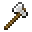
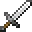

---
<!-- diamond_axe__from__smithing__use__iron_axe.md -->

<!-- en_us -->

## Diamond Axe | Smithing Table | Iron Axe

<table>
	<tablebody>
		<tr>
			<td colspan="5">Smithing Table</td>
		</tr>
		<tr>
			<td></td>
			<td></td>
			<td></td>
			<td></td>
			<td></td>
		</tr>
	</tablebody>
</table>
<table>
	<tablebody>
		<tr>
			<td></td>
			<td>ICON</td>
			<td>NAME</td>
			<td>ID</td>
			<td>Count</td>
		</tr>
		<tr>
			<td></td>
			<td></td>
			<td>Iron Axe</td>
			<td>iron_axe</td>
			<td>1</td>
		</tr>
		<tr>
			<td></td>
			<td></td>
			<td>Diamond</td>
			<td>diamond</td>
			<td>1</td>
		</tr>
		<tr>
			<td></td>
			<td></td>
			<td>Diamond Axe</td>
			<td>diamond_axe</td>
			<td>1</td>
		</tr>
	</tablebody>
</table>

---
<!-- diamond_hoe__from__smithing__use__iron_hoe.md -->

<!-- en_us -->

## Diamond Hoe | Smithing Table | Iron Hoe

<table>
	<tablebody>
		<tr>
			<td colspan="5">Smithing Table</td>
		</tr>
		<tr>
			<td></td>
			<td></td>
			<td></td>
			<td></td>
			<td></td>
		</tr>
	</tablebody>
</table>
<table>
	<tablebody>
		<tr>
			<td></td>
			<td>ICON</td>
			<td>NAME</td>
			<td>ID</td>
			<td>Count</td>
		</tr>
		<tr>
			<td></td>
			<td></td>
			<td>Iron Hoe</td>
			<td>iron_hoe</td>
			<td>1</td>
		</tr>
		<tr>
			<td></td>
			<td></td>
			<td>Diamond</td>
			<td>diamond</td>
			<td>1</td>
		</tr>
		<tr>
			<td></td>
			<td></td>
			<td>Diamond Hoe</td>
			<td>diamond_hoe</td>
			<td>1</td>
		</tr>
	</tablebody>
</table>

---
<!-- diamond_pickaxe__from__smithing__use__iron_pickaxe.md -->

<!-- en_us -->

## Diamond Pickaxe | Smithing Table | Iron Pickaxe

<table>
	<tablebody>
		<tr>
			<td colspan="5">Smithing Table</td>
		</tr>
		<tr>
			<td></td>
			<td></td>
			<td></td>
			<td></td>
			<td></td>
		</tr>
	</tablebody>
</table>
<table>
	<tablebody>
		<tr>
			<td></td>
			<td>ICON</td>
			<td>NAME</td>
			<td>ID</td>
			<td>Count</td>
		</tr>
		<tr>
			<td></td>
			<td></td>
			<td>Iron Pickaxe</td>
			<td>iron_pickaxe</td>
			<td>1</td>
		</tr>
		<tr>
			<td></td>
			<td></td>
			<td>Diamond</td>
			<td>diamond</td>
			<td>1</td>
		</tr>
		<tr>
			<td></td>
			<td></td>
			<td>Diamond Pickaxe</td>
			<td>diamond_pickaxe</td>
			<td>1</td>
		</tr>
	</tablebody>
</table>

---
<!-- diamond_shovel__from__smithing__use__iron_shovel.md -->

<!-- en_us -->

## Diamond Shovel | Smithing Table | Iron Shovel

<table>
	<tablebody>
		<tr>
			<td colspan="5">Smithing Table</td>
		</tr>
		<tr>
			<td></td>
			<td></td>
			<td></td>
			<td></td>
			<td></td>
		</tr>
	</tablebody>
</table>
<table>
	<tablebody>
		<tr>
			<td></td>
			<td>ICON</td>
			<td>NAME</td>
			<td>ID</td>
			<td>Count</td>
		</tr>
		<tr>
			<td></td>
			<td></td>
			<td>Iron Shovel</td>
			<td>iron_shovel</td>
			<td>1</td>
		</tr>
		<tr>
			<td></td>
			<td></td>
			<td>Diamond</td>
			<td>diamond</td>
			<td>1</td>
		</tr>
		<tr>
			<td></td>
			<td></td>
			<td>Diamond Shovel</td>
			<td>diamond_shovel</td>
			<td>1</td>
		</tr>
	</tablebody>
</table>

---
<!-- diamond_sword__from__smithing__use__iron_sword.md -->

<!-- en_us -->

## Diamond Sword | Smithing Table | Iron Sword

<table>
	<tablebody>
		<tr>
			<td colspan="5">Smithing Table</td>
		</tr>
		<tr>
			<td></td>
			<td></td>
			<td></td>
			<td></td>
			<td></td>
		</tr>
	</tablebody>
</table>
<table>
	<tablebody>
		<tr>
			<td></td>
			<td>ICON</td>
			<td>NAME</td>
			<td>ID</td>
			<td>Count</td>
		</tr>
		<tr>
			<td></td>
			<td></td>
			<td>Iron Sword</td>
			<td>iron_sword</td>
			<td>1</td>
		</tr>
		<tr>
			<td></td>
			<td></td>
			<td>Diamond</td>
			<td>diamond</td>
			<td>1</td>
		</tr>
		<tr>
			<td></td>
			<td></td>
			<td>Diamond Sword</td>
			<td>diamond_sword</td>
			<td>1</td>
		</tr>
	</tablebody>
</table>

