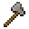
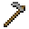
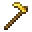
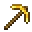
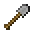
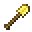
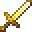

---
<!-- golden_axe__from__smithing__use__stone_axe.md -->

<!-- en_us -->

## Golden Axe | Smithing Table | Stone Axe

<table>
	<tablebody>
		<tr>
			<td colspan="5">Smithing Table</td>
		</tr>
		<tr>
			<td></td>
			<td></td>
			<td></td>
			<td></td>
			<td></td>
		</tr>
	</tablebody>
</table>
<table>
	<tablebody>
		<tr>
			<td></td>
			<td>ICON</td>
			<td>NAME</td>
			<td>ID</td>
			<td>Count</td>
		</tr>
		<tr>
			<td></td>
			<td></td>
			<td>Stone Axe</td>
			<td>stone_axe</td>
			<td>1</td>
		</tr>
		<tr>
			<td></td>
			<td></td>
			<td>Gold Ingot</td>
			<td>gold_ingot</td>
			<td>1</td>
		</tr>
		<tr>
			<td></td>
			<td></td>
			<td>Golden Axe</td>
			<td>golden_axe</td>
			<td>1</td>
		</tr>
	</tablebody>
</table>

---
<!-- golden_hoe__from__smithing__use__stone_hoe.md -->

<!-- en_us -->

## Golden Hoe | Smithing Table | Stone Hoe

<table>
	<tablebody>
		<tr>
			<td colspan="5">Smithing Table</td>
		</tr>
		<tr>
			<td></td>
			<td></td>
			<td></td>
			<td></td>
			<td></td>
		</tr>
	</tablebody>
</table>
<table>
	<tablebody>
		<tr>
			<td></td>
			<td>ICON</td>
			<td>NAME</td>
			<td>ID</td>
			<td>Count</td>
		</tr>
		<tr>
			<td></td>
			<td></td>
			<td>Stone Hoe</td>
			<td>stone_hoe</td>
			<td>1</td>
		</tr>
		<tr>
			<td></td>
			<td></td>
			<td>Gold Ingot</td>
			<td>gold_ingot</td>
			<td>1</td>
		</tr>
		<tr>
			<td></td>
			<td></td>
			<td>Golden Hoe</td>
			<td>golden_hoe</td>
			<td>1</td>
		</tr>
	</tablebody>
</table>

---
<!-- golden_pickaxe__from__smithing__use__stone_pickaxe.md -->

<!-- en_us -->

## Golden Pickaxe | Smithing Table | Stone Pickaxe

<table>
	<tablebody>
		<tr>
			<td colspan="5">Smithing Table</td>
		</tr>
		<tr>
			<td></td>
			<td></td>
			<td></td>
			<td></td>
			<td></td>
		</tr>
	</tablebody>
</table>
<table>
	<tablebody>
		<tr>
			<td></td>
			<td>ICON</td>
			<td>NAME</td>
			<td>ID</td>
			<td>Count</td>
		</tr>
		<tr>
			<td></td>
			<td></td>
			<td>Stone Pickaxe</td>
			<td>stone_pickaxe</td>
			<td>1</td>
		</tr>
		<tr>
			<td></td>
			<td></td>
			<td>Gold Ingot</td>
			<td>gold_ingot</td>
			<td>1</td>
		</tr>
		<tr>
			<td></td>
			<td></td>
			<td>Golden Pickaxe</td>
			<td>golden_pickaxe</td>
			<td>1</td>
		</tr>
	</tablebody>
</table>

---
<!-- golden_shovel__from__smithing__use__stone_shovel.md -->

<!-- en_us -->

## Golden Shovel | Smithing Table | Stone Shovel

<table>
	<tablebody>
		<tr>
			<td colspan="5">Smithing Table</td>
		</tr>
		<tr>
			<td></td>
			<td></td>
			<td></td>
			<td></td>
			<td></td>
		</tr>
	</tablebody>
</table>
<table>
	<tablebody>
		<tr>
			<td></td>
			<td>ICON</td>
			<td>NAME</td>
			<td>ID</td>
			<td>Count</td>
		</tr>
		<tr>
			<td></td>
			<td></td>
			<td>Stone Shovel</td>
			<td>stone_shovel</td>
			<td>1</td>
		</tr>
		<tr>
			<td></td>
			<td></td>
			<td>Gold Ingot</td>
			<td>gold_ingot</td>
			<td>1</td>
		</tr>
		<tr>
			<td></td>
			<td></td>
			<td>Golden Shovel</td>
			<td>golden_shovel</td>
			<td>1</td>
		</tr>
	</tablebody>
</table>

---
<!-- golden_sword__from__smithing__use__stone_sword.md -->

<!-- en_us -->

## Golden Sword | Smithing Table | Stone Sword

<table>
	<tablebody>
		<tr>
			<td colspan="5">Smithing Table</td>
		</tr>
		<tr>
			<td></td>
			<td></td>
			<td></td>
			<td></td>
			<td></td>
		</tr>
	</tablebody>
</table>
<table>
	<tablebody>
		<tr>
			<td></td>
			<td>ICON</td>
			<td>NAME</td>
			<td>ID</td>
			<td>Count</td>
		</tr>
		<tr>
			<td></td>
			<td></td>
			<td>Stone Sword</td>
			<td>stone_sword</td>
			<td>1</td>
		</tr>
		<tr>
			<td></td>
			<td></td>
			<td>Gold Ingot</td>
			<td>gold_ingot</td>
			<td>1</td>
		</tr>
		<tr>
			<td></td>
			<td></td>
			<td>Golden Sword</td>
			<td>golden_sword</td>
			<td>1</td>
		</tr>
	</tablebody>
</table>

