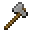
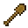

---
<!-- stone_axe__from__smithing__use__wooden_axe.md -->

<!-- en_us -->

## Stone Axe | Smithing Table | Wooden Axe

<table>
	<tablebody>
		<tr>
			<td colspan="5">Smithing Table</td>
		</tr>
		<tr>
			<td></td>
			<td></td>
			<td></td>
			<td></td>
			<td></td>
		</tr>
	</tablebody>
</table>
<table>
	<tablebody>
		<tr>
			<td></td>
			<td>ICON</td>
			<td>NAME</td>
			<td>ID</td>
			<td>Count</td>
		</tr>
		<tr>
			<td></td>
			<td></td>
			<td>Wooden Axe</td>
			<td>wooden_axe</td>
			<td>1</td>
		</tr>
		<tr>
			<td></td>
			<td></td>
			<td>Cobblestone</td>
			<td>cobblestone</td>
			<td>1</td>
		</tr>
		<tr>
			<td></td>
			<td></td>
			<td>Stone Axe</td>
			<td>stone_axe</td>
			<td>1</td>
		</tr>
	</tablebody>
</table>

---
<!-- stone_hoe__from__smithing__use__wooden_hoe.md -->

<!-- en_us -->

## Stone Hoe | Smithing Table | Wooden Hoe

<table>
	<tablebody>
		<tr>
			<td colspan="5">Smithing Table</td>
		</tr>
		<tr>
			<td></td>
			<td></td>
			<td></td>
			<td></td>
			<td></td>
		</tr>
	</tablebody>
</table>
<table>
	<tablebody>
		<tr>
			<td></td>
			<td>ICON</td>
			<td>NAME</td>
			<td>ID</td>
			<td>Count</td>
		</tr>
		<tr>
			<td></td>
			<td></td>
			<td>Wooden Hoe</td>
			<td>wooden_hoe</td>
			<td>1</td>
		</tr>
		<tr>
			<td></td>
			<td></td>
			<td>Cobblestone</td>
			<td>cobblestone</td>
			<td>1</td>
		</tr>
		<tr>
			<td></td>
			<td></td>
			<td>Stone Hoe</td>
			<td>stone_hoe</td>
			<td>1</td>
		</tr>
	</tablebody>
</table>

---
<!-- stone_pickaxe__from__smithing__use__wooden_pickaxe.md -->

<!-- en_us -->

## Stone Pickaxe | Smithing Table | Wooden Pickaxe

<table>
	<tablebody>
		<tr>
			<td colspan="5">Smithing Table</td>
		</tr>
		<tr>
			<td></td>
			<td></td>
			<td></td>
			<td></td>
			<td></td>
		</tr>
	</tablebody>
</table>
<table>
	<tablebody>
		<tr>
			<td></td>
			<td>ICON</td>
			<td>NAME</td>
			<td>ID</td>
			<td>Count</td>
		</tr>
		<tr>
			<td></td>
			<td></td>
			<td>Wooden Pickaxe</td>
			<td>wooden_pickaxe</td>
			<td>1</td>
		</tr>
		<tr>
			<td></td>
			<td></td>
			<td>Cobblestone</td>
			<td>cobblestone</td>
			<td>1</td>
		</tr>
		<tr>
			<td></td>
			<td></td>
			<td>Stone Pickaxe</td>
			<td>stone_pickaxe</td>
			<td>1</td>
		</tr>
	</tablebody>
</table>

---
<!-- stone_shovel__from__smithing__use__wooden_shovel.md -->

<!-- en_us -->

## Stone Shovel | Smithing Table | Wooden Shovel

<table>
	<tablebody>
		<tr>
			<td colspan="5">Smithing Table</td>
		</tr>
		<tr>
			<td></td>
			<td></td>
			<td></td>
			<td></td>
			<td></td>
		</tr>
	</tablebody>
</table>
<table>
	<tablebody>
		<tr>
			<td></td>
			<td>ICON</td>
			<td>NAME</td>
			<td>ID</td>
			<td>Count</td>
		</tr>
		<tr>
			<td></td>
			<td></td>
			<td>Wooden Shovel</td>
			<td>wooden_shovel</td>
			<td>1</td>
		</tr>
		<tr>
			<td></td>
			<td></td>
			<td>Cobblestone</td>
			<td>cobblestone</td>
			<td>1</td>
		</tr>
		<tr>
			<td></td>
			<td></td>
			<td>Stone Shovel</td>
			<td>stone_shovel</td>
			<td>1</td>
		</tr>
	</tablebody>
</table>

---
<!-- stone_sword__from__smithing__use__wooden_sword.md -->

<!-- en_us -->

## Stone Sword | Smithing Table | Wooden Sword

<table>
	<tablebody>
		<tr>
			<td colspan="5">Smithing Table</td>
		</tr>
		<tr>
			<td></td>
			<td></td>
			<td></td>
			<td></td>
			<td></td>
		</tr>
	</tablebody>
</table>
<table>
	<tablebody>
		<tr>
			<td></td>
			<td>ICON</td>
			<td>NAME</td>
			<td>ID</td>
			<td>Count</td>
		</tr>
		<tr>
			<td></td>
			<td></td>
			<td>Wooden Sword</td>
			<td>wooden_sword</td>
			<td>1</td>
		</tr>
		<tr>
			<td></td>
			<td></td>
			<td>Cobblestone</td>
			<td>cobblestone</td>
			<td>1</td>
		</tr>
		<tr>
			<td></td>
			<td></td>
			<td>Stone Sword</td>
			<td>stone_sword</td>
			<td>1</td>
		</tr>
	</tablebody>
</table>

