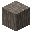
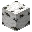
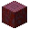

---
<!-- acacia_log__from__crafting_shaped__use__acacia_wood.md -->

<!-- en_us -->

## Acacia Log | Crafting Table: Shaped | Acacia Wood

<table>
	<tablebody>
		<tr>
			<td colspan="5">Crafting Table: Shaped</td>
		</tr>
		<tr>
			<td></td>
			<td></td>
			<td></td>
			<td colspan="2"></td>
		</tr>
		<tr>
			<td></td>
			<td></td>
			<td></td>
			<td></td>
			<td></td>
		</tr>
		<tr>
			<td></td>
			<td></td>
			<td></td>
			<td colspan="2"></td>
		</tr>
	</tablebody>
</table>
<table>
	<tablebody>
		<tr>
			<td></td>
			<td>ICON</td>
			<td>NAME</td>
			<td>ID</td>
			<td>Count</td>
		</tr>
		<tr>
			<td></td>
			<td></td>
			<td>Acacia Log</td>
			<td>acacia_log</td>
			<td>4</td>
		</tr>
		<tr>
			<td></td>
			<td></td>
			<td>Acacia Wood</td>
			<td>acacia_wood</td>
			<td>3</td>
		</tr>
	</tablebody>
</table>

---
<!-- birch_log__from__crafting_shaped__use__birch_wood.md -->

<!-- en_us -->

## Birch Log | Crafting Table: Shaped | Birch Wood

<table>
	<tablebody>
		<tr>
			<td colspan="5">Crafting Table: Shaped</td>
		</tr>
		<tr>
			<td></td>
			<td></td>
			<td></td>
			<td colspan="2"></td>
		</tr>
		<tr>
			<td></td>
			<td></td>
			<td></td>
			<td></td>
			<td></td>
		</tr>
		<tr>
			<td></td>
			<td></td>
			<td></td>
			<td colspan="2"></td>
		</tr>
	</tablebody>
</table>
<table>
	<tablebody>
		<tr>
			<td></td>
			<td>ICON</td>
			<td>NAME</td>
			<td>ID</td>
			<td>Count</td>
		</tr>
		<tr>
			<td></td>
			<td></td>
			<td>Birch Log</td>
			<td>birch_log</td>
			<td>4</td>
		</tr>
		<tr>
			<td></td>
			<td></td>
			<td>Birch Wood</td>
			<td>birch_wood</td>
			<td>3</td>
		</tr>
	</tablebody>
</table>

---
<!-- dark_oak_log__from__crafting_shaped__use__dark_oak_wood.md -->

<!-- en_us -->

## Dark Oak Log | Crafting Table: Shaped | Dark Oak Wood

<table>
	<tablebody>
		<tr>
			<td colspan="5">Crafting Table: Shaped</td>
		</tr>
		<tr>
			<td></td>
			<td></td>
			<td></td>
			<td colspan="2"></td>
		</tr>
		<tr>
			<td></td>
			<td></td>
			<td></td>
			<td></td>
			<td></td>
		</tr>
		<tr>
			<td></td>
			<td></td>
			<td></td>
			<td colspan="2"></td>
		</tr>
	</tablebody>
</table>
<table>
	<tablebody>
		<tr>
			<td></td>
			<td>ICON</td>
			<td>NAME</td>
			<td>ID</td>
			<td>Count</td>
		</tr>
		<tr>
			<td></td>
			<td></td>
			<td>Dark Oak Log</td>
			<td>dark_oak_log</td>
			<td>4</td>
		</tr>
		<tr>
			<td></td>
			<td></td>
			<td>Dark Oak Wood</td>
			<td>dark_oak_wood</td>
			<td>3</td>
		</tr>
	</tablebody>
</table>

---
<!-- jungle_log__from__crafting_shaped__use__jungle_wood.md -->

<!-- en_us -->

## Jungle Log | Crafting Table: Shaped | Jungle Wood

<table>
	<tablebody>
		<tr>
			<td colspan="5">Crafting Table: Shaped</td>
		</tr>
		<tr>
			<td></td>
			<td></td>
			<td></td>
			<td colspan="2"></td>
		</tr>
		<tr>
			<td></td>
			<td></td>
			<td></td>
			<td></td>
			<td></td>
		</tr>
		<tr>
			<td></td>
			<td></td>
			<td></td>
			<td colspan="2"></td>
		</tr>
	</tablebody>
</table>
<table>
	<tablebody>
		<tr>
			<td></td>
			<td>ICON</td>
			<td>NAME</td>
			<td>ID</td>
			<td>Count</td>
		</tr>
		<tr>
			<td></td>
			<td></td>
			<td>Jungle Log</td>
			<td>jungle_log</td>
			<td>4</td>
		</tr>
		<tr>
			<td></td>
			<td></td>
			<td>Jungle Wood</td>
			<td>jungle_wood</td>
			<td>3</td>
		</tr>
	</tablebody>
</table>

---
<!-- oak_log__from__crafting_shaped__use__oak_wood.md -->

<!-- en_us -->

## Oak Log | Crafting Table: Shaped | Oak Wood

<table>
	<tablebody>
		<tr>
			<td colspan="5">Crafting Table: Shaped</td>
		</tr>
		<tr>
			<td></td>
			<td></td>
			<td></td>
			<td colspan="2"></td>
		</tr>
		<tr>
			<td></td>
			<td></td>
			<td></td>
			<td></td>
			<td></td>
		</tr>
		<tr>
			<td></td>
			<td></td>
			<td></td>
			<td colspan="2"></td>
		</tr>
	</tablebody>
</table>
<table>
	<tablebody>
		<tr>
			<td></td>
			<td>ICON</td>
			<td>NAME</td>
			<td>ID</td>
			<td>Count</td>
		</tr>
		<tr>
			<td></td>
			<td></td>
			<td>Oak Log</td>
			<td>oak_log</td>
			<td>4</td>
		</tr>
		<tr>
			<td></td>
			<td></td>
			<td>Oak Wood</td>
			<td>oak_wood</td>
			<td>3</td>
		</tr>
	</tablebody>
</table>

---
<!-- spruce_log__from__crafting_shaped__use__spruce_wood.md -->

<!-- en_us -->

## Spruce Log | Crafting Table: Shaped | Spruce Wood

<table>
	<tablebody>
		<tr>
			<td colspan="5">Crafting Table: Shaped</td>
		</tr>
		<tr>
			<td></td>
			<td></td>
			<td></td>
			<td colspan="2"></td>
		</tr>
		<tr>
			<td></td>
			<td></td>
			<td></td>
			<td></td>
			<td></td>
		</tr>
		<tr>
			<td></td>
			<td></td>
			<td></td>
			<td colspan="2"></td>
		</tr>
	</tablebody>
</table>
<table>
	<tablebody>
		<tr>
			<td></td>
			<td>ICON</td>
			<td>NAME</td>
			<td>ID</td>
			<td>Count</td>
		</tr>
		<tr>
			<td></td>
			<td></td>
			<td>Spruce Log</td>
			<td>spruce_log</td>
			<td>4</td>
		</tr>
		<tr>
			<td></td>
			<td></td>
			<td>Spruce Wood</td>
			<td>spruce_wood</td>
			<td>3</td>
		</tr>
	</tablebody>
</table>

---
<!-- crimson_stem__from__crafting_shaped__use__crimson_hyphae.md -->

<!-- en_us -->

## Crimson Stem | Crafting Table: Shaped | Crimson Hyphae

<table>
	<tablebody>
		<tr>
			<td colspan="5">Crafting Table: Shaped</td>
		</tr>
		<tr>
			<td></td>
			<td></td>
			<td></td>
			<td colspan="2"></td>
		</tr>
		<tr>
			<td></td>
			<td></td>
			<td></td>
			<td></td>
			<td></td>
		</tr>
		<tr>
			<td></td>
			<td></td>
			<td></td>
			<td colspan="2"></td>
		</tr>
	</tablebody>
</table>
<table>
	<tablebody>
		<tr>
			<td></td>
			<td>ICON</td>
			<td>NAME</td>
			<td>ID</td>
			<td>Count</td>
		</tr>
		<tr>
			<td></td>
			<td></td>
			<td>Crimson Stem</td>
			<td>crimson_stem</td>
			<td>4</td>
		</tr>
		<tr>
			<td></td>
			<td></td>
			<td>Crimson Hyphae</td>
			<td>crimson_hyphae</td>
			<td>3</td>
		</tr>
	</tablebody>
</table>

---
<!-- warped_stem__from__crafting_shaped__use__warped_hyphae.md -->

<!-- en_us -->

## Warped Stem | Crafting Table: Shaped | Warped Hyphae

<table>
	<tablebody>
		<tr>
			<td colspan="5">Crafting Table: Shaped</td>
		</tr>
		<tr>
			<td></td>
			<td></td>
			<td></td>
			<td colspan="2"></td>
		</tr>
		<tr>
			<td></td>
			<td></td>
			<td></td>
			<td></td>
			<td></td>
		</tr>
		<tr>
			<td></td>
			<td></td>
			<td></td>
			<td colspan="2"></td>
		</tr>
	</tablebody>
</table>
<table>
	<tablebody>
		<tr>
			<td></td>
			<td>ICON</td>
			<td>NAME</td>
			<td>ID</td>
			<td>Count</td>
		</tr>
		<tr>
			<td></td>
			<td></td>
			<td>Warped Stem</td>
			<td>warped_stem</td>
			<td>4</td>
		</tr>
		<tr>
			<td></td>
			<td></td>
			<td>Warped Hyphae</td>
			<td>warped_hyphae</td>
			<td>3</td>
		</tr>
	</tablebody>
</table>

