---
<!-- acacia_planks__from__crafting_shapeless__use__acacia_button.md -->

<!-- en_us -->

## Acacia Planks | Crafting Table: Shapeless | Acacia Button

<table>
	<tablebody>
		<tr>
			<td colspan="5">Crafting Table: Shapeless</td>
		</tr>
		<tr>
			<td></td>
			<td></td>
			<td></td>
			<td colspan="2"></td>
		</tr>
		<tr>
			<td></td>
			<td></td>
			<td></td>
			<td></td>
			<td></td>
		</tr>
		<tr>
			<td></td>
			<td></td>
			<td></td>
			<td colspan="2"></td>
		</tr>
	</tablebody>
</table>
<table>
	<tablebody>
		<tr>
			<td></td>
			<td>ICON</td>
			<td>NAME</td>
			<td>ID</td>
			<td>Count</td>
		</tr>
		<tr>
			<td></td>
			<td></td>
			<td>Acacia Planks</td>
			<td>acacia_planks</td>
			<td>1</td>
		</tr>
		<tr>
			<td rowspan="9"></td>
			<td></td>
			<td>Acacia Button</td>
			<td>acacia_button</td>
			<td rowspan="9">1</td>
		</tr>
		<tr>
			<td></td>
			<td>Acacia Door</td>
			<td>acacia_door</td>
		</tr>
		<tr>
			<td>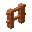</td>
			<td>Acacia Fence</td>
			<td>acacia_fence</td>
		</tr>
		<tr>
			<td>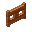</td>
			<td>Acacia Fence Gate</td>
			<td>acacia_fence_gate</td>
		</tr>
		<tr>
			<td>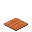</td>
			<td>Acacia Pressure Plate</td>
			<td>acacia_pressure_plate</td>
		</tr>
		<tr>
			<td></td>
			<td>Acacia Sign</td>
			<td>acacia_sign</td>
		</tr>
		<tr>
			<td>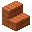</td>
			<td>Acacia Stairs</td>
			<td>acacia_stairs</td>
		</tr>
		<tr>
			<td>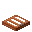</td>
			<td>Acacia Trapdoor</td>
			<td>acacia_trapdoor</td>
		</tr>
		<tr>
			<td>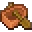</td>
			<td>Acacia Boat</td>
			<td>acacia_boat</td>
		</tr>
	</tablebody>
</table>

---
<!-- birch_planks__from__crafting_shapeless__use__birch_button.md -->

<!-- en_us -->

## Birch Planks | Crafting Table: Shapeless | Birch Button

<table>
	<tablebody>
		<tr>
			<td colspan="5">Crafting Table: Shapeless</td>
		</tr>
		<tr>
			<td>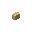</td>
			<td></td>
			<td></td>
			<td colspan="2"></td>
		</tr>
		<tr>
			<td></td>
			<td></td>
			<td></td>
			<td></td>
			<td></td>
		</tr>
		<tr>
			<td></td>
			<td></td>
			<td></td>
			<td colspan="2"></td>
		</tr>
	</tablebody>
</table>
<table>
	<tablebody>
		<tr>
			<td></td>
			<td>ICON</td>
			<td>NAME</td>
			<td>ID</td>
			<td>Count</td>
		</tr>
		<tr>
			<td></td>
			<td></td>
			<td>Birch Planks</td>
			<td>birch_planks</td>
			<td>1</td>
		</tr>
		<tr>
			<td rowspan="9"></td>
			<td></td>
			<td>Birch Button</td>
			<td>birch_button</td>
			<td rowspan="9">1</td>
		</tr>
		<tr>
			<td>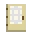</td>
			<td>Birch Door</td>
			<td>birch_door</td>
		</tr>
		<tr>
			<td></td>
			<td>Birch Fence</td>
			<td>birch_fence</td>
		</tr>
		<tr>
			<td>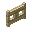</td>
			<td>Birch Fence Gate</td>
			<td>birch_fence_gate</td>
		</tr>
		<tr>
			<td>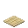</td>
			<td>Birch Pressure Plate</td>
			<td>birch_pressure_plate</td>
		</tr>
		<tr>
			<td></td>
			<td>Birch Sign</td>
			<td>birch_sign</td>
		</tr>
		<tr>
			<td>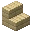</td>
			<td>Birch Stairs</td>
			<td>birch_stairs</td>
		</tr>
		<tr>
			<td>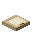</td>
			<td>Birch Trapdoor</td>
			<td>birch_trapdoor</td>
		</tr>
		<tr>
			<td></td>
			<td>Birch Boat</td>
			<td>birch_boat</td>
		</tr>
	</tablebody>
</table>

---
<!-- dark_oak_planks__from__crafting_shapeless__use__dark_oak_button.md -->

<!-- en_us -->

## Dark Oak Planks | Crafting Table: Shapeless | Dark Oak Button

<table>
	<tablebody>
		<tr>
			<td colspan="5">Crafting Table: Shapeless</td>
		</tr>
		<tr>
			<td>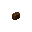</td>
			<td></td>
			<td></td>
			<td colspan="2"></td>
		</tr>
		<tr>
			<td></td>
			<td></td>
			<td></td>
			<td></td>
			<td></td>
		</tr>
		<tr>
			<td></td>
			<td></td>
			<td></td>
			<td colspan="2"></td>
		</tr>
	</tablebody>
</table>
<table>
	<tablebody>
		<tr>
			<td></td>
			<td>ICON</td>
			<td>NAME</td>
			<td>ID</td>
			<td>Count</td>
		</tr>
		<tr>
			<td></td>
			<td></td>
			<td>Dark Oak Planks</td>
			<td>dark_oak_planks</td>
			<td>1</td>
		</tr>
		<tr>
			<td rowspan="9"></td>
			<td></td>
			<td>Dark Oak Button</td>
			<td>dark_oak_button</td>
			<td rowspan="9">1</td>
		</tr>
		<tr>
			<td>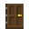</td>
			<td>Dark Oak Door</td>
			<td>dark_oak_door</td>
		</tr>
		<tr>
			<td>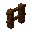</td>
			<td>Dark Oak Fence</td>
			<td>dark_oak_fence</td>
		</tr>
		<tr>
			<td></td>
			<td>Dark Oak Fence Gate</td>
			<td>dark_oak_fence_gate</td>
		</tr>
		<tr>
			<td>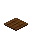</td>
			<td>Dark Oak Pressure Plate</td>
			<td>dark_oak_pressure_plate</td>
		</tr>
		<tr>
			<td></td>
			<td>Dark Oak Sign</td>
			<td>dark_oak_sign</td>
		</tr>
		<tr>
			<td>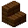</td>
			<td>Dark Oak Stairs</td>
			<td>dark_oak_stairs</td>
		</tr>
		<tr>
			<td>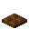</td>
			<td>Dark Oak Trapdoor</td>
			<td>dark_oak_trapdoor</td>
		</tr>
		<tr>
			<td>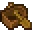</td>
			<td>Dark Oak Boat</td>
			<td>dark_oak_boat</td>
		</tr>
	</tablebody>
</table>

---
<!-- jungle_planks__from__crafting_shapeless__use__jungle_button.md -->

<!-- en_us -->

## Jungle Planks | Crafting Table: Shapeless | Jungle Button

<table>
	<tablebody>
		<tr>
			<td colspan="5">Crafting Table: Shapeless</td>
		</tr>
		<tr>
			<td>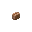</td>
			<td></td>
			<td></td>
			<td colspan="2"></td>
		</tr>
		<tr>
			<td></td>
			<td></td>
			<td></td>
			<td></td>
			<td></td>
		</tr>
		<tr>
			<td></td>
			<td></td>
			<td></td>
			<td colspan="2"></td>
		</tr>
	</tablebody>
</table>
<table>
	<tablebody>
		<tr>
			<td></td>
			<td>ICON</td>
			<td>NAME</td>
			<td>ID</td>
			<td>Count</td>
		</tr>
		<tr>
			<td></td>
			<td></td>
			<td>Jungle Planks</td>
			<td>jungle_planks</td>
			<td>1</td>
		</tr>
		<tr>
			<td rowspan="9"></td>
			<td></td>
			<td>Jungle Button</td>
			<td>jungle_button</td>
			<td rowspan="9">1</td>
		</tr>
		<tr>
			<td>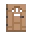</td>
			<td>Jungle Door</td>
			<td>jungle_door</td>
		</tr>
		<tr>
			<td></td>
			<td>Jungle Fence</td>
			<td>jungle_fence</td>
		</tr>
		<tr>
			<td>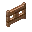</td>
			<td>Jungle Fence Gate</td>
			<td>jungle_fence_gate</td>
		</tr>
		<tr>
			<td>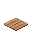</td>
			<td>Jungle Pressure Plate</td>
			<td>jungle_pressure_plate</td>
		</tr>
		<tr>
			<td></td>
			<td>Jungle Sign</td>
			<td>jungle_sign</td>
		</tr>
		<tr>
			<td>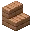</td>
			<td>Jungle Stairs</td>
			<td>jungle_stairs</td>
		</tr>
		<tr>
			<td>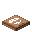</td>
			<td>Jungle Trapdoor</td>
			<td>jungle_trapdoor</td>
		</tr>
		<tr>
			<td>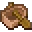</td>
			<td>Jungle Boat</td>
			<td>jungle_boat</td>
		</tr>
	</tablebody>
</table>

---
<!-- oak_planks__from__crafting_shapeless__use__oak_button.md -->

<!-- en_us -->

## Oak Planks | Crafting Table: Shapeless | Oak Button

<table>
	<tablebody>
		<tr>
			<td colspan="5">Crafting Table: Shapeless</td>
		</tr>
		<tr>
			<td></td>
			<td></td>
			<td></td>
			<td colspan="2"></td>
		</tr>
		<tr>
			<td></td>
			<td></td>
			<td></td>
			<td></td>
			<td></td>
		</tr>
		<tr>
			<td></td>
			<td></td>
			<td></td>
			<td colspan="2"></td>
		</tr>
	</tablebody>
</table>
<table>
	<tablebody>
		<tr>
			<td></td>
			<td>ICON</td>
			<td>NAME</td>
			<td>ID</td>
			<td>Count</td>
		</tr>
		<tr>
			<td></td>
			<td></td>
			<td>Oak Planks</td>
			<td>oak_planks</td>
			<td>1</td>
		</tr>
		<tr>
			<td rowspan="9"></td>
			<td></td>
			<td>Oak Button</td>
			<td>oak_button</td>
			<td rowspan="9">1</td>
		</tr>
		<tr>
			<td>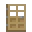</td>
			<td>Oak Door</td>
			<td>oak_door</td>
		</tr>
		<tr>
			<td>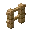</td>
			<td>Oak Fence</td>
			<td>oak_fence</td>
		</tr>
		<tr>
			<td>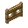</td>
			<td>Oak Fence Gate</td>
			<td>oak_fence_gate</td>
		</tr>
		<tr>
			<td>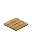</td>
			<td>Oak Pressure Plate</td>
			<td>oak_pressure_plate</td>
		</tr>
		<tr>
			<td></td>
			<td>Oak Sign</td>
			<td>oak_sign</td>
		</tr>
		<tr>
			<td>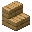</td>
			<td>Oak Stairs</td>
			<td>oak_stairs</td>
		</tr>
		<tr>
			<td>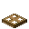</td>
			<td>Oak Trapdoor</td>
			<td>oak_trapdoor</td>
		</tr>
		<tr>
			<td>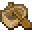</td>
			<td>Oak Boat</td>
			<td>oak_boat</td>
		</tr>
	</tablebody>
</table>

---
<!-- spruce_planks__from__crafting_shapeless__use__spruce_button.md -->

<!-- en_us -->

## Spruce Planks | Crafting Table: Shapeless | Spruce Button

<table>
	<tablebody>
		<tr>
			<td colspan="5">Crafting Table: Shapeless</td>
		</tr>
		<tr>
			<td>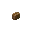</td>
			<td></td>
			<td></td>
			<td colspan="2"></td>
		</tr>
		<tr>
			<td></td>
			<td></td>
			<td></td>
			<td></td>
			<td></td>
		</tr>
		<tr>
			<td></td>
			<td></td>
			<td></td>
			<td colspan="2"></td>
		</tr>
	</tablebody>
</table>
<table>
	<tablebody>
		<tr>
			<td></td>
			<td>ICON</td>
			<td>NAME</td>
			<td>ID</td>
			<td>Count</td>
		</tr>
		<tr>
			<td></td>
			<td></td>
			<td>Spruce Planks</td>
			<td>spruce_planks</td>
			<td>1</td>
		</tr>
		<tr>
			<td rowspan="9"></td>
			<td></td>
			<td>Spruce Button</td>
			<td>spruce_button</td>
			<td rowspan="9">1</td>
		</tr>
		<tr>
			<td>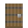</td>
			<td>Spruce Door</td>
			<td>spruce_door</td>
		</tr>
		<tr>
			<td>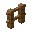</td>
			<td>Spruce Fence</td>
			<td>spruce_fence</td>
		</tr>
		<tr>
			<td>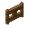</td>
			<td>Spruce Fence Gate</td>
			<td>spruce_fence_gate</td>
		</tr>
		<tr>
			<td>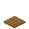</td>
			<td>Spruce Pressure Plate</td>
			<td>spruce_pressure_plate</td>
		</tr>
		<tr>
			<td></td>
			<td>Spruce Sign</td>
			<td>spruce_sign</td>
		</tr>
		<tr>
			<td>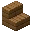</td>
			<td>Spruce Stairs</td>
			<td>spruce_stairs</td>
		</tr>
		<tr>
			<td>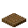</td>
			<td>Spruce Trapdoor</td>
			<td>spruce_trapdoor</td>
		</tr>
		<tr>
			<td>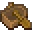</td>
			<td>Spruce Boat</td>
			<td>spruce_boat</td>
		</tr>
	</tablebody>
</table>

---
<!-- crimson_planks__from__crafting_shapeless__use__crimson_button.md -->

<!-- en_us -->

## Crimson Planks | Crafting Table: Shapeless | Crimson Button

<table>
	<tablebody>
		<tr>
			<td colspan="5">Crafting Table: Shapeless</td>
		</tr>
		<tr>
			<td></td>
			<td></td>
			<td></td>
			<td colspan="2"></td>
		</tr>
		<tr>
			<td></td>
			<td></td>
			<td></td>
			<td></td>
			<td></td>
		</tr>
		<tr>
			<td></td>
			<td></td>
			<td></td>
			<td colspan="2"></td>
		</tr>
	</tablebody>
</table>
<table>
	<tablebody>
		<tr>
			<td></td>
			<td>ICON</td>
			<td>NAME</td>
			<td>ID</td>
			<td>Count</td>
		</tr>
		<tr>
			<td></td>
			<td></td>
			<td>Crimson Planks</td>
			<td>crimson_planks</td>
			<td>1</td>
		</tr>
		<tr>
			<td rowspan="8"></td>
			<td></td>
			<td>Crimson Button</td>
			<td>crimson_button</td>
			<td rowspan="8">1</td>
		</tr>
		<tr>
			<td>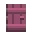</td>
			<td>Crimson Door</td>
			<td>crimson_door</td>
		</tr>
		<tr>
			<td>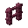</td>
			<td>Crimson Fence</td>
			<td>crimson_fence</td>
		</tr>
		<tr>
			<td>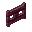</td>
			<td>Crimson Fence Gate</td>
			<td>crimson_fence_gate</td>
		</tr>
		<tr>
			<td></td>
			<td>Crimson Pressure Plate</td>
			<td>crimson_pressure_plate</td>
		</tr>
		<tr>
			<td></td>
			<td>Crimson Sign</td>
			<td>crimson_sign</td>
		</tr>
		<tr>
			<td>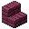</td>
			<td>Crimson Stairs</td>
			<td>crimson_stairs</td>
		</tr>
		<tr>
			<td>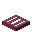</td>
			<td>Crimson Trapdoor</td>
			<td>crimson_trapdoor</td>
		</tr>
	</tablebody>
</table>

---
<!-- warped_planks__from__crafting_shapeless__use__warped_button.md -->

<!-- en_us -->

## Warped Planks | Crafting Table: Shapeless | Warped Button

<table>
	<tablebody>
		<tr>
			<td colspan="5">Crafting Table: Shapeless</td>
		</tr>
		<tr>
			<td></td>
			<td></td>
			<td></td>
			<td colspan="2"></td>
		</tr>
		<tr>
			<td></td>
			<td></td>
			<td></td>
			<td></td>
			<td></td>
		</tr>
		<tr>
			<td></td>
			<td></td>
			<td></td>
			<td colspan="2"></td>
		</tr>
	</tablebody>
</table>
<table>
	<tablebody>
		<tr>
			<td></td>
			<td>ICON</td>
			<td>NAME</td>
			<td>ID</td>
			<td>Count</td>
		</tr>
		<tr>
			<td></td>
			<td></td>
			<td>Warped Planks</td>
			<td>warped_planks</td>
			<td>1</td>
		</tr>
		<tr>
			<td rowspan="8"></td>
			<td></td>
			<td>Warped Button</td>
			<td>warped_button</td>
			<td rowspan="8">1</td>
		</tr>
		<tr>
			<td>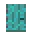</td>
			<td>Warped Door</td>
			<td>warped_door</td>
		</tr>
		<tr>
			<td>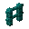</td>
			<td>Warped Fence</td>
			<td>warped_fence</td>
		</tr>
		<tr>
			<td>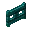</td>
			<td>Warped Fence Gate</td>
			<td>warped_fence_gate</td>
		</tr>
		<tr>
			<td>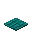</td>
			<td>Warped Pressure Plate</td>
			<td>warped_pressure_plate</td>
		</tr>
		<tr>
			<td></td>
			<td>Warped Sign</td>
			<td>warped_sign</td>
		</tr>
		<tr>
			<td></td>
			<td>Warped Stairs</td>
			<td>warped_stairs</td>
		</tr>
		<tr>
			<td></td>
			<td>Warped Trapdoor</td>
			<td>warped_trapdoor</td>
		</tr>
	</tablebody>
</table>

