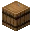
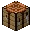
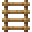
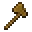
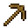

---
<!-- stick__from__crafting_shapeless__use__barrel.md -->

<!-- en_us -->

## Stick | Crafting Table: Shapeless | Barrel

<table>
	<tablebody>
		<tr>
			<td colspan="5">Crafting Table: Shapeless</td>
		</tr>
		<tr>
			<td></td>
			<td></td>
			<td></td>
			<td colspan="2"></td>
		</tr>
		<tr>
			<td></td>
			<td></td>
			<td></td>
			<td></td>
			<td></td>
		</tr>
		<tr>
			<td></td>
			<td></td>
			<td></td>
			<td colspan="2"></td>
		</tr>
	</tablebody>
</table>
<table>
	<tablebody>
		<tr>
			<td></td>
			<td>ICON</td>
			<td>NAME</td>
			<td>ID</td>
			<td>Count</td>
		</tr>
		<tr>
			<td></td>
			<td></td>
			<td>Stick</td>
			<td>stick</td>
			<td>8</td>
		</tr>
		<tr>
			<td></td>
			<td></td>
			<td>Barrel</td>
			<td>barrel</td>
			<td>1</td>
		</tr>
	</tablebody>
</table>

---
<!-- stick__from__crafting_shapeless__use__bowl.md -->

<!-- en_us -->

## Stick | Crafting Table: Shapeless | Bowl

<table>
	<tablebody>
		<tr>
			<td colspan="5">Crafting Table: Shapeless</td>
		</tr>
		<tr>
			<td></td>
			<td></td>
			<td></td>
			<td colspan="2"></td>
		</tr>
		<tr>
			<td></td>
			<td></td>
			<td></td>
			<td></td>
			<td></td>
		</tr>
		<tr>
			<td></td>
			<td></td>
			<td></td>
			<td colspan="2"></td>
		</tr>
	</tablebody>
</table>
<table>
	<tablebody>
		<tr>
			<td></td>
			<td>ICON</td>
			<td>NAME</td>
			<td>ID</td>
			<td>Count</td>
		</tr>
		<tr>
			<td></td>
			<td></td>
			<td>Stick</td>
			<td>stick</td>
			<td>1</td>
		</tr>
		<tr>
			<td></td>
			<td></td>
			<td>Bowl</td>
			<td>bowl</td>
			<td>1</td>
		</tr>
	</tablebody>
</table>

---
<!-- stick__from__crafting_shapeless__use__chest.md -->

<!-- en_us -->

## Stick | Crafting Table: Shapeless | Chest

<table>
	<tablebody>
		<tr>
			<td colspan="5">Crafting Table: Shapeless</td>
		</tr>
		<tr>
			<td></td>
			<td></td>
			<td></td>
			<td colspan="2"></td>
		</tr>
		<tr>
			<td></td>
			<td></td>
			<td></td>
			<td></td>
			<td></td>
		</tr>
		<tr>
			<td></td>
			<td></td>
			<td></td>
			<td colspan="2"></td>
		</tr>
	</tablebody>
</table>
<table>
	<tablebody>
		<tr>
			<td></td>
			<td>ICON</td>
			<td>NAME</td>
			<td>ID</td>
			<td>Count</td>
		</tr>
		<tr>
			<td></td>
			<td></td>
			<td>Stick</td>
			<td>stick</td>
			<td>16</td>
		</tr>
		<tr>
			<td></td>
			<td></td>
			<td>Chest</td>
			<td>chest</td>
			<td>1</td>
		</tr>
	</tablebody>
</table>

---
<!-- stick__from__crafting_shapeless__use__composter.md -->

<!-- en_us -->

## Stick | Crafting Table: Shapeless | Composter

<table>
	<tablebody>
		<tr>
			<td colspan="5">Crafting Table: Shapeless</td>
		</tr>
		<tr>
			<td></td>
			<td></td>
			<td></td>
			<td colspan="2"></td>
		</tr>
		<tr>
			<td></td>
			<td></td>
			<td></td>
			<td></td>
			<td></td>
		</tr>
		<tr>
			<td></td>
			<td></td>
			<td></td>
			<td colspan="2"></td>
		</tr>
	</tablebody>
</table>
<table>
	<tablebody>
		<tr>
			<td></td>
			<td>ICON</td>
			<td>NAME</td>
			<td>ID</td>
			<td>Count</td>
		</tr>
		<tr>
			<td></td>
			<td></td>
			<td>Stick</td>
			<td>stick</td>
			<td>7</td>
		</tr>
		<tr>
			<td></td>
			<td></td>
			<td>Composter</td>
			<td>composter</td>
			<td>1</td>
		</tr>
	</tablebody>
</table>

---
<!-- stick__from__crafting_shapeless__use__crafting_table.md -->

<!-- en_us -->

## Stick | Crafting Table: Shapeless | Crafting Table

<table>
	<tablebody>
		<tr>
			<td colspan="5">Crafting Table: Shapeless</td>
		</tr>
		<tr>
			<td></td>
			<td></td>
			<td></td>
			<td colspan="2"></td>
		</tr>
		<tr>
			<td></td>
			<td></td>
			<td></td>
			<td></td>
			<td></td>
		</tr>
		<tr>
			<td></td>
			<td></td>
			<td></td>
			<td colspan="2"></td>
		</tr>
	</tablebody>
</table>
<table>
	<tablebody>
		<tr>
			<td></td>
			<td>ICON</td>
			<td>NAME</td>
			<td>ID</td>
			<td>Count</td>
		</tr>
		<tr>
			<td></td>
			<td></td>
			<td>Stick</td>
			<td>stick</td>
			<td>8</td>
		</tr>
		<tr>
			<td></td>
			<td></td>
			<td>Crafting Table</td>
			<td>crafting_table</td>
			<td>1</td>
		</tr>
	</tablebody>
</table>

---
<!-- stick__from__crafting_shapeless__use__ladder.md -->

<!-- en_us -->

## Stick | Crafting Table: Shapeless | Ladder

<table>
	<tablebody>
		<tr>
			<td colspan="5">Crafting Table: Shapeless</td>
		</tr>
		<tr>
			<td></td>
			<td></td>
			<td></td>
			<td colspan="2"></td>
		</tr>
		<tr>
			<td></td>
			<td></td>
			<td></td>
			<td></td>
			<td></td>
		</tr>
		<tr>
			<td></td>
			<td></td>
			<td></td>
			<td colspan="2"></td>
		</tr>
	</tablebody>
</table>
<table>
	<tablebody>
		<tr>
			<td></td>
			<td>ICON</td>
			<td>NAME</td>
			<td>ID</td>
			<td>Count</td>
		</tr>
		<tr>
			<td></td>
			<td></td>
			<td>Stick</td>
			<td>stick</td>
			<td>2</td>
		</tr>
		<tr>
			<td></td>
			<td></td>
			<td>Ladder</td>
			<td>ladder</td>
			<td>1</td>
		</tr>
	</tablebody>
</table>

---
<!-- stick__from__crafting_shapeless__use__wooden_axe.md -->

<!-- en_us -->

## Stick | Crafting Table: Shapeless | Wooden Axe

<table>
	<tablebody>
		<tr>
			<td colspan="5">Crafting Table: Shapeless</td>
		</tr>
		<tr>
			<td></td>
			<td></td>
			<td></td>
			<td colspan="2"></td>
		</tr>
		<tr>
			<td></td>
			<td></td>
			<td></td>
			<td></td>
			<td></td>
		</tr>
		<tr>
			<td></td>
			<td></td>
			<td></td>
			<td colspan="2"></td>
		</tr>
	</tablebody>
</table>
<table>
	<tablebody>
		<tr>
			<td></td>
			<td>ICON</td>
			<td>NAME</td>
			<td>ID</td>
			<td>Count</td>
		</tr>
		<tr>
			<td></td>
			<td></td>
			<td>Stick</td>
			<td>stick</td>
			<td>8</td>
		</tr>
		<tr>
			<td></td>
			<td></td>
			<td>Wooden Axe</td>
			<td>wooden_axe</td>
			<td>1</td>
		</tr>
	</tablebody>
</table>

---
<!-- stick__from__crafting_shapeless__use__wooden_hoe.md -->

<!-- en_us -->

## Stick | Crafting Table: Shapeless | Wooden Hoe

<table>
	<tablebody>
		<tr>
			<td colspan="5">Crafting Table: Shapeless</td>
		</tr>
		<tr>
			<td></td>
			<td></td>
			<td></td>
			<td colspan="2"></td>
		</tr>
		<tr>
			<td></td>
			<td></td>
			<td></td>
			<td></td>
			<td></td>
		</tr>
		<tr>
			<td></td>
			<td></td>
			<td></td>
			<td colspan="2"></td>
		</tr>
	</tablebody>
</table>
<table>
	<tablebody>
		<tr>
			<td></td>
			<td>ICON</td>
			<td>NAME</td>
			<td>ID</td>
			<td>Count</td>
		</tr>
		<tr>
			<td></td>
			<td></td>
			<td>Stick</td>
			<td>stick</td>
			<td>6</td>
		</tr>
		<tr>
			<td></td>
			<td></td>
			<td>Wooden Hoe</td>
			<td>wooden_hoe</td>
			<td>1</td>
		</tr>
	</tablebody>
</table>

---
<!-- stick__from__crafting_shapeless__use__wooden_pickaxe.md -->

<!-- en_us -->

## Stick | Crafting Table: Shapeless | Wooden Pickaxe

<table>
	<tablebody>
		<tr>
			<td colspan="5">Crafting Table: Shapeless</td>
		</tr>
		<tr>
			<td></td>
			<td></td>
			<td></td>
			<td colspan="2"></td>
		</tr>
		<tr>
			<td></td>
			<td></td>
			<td></td>
			<td></td>
			<td></td>
		</tr>
		<tr>
			<td></td>
			<td></td>
			<td></td>
			<td colspan="2"></td>
		</tr>
	</tablebody>
</table>
<table>
	<tablebody>
		<tr>
			<td></td>
			<td>ICON</td>
			<td>NAME</td>
			<td>ID</td>
			<td>Count</td>
		</tr>
		<tr>
			<td></td>
			<td></td>
			<td>Stick</td>
			<td>stick</td>
			<td>8</td>
		</tr>
		<tr>
			<td></td>
			<td></td>
			<td>Wooden Pickaxe</td>
			<td>wooden_pickaxe</td>
			<td>1</td>
		</tr>
	</tablebody>
</table>

---
<!-- stick__from__crafting_shapeless__use__wooden_shovel.md -->

<!-- en_us -->

## Stick | Crafting Table: Shapeless | Wooden Shovel

<table>
	<tablebody>
		<tr>
			<td colspan="5">Crafting Table: Shapeless</td>
		</tr>
		<tr>
			<td></td>
			<td></td>
			<td></td>
			<td colspan="2"></td>
		</tr>
		<tr>
			<td></td>
			<td></td>
			<td></td>
			<td></td>
			<td></td>
		</tr>
		<tr>
			<td></td>
			<td></td>
			<td></td>
			<td colspan="2"></td>
		</tr>
	</tablebody>
</table>
<table>
	<tablebody>
		<tr>
			<td></td>
			<td>ICON</td>
			<td>NAME</td>
			<td>ID</td>
			<td>Count</td>
		</tr>
		<tr>
			<td></td>
			<td></td>
			<td>Stick</td>
			<td>stick</td>
			<td>4</td>
		</tr>
		<tr>
			<td></td>
			<td></td>
			<td>Wooden Shovel</td>
			<td>wooden_shovel</td>
			<td>1</td>
		</tr>
	</tablebody>
</table>

---
<!-- stick__from__crafting_shapeless__use__wooden_sword.md -->

<!-- en_us -->

## Stick | Crafting Table: Shapeless | Wooden Sword

<table>
	<tablebody>
		<tr>
			<td colspan="5">Crafting Table: Shapeless</td>
		</tr>
		<tr>
			<td></td>
			<td></td>
			<td></td>
			<td colspan="2"></td>
		</tr>
		<tr>
			<td></td>
			<td></td>
			<td></td>
			<td></td>
			<td></td>
		</tr>
		<tr>
			<td></td>
			<td></td>
			<td></td>
			<td colspan="2"></td>
		</tr>
	</tablebody>
</table>
<table>
	<tablebody>
		<tr>
			<td></td>
			<td>ICON</td>
			<td>NAME</td>
			<td>ID</td>
			<td>Count</td>
		</tr>
		<tr>
			<td></td>
			<td></td>
			<td>Stick</td>
			<td>stick</td>
			<td>5</td>
		</tr>
		<tr>
			<td></td>
			<td></td>
			<td>Wooden Sword</td>
			<td>wooden_sword</td>
			<td>1</td>
		</tr>
	</tablebody>
</table>

---
<!-- stick__from__crafting_shapeless__use__tag_wooden_slabs.md -->

<!-- en_us -->

## Stick | Crafting Table: Shapeless | Wooden Slab

<table>
	<tablebody>
		<tr>
			<td colspan="5">Crafting Table: Shapeless</td>
		</tr>
		<tr>
			<td></td>
			<td></td>
			<td></td>
			<td colspan="2"></td>
		</tr>
		<tr>
			<td></td>
			<td></td>
			<td></td>
			<td></td>
			<td></td>
		</tr>
		<tr>
			<td></td>
			<td></td>
			<td></td>
			<td colspan="2"></td>
		</tr>
	</tablebody>
</table>
<table>
	<tablebody>
		<tr>
			<td></td>
			<td>ICON</td>
			<td>NAME</td>
			<td>ID</td>
			<td>Count</td>
		</tr>
		<tr>
			<td></td>
			<td></td>
			<td>Stick</td>
			<td>stick</td>
			<td>1</td>
		</tr>
		<tr>
			<td></td>
			<td></td>
			<td><a>Wooden Slab</a></td>
			<td><a>wooden_slabs</a></td>
			<td>1</td>
		</tr>
	</tablebody>
</table>

[Wooden Slab](../../../en_us/tags/tag__wooden_slabs.md)

