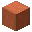
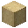
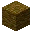
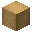
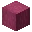

---
<!-- stripped_acacia_wood__from__stonecutting__use__acacia_wood.md -->

<!-- en_us -->

## Stripped Acacia Wood | Stonecutter | Acacia Wood

<table>
	<tablebody>
		<tr>
			<td colspan="6">Stonecutter</td>
		</tr>
		<tr>
			<td colspan="2"></td>
			<td></td>
			<td></td>
			<td></td>
			<td></td>
		</tr>
		<tr>
			<td></td>
			<td></td>
			<td></td>
			<td></td>
			<td></td>
			<td></td>
		</tr>
		<tr>
			<td colspan="2"></td>
			<td></td>
			<td></td>
			<td></td>
			<td></td>
		</tr>
	</tablebody>
</table>
<table>
	<tablebody>
		<tr>
			<td></td>
			<td>ICON</td>
			<td>NAME</td>
			<td>ID</td>
			<td>Count</td>
		</tr>
		<tr>
			<td></td>
			<td></td>
			<td>Acacia Wood</td>
			<td>acacia_wood</td>
			<td>1</td>
		</tr>
		<tr>
			<td></td>
			<td></td>
			<td>Stripped Acacia Wood</td>
			<td>stripped_acacia_wood</td>
			<td>1</td>
		</tr>
	</tablebody>
</table>

---
<!-- stripped_birch_wood__from__stonecutting__use__birch_wood.md -->

<!-- en_us -->

## Stripped Birch Wood | Stonecutter | Birch Wood

<table>
	<tablebody>
		<tr>
			<td colspan="6">Stonecutter</td>
		</tr>
		<tr>
			<td colspan="2"></td>
			<td></td>
			<td></td>
			<td></td>
			<td></td>
		</tr>
		<tr>
			<td></td>
			<td></td>
			<td></td>
			<td></td>
			<td></td>
			<td></td>
		</tr>
		<tr>
			<td colspan="2"></td>
			<td></td>
			<td></td>
			<td></td>
			<td></td>
		</tr>
	</tablebody>
</table>
<table>
	<tablebody>
		<tr>
			<td></td>
			<td>ICON</td>
			<td>NAME</td>
			<td>ID</td>
			<td>Count</td>
		</tr>
		<tr>
			<td></td>
			<td></td>
			<td>Birch Wood</td>
			<td>birch_wood</td>
			<td>1</td>
		</tr>
		<tr>
			<td></td>
			<td></td>
			<td>Stripped Birch Wood</td>
			<td>stripped_birch_wood</td>
			<td>1</td>
		</tr>
	</tablebody>
</table>

---
<!-- stripped_dark_oak_wood__from__stonecutting__use__dark_oak_wood.md -->

<!-- en_us -->

## Stripped Dark Oak Wood | Stonecutter | Dark Oak Wood

<table>
	<tablebody>
		<tr>
			<td colspan="6">Stonecutter</td>
		</tr>
		<tr>
			<td colspan="2"></td>
			<td></td>
			<td></td>
			<td></td>
			<td></td>
		</tr>
		<tr>
			<td></td>
			<td></td>
			<td></td>
			<td></td>
			<td></td>
			<td></td>
		</tr>
		<tr>
			<td colspan="2"></td>
			<td></td>
			<td></td>
			<td></td>
			<td></td>
		</tr>
	</tablebody>
</table>
<table>
	<tablebody>
		<tr>
			<td></td>
			<td>ICON</td>
			<td>NAME</td>
			<td>ID</td>
			<td>Count</td>
		</tr>
		<tr>
			<td></td>
			<td></td>
			<td>Dark Oak Wood</td>
			<td>dark_oak_wood</td>
			<td>1</td>
		</tr>
		<tr>
			<td></td>
			<td></td>
			<td>Stripped Dark Oak Wood</td>
			<td>stripped_dark_oak_wood</td>
			<td>1</td>
		</tr>
	</tablebody>
</table>

---
<!-- stripped_jungle_wood__from__stonecutting__use__jungle_wood.md -->

<!-- en_us -->

## Stripped Jungle Wood | Stonecutter | Jungle Wood

<table>
	<tablebody>
		<tr>
			<td colspan="6">Stonecutter</td>
		</tr>
		<tr>
			<td colspan="2"></td>
			<td></td>
			<td></td>
			<td></td>
			<td></td>
		</tr>
		<tr>
			<td></td>
			<td></td>
			<td></td>
			<td></td>
			<td></td>
			<td></td>
		</tr>
		<tr>
			<td colspan="2"></td>
			<td></td>
			<td></td>
			<td></td>
			<td></td>
		</tr>
	</tablebody>
</table>
<table>
	<tablebody>
		<tr>
			<td></td>
			<td>ICON</td>
			<td>NAME</td>
			<td>ID</td>
			<td>Count</td>
		</tr>
		<tr>
			<td></td>
			<td></td>
			<td>Jungle Wood</td>
			<td>jungle_wood</td>
			<td>1</td>
		</tr>
		<tr>
			<td></td>
			<td></td>
			<td>Stripped Jungle Wood</td>
			<td>stripped_jungle_wood</td>
			<td>1</td>
		</tr>
	</tablebody>
</table>

---
<!-- stripped_oak_wood__from__stonecutting__use__oak_wood.md -->

<!-- en_us -->

## Stripped Oak Wood | Stonecutter | Oak Wood

<table>
	<tablebody>
		<tr>
			<td colspan="6">Stonecutter</td>
		</tr>
		<tr>
			<td colspan="2"></td>
			<td></td>
			<td></td>
			<td></td>
			<td></td>
		</tr>
		<tr>
			<td></td>
			<td></td>
			<td></td>
			<td></td>
			<td></td>
			<td></td>
		</tr>
		<tr>
			<td colspan="2"></td>
			<td></td>
			<td></td>
			<td></td>
			<td></td>
		</tr>
	</tablebody>
</table>
<table>
	<tablebody>
		<tr>
			<td></td>
			<td>ICON</td>
			<td>NAME</td>
			<td>ID</td>
			<td>Count</td>
		</tr>
		<tr>
			<td></td>
			<td></td>
			<td>Oak Wood</td>
			<td>oak_wood</td>
			<td>1</td>
		</tr>
		<tr>
			<td></td>
			<td></td>
			<td>Stripped Oak Wood</td>
			<td>stripped_oak_wood</td>
			<td>1</td>
		</tr>
	</tablebody>
</table>

---
<!-- stripped_spruce_wood__from__stonecutting__use__spruce_wood.md -->

<!-- en_us -->

## Stripped Spruce Wood | Stonecutter | Spruce Wood

<table>
	<tablebody>
		<tr>
			<td colspan="6">Stonecutter</td>
		</tr>
		<tr>
			<td colspan="2"></td>
			<td></td>
			<td></td>
			<td></td>
			<td></td>
		</tr>
		<tr>
			<td></td>
			<td></td>
			<td></td>
			<td></td>
			<td></td>
			<td></td>
		</tr>
		<tr>
			<td colspan="2"></td>
			<td></td>
			<td></td>
			<td></td>
			<td></td>
		</tr>
	</tablebody>
</table>
<table>
	<tablebody>
		<tr>
			<td></td>
			<td>ICON</td>
			<td>NAME</td>
			<td>ID</td>
			<td>Count</td>
		</tr>
		<tr>
			<td></td>
			<td></td>
			<td>Spruce Wood</td>
			<td>spruce_wood</td>
			<td>1</td>
		</tr>
		<tr>
			<td></td>
			<td></td>
			<td>Stripped Spruce Wood</td>
			<td>stripped_spruce_wood</td>
			<td>1</td>
		</tr>
	</tablebody>
</table>

---
<!-- stripped_crimson_hyphae__from__stonecutting__use__crimson_hyphae.md -->

<!-- en_us -->

## Stripped Crimson Hyphae | Stonecutter | Crimson Hyphae

<table>
	<tablebody>
		<tr>
			<td colspan="6">Stonecutter</td>
		</tr>
		<tr>
			<td colspan="2"></td>
			<td></td>
			<td></td>
			<td></td>
			<td></td>
		</tr>
		<tr>
			<td></td>
			<td></td>
			<td></td>
			<td></td>
			<td></td>
			<td></td>
		</tr>
		<tr>
			<td colspan="2"></td>
			<td></td>
			<td></td>
			<td></td>
			<td></td>
		</tr>
	</tablebody>
</table>
<table>
	<tablebody>
		<tr>
			<td></td>
			<td>ICON</td>
			<td>NAME</td>
			<td>ID</td>
			<td>Count</td>
		</tr>
		<tr>
			<td></td>
			<td></td>
			<td>Crimson Hyphae</td>
			<td>crimson_hyphae</td>
			<td>1</td>
		</tr>
		<tr>
			<td></td>
			<td></td>
			<td>Stripped Crimson Hyphae</td>
			<td>stripped_crimson_hyphae</td>
			<td>1</td>
		</tr>
	</tablebody>
</table>

---
<!-- stripped_warped_hyphae__from__stonecutting__use__warped_hyphae.md -->

<!-- en_us -->

## Stripped Warped Hyphae | Stonecutter | Warped Hyphae

<table>
	<tablebody>
		<tr>
			<td colspan="6">Stonecutter</td>
		</tr>
		<tr>
			<td colspan="2"></td>
			<td></td>
			<td></td>
			<td></td>
			<td></td>
		</tr>
		<tr>
			<td></td>
			<td></td>
			<td></td>
			<td></td>
			<td></td>
			<td></td>
		</tr>
		<tr>
			<td colspan="2"></td>
			<td></td>
			<td></td>
			<td></td>
			<td></td>
		</tr>
	</tablebody>
</table>
<table>
	<tablebody>
		<tr>
			<td></td>
			<td>ICON</td>
			<td>NAME</td>
			<td>ID</td>
			<td>Count</td>
		</tr>
		<tr>
			<td></td>
			<td></td>
			<td>Warped Hyphae</td>
			<td>warped_hyphae</td>
			<td>1</td>
		</tr>
		<tr>
			<td></td>
			<td></td>
			<td>Stripped Warped Hyphae</td>
			<td>stripped_warped_hyphae</td>
			<td>1</td>
		</tr>
	</tablebody>
</table>

