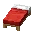
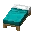
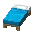
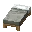
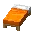
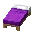
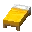

---
<!-- black_bed__from__crafting_shapeless__use__tag_bed.md -->

<!-- en_us -->

## Black Bed | Crafting Table: Shapeless | Colored Bed

<table>
	<tablebody>
		<tr>
			<td colspan="5">Crafting Table: Shapeless</td>
		</tr>
		<tr>
			<td></td>
			<td></td>
			<td></td>
			<td colspan="2"></td>
		</tr>
		<tr>
			<td></td>
			<td></td>
			<td></td>
			<td></td>
			<td></td>
		</tr>
		<tr>
			<td></td>
			<td></td>
			<td></td>
			<td colspan="2"></td>
		</tr>
	</tablebody>
</table>
<table>
	<tablebody>
		<tr>
			<td></td>
			<td>ICON</td>
			<td>NAME</td>
			<td>ID</td>
			<td>Count</td>
		</tr>
		<tr>
			<td></td>
			<td></td>
			<td>Black Bed</td>
			<td>black_bed</td>
			<td>1</td>
		</tr>
		<tr>
			<td></td>
			<td></td>
			<td><a>Colored Bed</a></td>
			<td><a>bed</a></td>
			<td>1</td>
		</tr>
		<tr>
			<td></td>
			<td></td>
			<td>Black Dye</td>
			<td>black_dye</td>
			<td>1</td>
		</tr>
	</tablebody>
</table>

[Colored Bed](../../../en_us/tags/tag__bed.md)

---
<!-- blue_bed__from__crafting_shapeless__use__tag_bed.md -->

<!-- en_us -->

## Blue Bed | Crafting Table: Shapeless | Colored Bed

<table>
	<tablebody>
		<tr>
			<td colspan="5">Crafting Table: Shapeless</td>
		</tr>
		<tr>
			<td></td>
			<td></td>
			<td></td>
			<td colspan="2"></td>
		</tr>
		<tr>
			<td></td>
			<td></td>
			<td></td>
			<td></td>
			<td></td>
		</tr>
		<tr>
			<td></td>
			<td></td>
			<td></td>
			<td colspan="2"></td>
		</tr>
	</tablebody>
</table>
<table>
	<tablebody>
		<tr>
			<td></td>
			<td>ICON</td>
			<td>NAME</td>
			<td>ID</td>
			<td>Count</td>
		</tr>
		<tr>
			<td></td>
			<td></td>
			<td>Blue Bed</td>
			<td>blue_bed</td>
			<td>1</td>
		</tr>
		<tr>
			<td></td>
			<td></td>
			<td><a>Colored Bed</a></td>
			<td><a>bed</a></td>
			<td>1</td>
		</tr>
		<tr>
			<td></td>
			<td></td>
			<td>Blue Dye</td>
			<td>blue_dye</td>
			<td>1</td>
		</tr>
	</tablebody>
</table>

[Colored Bed](../../../en_us/tags/tag__bed.md)

---
<!-- brown_bed__from__crafting_shapeless__use__tag_bed.md -->

<!-- en_us -->

## Brown Bed | Crafting Table: Shapeless | Colored Bed

<table>
	<tablebody>
		<tr>
			<td colspan="5">Crafting Table: Shapeless</td>
		</tr>
		<tr>
			<td></td>
			<td></td>
			<td></td>
			<td colspan="2"></td>
		</tr>
		<tr>
			<td></td>
			<td></td>
			<td></td>
			<td></td>
			<td></td>
		</tr>
		<tr>
			<td></td>
			<td></td>
			<td></td>
			<td colspan="2"></td>
		</tr>
	</tablebody>
</table>
<table>
	<tablebody>
		<tr>
			<td></td>
			<td>ICON</td>
			<td>NAME</td>
			<td>ID</td>
			<td>Count</td>
		</tr>
		<tr>
			<td></td>
			<td></td>
			<td>Brown Bed</td>
			<td>brown_bed</td>
			<td>1</td>
		</tr>
		<tr>
			<td></td>
			<td></td>
			<td><a>Colored Bed</a></td>
			<td><a>bed</a></td>
			<td>1</td>
		</tr>
		<tr>
			<td></td>
			<td></td>
			<td>Brown Dye</td>
			<td>brown_dye</td>
			<td>1</td>
		</tr>
	</tablebody>
</table>

[Colored Bed](../../../en_us/tags/tag__bed.md)

---
<!-- cyan_bed__from__crafting_shapeless__use__tag_bed.md -->

<!-- en_us -->

## Cyan Bed | Crafting Table: Shapeless | Colored Bed

<table>
	<tablebody>
		<tr>
			<td colspan="5">Crafting Table: Shapeless</td>
		</tr>
		<tr>
			<td></td>
			<td></td>
			<td></td>
			<td colspan="2"></td>
		</tr>
		<tr>
			<td></td>
			<td></td>
			<td></td>
			<td></td>
			<td></td>
		</tr>
		<tr>
			<td></td>
			<td></td>
			<td></td>
			<td colspan="2"></td>
		</tr>
	</tablebody>
</table>
<table>
	<tablebody>
		<tr>
			<td></td>
			<td>ICON</td>
			<td>NAME</td>
			<td>ID</td>
			<td>Count</td>
		</tr>
		<tr>
			<td></td>
			<td></td>
			<td>Cyan Bed</td>
			<td>cyan_bed</td>
			<td>1</td>
		</tr>
		<tr>
			<td></td>
			<td></td>
			<td><a>Colored Bed</a></td>
			<td><a>bed</a></td>
			<td>1</td>
		</tr>
		<tr>
			<td></td>
			<td></td>
			<td>Cyan Dye</td>
			<td>cyan_dye</td>
			<td>1</td>
		</tr>
	</tablebody>
</table>

[Colored Bed](../../../en_us/tags/tag__bed.md)

---
<!-- gray_bed__from__crafting_shapeless__use__tag_bed.md -->

<!-- en_us -->

## Gray Bed | Crafting Table: Shapeless | Colored Bed

<table>
	<tablebody>
		<tr>
			<td colspan="5">Crafting Table: Shapeless</td>
		</tr>
		<tr>
			<td></td>
			<td></td>
			<td></td>
			<td colspan="2"></td>
		</tr>
		<tr>
			<td></td>
			<td></td>
			<td></td>
			<td></td>
			<td></td>
		</tr>
		<tr>
			<td></td>
			<td></td>
			<td></td>
			<td colspan="2"></td>
		</tr>
	</tablebody>
</table>
<table>
	<tablebody>
		<tr>
			<td></td>
			<td>ICON</td>
			<td>NAME</td>
			<td>ID</td>
			<td>Count</td>
		</tr>
		<tr>
			<td></td>
			<td></td>
			<td>Gray Bed</td>
			<td>gray_bed</td>
			<td>1</td>
		</tr>
		<tr>
			<td></td>
			<td></td>
			<td><a>Colored Bed</a></td>
			<td><a>bed</a></td>
			<td>1</td>
		</tr>
		<tr>
			<td></td>
			<td></td>
			<td>Gray Dye</td>
			<td>gray_dye</td>
			<td>1</td>
		</tr>
	</tablebody>
</table>

[Colored Bed](../../../en_us/tags/tag__bed.md)

---
<!-- green_bed__from__crafting_shapeless__use__tag_bed.md -->

<!-- en_us -->

## Green Bed | Crafting Table: Shapeless | Colored Bed

<table>
	<tablebody>
		<tr>
			<td colspan="5">Crafting Table: Shapeless</td>
		</tr>
		<tr>
			<td></td>
			<td></td>
			<td></td>
			<td colspan="2"></td>
		</tr>
		<tr>
			<td></td>
			<td></td>
			<td></td>
			<td></td>
			<td></td>
		</tr>
		<tr>
			<td></td>
			<td></td>
			<td></td>
			<td colspan="2"></td>
		</tr>
	</tablebody>
</table>
<table>
	<tablebody>
		<tr>
			<td></td>
			<td>ICON</td>
			<td>NAME</td>
			<td>ID</td>
			<td>Count</td>
		</tr>
		<tr>
			<td></td>
			<td></td>
			<td>Green Bed</td>
			<td>green_bed</td>
			<td>1</td>
		</tr>
		<tr>
			<td></td>
			<td></td>
			<td><a>Colored Bed</a></td>
			<td><a>bed</a></td>
			<td>1</td>
		</tr>
		<tr>
			<td></td>
			<td></td>
			<td>Green Dye</td>
			<td>green_dye</td>
			<td>1</td>
		</tr>
	</tablebody>
</table>

[Colored Bed](../../../en_us/tags/tag__bed.md)

---
<!-- light_blue_bed__from__crafting_shapeless__use__tag_bed.md -->

<!-- en_us -->

## Light Blue Bed | Crafting Table: Shapeless | Colored Bed

<table>
	<tablebody>
		<tr>
			<td colspan="5">Crafting Table: Shapeless</td>
		</tr>
		<tr>
			<td></td>
			<td></td>
			<td></td>
			<td colspan="2"></td>
		</tr>
		<tr>
			<td></td>
			<td></td>
			<td></td>
			<td></td>
			<td></td>
		</tr>
		<tr>
			<td></td>
			<td></td>
			<td></td>
			<td colspan="2"></td>
		</tr>
	</tablebody>
</table>
<table>
	<tablebody>
		<tr>
			<td></td>
			<td>ICON</td>
			<td>NAME</td>
			<td>ID</td>
			<td>Count</td>
		</tr>
		<tr>
			<td></td>
			<td></td>
			<td>Light Blue Bed</td>
			<td>light_blue_bed</td>
			<td>1</td>
		</tr>
		<tr>
			<td></td>
			<td></td>
			<td><a>Colored Bed</a></td>
			<td><a>bed</a></td>
			<td>1</td>
		</tr>
		<tr>
			<td></td>
			<td></td>
			<td>Light Blue Dye</td>
			<td>light_blue_dye</td>
			<td>1</td>
		</tr>
	</tablebody>
</table>

[Colored Bed](../../../en_us/tags/tag__bed.md)

---
<!-- light_gray_bed__from__crafting_shapeless__use__tag_bed.md -->

<!-- en_us -->

## Light Gray Bed | Crafting Table: Shapeless | Colored Bed

<table>
	<tablebody>
		<tr>
			<td colspan="5">Crafting Table: Shapeless</td>
		</tr>
		<tr>
			<td></td>
			<td></td>
			<td></td>
			<td colspan="2"></td>
		</tr>
		<tr>
			<td></td>
			<td></td>
			<td></td>
			<td></td>
			<td></td>
		</tr>
		<tr>
			<td></td>
			<td></td>
			<td></td>
			<td colspan="2"></td>
		</tr>
	</tablebody>
</table>
<table>
	<tablebody>
		<tr>
			<td></td>
			<td>ICON</td>
			<td>NAME</td>
			<td>ID</td>
			<td>Count</td>
		</tr>
		<tr>
			<td></td>
			<td></td>
			<td>Light Gray Bed</td>
			<td>light_gray_bed</td>
			<td>1</td>
		</tr>
		<tr>
			<td></td>
			<td></td>
			<td><a>Colored Bed</a></td>
			<td><a>bed</a></td>
			<td>1</td>
		</tr>
		<tr>
			<td></td>
			<td></td>
			<td>Light Gray Dye</td>
			<td>light_gray_dye</td>
			<td>1</td>
		</tr>
	</tablebody>
</table>

[Colored Bed](../../../en_us/tags/tag__bed.md)

---
<!-- lime_bed__from__crafting_shapeless__use__tag_bed.md -->

<!-- en_us -->

## Lime Bed | Crafting Table: Shapeless | Colored Bed

<table>
	<tablebody>
		<tr>
			<td colspan="5">Crafting Table: Shapeless</td>
		</tr>
		<tr>
			<td></td>
			<td></td>
			<td></td>
			<td colspan="2"></td>
		</tr>
		<tr>
			<td></td>
			<td></td>
			<td></td>
			<td></td>
			<td></td>
		</tr>
		<tr>
			<td></td>
			<td></td>
			<td></td>
			<td colspan="2"></td>
		</tr>
	</tablebody>
</table>
<table>
	<tablebody>
		<tr>
			<td></td>
			<td>ICON</td>
			<td>NAME</td>
			<td>ID</td>
			<td>Count</td>
		</tr>
		<tr>
			<td></td>
			<td></td>
			<td>Lime Bed</td>
			<td>lime_bed</td>
			<td>1</td>
		</tr>
		<tr>
			<td></td>
			<td></td>
			<td><a>Colored Bed</a></td>
			<td><a>bed</a></td>
			<td>1</td>
		</tr>
		<tr>
			<td></td>
			<td></td>
			<td>Lime Dye</td>
			<td>lime_dye</td>
			<td>1</td>
		</tr>
	</tablebody>
</table>

[Colored Bed](../../../en_us/tags/tag__bed.md)

---
<!-- magenta_bed__from__crafting_shapeless__use__tag_bed.md -->

<!-- en_us -->

## Magenta Bed | Crafting Table: Shapeless | Colored Bed

<table>
	<tablebody>
		<tr>
			<td colspan="5">Crafting Table: Shapeless</td>
		</tr>
		<tr>
			<td></td>
			<td></td>
			<td></td>
			<td colspan="2"></td>
		</tr>
		<tr>
			<td></td>
			<td></td>
			<td></td>
			<td></td>
			<td></td>
		</tr>
		<tr>
			<td></td>
			<td></td>
			<td></td>
			<td colspan="2"></td>
		</tr>
	</tablebody>
</table>
<table>
	<tablebody>
		<tr>
			<td></td>
			<td>ICON</td>
			<td>NAME</td>
			<td>ID</td>
			<td>Count</td>
		</tr>
		<tr>
			<td></td>
			<td></td>
			<td>Magenta Bed</td>
			<td>magenta_bed</td>
			<td>1</td>
		</tr>
		<tr>
			<td></td>
			<td></td>
			<td><a>Colored Bed</a></td>
			<td><a>bed</a></td>
			<td>1</td>
		</tr>
		<tr>
			<td></td>
			<td></td>
			<td>Magenta Dye</td>
			<td>magenta_dye</td>
			<td>1</td>
		</tr>
	</tablebody>
</table>

[Colored Bed](../../../en_us/tags/tag__bed.md)

---
<!-- orange_bed__from__crafting_shapeless__use__tag_bed.md -->

<!-- en_us -->

## Orange Bed | Crafting Table: Shapeless | Colored Bed

<table>
	<tablebody>
		<tr>
			<td colspan="5">Crafting Table: Shapeless</td>
		</tr>
		<tr>
			<td></td>
			<td></td>
			<td></td>
			<td colspan="2"></td>
		</tr>
		<tr>
			<td></td>
			<td></td>
			<td></td>
			<td></td>
			<td></td>
		</tr>
		<tr>
			<td></td>
			<td></td>
			<td></td>
			<td colspan="2"></td>
		</tr>
	</tablebody>
</table>
<table>
	<tablebody>
		<tr>
			<td></td>
			<td>ICON</td>
			<td>NAME</td>
			<td>ID</td>
			<td>Count</td>
		</tr>
		<tr>
			<td></td>
			<td></td>
			<td>Orange Bed</td>
			<td>orange_bed</td>
			<td>1</td>
		</tr>
		<tr>
			<td></td>
			<td></td>
			<td><a>Colored Bed</a></td>
			<td><a>bed</a></td>
			<td>1</td>
		</tr>
		<tr>
			<td></td>
			<td></td>
			<td>Orange Dye</td>
			<td>orange_dye</td>
			<td>1</td>
		</tr>
	</tablebody>
</table>

[Colored Bed](../../../en_us/tags/tag__bed.md)

---
<!-- pink_bed__from__crafting_shapeless__use__tag_bed.md -->

<!-- en_us -->

## Pink Bed | Crafting Table: Shapeless | Colored Bed

<table>
	<tablebody>
		<tr>
			<td colspan="5">Crafting Table: Shapeless</td>
		</tr>
		<tr>
			<td></td>
			<td></td>
			<td></td>
			<td colspan="2"></td>
		</tr>
		<tr>
			<td></td>
			<td></td>
			<td></td>
			<td></td>
			<td></td>
		</tr>
		<tr>
			<td></td>
			<td></td>
			<td></td>
			<td colspan="2"></td>
		</tr>
	</tablebody>
</table>
<table>
	<tablebody>
		<tr>
			<td></td>
			<td>ICON</td>
			<td>NAME</td>
			<td>ID</td>
			<td>Count</td>
		</tr>
		<tr>
			<td></td>
			<td></td>
			<td>Pink Bed</td>
			<td>pink_bed</td>
			<td>1</td>
		</tr>
		<tr>
			<td></td>
			<td></td>
			<td><a>Colored Bed</a></td>
			<td><a>bed</a></td>
			<td>1</td>
		</tr>
		<tr>
			<td></td>
			<td></td>
			<td>Pink Dye</td>
			<td>pink_dye</td>
			<td>1</td>
		</tr>
	</tablebody>
</table>

[Colored Bed](../../../en_us/tags/tag__bed.md)

---
<!-- purple_bed__from__crafting_shapeless__use__tag_bed.md -->

<!-- en_us -->

## Purple Bed | Crafting Table: Shapeless | Colored Bed

<table>
	<tablebody>
		<tr>
			<td colspan="5">Crafting Table: Shapeless</td>
		</tr>
		<tr>
			<td></td>
			<td></td>
			<td></td>
			<td colspan="2"></td>
		</tr>
		<tr>
			<td></td>
			<td></td>
			<td></td>
			<td></td>
			<td></td>
		</tr>
		<tr>
			<td></td>
			<td></td>
			<td></td>
			<td colspan="2"></td>
		</tr>
	</tablebody>
</table>
<table>
	<tablebody>
		<tr>
			<td></td>
			<td>ICON</td>
			<td>NAME</td>
			<td>ID</td>
			<td>Count</td>
		</tr>
		<tr>
			<td></td>
			<td></td>
			<td>Purple Bed</td>
			<td>purple_bed</td>
			<td>1</td>
		</tr>
		<tr>
			<td></td>
			<td></td>
			<td><a>Colored Bed</a></td>
			<td><a>bed</a></td>
			<td>1</td>
		</tr>
		<tr>
			<td></td>
			<td></td>
			<td>Purple Dye</td>
			<td>purple_dye</td>
			<td>1</td>
		</tr>
	</tablebody>
</table>

[Colored Bed](../../../en_us/tags/tag__bed.md)

---
<!-- red_bed__from__crafting_shapeless__use__tag_bed.md -->

<!-- en_us -->

## Red Bed | Crafting Table: Shapeless | Colored Bed

<table>
	<tablebody>
		<tr>
			<td colspan="5">Crafting Table: Shapeless</td>
		</tr>
		<tr>
			<td></td>
			<td></td>
			<td></td>
			<td colspan="2"></td>
		</tr>
		<tr>
			<td></td>
			<td></td>
			<td></td>
			<td></td>
			<td></td>
		</tr>
		<tr>
			<td></td>
			<td></td>
			<td></td>
			<td colspan="2"></td>
		</tr>
	</tablebody>
</table>
<table>
	<tablebody>
		<tr>
			<td></td>
			<td>ICON</td>
			<td>NAME</td>
			<td>ID</td>
			<td>Count</td>
		</tr>
		<tr>
			<td></td>
			<td></td>
			<td>Red Bed</td>
			<td>red_bed</td>
			<td>1</td>
		</tr>
		<tr>
			<td></td>
			<td></td>
			<td><a>Colored Bed</a></td>
			<td><a>bed</a></td>
			<td>1</td>
		</tr>
		<tr>
			<td></td>
			<td></td>
			<td>Red Dye</td>
			<td>red_dye</td>
			<td>1</td>
		</tr>
	</tablebody>
</table>

[Colored Bed](../../../en_us/tags/tag__bed.md)

---
<!-- white_bed__from__crafting_shapeless__use__tag_bed.md -->

<!-- en_us -->

## White Bed | Crafting Table: Shapeless | Colored Bed

<table>
	<tablebody>
		<tr>
			<td colspan="5">Crafting Table: Shapeless</td>
		</tr>
		<tr>
			<td></td>
			<td></td>
			<td></td>
			<td colspan="2"></td>
		</tr>
		<tr>
			<td></td>
			<td></td>
			<td></td>
			<td></td>
			<td></td>
		</tr>
		<tr>
			<td></td>
			<td></td>
			<td></td>
			<td colspan="2"></td>
		</tr>
	</tablebody>
</table>
<table>
	<tablebody>
		<tr>
			<td></td>
			<td>ICON</td>
			<td>NAME</td>
			<td>ID</td>
			<td>Count</td>
		</tr>
		<tr>
			<td></td>
			<td></td>
			<td>White Bed</td>
			<td>white_bed</td>
			<td>1</td>
		</tr>
		<tr>
			<td></td>
			<td></td>
			<td><a>Colored Bed</a></td>
			<td><a>bed</a></td>
			<td>1</td>
		</tr>
		<tr>
			<td></td>
			<td></td>
			<td>White Dye</td>
			<td>white_dye</td>
			<td>1</td>
		</tr>
	</tablebody>
</table>

[Colored Bed](../../../en_us/tags/tag__bed.md)

---
<!-- yellow_bed__from__crafting_shapeless__use__tag_bed.md -->

<!-- en_us -->

## Yellow Bed | Crafting Table: Shapeless | Colored Bed

<table>
	<tablebody>
		<tr>
			<td colspan="5">Crafting Table: Shapeless</td>
		</tr>
		<tr>
			<td></td>
			<td></td>
			<td></td>
			<td colspan="2"></td>
		</tr>
		<tr>
			<td></td>
			<td></td>
			<td></td>
			<td></td>
			<td></td>
		</tr>
		<tr>
			<td></td>
			<td></td>
			<td></td>
			<td colspan="2"></td>
		</tr>
	</tablebody>
</table>
<table>
	<tablebody>
		<tr>
			<td></td>
			<td>ICON</td>
			<td>NAME</td>
			<td>ID</td>
			<td>Count</td>
		</tr>
		<tr>
			<td></td>
			<td></td>
			<td>Yellow Bed</td>
			<td>yellow_bed</td>
			<td>1</td>
		</tr>
		<tr>
			<td></td>
			<td></td>
			<td><a>Colored Bed</a></td>
			<td><a>bed</a></td>
			<td>1</td>
		</tr>
		<tr>
			<td></td>
			<td></td>
			<td>Yellow Dye</td>
			<td>yellow_dye</td>
			<td>1</td>
		</tr>
	</tablebody>
</table>

[Colored Bed](../../../en_us/tags/tag__bed.md)

