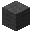

---
<!-- gray_wool__from__crafting_shaped__use__tag_carpet.md -->

<!-- en_us -->

## Gray Wool | Crafting Table: Shaped | Colored Carpet

<table>
	<tablebody>
		<tr>
			<td colspan="5">Crafting Table: Shaped</td>
		</tr>
		<tr>
			<td></td>
			<td></td>
			<td></td>
			<td colspan="2"></td>
		</tr>
		<tr>
			<td></td>
			<td></td>
			<td></td>
			<td></td>
			<td></td>
		</tr>
		<tr>
			<td></td>
			<td></td>
			<td></td>
			<td colspan="2"></td>
		</tr>
	</tablebody>
</table>
<table>
	<tablebody>
		<tr>
			<td></td>
			<td>ICON</td>
			<td>NAME</td>
			<td>ID</td>
			<td>Count</td>
		</tr>
		<tr>
			<td></td>
			<td></td>
			<td>Gray Wool</td>
			<td>gray_wool</td>
			<td>1</td>
		</tr>
		<tr>
			<td></td>
			<td></td>
			<td><a>Colored Carpet</a></td>
			<td><a>carpet</a></td>
			<td>2</td>
		</tr>
	</tablebody>
</table>

[Colored Carpet](../../../en_us/tags/tag__carpet.md)

---
<!-- gray_wool__from__stonecutting__use__tag_bed.md -->

<!-- en_us -->

## Gray Wool | Stonecutter | Colored Bed

<table>
	<tablebody>
		<tr>
			<td colspan="6">Stonecutter</td>
		</tr>
		<tr>
			<td colspan="2"></td>
			<td></td>
			<td></td>
			<td></td>
			<td></td>
		</tr>
		<tr>
			<td></td>
			<td></td>
			<td></td>
			<td></td>
			<td></td>
			<td></td>
		</tr>
		<tr>
			<td colspan="2"></td>
			<td></td>
			<td></td>
			<td></td>
			<td></td>
		</tr>
	</tablebody>
</table>
<table>
	<tablebody>
		<tr>
			<td></td>
			<td>ICON</td>
			<td>NAME</td>
			<td>ID</td>
			<td>Count</td>
		</tr>
		<tr>
			<td></td>
			<td></td>
			<td><a>Colored Bed</a></td>
			<td><a>bed</a></td>
			<td>1</td>
		</tr>
		<tr>
			<td></td>
			<td></td>
			<td>Gray Wool</td>
			<td>gray_wool</td>
			<td>3</td>
		</tr>
	</tablebody>
</table>

[Colored Bed](../../../en_us/tags/tag__bed.md)

