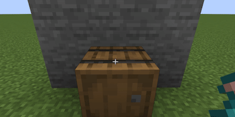
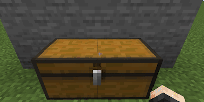

## Tea Stove：

### How to

Small·Tea Stove

[//]: # ()

Large·Tea Stove

[//]: # ()

* Steps
  * Put a book in the first slot of the container
  * Drop a consumable over the container
  * Players must be within 5 blocks of the consumable

[Tea Recipe](/en_us/tea_room/tea_recipe.md)

### Container

<table>
	<tablebody>
		<tr>
			<td>Container</td>
			<td>Container ID</td>
			<td>ItemPosition</td>
		</tr>
		<tr>
            <td>Barrel</td>
			<td>barrel</td>
			<td rowspan="4"></td>
		</tr>
		<tr>
            <td>Shulker Box</td>
			<td>shulker_box</td>
		</tr>
		<tr>
            <td>Chest</td>
			<td>chest</td>
		</tr>
		<tr>
            <td>Trapped Chest</td>
			<td>trapped_chest</td>
		</tr>
		<tr>
            <td>Large Chest</td>
			<td>large_chest</td>
			<td></td>
		</tr>
		<tr>
            <td>Hopper</td>
			<td>hopper</td>
			<td></td>
		</tr>
		<tr>
            <td>Dropper</td>
			<td>dropper</td>
			<td rowspan="2"></td>
		</tr>
		<tr>
            <td>Dispenser</td>
			<td>dispenser</td>
		</tr>
		<tr>
            <td>Furnace</td>
			<td>furnace</td>
			<td rowspan="3"></td>
		</tr>
		<tr>
            <td>Blast Furnace</td>
			<td>blast_furnace</td>
		</tr>
		<tr>
            <td>Smoker</td>
			<td>smoker</td>
		</tr>
	</tablebody>
</table>

### Hint

* Detect spatial order
   * First detect the container in the block where the consumable is located, such as chest, hopper and other incomplete blocks.
   * Then check the container in the block below the consumable, such as barrel, shulker box and other complete blocks.

* Detect time sequence
   * Detected every 20ticks, the detection of different items is staggered.

