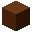
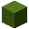

---
<!-- black_concrete__from__crafting_shapeless__use__black_concrete_powder.md -->

<!-- zh_cn -->

## 黑色混凝土 | 工作台: 无序 | 黑色混凝土粉末

<table>
	<tablebody>
		<tr>
			<td colspan="5">工作台: 无序</td>
		</tr>
		<tr>
			<td></td>
			<td></td>
			<td></td>
			<td colspan="2"></td>
		</tr>
		<tr>
			<td></td>
			<td></td>
			<td></td>
			<td></td>
			<td></td>
		</tr>
		<tr>
			<td></td>
			<td></td>
			<td></td>
			<td colspan="2"></td>
		</tr>
	</tablebody>
</table>
<table>
	<tablebody>
		<tr>
			<td></td>
			<td>图标</td>
			<td>名称</td>
			<td>标签</td>
			<td>数量</td>
		</tr>
		<tr>
			<td></td>
			<td></td>
			<td>黑色混凝土</td>
			<td>black_concrete</td>
			<td>1</td>
		</tr>
		<tr>
			<td></td>
			<td></td>
			<td>黑色混凝土粉末</td>
			<td>black_concrete_powder</td>
			<td>1</td>
		</tr>
	</tablebody>
</table>

---
<!-- blue_concrete__from__crafting_shapeless__use__blue_concrete_powder.md -->

<!-- zh_cn -->

## 蓝色混凝土 | 工作台: 无序 | 蓝色混凝土粉末

<table>
	<tablebody>
		<tr>
			<td colspan="5">工作台: 无序</td>
		</tr>
		<tr>
			<td></td>
			<td></td>
			<td></td>
			<td colspan="2"></td>
		</tr>
		<tr>
			<td></td>
			<td></td>
			<td></td>
			<td></td>
			<td></td>
		</tr>
		<tr>
			<td></td>
			<td></td>
			<td></td>
			<td colspan="2"></td>
		</tr>
	</tablebody>
</table>
<table>
	<tablebody>
		<tr>
			<td></td>
			<td>图标</td>
			<td>名称</td>
			<td>标签</td>
			<td>数量</td>
		</tr>
		<tr>
			<td></td>
			<td></td>
			<td>蓝色混凝土</td>
			<td>blue_concrete</td>
			<td>1</td>
		</tr>
		<tr>
			<td></td>
			<td></td>
			<td>蓝色混凝土粉末</td>
			<td>blue_concrete_powder</td>
			<td>1</td>
		</tr>
	</tablebody>
</table>

---
<!-- brown_concrete__from__crafting_shapeless__use__brown_concrete_powder.md -->

<!-- zh_cn -->

## 棕色混凝土 | 工作台: 无序 | 棕色混凝土粉末

<table>
	<tablebody>
		<tr>
			<td colspan="5">工作台: 无序</td>
		</tr>
		<tr>
			<td></td>
			<td></td>
			<td></td>
			<td colspan="2"></td>
		</tr>
		<tr>
			<td></td>
			<td></td>
			<td></td>
			<td></td>
			<td></td>
		</tr>
		<tr>
			<td></td>
			<td></td>
			<td></td>
			<td colspan="2"></td>
		</tr>
	</tablebody>
</table>
<table>
	<tablebody>
		<tr>
			<td></td>
			<td>图标</td>
			<td>名称</td>
			<td>标签</td>
			<td>数量</td>
		</tr>
		<tr>
			<td></td>
			<td></td>
			<td>棕色混凝土</td>
			<td>brown_concrete</td>
			<td>1</td>
		</tr>
		<tr>
			<td></td>
			<td></td>
			<td>棕色混凝土粉末</td>
			<td>brown_concrete_powder</td>
			<td>1</td>
		</tr>
	</tablebody>
</table>

---
<!-- cyan_concrete__from__crafting_shapeless__use__cyan_concrete_powder.md -->

<!-- zh_cn -->

## 青色混凝土 | 工作台: 无序 | 青色混凝土粉末

<table>
	<tablebody>
		<tr>
			<td colspan="5">工作台: 无序</td>
		</tr>
		<tr>
			<td></td>
			<td></td>
			<td></td>
			<td colspan="2"></td>
		</tr>
		<tr>
			<td></td>
			<td></td>
			<td></td>
			<td></td>
			<td></td>
		</tr>
		<tr>
			<td></td>
			<td></td>
			<td></td>
			<td colspan="2"></td>
		</tr>
	</tablebody>
</table>
<table>
	<tablebody>
		<tr>
			<td></td>
			<td>图标</td>
			<td>名称</td>
			<td>标签</td>
			<td>数量</td>
		</tr>
		<tr>
			<td></td>
			<td></td>
			<td>青色混凝土</td>
			<td>cyan_concrete</td>
			<td>1</td>
		</tr>
		<tr>
			<td></td>
			<td></td>
			<td>青色混凝土粉末</td>
			<td>cyan_concrete_powder</td>
			<td>1</td>
		</tr>
	</tablebody>
</table>

---
<!-- gray_concrete__from__crafting_shapeless__use__gray_concrete_powder.md -->

<!-- zh_cn -->

## 灰色混凝土 | 工作台: 无序 | 灰色混凝土粉末

<table>
	<tablebody>
		<tr>
			<td colspan="5">工作台: 无序</td>
		</tr>
		<tr>
			<td></td>
			<td></td>
			<td></td>
			<td colspan="2"></td>
		</tr>
		<tr>
			<td></td>
			<td></td>
			<td></td>
			<td></td>
			<td></td>
		</tr>
		<tr>
			<td></td>
			<td></td>
			<td></td>
			<td colspan="2"></td>
		</tr>
	</tablebody>
</table>
<table>
	<tablebody>
		<tr>
			<td></td>
			<td>图标</td>
			<td>名称</td>
			<td>标签</td>
			<td>数量</td>
		</tr>
		<tr>
			<td></td>
			<td></td>
			<td>灰色混凝土</td>
			<td>gray_concrete</td>
			<td>1</td>
		</tr>
		<tr>
			<td></td>
			<td></td>
			<td>灰色混凝土粉末</td>
			<td>gray_concrete_powder</td>
			<td>1</td>
		</tr>
	</tablebody>
</table>

---
<!-- green_concrete__from__crafting_shapeless__use__green_concrete_powder.md -->

<!-- zh_cn -->

## 绿色混凝土 | 工作台: 无序 | 绿色混凝土粉末

<table>
	<tablebody>
		<tr>
			<td colspan="5">工作台: 无序</td>
		</tr>
		<tr>
			<td></td>
			<td></td>
			<td></td>
			<td colspan="2"></td>
		</tr>
		<tr>
			<td></td>
			<td></td>
			<td></td>
			<td></td>
			<td></td>
		</tr>
		<tr>
			<td></td>
			<td></td>
			<td></td>
			<td colspan="2"></td>
		</tr>
	</tablebody>
</table>
<table>
	<tablebody>
		<tr>
			<td></td>
			<td>图标</td>
			<td>名称</td>
			<td>标签</td>
			<td>数量</td>
		</tr>
		<tr>
			<td></td>
			<td></td>
			<td>绿色混凝土</td>
			<td>green_concrete</td>
			<td>1</td>
		</tr>
		<tr>
			<td></td>
			<td></td>
			<td>绿色混凝土粉末</td>
			<td>green_concrete_powder</td>
			<td>1</td>
		</tr>
	</tablebody>
</table>

---
<!-- light_blue_concrete__from__crafting_shapeless__use__light_blue_concrete_powder.md -->

<!-- zh_cn -->

## 淡蓝色混凝土 | 工作台: 无序 | 淡蓝色混凝土粉末

<table>
	<tablebody>
		<tr>
			<td colspan="5">工作台: 无序</td>
		</tr>
		<tr>
			<td></td>
			<td></td>
			<td></td>
			<td colspan="2"></td>
		</tr>
		<tr>
			<td></td>
			<td></td>
			<td></td>
			<td></td>
			<td></td>
		</tr>
		<tr>
			<td></td>
			<td></td>
			<td></td>
			<td colspan="2"></td>
		</tr>
	</tablebody>
</table>
<table>
	<tablebody>
		<tr>
			<td></td>
			<td>图标</td>
			<td>名称</td>
			<td>标签</td>
			<td>数量</td>
		</tr>
		<tr>
			<td></td>
			<td></td>
			<td>淡蓝色混凝土</td>
			<td>light_blue_concrete</td>
			<td>1</td>
		</tr>
		<tr>
			<td></td>
			<td></td>
			<td>淡蓝色混凝土粉末</td>
			<td>light_blue_concrete_powder</td>
			<td>1</td>
		</tr>
	</tablebody>
</table>

---
<!-- light_gray_concrete__from__crafting_shapeless__use__light_gray_concrete_powder.md -->

<!-- zh_cn -->

## 淡灰色混凝土 | 工作台: 无序 | 淡灰色混凝土粉末

<table>
	<tablebody>
		<tr>
			<td colspan="5">工作台: 无序</td>
		</tr>
		<tr>
			<td></td>
			<td></td>
			<td></td>
			<td colspan="2"></td>
		</tr>
		<tr>
			<td></td>
			<td></td>
			<td></td>
			<td></td>
			<td></td>
		</tr>
		<tr>
			<td></td>
			<td></td>
			<td></td>
			<td colspan="2"></td>
		</tr>
	</tablebody>
</table>
<table>
	<tablebody>
		<tr>
			<td></td>
			<td>图标</td>
			<td>名称</td>
			<td>标签</td>
			<td>数量</td>
		</tr>
		<tr>
			<td></td>
			<td></td>
			<td>淡灰色混凝土</td>
			<td>light_gray_concrete</td>
			<td>1</td>
		</tr>
		<tr>
			<td></td>
			<td></td>
			<td>淡灰色混凝土粉末</td>
			<td>light_gray_concrete_powder</td>
			<td>1</td>
		</tr>
	</tablebody>
</table>

---
<!-- lime_concrete__from__crafting_shapeless__use__lime_concrete_powder.md -->

<!-- zh_cn -->

## 黄绿色混凝土 | 工作台: 无序 | 黄绿色混凝土粉末

<table>
	<tablebody>
		<tr>
			<td colspan="5">工作台: 无序</td>
		</tr>
		<tr>
			<td></td>
			<td></td>
			<td></td>
			<td colspan="2"></td>
		</tr>
		<tr>
			<td></td>
			<td></td>
			<td></td>
			<td></td>
			<td></td>
		</tr>
		<tr>
			<td></td>
			<td></td>
			<td></td>
			<td colspan="2"></td>
		</tr>
	</tablebody>
</table>
<table>
	<tablebody>
		<tr>
			<td></td>
			<td>图标</td>
			<td>名称</td>
			<td>标签</td>
			<td>数量</td>
		</tr>
		<tr>
			<td></td>
			<td></td>
			<td>黄绿色混凝土</td>
			<td>lime_concrete</td>
			<td>1</td>
		</tr>
		<tr>
			<td></td>
			<td></td>
			<td>黄绿色混凝土粉末</td>
			<td>lime_concrete_powder</td>
			<td>1</td>
		</tr>
	</tablebody>
</table>

---
<!-- magenta_concrete__from__crafting_shapeless__use__magenta_concrete_powder.md -->

<!-- zh_cn -->

## 品红色混凝土 | 工作台: 无序 | 品红色混凝土粉末

<table>
	<tablebody>
		<tr>
			<td colspan="5">工作台: 无序</td>
		</tr>
		<tr>
			<td></td>
			<td></td>
			<td></td>
			<td colspan="2"></td>
		</tr>
		<tr>
			<td></td>
			<td></td>
			<td></td>
			<td></td>
			<td></td>
		</tr>
		<tr>
			<td></td>
			<td></td>
			<td></td>
			<td colspan="2"></td>
		</tr>
	</tablebody>
</table>
<table>
	<tablebody>
		<tr>
			<td></td>
			<td>图标</td>
			<td>名称</td>
			<td>标签</td>
			<td>数量</td>
		</tr>
		<tr>
			<td></td>
			<td></td>
			<td>品红色混凝土</td>
			<td>magenta_concrete</td>
			<td>1</td>
		</tr>
		<tr>
			<td></td>
			<td></td>
			<td>品红色混凝土粉末</td>
			<td>magenta_concrete_powder</td>
			<td>1</td>
		</tr>
	</tablebody>
</table>

---
<!-- orange_concrete__from__crafting_shapeless__use__orange_concrete_powder.md -->

<!-- zh_cn -->

## 橙色混凝土 | 工作台: 无序 | 橙色混凝土粉末

<table>
	<tablebody>
		<tr>
			<td colspan="5">工作台: 无序</td>
		</tr>
		<tr>
			<td></td>
			<td></td>
			<td></td>
			<td colspan="2"></td>
		</tr>
		<tr>
			<td></td>
			<td></td>
			<td></td>
			<td></td>
			<td></td>
		</tr>
		<tr>
			<td></td>
			<td></td>
			<td></td>
			<td colspan="2"></td>
		</tr>
	</tablebody>
</table>
<table>
	<tablebody>
		<tr>
			<td></td>
			<td>图标</td>
			<td>名称</td>
			<td>标签</td>
			<td>数量</td>
		</tr>
		<tr>
			<td></td>
			<td></td>
			<td>橙色混凝土</td>
			<td>orange_concrete</td>
			<td>1</td>
		</tr>
		<tr>
			<td></td>
			<td></td>
			<td>橙色混凝土粉末</td>
			<td>orange_concrete_powder</td>
			<td>1</td>
		</tr>
	</tablebody>
</table>

---
<!-- pink_concrete__from__crafting_shapeless__use__pink_concrete_powder.md -->

<!-- zh_cn -->

## 粉红色混凝土 | 工作台: 无序 | 粉红色混凝土粉末

<table>
	<tablebody>
		<tr>
			<td colspan="5">工作台: 无序</td>
		</tr>
		<tr>
			<td></td>
			<td></td>
			<td></td>
			<td colspan="2"></td>
		</tr>
		<tr>
			<td></td>
			<td></td>
			<td></td>
			<td></td>
			<td></td>
		</tr>
		<tr>
			<td></td>
			<td></td>
			<td></td>
			<td colspan="2"></td>
		</tr>
	</tablebody>
</table>
<table>
	<tablebody>
		<tr>
			<td></td>
			<td>图标</td>
			<td>名称</td>
			<td>标签</td>
			<td>数量</td>
		</tr>
		<tr>
			<td></td>
			<td></td>
			<td>粉红色混凝土</td>
			<td>pink_concrete</td>
			<td>1</td>
		</tr>
		<tr>
			<td></td>
			<td></td>
			<td>粉红色混凝土粉末</td>
			<td>pink_concrete_powder</td>
			<td>1</td>
		</tr>
	</tablebody>
</table>

---
<!-- purple_concrete__from__crafting_shapeless__use__purple_concrete_powder.md -->

<!-- zh_cn -->

## 紫色混凝土 | 工作台: 无序 | 紫色混凝土粉末

<table>
	<tablebody>
		<tr>
			<td colspan="5">工作台: 无序</td>
		</tr>
		<tr>
			<td></td>
			<td></td>
			<td></td>
			<td colspan="2"></td>
		</tr>
		<tr>
			<td></td>
			<td></td>
			<td></td>
			<td></td>
			<td></td>
		</tr>
		<tr>
			<td></td>
			<td></td>
			<td></td>
			<td colspan="2"></td>
		</tr>
	</tablebody>
</table>
<table>
	<tablebody>
		<tr>
			<td></td>
			<td>图标</td>
			<td>名称</td>
			<td>标签</td>
			<td>数量</td>
		</tr>
		<tr>
			<td></td>
			<td></td>
			<td>紫色混凝土</td>
			<td>purple_concrete</td>
			<td>1</td>
		</tr>
		<tr>
			<td></td>
			<td></td>
			<td>紫色混凝土粉末</td>
			<td>purple_concrete_powder</td>
			<td>1</td>
		</tr>
	</tablebody>
</table>

---
<!-- red_concrete__from__crafting_shapeless__use__red_concrete_powder.md -->

<!-- zh_cn -->

## 红色混凝土 | 工作台: 无序 | 红色混凝土粉末

<table>
	<tablebody>
		<tr>
			<td colspan="5">工作台: 无序</td>
		</tr>
		<tr>
			<td></td>
			<td></td>
			<td></td>
			<td colspan="2"></td>
		</tr>
		<tr>
			<td></td>
			<td></td>
			<td></td>
			<td></td>
			<td></td>
		</tr>
		<tr>
			<td></td>
			<td></td>
			<td></td>
			<td colspan="2"></td>
		</tr>
	</tablebody>
</table>
<table>
	<tablebody>
		<tr>
			<td></td>
			<td>图标</td>
			<td>名称</td>
			<td>标签</td>
			<td>数量</td>
		</tr>
		<tr>
			<td></td>
			<td></td>
			<td>红色混凝土</td>
			<td>red_concrete</td>
			<td>1</td>
		</tr>
		<tr>
			<td></td>
			<td></td>
			<td>红色混凝土粉末</td>
			<td>red_concrete_powder</td>
			<td>1</td>
		</tr>
	</tablebody>
</table>

---
<!-- white_concrete__from__crafting_shapeless__use__white_concrete_powder.md -->

<!-- zh_cn -->

## 白色混凝土 | 工作台: 无序 | 白色混凝土粉末

<table>
	<tablebody>
		<tr>
			<td colspan="5">工作台: 无序</td>
		</tr>
		<tr>
			<td></td>
			<td></td>
			<td></td>
			<td colspan="2"></td>
		</tr>
		<tr>
			<td></td>
			<td></td>
			<td></td>
			<td></td>
			<td></td>
		</tr>
		<tr>
			<td></td>
			<td></td>
			<td></td>
			<td colspan="2"></td>
		</tr>
	</tablebody>
</table>
<table>
	<tablebody>
		<tr>
			<td></td>
			<td>图标</td>
			<td>名称</td>
			<td>标签</td>
			<td>数量</td>
		</tr>
		<tr>
			<td></td>
			<td></td>
			<td>白色混凝土</td>
			<td>white_concrete</td>
			<td>1</td>
		</tr>
		<tr>
			<td></td>
			<td></td>
			<td>白色混凝土粉末</td>
			<td>white_concrete_powder</td>
			<td>1</td>
		</tr>
	</tablebody>
</table>

---
<!-- yellow_concrete__from__crafting_shapeless__use__yellow_concrete_powder.md -->

<!-- zh_cn -->

## 黄色混凝土 | 工作台: 无序 | 黄色混凝土粉末

<table>
	<tablebody>
		<tr>
			<td colspan="5">工作台: 无序</td>
		</tr>
		<tr>
			<td></td>
			<td></td>
			<td></td>
			<td colspan="2"></td>
		</tr>
		<tr>
			<td></td>
			<td></td>
			<td></td>
			<td></td>
			<td></td>
		</tr>
		<tr>
			<td></td>
			<td></td>
			<td></td>
			<td colspan="2"></td>
		</tr>
	</tablebody>
</table>
<table>
	<tablebody>
		<tr>
			<td></td>
			<td>图标</td>
			<td>名称</td>
			<td>标签</td>
			<td>数量</td>
		</tr>
		<tr>
			<td></td>
			<td></td>
			<td>黄色混凝土</td>
			<td>yellow_concrete</td>
			<td>1</td>
		</tr>
		<tr>
			<td></td>
			<td></td>
			<td>黄色混凝土粉末</td>
			<td>yellow_concrete_powder</td>
			<td>1</td>
		</tr>
	</tablebody>
</table>

