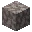
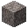
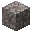
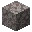

---
<!-- brain_coral_block__from__crafting_shaped__use__dead_brain_coral_block.md -->

<!-- zh_cn -->

## 脑纹珊瑚块 | 工作台: 有序 | 失活的脑纹珊瑚块

<table>
	<tablebody>
		<tr>
			<td colspan="5">工作台: 有序</td>
		</tr>
		<tr>
			<td></td>
			<td></td>
			<td></td>
			<td colspan="2"></td>
		</tr>
		<tr>
			<td></td>
			<td></td>
			<td></td>
			<td></td>
			<td></td>
		</tr>
		<tr>
			<td></td>
			<td></td>
			<td></td>
			<td colspan="2"></td>
		</tr>
	</tablebody>
</table>
<table>
	<tablebody>
		<tr>
			<td></td>
			<td>图标</td>
			<td>名称</td>
			<td>标签</td>
			<td>数量</td>
		</tr>
		<tr>
			<td></td>
			<td></td>
			<td>脑纹珊瑚块</td>
			<td>brain_coral_block</td>
			<td>8</td>
		</tr>
		<tr>
			<td></td>
			<td></td>
			<td>失活的脑纹珊瑚块</td>
			<td>dead_brain_coral_block</td>
			<td>8</td>
		</tr>
		<tr>
			<td></td>
			<td></td>
			<td>龙息</td>
			<td>dragon_breath</td>
			<td>1</td>
		</tr>
	</tablebody>
</table>

---
<!-- bubble_coral_block__from__crafting_shaped__use__dead_bubble_coral_block.md -->

<!-- zh_cn -->

## 气泡珊瑚块 | 工作台: 有序 | 失活的气泡珊瑚块

<table>
	<tablebody>
		<tr>
			<td colspan="5">工作台: 有序</td>
		</tr>
		<tr>
			<td></td>
			<td></td>
			<td></td>
			<td colspan="2"></td>
		</tr>
		<tr>
			<td></td>
			<td></td>
			<td></td>
			<td></td>
			<td></td>
		</tr>
		<tr>
			<td></td>
			<td></td>
			<td></td>
			<td colspan="2"></td>
		</tr>
	</tablebody>
</table>
<table>
	<tablebody>
		<tr>
			<td></td>
			<td>图标</td>
			<td>名称</td>
			<td>标签</td>
			<td>数量</td>
		</tr>
		<tr>
			<td></td>
			<td></td>
			<td>气泡珊瑚块</td>
			<td>bubble_coral_block</td>
			<td>8</td>
		</tr>
		<tr>
			<td></td>
			<td></td>
			<td>失活的气泡珊瑚块</td>
			<td>dead_bubble_coral_block</td>
			<td>8</td>
		</tr>
		<tr>
			<td></td>
			<td></td>
			<td>龙息</td>
			<td>dragon_breath</td>
			<td>1</td>
		</tr>
	</tablebody>
</table>

---
<!-- fire_coral_block__from__crafting_shaped__use__dead_fire_coral_block.md -->

<!-- zh_cn -->

## 火珊瑚块 | 工作台: 有序 | 失活的火珊瑚块

<table>
	<tablebody>
		<tr>
			<td colspan="5">工作台: 有序</td>
		</tr>
		<tr>
			<td></td>
			<td></td>
			<td></td>
			<td colspan="2"></td>
		</tr>
		<tr>
			<td></td>
			<td></td>
			<td></td>
			<td></td>
			<td></td>
		</tr>
		<tr>
			<td></td>
			<td></td>
			<td></td>
			<td colspan="2"></td>
		</tr>
	</tablebody>
</table>
<table>
	<tablebody>
		<tr>
			<td></td>
			<td>图标</td>
			<td>名称</td>
			<td>标签</td>
			<td>数量</td>
		</tr>
		<tr>
			<td></td>
			<td></td>
			<td>火珊瑚块</td>
			<td>fire_coral_block</td>
			<td>8</td>
		</tr>
		<tr>
			<td></td>
			<td></td>
			<td>失活的火珊瑚块</td>
			<td>dead_fire_coral_block</td>
			<td>8</td>
		</tr>
		<tr>
			<td></td>
			<td></td>
			<td>龙息</td>
			<td>dragon_breath</td>
			<td>1</td>
		</tr>
	</tablebody>
</table>

---
<!-- horn_coral_block__from__crafting_shaped__use__dead_horn_coral_block.md -->

<!-- zh_cn -->

## 鹿角珊瑚块 | 工作台: 有序 | 失活的鹿角珊瑚块

<table>
	<tablebody>
		<tr>
			<td colspan="5">工作台: 有序</td>
		</tr>
		<tr>
			<td></td>
			<td></td>
			<td></td>
			<td colspan="2"></td>
		</tr>
		<tr>
			<td></td>
			<td></td>
			<td></td>
			<td></td>
			<td></td>
		</tr>
		<tr>
			<td></td>
			<td></td>
			<td></td>
			<td colspan="2"></td>
		</tr>
	</tablebody>
</table>
<table>
	<tablebody>
		<tr>
			<td></td>
			<td>图标</td>
			<td>名称</td>
			<td>标签</td>
			<td>数量</td>
		</tr>
		<tr>
			<td></td>
			<td></td>
			<td>鹿角珊瑚块</td>
			<td>horn_coral_block</td>
			<td>8</td>
		</tr>
		<tr>
			<td></td>
			<td></td>
			<td>失活的鹿角珊瑚块</td>
			<td>dead_horn_coral_block</td>
			<td>8</td>
		</tr>
		<tr>
			<td></td>
			<td></td>
			<td>龙息</td>
			<td>dragon_breath</td>
			<td>1</td>
		</tr>
	</tablebody>
</table>

---
<!-- tube_coral_block__from__crafting_shaped__use__dead_tube_coral_block.md -->

<!-- zh_cn -->

## 管珊瑚块 | 工作台: 有序 | 失活的管珊瑚块

<table>
	<tablebody>
		<tr>
			<td colspan="5">工作台: 有序</td>
		</tr>
		<tr>
			<td></td>
			<td></td>
			<td></td>
			<td colspan="2"></td>
		</tr>
		<tr>
			<td></td>
			<td></td>
			<td></td>
			<td></td>
			<td></td>
		</tr>
		<tr>
			<td></td>
			<td></td>
			<td></td>
			<td colspan="2"></td>
		</tr>
	</tablebody>
</table>
<table>
	<tablebody>
		<tr>
			<td></td>
			<td>图标</td>
			<td>名称</td>
			<td>标签</td>
			<td>数量</td>
		</tr>
		<tr>
			<td></td>
			<td></td>
			<td>管珊瑚块</td>
			<td>tube_coral_block</td>
			<td>8</td>
		</tr>
		<tr>
			<td></td>
			<td></td>
			<td>失活的管珊瑚块</td>
			<td>dead_tube_coral_block</td>
			<td>8</td>
		</tr>
		<tr>
			<td></td>
			<td></td>
			<td>龙息</td>
			<td>dragon_breath</td>
			<td>1</td>
		</tr>
	</tablebody>
</table>

