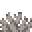
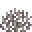

---
<!-- dead_brain_coral_fan__from__smoking__use__brain_coral_fan.md -->

<!-- zh_cn -->

## 失活的脑纹珊瑚扇 | 烟熏炉 | 脑纹珊瑚扇

<table>
	<tablebody>
		<tr>
			<td colspan="3">烟熏炉</td>
			<td>时长</td>
			<td>经验</td>
		</tr>
		<tr>
			<td></td>
			<td></td>
			<td></td>
			<td>60</td>
			<td>0.1</td>
		</tr>
	</tablebody>
</table>
<table>
	<tablebody>
		<tr>
			<td></td>
			<td>图标</td>
			<td>名称</td>
			<td>标签</td>
			<td>数量</td>
		</tr>
		<tr>
			<td></td>
			<td></td>
			<td>脑纹珊瑚扇</td>
			<td>brain_coral_fan</td>
			<td>1</td>
		</tr>
		<tr>
			<td></td>
			<td></td>
			<td>失活的脑纹珊瑚扇</td>
			<td>dead_brain_coral_fan</td>
			<td>1</td>
		</tr>
	</tablebody>
</table>

---
<!-- dead_bubble_coral_fan__from__smoking__use__bubble_coral_fan.md -->

<!-- zh_cn -->

## 失活的气泡珊瑚扇 | 烟熏炉 | 气泡珊瑚扇

<table>
	<tablebody>
		<tr>
			<td colspan="3">烟熏炉</td>
			<td>时长</td>
			<td>经验</td>
		</tr>
		<tr>
			<td></td>
			<td></td>
			<td></td>
			<td>60</td>
			<td>0.1</td>
		</tr>
	</tablebody>
</table>
<table>
	<tablebody>
		<tr>
			<td></td>
			<td>图标</td>
			<td>名称</td>
			<td>标签</td>
			<td>数量</td>
		</tr>
		<tr>
			<td></td>
			<td></td>
			<td>气泡珊瑚扇</td>
			<td>bubble_coral_fan</td>
			<td>1</td>
		</tr>
		<tr>
			<td></td>
			<td></td>
			<td>失活的气泡珊瑚扇</td>
			<td>dead_bubble_coral_fan</td>
			<td>1</td>
		</tr>
	</tablebody>
</table>

---
<!-- dead_fire_coral_fan__from__smoking__use__fire_coral_fan.md -->

<!-- zh_cn -->

## 失活的火珊瑚扇 | 烟熏炉 | 火珊瑚扇

<table>
	<tablebody>
		<tr>
			<td colspan="3">烟熏炉</td>
			<td>时长</td>
			<td>经验</td>
		</tr>
		<tr>
			<td></td>
			<td></td>
			<td></td>
			<td>60</td>
			<td>0.1</td>
		</tr>
	</tablebody>
</table>
<table>
	<tablebody>
		<tr>
			<td></td>
			<td>图标</td>
			<td>名称</td>
			<td>标签</td>
			<td>数量</td>
		</tr>
		<tr>
			<td></td>
			<td></td>
			<td>火珊瑚扇</td>
			<td>fire_coral_fan</td>
			<td>1</td>
		</tr>
		<tr>
			<td></td>
			<td></td>
			<td>失活的火珊瑚扇</td>
			<td>dead_fire_coral_fan</td>
			<td>1</td>
		</tr>
	</tablebody>
</table>

---
<!-- dead_horn_coral_fan__from__smoking__use__horn_coral_fan.md -->

<!-- zh_cn -->

## 失活的鹿角珊瑚扇 | 烟熏炉 | 鹿角珊瑚扇

<table>
	<tablebody>
		<tr>
			<td colspan="3">烟熏炉</td>
			<td>时长</td>
			<td>经验</td>
		</tr>
		<tr>
			<td></td>
			<td></td>
			<td></td>
			<td>60</td>
			<td>0.1</td>
		</tr>
	</tablebody>
</table>
<table>
	<tablebody>
		<tr>
			<td></td>
			<td>图标</td>
			<td>名称</td>
			<td>标签</td>
			<td>数量</td>
		</tr>
		<tr>
			<td></td>
			<td></td>
			<td>鹿角珊瑚扇</td>
			<td>horn_coral_fan</td>
			<td>1</td>
		</tr>
		<tr>
			<td></td>
			<td></td>
			<td>失活的鹿角珊瑚扇</td>
			<td>dead_horn_coral_fan</td>
			<td>1</td>
		</tr>
	</tablebody>
</table>

---
<!-- dead_tube_coral_fan__from__smoking__use__tube_coral_fan.md -->

<!-- zh_cn -->

## 失活的管珊瑚扇 | 烟熏炉 | 管珊瑚扇

<table>
	<tablebody>
		<tr>
			<td colspan="3">烟熏炉</td>
			<td>时长</td>
			<td>经验</td>
		</tr>
		<tr>
			<td></td>
			<td></td>
			<td></td>
			<td>60</td>
			<td>0.1</td>
		</tr>
	</tablebody>
</table>
<table>
	<tablebody>
		<tr>
			<td></td>
			<td>图标</td>
			<td>名称</td>
			<td>标签</td>
			<td>数量</td>
		</tr>
		<tr>
			<td></td>
			<td></td>
			<td>管珊瑚扇</td>
			<td>tube_coral_fan</td>
			<td>1</td>
		</tr>
		<tr>
			<td></td>
			<td></td>
			<td>失活的管珊瑚扇</td>
			<td>dead_tube_coral_fan</td>
			<td>1</td>
		</tr>
	</tablebody>
</table>

