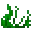
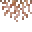
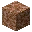
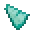
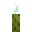
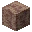
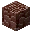

---
<!-- dirt__from__crafting_shapeless__use__tag_coral_block.md -->

<!-- zh_cn -->

## 泥土 | 工作台: 无序 | 珊瑚块

<table>
	<tablebody>
		<tr>
			<td colspan="5">工作台: 无序</td>
		</tr>
		<tr>
			<td></td>
			<td></td>
			<td></td>
			<td colspan="2"></td>
		</tr>
		<tr>
			<td></td>
			<td></td>
			<td></td>
			<td></td>
			<td></td>
		</tr>
		<tr>
			<td></td>
			<td></td>
			<td></td>
			<td colspan="2"></td>
		</tr>
	</tablebody>
</table>
<table>
	<tablebody>
		<tr>
			<td></td>
			<td>图标</td>
			<td>名称</td>
			<td>标签</td>
			<td>数量</td>
		</tr>
		<tr>
			<td></td>
			<td></td>
			<td>泥土</td>
			<td>dirt</td>
			<td>64</td>
		</tr>
		<tr>
			<td rowspan="2"></td>
			<td></td>
			<td><a>珊瑚块</a></td>
			<td><a>coral_block</a></td>
			<td rowspan="2">1</td>
		</tr>
		<tr>
			<td></td>
			<td><a>失活的珊瑚块</a></td>
			<td><a>dead_coral_block</a></td>
		</tr>
		<tr>
			<td></td>
			<td></td>
			<td>海草</td>
			<td>seagrass</td>
			<td>1</td>
		</tr>
	</tablebody>
</table>

[珊瑚块](../../../zh_cn/tags/tag__coral_block.md)

[失活的珊瑚块](../../../zh_cn/tags/tag__dead_coral_block.md)

---
<!-- grass_block__from__crafting_shapeless__use__tag_coral_block.md -->

<!-- zh_cn -->

## 草方块 | 工作台: 无序 | 珊瑚块

<table>
	<tablebody>
		<tr>
			<td colspan="5">工作台: 无序</td>
		</tr>
		<tr>
			<td></td>
			<td></td>
			<td></td>
			<td colspan="2"></td>
		</tr>
		<tr>
			<td></td>
			<td></td>
			<td></td>
			<td></td>
			<td></td>
		</tr>
		<tr>
			<td></td>
			<td></td>
			<td></td>
			<td colspan="2"></td>
		</tr>
	</tablebody>
</table>
<table>
	<tablebody>
		<tr>
			<td></td>
			<td>图标</td>
			<td>名称</td>
			<td>标签</td>
			<td>数量</td>
		</tr>
		<tr>
			<td></td>
			<td></td>
			<td>草方块</td>
			<td>grass_block</td>
			<td>64</td>
		</tr>
		<tr>
			<td rowspan="2"></td>
			<td></td>
			<td><a>珊瑚块</a></td>
			<td><a>coral_block</a></td>
			<td rowspan="2">1</td>
		</tr>
		<tr>
			<td></td>
			<td><a>失活的珊瑚块</a></td>
			<td><a>dead_coral_block</a></td>
		</tr>
		<tr>
			<td></td>
			<td></td>
			<td>草</td>
			<td>grass</td>
			<td>1</td>
		</tr>
	</tablebody>
</table>

[珊瑚块](../../../zh_cn/tags/tag__coral_block.md)

[失活的珊瑚块](../../../zh_cn/tags/tag__dead_coral_block.md)

---
<!-- rooted_dirt__from__crafting_shapeless__use__tag_coral_block.md -->

<!-- zh_cn -->

## 缠根泥土 | 工作台: 无序 | 珊瑚块

<table>
	<tablebody>
		<tr>
			<td colspan="5">工作台: 无序</td>
		</tr>
		<tr>
			<td></td>
			<td></td>
			<td></td>
			<td colspan="2"></td>
		</tr>
		<tr>
			<td></td>
			<td></td>
			<td></td>
			<td></td>
			<td></td>
		</tr>
		<tr>
			<td></td>
			<td></td>
			<td></td>
			<td colspan="2"></td>
		</tr>
	</tablebody>
</table>
<table>
	<tablebody>
		<tr>
			<td></td>
			<td>图标</td>
			<td>名称</td>
			<td>标签</td>
			<td>数量</td>
		</tr>
		<tr>
			<td></td>
			<td></td>
			<td>缠根泥土</td>
			<td>rooted_dirt</td>
			<td>64</td>
		</tr>
		<tr>
			<td rowspan="2"></td>
			<td></td>
			<td><a>珊瑚块</a></td>
			<td><a>coral_block</a></td>
			<td rowspan="2">1</td>
		</tr>
		<tr>
			<td></td>
			<td><a>失活的珊瑚块</a></td>
			<td><a>dead_coral_block</a></td>
		</tr>
		<tr>
			<td></td>
			<td></td>
			<td>垂根</td>
			<td>hanging_roots</td>
			<td>1</td>
		</tr>
	</tablebody>
</table>

[珊瑚块](../../../zh_cn/tags/tag__coral_block.md)

[失活的珊瑚块](../../../zh_cn/tags/tag__dead_coral_block.md)

---
<!-- cobblestone__from__crafting_shapeless__use__water_bucket.md -->

<!-- zh_cn -->

## 圆石 | 工作台: 无序 | 水桶

<table>
	<tablebody>
		<tr>
			<td colspan="5">工作台: 无序</td>
		</tr>
		<tr>
			<td></td>
			<td></td>
			<td></td>
			<td colspan="2"></td>
		</tr>
		<tr>
			<td></td>
			<td></td>
			<td></td>
			<td></td>
			<td></td>
		</tr>
		<tr>
			<td></td>
			<td></td>
			<td></td>
			<td colspan="2"></td>
		</tr>
	</tablebody>
</table>
<table>
	<tablebody>
		<tr>
			<td></td>
			<td>图标</td>
			<td>名称</td>
			<td>标签</td>
			<td>数量</td>
		</tr>
		<tr>
			<td></td>
			<td></td>
			<td>圆石</td>
			<td>cobblestone</td>
			<td>64</td>
		</tr>
		<tr>
			<td></td>
			<td></td>
			<td>水桶</td>
			<td>water_bucket</td>
			<td>1</td>
		</tr>
		<tr>
			<td></td>
			<td></td>
			<td>熔岩桶</td>
			<td>lava_bucket</td>
			<td>1</td>
		</tr>
	</tablebody>
</table>

---
<!-- sand__from__crafting_shapeless__use__tag_coral_block.md -->

<!-- zh_cn -->

## 沙子 | 工作台: 无序 | 珊瑚块

<table>
	<tablebody>
		<tr>
			<td colspan="5">工作台: 无序</td>
		</tr>
		<tr>
			<td></td>
			<td></td>
			<td></td>
			<td colspan="2"></td>
		</tr>
		<tr>
			<td></td>
			<td></td>
			<td></td>
			<td></td>
			<td></td>
		</tr>
		<tr>
			<td></td>
			<td></td>
			<td></td>
			<td colspan="2"></td>
		</tr>
	</tablebody>
</table>
<table>
	<tablebody>
		<tr>
			<td></td>
			<td>图标</td>
			<td>名称</td>
			<td>标签</td>
			<td>数量</td>
		</tr>
		<tr>
			<td></td>
			<td></td>
			<td>沙子</td>
			<td>sand</td>
			<td>64</td>
		</tr>
		<tr>
			<td rowspan="2"></td>
			<td></td>
			<td><a>珊瑚块</a></td>
			<td><a>coral_block</a></td>
			<td rowspan="2">1</td>
		</tr>
		<tr>
			<td></td>
			<td><a>失活的珊瑚块</a></td>
			<td><a>dead_coral_block</a></td>
		</tr>
		<tr>
			<td rowspan="3"></td>
			<td></td>
			<td>紫水晶碎片</td>
			<td>amethyst_shard</td>
			<td rowspan="3">1</td>
		</tr>
		<tr>
			<td></td>
			<td><a>染色玻璃板</a></td>
			<td><a>stained_glass_pane</a></td>
		</tr>
		<tr>
			<td></td>
			<td>玻璃板</td>
			<td>glass_pane</td>
		</tr>
	</tablebody>
</table>

[珊瑚块](../../../zh_cn/tags/tag__coral_block.md)

[失活的珊瑚块](../../../zh_cn/tags/tag__dead_coral_block.md)

[染色玻璃板](../../../zh_cn/tags/tag__stained_glass_pane.md)

---
<!-- gravel__from__crafting_shapeless__use__tag_coral_block.md -->

<!-- zh_cn -->

## 沙砾 | 工作台: 无序 | 珊瑚块

<table>
	<tablebody>
		<tr>
			<td colspan="5">工作台: 无序</td>
		</tr>
		<tr>
			<td></td>
			<td></td>
			<td></td>
			<td colspan="2"></td>
		</tr>
		<tr>
			<td></td>
			<td></td>
			<td></td>
			<td></td>
			<td></td>
		</tr>
		<tr>
			<td></td>
			<td></td>
			<td></td>
			<td colspan="2"></td>
		</tr>
	</tablebody>
</table>
<table>
	<tablebody>
		<tr>
			<td></td>
			<td>图标</td>
			<td>名称</td>
			<td>标签</td>
			<td>数量</td>
		</tr>
		<tr>
			<td></td>
			<td></td>
			<td>沙砾</td>
			<td>gravel</td>
			<td>64</td>
		</tr>
		<tr>
			<td rowspan="2"></td>
			<td></td>
			<td><a>珊瑚块</a></td>
			<td><a>coral_block</a></td>
			<td rowspan="2">1</td>
		</tr>
		<tr>
			<td></td>
			<td><a>失活的珊瑚块</a></td>
			<td><a>dead_coral_block</a></td>
		</tr>
		<tr>
			<td></td>
			<td></td>
			<td>圆石</td>
			<td>cobblestone</td>
			<td>1</td>
		</tr>
	</tablebody>
</table>

[珊瑚块](../../../zh_cn/tags/tag__coral_block.md)

[失活的珊瑚块](../../../zh_cn/tags/tag__dead_coral_block.md)

---
<!-- calcite__from__crafting_shaped__use__pointed_dripstone.md -->

<!-- zh_cn -->

## 方解石 | 工作台: 有序 | 滴水石锥

<table>
	<tablebody>
		<tr>
			<td colspan="5">工作台: 有序</td>
		</tr>
		<tr>
			<td></td>
			<td></td>
			<td></td>
			<td colspan="2"></td>
		</tr>
		<tr>
			<td></td>
			<td></td>
			<td></td>
			<td></td>
			<td></td>
		</tr>
		<tr>
			<td></td>
			<td></td>
			<td></td>
			<td colspan="2"></td>
		</tr>
	</tablebody>
</table>
<table>
	<tablebody>
		<tr>
			<td></td>
			<td>图标</td>
			<td>名称</td>
			<td>标签</td>
			<td>数量</td>
		</tr>
		<tr>
			<td></td>
			<td></td>
			<td>方解石</td>
			<td>calcite</td>
			<td>1</td>
		</tr>
		<tr>
			<td></td>
			<td></td>
			<td>滴水石锥</td>
			<td>pointed_dripstone</td>
			<td>2</td>
		</tr>
		<tr>
			<td></td>
			<td></td>
			<td>海晶碎片</td>
			<td>prismarine_shard</td>
			<td>2</td>
		</tr>
	</tablebody>
</table>

---
<!-- sponge__from__crafting_shapeless__use__tag_coral_block.md -->

<!-- zh_cn -->

## 海绵 | 工作台: 无序 | 珊瑚块

<table>
	<tablebody>
		<tr>
			<td colspan="5">工作台: 无序</td>
		</tr>
		<tr>
			<td></td>
			<td></td>
			<td></td>
			<td colspan="2"></td>
		</tr>
		<tr>
			<td></td>
			<td></td>
			<td></td>
			<td></td>
			<td></td>
		</tr>
		<tr>
			<td></td>
			<td></td>
			<td></td>
			<td colspan="2"></td>
		</tr>
	</tablebody>
</table>
<table>
	<tablebody>
		<tr>
			<td></td>
			<td>图标</td>
			<td>名称</td>
			<td>标签</td>
			<td>数量</td>
		</tr>
		<tr>
			<td></td>
			<td></td>
			<td>海绵</td>
			<td>sponge</td>
			<td>64</td>
		</tr>
		<tr>
			<td rowspan="2"></td>
			<td></td>
			<td><a>珊瑚块</a></td>
			<td><a>coral_block</a></td>
			<td rowspan="2">1</td>
		</tr>
		<tr>
			<td></td>
			<td><a>失活的珊瑚块</a></td>
			<td><a>dead_coral_block</a></td>
		</tr>
		<tr>
			<td></td>
			<td></td>
			<td>海泡菜</td>
			<td>sea_pickle</td>
			<td>1</td>
		</tr>
	</tablebody>
</table>

[珊瑚块](../../../zh_cn/tags/tag__coral_block.md)

[失活的珊瑚块](../../../zh_cn/tags/tag__dead_coral_block.md)

---
<!-- ancient_debris__from__crafting_shaped__use__dripstone_block.md -->

<!-- zh_cn -->

## 远古残骸 | 工作台: 有序 | 滴水石块

<table>
	<tablebody>
		<tr>
			<td colspan="5">工作台: 有序</td>
		</tr>
		<tr>
			<td></td>
			<td></td>
			<td></td>
			<td colspan="2"></td>
		</tr>
		<tr>
			<td></td>
			<td></td>
			<td></td>
			<td></td>
			<td></td>
		</tr>
		<tr>
			<td></td>
			<td></td>
			<td></td>
			<td colspan="2"></td>
		</tr>
	</tablebody>
</table>
<table>
	<tablebody>
		<tr>
			<td></td>
			<td>图标</td>
			<td>名称</td>
			<td>标签</td>
			<td>数量</td>
		</tr>
		<tr>
			<td></td>
			<td></td>
			<td>远古残骸</td>
			<td>ancient_debris</td>
			<td>1</td>
		</tr>
		<tr>
			<td rowspan="2"></td>
			<td></td>
			<td>滴水石块</td>
			<td>dripstone_block</td>
			<td rowspan="2">1</td>
		</tr>
		<tr>
			<td></td>
			<td>哭泣的黑曜石</td>
			<td>crying_obsidian</td>
		</tr>
		<tr>
			<td></td>
			<td></td>
			<td>骨块</td>
			<td>bone_block</td>
			<td>4</td>
		</tr>
	</tablebody>
</table>

---
<!-- sea_lantern__from__crafting_shaped__use__prismarine_crystals.md -->

<!-- zh_cn -->

## 海晶灯 | 工作台: 有序 | 海晶砂粒

<table>
	<tablebody>
		<tr>
			<td colspan="5">工作台: 有序</td>
		</tr>
		<tr>
			<td></td>
			<td></td>
			<td></td>
			<td colspan="2"></td>
		</tr>
		<tr>
			<td></td>
			<td></td>
			<td></td>
			<td></td>
			<td></td>
		</tr>
		<tr>
			<td></td>
			<td></td>
			<td></td>
			<td colspan="2"></td>
		</tr>
	</tablebody>
</table>
<table>
	<tablebody>
		<tr>
			<td></td>
			<td>图标</td>
			<td>名称</td>
			<td>标签</td>
			<td>数量</td>
		</tr>
		<tr>
			<td></td>
			<td></td>
			<td>海晶灯</td>
			<td>sea_lantern</td>
			<td>1</td>
		</tr>
		<tr>
			<td></td>
			<td></td>
			<td>海晶砂粒</td>
			<td>prismarine_crystals</td>
			<td>9</td>
		</tr>
	</tablebody>
</table>

