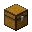

---
<!-- blast_furnace__from__crafting_shaped__use__smooth_stone.md -->

<!-- zh_cn -->

## 高炉 | 工作台: 有序 | 平滑石头

<table>
	<tablebody>
		<tr>
			<td colspan="5">工作台: 有序</td>
		</tr>
		<tr>
			<td></td>
			<td></td>
			<td></td>
			<td colspan="2"></td>
		</tr>
		<tr>
			<td></td>
			<td></td>
			<td></td>
			<td></td>
			<td></td>
		</tr>
		<tr>
			<td></td>
			<td></td>
			<td></td>
			<td colspan="2"></td>
		</tr>
	</tablebody>
</table>
<table>
	<tablebody>
		<tr>
			<td></td>
			<td>图标</td>
			<td>名称</td>
			<td>标签</td>
			<td>数量</td>
		</tr>
		<tr>
			<td></td>
			<td></td>
			<td>高炉</td>
			<td>blast_furnace</td>
			<td>1</td>
		</tr>
		<tr>
			<td></td>
			<td></td>
			<td>平滑石头</td>
			<td>smooth_stone</td>
			<td>3</td>
		</tr>
		<tr>
			<td></td>
			<td></td>
			<td>熔炉</td>
			<td>furnace</td>
			<td>1</td>
		</tr>
		<tr>
			<td rowspan="2"></td>
			<td></td>
			<td>铁锭</td>
			<td>iron_ingot</td>
			<td rowspan="2">5</td>
		</tr>
		<tr>
			<td></td>
			<td>铜锭</td>
			<td>copper_ingot</td>
		</tr>
	</tablebody>
</table>

---
<!-- chest__from__stonecutting__use__trapped_chest.md -->

<!-- zh_cn -->

## 箱子 | 切石机 | 陷阱箱

<table>
	<tablebody>
		<tr>
			<td colspan="6">切石机</td>
		</tr>
		<tr>
			<td colspan="2"></td>
			<td></td>
			<td></td>
			<td></td>
			<td></td>
		</tr>
		<tr>
			<td></td>
			<td></td>
			<td></td>
			<td></td>
			<td></td>
			<td></td>
		</tr>
		<tr>
			<td colspan="2"></td>
			<td></td>
			<td></td>
			<td></td>
			<td></td>
		</tr>
	</tablebody>
</table>
<table>
	<tablebody>
		<tr>
			<td></td>
			<td>图标</td>
			<td>名称</td>
			<td>标签</td>
			<td>数量</td>
		</tr>
		<tr>
			<td></td>
			<td></td>
			<td>陷阱箱</td>
			<td>trapped_chest</td>
			<td>1</td>
		</tr>
		<tr>
			<td></td>
			<td></td>
			<td>箱子</td>
			<td>chest</td>
			<td>1</td>
		</tr>
	</tablebody>
</table>

---
<!-- barrel__from__crafting_shaped__use__tag_planks.md -->

<!-- zh_cn -->

## 木桶 | 工作台: 有序 | 木板

<table>
	<tablebody>
		<tr>
			<td colspan="5">工作台: 有序</td>
		</tr>
		<tr>
			<td></td>
			<td></td>
			<td></td>
			<td colspan="2"></td>
		</tr>
		<tr>
			<td></td>
			<td></td>
			<td></td>
			<td></td>
			<td></td>
		</tr>
		<tr>
			<td></td>
			<td></td>
			<td></td>
			<td colspan="2"></td>
		</tr>
	</tablebody>
</table>
<table>
	<tablebody>
		<tr>
			<td></td>
			<td>图标</td>
			<td>名称</td>
			<td>标签</td>
			<td>数量</td>
		</tr>
		<tr>
			<td></td>
			<td></td>
			<td>木桶</td>
			<td>barrel</td>
			<td>1</td>
		</tr>
		<tr>
			<td rowspan="2"></td>
			<td></td>
			<td><a>木板</a></td>
			<td><a>planks</a></td>
			<td rowspan="2">6</td>
		</tr>
		<tr>
			<td></td>
			<td>木棍</td>
			<td>stick</td>
		</tr>
		<tr>
			<td></td>
			<td></td>
			<td><a>木台阶</a></td>
			<td><a>wooden_slabs</a></td>
			<td>2</td>
		</tr>
	</tablebody>
</table>

[木台阶](../../../zh_cn/tags/tag__wooden_slabs.md)

---
<!-- shulker_box__from__crafting_shaped__use__popped_chorus_fruit.md -->

<!-- zh_cn -->

## 潜影盒 | 工作台: 有序 | 爆裂紫颂果

<table>
	<tablebody>
		<tr>
			<td colspan="5">工作台: 有序</td>
		</tr>
		<tr>
			<td></td>
			<td></td>
			<td></td>
			<td colspan="2"></td>
		</tr>
		<tr>
			<td></td>
			<td></td>
			<td></td>
			<td></td>
			<td></td>
		</tr>
		<tr>
			<td></td>
			<td></td>
			<td></td>
			<td colspan="2"></td>
		</tr>
	</tablebody>
</table>
<table>
	<tablebody>
		<tr>
			<td></td>
			<td>图标</td>
			<td>名称</td>
			<td>标签</td>
			<td>数量</td>
		</tr>
		<tr>
			<td></td>
			<td></td>
			<td>潜影盒</td>
			<td>shulker_box</td>
			<td>1</td>
		</tr>
		<tr>
			<td></td>
			<td></td>
			<td>爆裂紫颂果</td>
			<td>popped_chorus_fruit</td>
			<td>8</td>
		</tr>
		<tr>
			<td></td>
			<td></td>
			<td>木桶</td>
			<td>barrel</td>
			<td>1</td>
		</tr>
	</tablebody>
</table>

---
<!-- scaffolding__from__crafting_shaped__use__string.md -->

<!-- zh_cn -->

## 脚手架 | 工作台: 有序 | 线

<table>
	<tablebody>
		<tr>
			<td colspan="5">工作台: 有序</td>
		</tr>
		<tr>
			<td></td>
			<td></td>
			<td></td>
			<td colspan="2"></td>
		</tr>
		<tr>
			<td></td>
			<td></td>
			<td></td>
			<td></td>
			<td></td>
		</tr>
		<tr>
			<td></td>
			<td></td>
			<td></td>
			<td colspan="2"></td>
		</tr>
	</tablebody>
</table>
<table>
	<tablebody>
		<tr>
			<td></td>
			<td>图标</td>
			<td>名称</td>
			<td>标签</td>
			<td>数量</td>
		</tr>
		<tr>
			<td></td>
			<td></td>
			<td>脚手架</td>
			<td>scaffolding</td>
			<td>6</td>
		</tr>
		<tr>
			<td></td>
			<td></td>
			<td>线</td>
			<td>string</td>
			<td>1</td>
		</tr>
		<tr>
			<td rowspan="2"></td>
			<td></td>
			<td>竹子</td>
			<td>bamboo</td>
			<td rowspan="2">6</td>
		</tr>
		<tr>
			<td></td>
			<td>木棍</td>
			<td>stick</td>
		</tr>
	</tablebody>
</table>

---
<!-- bell__from__crafting_shaped__use__stick.md -->

<!-- zh_cn -->

## 钟 | 工作台: 有序 | 木棍

<table>
	<tablebody>
		<tr>
			<td colspan="5">工作台: 有序</td>
		</tr>
		<tr>
			<td></td>
			<td></td>
			<td></td>
			<td colspan="2"></td>
		</tr>
		<tr>
			<td></td>
			<td></td>
			<td></td>
			<td></td>
			<td></td>
		</tr>
		<tr>
			<td></td>
			<td></td>
			<td></td>
			<td colspan="2"></td>
		</tr>
	</tablebody>
</table>
<table>
	<tablebody>
		<tr>
			<td></td>
			<td>图标</td>
			<td>名称</td>
			<td>标签</td>
			<td>数量</td>
		</tr>
		<tr>
			<td></td>
			<td></td>
			<td>钟</td>
			<td>bell</td>
			<td>1</td>
		</tr>
		<tr>
			<td></td>
			<td></td>
			<td>木棍</td>
			<td>stick</td>
			<td>3</td>
		</tr>
		<tr>
			<td></td>
			<td></td>
			<td>金锭</td>
			<td>gold_ingot</td>
			<td>5</td>
		</tr>
	</tablebody>
</table>

---
<!-- pointed_dripstone__from__crafting_shapeless__use__dripstone_block.md -->

<!-- zh_cn -->

## 滴水石锥 | 工作台: 无序 | 滴水石块

<table>
	<tablebody>
		<tr>
			<td colspan="5">工作台: 无序</td>
		</tr>
		<tr>
			<td></td>
			<td></td>
			<td></td>
			<td colspan="2"></td>
		</tr>
		<tr>
			<td></td>
			<td></td>
			<td></td>
			<td></td>
			<td></td>
		</tr>
		<tr>
			<td></td>
			<td></td>
			<td></td>
			<td colspan="2"></td>
		</tr>
	</tablebody>
</table>
<table>
	<tablebody>
		<tr>
			<td></td>
			<td>图标</td>
			<td>名称</td>
			<td>标签</td>
			<td>数量</td>
		</tr>
		<tr>
			<td></td>
			<td></td>
			<td>滴水石锥</td>
			<td>pointed_dripstone</td>
			<td>4</td>
		</tr>
		<tr>
			<td></td>
			<td></td>
			<td>滴水石块</td>
			<td>dripstone_block</td>
			<td>1</td>
		</tr>
	</tablebody>
</table>

