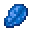

---
<!-- amethyst_shard__from__crafting_shaped__use__lapis_lazuli.md -->

<!-- zh_cn -->

## 紫水晶碎片 | 工作台: 有序 | 青金石

<table>
	<tablebody>
		<tr>
			<td colspan="5">工作台: 有序</td>
		</tr>
		<tr>
			<td></td>
			<td></td>
			<td></td>
			<td colspan="2"></td>
		</tr>
		<tr>
			<td></td>
			<td></td>
			<td></td>
			<td></td>
			<td></td>
		</tr>
		<tr>
			<td></td>
			<td></td>
			<td></td>
			<td colspan="2"></td>
		</tr>
	</tablebody>
</table>
<table>
	<tablebody>
		<tr>
			<td></td>
			<td>图标</td>
			<td>名称</td>
			<td>标签</td>
			<td>数量</td>
		</tr>
		<tr>
			<td></td>
			<td></td>
			<td>紫水晶碎片</td>
			<td>amethyst_shard</td>
			<td>1</td>
		</tr>
		<tr>
			<td></td>
			<td></td>
			<td>青金石</td>
			<td>lapis_lazuli</td>
			<td>5</td>
		</tr>
	</tablebody>
</table>

---
<!-- lapis_lazuli__from__crafting_shapeless__use__amethyst_shard.md -->

<!-- zh_cn -->

## 青金石 | 工作台: 无序 | 紫水晶碎片

<table>
	<tablebody>
		<tr>
			<td colspan="5">工作台: 无序</td>
		</tr>
		<tr>
			<td></td>
			<td></td>
			<td></td>
			<td colspan="2"></td>
		</tr>
		<tr>
			<td></td>
			<td></td>
			<td></td>
			<td></td>
			<td></td>
		</tr>
		<tr>
			<td></td>
			<td></td>
			<td></td>
			<td colspan="2"></td>
		</tr>
	</tablebody>
</table>
<table>
	<tablebody>
		<tr>
			<td></td>
			<td>图标</td>
			<td>名称</td>
			<td>标签</td>
			<td>数量</td>
		</tr>
		<tr>
			<td></td>
			<td></td>
			<td>青金石</td>
			<td>lapis_lazuli</td>
			<td>5</td>
		</tr>
		<tr>
			<td></td>
			<td></td>
			<td>紫水晶碎片</td>
			<td>amethyst_shard</td>
			<td>1</td>
		</tr>
	</tablebody>
</table>

