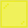

---
<!-- black_stained_glass_pane__from__crafting_shaped__use__tag_stained_glass_pane.md -->

<!-- zh_cn -->

## 黑色染色玻璃板 | 工作台: 有序 | 染色玻璃板

<table>
	<tablebody>
		<tr>
			<td colspan="5">工作台: 有序</td>
		</tr>
		<tr>
			<td></td>
			<td></td>
			<td></td>
			<td colspan="2"></td>
		</tr>
		<tr>
			<td></td>
			<td></td>
			<td></td>
			<td></td>
			<td></td>
		</tr>
		<tr>
			<td></td>
			<td></td>
			<td></td>
			<td colspan="2"></td>
		</tr>
	</tablebody>
</table>
<table>
	<tablebody>
		<tr>
			<td></td>
			<td>图标</td>
			<td>名称</td>
			<td>标签</td>
			<td>数量</td>
		</tr>
		<tr>
			<td></td>
			<td></td>
			<td>黑色染色玻璃板</td>
			<td>black_stained_glass_pane</td>
			<td>8</td>
		</tr>
		<tr>
			<td rowspan="2"></td>
			<td></td>
			<td><a>染色玻璃板</a></td>
			<td><a>stained_glass_pane</a></td>
			<td rowspan="2">8</td>
		</tr>
		<tr>
			<td></td>
			<td>玻璃板</td>
			<td>glass_pane</td>
		</tr>
		<tr>
			<td></td>
			<td></td>
			<td>黑色染料</td>
			<td>black_dye</td>
			<td>1</td>
		</tr>
	</tablebody>
</table>

[染色玻璃板](../../../zh_cn/tags/tag__stained_glass_pane.md)

---
<!-- blue_stained_glass_pane__from__crafting_shaped__use__tag_stained_glass_pane.md -->

<!-- zh_cn -->

## 蓝色染色玻璃板 | 工作台: 有序 | 染色玻璃板

<table>
	<tablebody>
		<tr>
			<td colspan="5">工作台: 有序</td>
		</tr>
		<tr>
			<td></td>
			<td></td>
			<td></td>
			<td colspan="2"></td>
		</tr>
		<tr>
			<td></td>
			<td></td>
			<td></td>
			<td></td>
			<td></td>
		</tr>
		<tr>
			<td></td>
			<td></td>
			<td></td>
			<td colspan="2"></td>
		</tr>
	</tablebody>
</table>
<table>
	<tablebody>
		<tr>
			<td></td>
			<td>图标</td>
			<td>名称</td>
			<td>标签</td>
			<td>数量</td>
		</tr>
		<tr>
			<td></td>
			<td></td>
			<td>蓝色染色玻璃板</td>
			<td>blue_stained_glass_pane</td>
			<td>8</td>
		</tr>
		<tr>
			<td rowspan="2"></td>
			<td></td>
			<td><a>染色玻璃板</a></td>
			<td><a>stained_glass_pane</a></td>
			<td rowspan="2">8</td>
		</tr>
		<tr>
			<td></td>
			<td>玻璃板</td>
			<td>glass_pane</td>
		</tr>
		<tr>
			<td></td>
			<td></td>
			<td>蓝色染料</td>
			<td>blue_dye</td>
			<td>1</td>
		</tr>
	</tablebody>
</table>

[染色玻璃板](../../../zh_cn/tags/tag__stained_glass_pane.md)

---
<!-- brown_stained_glass_pane__from__crafting_shaped__use__tag_stained_glass_pane.md -->

<!-- zh_cn -->

## 棕色染色玻璃板 | 工作台: 有序 | 染色玻璃板

<table>
	<tablebody>
		<tr>
			<td colspan="5">工作台: 有序</td>
		</tr>
		<tr>
			<td></td>
			<td></td>
			<td></td>
			<td colspan="2"></td>
		</tr>
		<tr>
			<td></td>
			<td></td>
			<td></td>
			<td></td>
			<td></td>
		</tr>
		<tr>
			<td></td>
			<td></td>
			<td></td>
			<td colspan="2"></td>
		</tr>
	</tablebody>
</table>
<table>
	<tablebody>
		<tr>
			<td></td>
			<td>图标</td>
			<td>名称</td>
			<td>标签</td>
			<td>数量</td>
		</tr>
		<tr>
			<td></td>
			<td></td>
			<td>棕色染色玻璃板</td>
			<td>brown_stained_glass_pane</td>
			<td>8</td>
		</tr>
		<tr>
			<td rowspan="2"></td>
			<td></td>
			<td><a>染色玻璃板</a></td>
			<td><a>stained_glass_pane</a></td>
			<td rowspan="2">8</td>
		</tr>
		<tr>
			<td></td>
			<td>玻璃板</td>
			<td>glass_pane</td>
		</tr>
		<tr>
			<td></td>
			<td></td>
			<td>棕色染料</td>
			<td>brown_dye</td>
			<td>1</td>
		</tr>
	</tablebody>
</table>

[染色玻璃板](../../../zh_cn/tags/tag__stained_glass_pane.md)

---
<!-- cyan_stained_glass_pane__from__crafting_shaped__use__tag_stained_glass_pane.md -->

<!-- zh_cn -->

## 青色染色玻璃板 | 工作台: 有序 | 染色玻璃板

<table>
	<tablebody>
		<tr>
			<td colspan="5">工作台: 有序</td>
		</tr>
		<tr>
			<td></td>
			<td></td>
			<td></td>
			<td colspan="2"></td>
		</tr>
		<tr>
			<td></td>
			<td></td>
			<td></td>
			<td></td>
			<td></td>
		</tr>
		<tr>
			<td></td>
			<td></td>
			<td></td>
			<td colspan="2"></td>
		</tr>
	</tablebody>
</table>
<table>
	<tablebody>
		<tr>
			<td></td>
			<td>图标</td>
			<td>名称</td>
			<td>标签</td>
			<td>数量</td>
		</tr>
		<tr>
			<td></td>
			<td></td>
			<td>青色染色玻璃板</td>
			<td>cyan_stained_glass_pane</td>
			<td>8</td>
		</tr>
		<tr>
			<td rowspan="2"></td>
			<td></td>
			<td><a>染色玻璃板</a></td>
			<td><a>stained_glass_pane</a></td>
			<td rowspan="2">8</td>
		</tr>
		<tr>
			<td></td>
			<td>玻璃板</td>
			<td>glass_pane</td>
		</tr>
		<tr>
			<td></td>
			<td></td>
			<td>青色染料</td>
			<td>cyan_dye</td>
			<td>1</td>
		</tr>
	</tablebody>
</table>

[染色玻璃板](../../../zh_cn/tags/tag__stained_glass_pane.md)

---
<!-- gray_stained_glass_pane__from__crafting_shaped__use__tag_stained_glass_pane.md -->

<!-- zh_cn -->

## 灰色染色玻璃板 | 工作台: 有序 | 染色玻璃板

<table>
	<tablebody>
		<tr>
			<td colspan="5">工作台: 有序</td>
		</tr>
		<tr>
			<td></td>
			<td></td>
			<td></td>
			<td colspan="2"></td>
		</tr>
		<tr>
			<td></td>
			<td></td>
			<td></td>
			<td></td>
			<td></td>
		</tr>
		<tr>
			<td></td>
			<td></td>
			<td></td>
			<td colspan="2"></td>
		</tr>
	</tablebody>
</table>
<table>
	<tablebody>
		<tr>
			<td></td>
			<td>图标</td>
			<td>名称</td>
			<td>标签</td>
			<td>数量</td>
		</tr>
		<tr>
			<td></td>
			<td></td>
			<td>灰色染色玻璃板</td>
			<td>gray_stained_glass_pane</td>
			<td>8</td>
		</tr>
		<tr>
			<td rowspan="2"></td>
			<td></td>
			<td><a>染色玻璃板</a></td>
			<td><a>stained_glass_pane</a></td>
			<td rowspan="2">8</td>
		</tr>
		<tr>
			<td></td>
			<td>玻璃板</td>
			<td>glass_pane</td>
		</tr>
		<tr>
			<td></td>
			<td></td>
			<td>灰色染料</td>
			<td>gray_dye</td>
			<td>1</td>
		</tr>
	</tablebody>
</table>

[染色玻璃板](../../../zh_cn/tags/tag__stained_glass_pane.md)

---
<!-- green_stained_glass_pane__from__crafting_shaped__use__tag_stained_glass_pane.md -->

<!-- zh_cn -->

## 绿色染色玻璃板 | 工作台: 有序 | 染色玻璃板

<table>
	<tablebody>
		<tr>
			<td colspan="5">工作台: 有序</td>
		</tr>
		<tr>
			<td></td>
			<td></td>
			<td></td>
			<td colspan="2"></td>
		</tr>
		<tr>
			<td></td>
			<td></td>
			<td></td>
			<td></td>
			<td></td>
		</tr>
		<tr>
			<td></td>
			<td></td>
			<td></td>
			<td colspan="2"></td>
		</tr>
	</tablebody>
</table>
<table>
	<tablebody>
		<tr>
			<td></td>
			<td>图标</td>
			<td>名称</td>
			<td>标签</td>
			<td>数量</td>
		</tr>
		<tr>
			<td></td>
			<td></td>
			<td>绿色染色玻璃板</td>
			<td>green_stained_glass_pane</td>
			<td>8</td>
		</tr>
		<tr>
			<td rowspan="2"></td>
			<td></td>
			<td><a>染色玻璃板</a></td>
			<td><a>stained_glass_pane</a></td>
			<td rowspan="2">8</td>
		</tr>
		<tr>
			<td></td>
			<td>玻璃板</td>
			<td>glass_pane</td>
		</tr>
		<tr>
			<td></td>
			<td></td>
			<td>绿色染料</td>
			<td>green_dye</td>
			<td>1</td>
		</tr>
	</tablebody>
</table>

[染色玻璃板](../../../zh_cn/tags/tag__stained_glass_pane.md)

---
<!-- light_blue_stained_glass_pane__from__crafting_shaped__use__tag_stained_glass_pane.md -->

<!-- zh_cn -->

## 淡蓝色染色玻璃板 | 工作台: 有序 | 染色玻璃板

<table>
	<tablebody>
		<tr>
			<td colspan="5">工作台: 有序</td>
		</tr>
		<tr>
			<td></td>
			<td></td>
			<td></td>
			<td colspan="2"></td>
		</tr>
		<tr>
			<td></td>
			<td></td>
			<td></td>
			<td></td>
			<td></td>
		</tr>
		<tr>
			<td></td>
			<td></td>
			<td></td>
			<td colspan="2"></td>
		</tr>
	</tablebody>
</table>
<table>
	<tablebody>
		<tr>
			<td></td>
			<td>图标</td>
			<td>名称</td>
			<td>标签</td>
			<td>数量</td>
		</tr>
		<tr>
			<td></td>
			<td></td>
			<td>淡蓝色染色玻璃板</td>
			<td>light_blue_stained_glass_pane</td>
			<td>8</td>
		</tr>
		<tr>
			<td rowspan="2"></td>
			<td></td>
			<td><a>染色玻璃板</a></td>
			<td><a>stained_glass_pane</a></td>
			<td rowspan="2">8</td>
		</tr>
		<tr>
			<td></td>
			<td>玻璃板</td>
			<td>glass_pane</td>
		</tr>
		<tr>
			<td></td>
			<td></td>
			<td>淡蓝色染料</td>
			<td>light_blue_dye</td>
			<td>1</td>
		</tr>
	</tablebody>
</table>

[染色玻璃板](../../../zh_cn/tags/tag__stained_glass_pane.md)

---
<!-- light_gray_stained_glass_pane__from__crafting_shaped__use__tag_stained_glass_pane.md -->

<!-- zh_cn -->

## 淡灰色染色玻璃板 | 工作台: 有序 | 染色玻璃板

<table>
	<tablebody>
		<tr>
			<td colspan="5">工作台: 有序</td>
		</tr>
		<tr>
			<td></td>
			<td></td>
			<td></td>
			<td colspan="2"></td>
		</tr>
		<tr>
			<td></td>
			<td></td>
			<td></td>
			<td></td>
			<td></td>
		</tr>
		<tr>
			<td></td>
			<td></td>
			<td></td>
			<td colspan="2"></td>
		</tr>
	</tablebody>
</table>
<table>
	<tablebody>
		<tr>
			<td></td>
			<td>图标</td>
			<td>名称</td>
			<td>标签</td>
			<td>数量</td>
		</tr>
		<tr>
			<td></td>
			<td></td>
			<td>淡灰色染色玻璃板</td>
			<td>light_gray_stained_glass_pane</td>
			<td>8</td>
		</tr>
		<tr>
			<td rowspan="2"></td>
			<td></td>
			<td><a>染色玻璃板</a></td>
			<td><a>stained_glass_pane</a></td>
			<td rowspan="2">8</td>
		</tr>
		<tr>
			<td></td>
			<td>玻璃板</td>
			<td>glass_pane</td>
		</tr>
		<tr>
			<td></td>
			<td></td>
			<td>淡灰色染料</td>
			<td>light_gray_dye</td>
			<td>1</td>
		</tr>
	</tablebody>
</table>

[染色玻璃板](../../../zh_cn/tags/tag__stained_glass_pane.md)

---
<!-- lime_stained_glass_pane__from__crafting_shaped__use__tag_stained_glass_pane.md -->

<!-- zh_cn -->

## 黄绿色染色玻璃板 | 工作台: 有序 | 染色玻璃板

<table>
	<tablebody>
		<tr>
			<td colspan="5">工作台: 有序</td>
		</tr>
		<tr>
			<td></td>
			<td></td>
			<td></td>
			<td colspan="2"></td>
		</tr>
		<tr>
			<td></td>
			<td></td>
			<td></td>
			<td></td>
			<td></td>
		</tr>
		<tr>
			<td></td>
			<td></td>
			<td></td>
			<td colspan="2"></td>
		</tr>
	</tablebody>
</table>
<table>
	<tablebody>
		<tr>
			<td></td>
			<td>图标</td>
			<td>名称</td>
			<td>标签</td>
			<td>数量</td>
		</tr>
		<tr>
			<td></td>
			<td></td>
			<td>黄绿色染色玻璃板</td>
			<td>lime_stained_glass_pane</td>
			<td>8</td>
		</tr>
		<tr>
			<td rowspan="2"></td>
			<td></td>
			<td><a>染色玻璃板</a></td>
			<td><a>stained_glass_pane</a></td>
			<td rowspan="2">8</td>
		</tr>
		<tr>
			<td></td>
			<td>玻璃板</td>
			<td>glass_pane</td>
		</tr>
		<tr>
			<td></td>
			<td></td>
			<td>黄绿色染料</td>
			<td>lime_dye</td>
			<td>1</td>
		</tr>
	</tablebody>
</table>

[染色玻璃板](../../../zh_cn/tags/tag__stained_glass_pane.md)

---
<!-- magenta_stained_glass_pane__from__crafting_shaped__use__tag_stained_glass_pane.md -->

<!-- zh_cn -->

## 品红色染色玻璃板 | 工作台: 有序 | 染色玻璃板

<table>
	<tablebody>
		<tr>
			<td colspan="5">工作台: 有序</td>
		</tr>
		<tr>
			<td></td>
			<td></td>
			<td></td>
			<td colspan="2"></td>
		</tr>
		<tr>
			<td></td>
			<td></td>
			<td></td>
			<td></td>
			<td></td>
		</tr>
		<tr>
			<td></td>
			<td></td>
			<td></td>
			<td colspan="2"></td>
		</tr>
	</tablebody>
</table>
<table>
	<tablebody>
		<tr>
			<td></td>
			<td>图标</td>
			<td>名称</td>
			<td>标签</td>
			<td>数量</td>
		</tr>
		<tr>
			<td></td>
			<td></td>
			<td>品红色染色玻璃板</td>
			<td>magenta_stained_glass_pane</td>
			<td>8</td>
		</tr>
		<tr>
			<td rowspan="2"></td>
			<td></td>
			<td><a>染色玻璃板</a></td>
			<td><a>stained_glass_pane</a></td>
			<td rowspan="2">8</td>
		</tr>
		<tr>
			<td></td>
			<td>玻璃板</td>
			<td>glass_pane</td>
		</tr>
		<tr>
			<td></td>
			<td></td>
			<td>品红色染料</td>
			<td>magenta_dye</td>
			<td>1</td>
		</tr>
	</tablebody>
</table>

[染色玻璃板](../../../zh_cn/tags/tag__stained_glass_pane.md)

---
<!-- orange_stained_glass_pane__from__crafting_shaped__use__tag_stained_glass_pane.md -->

<!-- zh_cn -->

## 橙色染色玻璃板 | 工作台: 有序 | 染色玻璃板

<table>
	<tablebody>
		<tr>
			<td colspan="5">工作台: 有序</td>
		</tr>
		<tr>
			<td></td>
			<td></td>
			<td></td>
			<td colspan="2"></td>
		</tr>
		<tr>
			<td></td>
			<td></td>
			<td></td>
			<td></td>
			<td></td>
		</tr>
		<tr>
			<td></td>
			<td></td>
			<td></td>
			<td colspan="2"></td>
		</tr>
	</tablebody>
</table>
<table>
	<tablebody>
		<tr>
			<td></td>
			<td>图标</td>
			<td>名称</td>
			<td>标签</td>
			<td>数量</td>
		</tr>
		<tr>
			<td></td>
			<td></td>
			<td>橙色染色玻璃板</td>
			<td>orange_stained_glass_pane</td>
			<td>8</td>
		</tr>
		<tr>
			<td rowspan="2"></td>
			<td></td>
			<td><a>染色玻璃板</a></td>
			<td><a>stained_glass_pane</a></td>
			<td rowspan="2">8</td>
		</tr>
		<tr>
			<td></td>
			<td>玻璃板</td>
			<td>glass_pane</td>
		</tr>
		<tr>
			<td></td>
			<td></td>
			<td>橙色染料</td>
			<td>orange_dye</td>
			<td>1</td>
		</tr>
	</tablebody>
</table>

[染色玻璃板](../../../zh_cn/tags/tag__stained_glass_pane.md)

---
<!-- pink_stained_glass_pane__from__crafting_shaped__use__tag_stained_glass_pane.md -->

<!-- zh_cn -->

## 粉红色染色玻璃板 | 工作台: 有序 | 染色玻璃板

<table>
	<tablebody>
		<tr>
			<td colspan="5">工作台: 有序</td>
		</tr>
		<tr>
			<td></td>
			<td></td>
			<td></td>
			<td colspan="2"></td>
		</tr>
		<tr>
			<td></td>
			<td></td>
			<td></td>
			<td></td>
			<td></td>
		</tr>
		<tr>
			<td></td>
			<td></td>
			<td></td>
			<td colspan="2"></td>
		</tr>
	</tablebody>
</table>
<table>
	<tablebody>
		<tr>
			<td></td>
			<td>图标</td>
			<td>名称</td>
			<td>标签</td>
			<td>数量</td>
		</tr>
		<tr>
			<td></td>
			<td></td>
			<td>粉红色染色玻璃板</td>
			<td>pink_stained_glass_pane</td>
			<td>8</td>
		</tr>
		<tr>
			<td rowspan="2"></td>
			<td></td>
			<td><a>染色玻璃板</a></td>
			<td><a>stained_glass_pane</a></td>
			<td rowspan="2">8</td>
		</tr>
		<tr>
			<td></td>
			<td>玻璃板</td>
			<td>glass_pane</td>
		</tr>
		<tr>
			<td></td>
			<td></td>
			<td>粉红色染料</td>
			<td>pink_dye</td>
			<td>1</td>
		</tr>
	</tablebody>
</table>

[染色玻璃板](../../../zh_cn/tags/tag__stained_glass_pane.md)

---
<!-- purple_stained_glass_pane__from__crafting_shaped__use__tag_stained_glass_pane.md -->

<!-- zh_cn -->

## 紫色染色玻璃板 | 工作台: 有序 | 染色玻璃板

<table>
	<tablebody>
		<tr>
			<td colspan="5">工作台: 有序</td>
		</tr>
		<tr>
			<td></td>
			<td></td>
			<td></td>
			<td colspan="2"></td>
		</tr>
		<tr>
			<td></td>
			<td></td>
			<td></td>
			<td></td>
			<td></td>
		</tr>
		<tr>
			<td></td>
			<td></td>
			<td></td>
			<td colspan="2"></td>
		</tr>
	</tablebody>
</table>
<table>
	<tablebody>
		<tr>
			<td></td>
			<td>图标</td>
			<td>名称</td>
			<td>标签</td>
			<td>数量</td>
		</tr>
		<tr>
			<td></td>
			<td></td>
			<td>紫色染色玻璃板</td>
			<td>purple_stained_glass_pane</td>
			<td>8</td>
		</tr>
		<tr>
			<td rowspan="2"></td>
			<td></td>
			<td><a>染色玻璃板</a></td>
			<td><a>stained_glass_pane</a></td>
			<td rowspan="2">8</td>
		</tr>
		<tr>
			<td></td>
			<td>玻璃板</td>
			<td>glass_pane</td>
		</tr>
		<tr>
			<td></td>
			<td></td>
			<td>紫色染料</td>
			<td>purple_dye</td>
			<td>1</td>
		</tr>
	</tablebody>
</table>

[染色玻璃板](../../../zh_cn/tags/tag__stained_glass_pane.md)

---
<!-- red_stained_glass_pane__from__crafting_shaped__use__tag_stained_glass_pane.md -->

<!-- zh_cn -->

## 红色染色玻璃板 | 工作台: 有序 | 染色玻璃板

<table>
	<tablebody>
		<tr>
			<td colspan="5">工作台: 有序</td>
		</tr>
		<tr>
			<td></td>
			<td></td>
			<td></td>
			<td colspan="2"></td>
		</tr>
		<tr>
			<td></td>
			<td></td>
			<td></td>
			<td></td>
			<td></td>
		</tr>
		<tr>
			<td></td>
			<td></td>
			<td></td>
			<td colspan="2"></td>
		</tr>
	</tablebody>
</table>
<table>
	<tablebody>
		<tr>
			<td></td>
			<td>图标</td>
			<td>名称</td>
			<td>标签</td>
			<td>数量</td>
		</tr>
		<tr>
			<td></td>
			<td></td>
			<td>红色染色玻璃板</td>
			<td>red_stained_glass_pane</td>
			<td>8</td>
		</tr>
		<tr>
			<td rowspan="2"></td>
			<td></td>
			<td><a>染色玻璃板</a></td>
			<td><a>stained_glass_pane</a></td>
			<td rowspan="2">8</td>
		</tr>
		<tr>
			<td></td>
			<td>玻璃板</td>
			<td>glass_pane</td>
		</tr>
		<tr>
			<td></td>
			<td></td>
			<td>红色染料</td>
			<td>red_dye</td>
			<td>1</td>
		</tr>
	</tablebody>
</table>

[染色玻璃板](../../../zh_cn/tags/tag__stained_glass_pane.md)

---
<!-- white_stained_glass_pane__from__crafting_shaped__use__tag_stained_glass_pane.md -->

<!-- zh_cn -->

## 白色染色玻璃板 | 工作台: 有序 | 染色玻璃板

<table>
	<tablebody>
		<tr>
			<td colspan="5">工作台: 有序</td>
		</tr>
		<tr>
			<td></td>
			<td></td>
			<td></td>
			<td colspan="2"></td>
		</tr>
		<tr>
			<td></td>
			<td></td>
			<td></td>
			<td></td>
			<td></td>
		</tr>
		<tr>
			<td></td>
			<td></td>
			<td></td>
			<td colspan="2"></td>
		</tr>
	</tablebody>
</table>
<table>
	<tablebody>
		<tr>
			<td></td>
			<td>图标</td>
			<td>名称</td>
			<td>标签</td>
			<td>数量</td>
		</tr>
		<tr>
			<td></td>
			<td></td>
			<td>白色染色玻璃板</td>
			<td>white_stained_glass_pane</td>
			<td>8</td>
		</tr>
		<tr>
			<td rowspan="2"></td>
			<td></td>
			<td><a>染色玻璃板</a></td>
			<td><a>stained_glass_pane</a></td>
			<td rowspan="2">8</td>
		</tr>
		<tr>
			<td></td>
			<td>玻璃板</td>
			<td>glass_pane</td>
		</tr>
		<tr>
			<td></td>
			<td></td>
			<td>白色染料</td>
			<td>white_dye</td>
			<td>1</td>
		</tr>
	</tablebody>
</table>

[染色玻璃板](../../../zh_cn/tags/tag__stained_glass_pane.md)

---
<!-- yellow_stained_glass_pane__from__crafting_shaped__use__tag_stained_glass_pane.md -->

<!-- zh_cn -->

## 黄色染色玻璃板 | 工作台: 有序 | 染色玻璃板

<table>
	<tablebody>
		<tr>
			<td colspan="5">工作台: 有序</td>
		</tr>
		<tr>
			<td></td>
			<td></td>
			<td></td>
			<td colspan="2"></td>
		</tr>
		<tr>
			<td></td>
			<td></td>
			<td></td>
			<td></td>
			<td></td>
		</tr>
		<tr>
			<td></td>
			<td></td>
			<td></td>
			<td colspan="2"></td>
		</tr>
	</tablebody>
</table>
<table>
	<tablebody>
		<tr>
			<td></td>
			<td>图标</td>
			<td>名称</td>
			<td>标签</td>
			<td>数量</td>
		</tr>
		<tr>
			<td></td>
			<td></td>
			<td>黄色染色玻璃板</td>
			<td>yellow_stained_glass_pane</td>
			<td>8</td>
		</tr>
		<tr>
			<td rowspan="2"></td>
			<td></td>
			<td><a>染色玻璃板</a></td>
			<td><a>stained_glass_pane</a></td>
			<td rowspan="2">8</td>
		</tr>
		<tr>
			<td></td>
			<td>玻璃板</td>
			<td>glass_pane</td>
		</tr>
		<tr>
			<td></td>
			<td></td>
			<td>黄色染料</td>
			<td>yellow_dye</td>
			<td>1</td>
		</tr>
	</tablebody>
</table>

[染色玻璃板](../../../zh_cn/tags/tag__stained_glass_pane.md)

