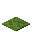
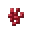

---
<!-- lily_pad__from__crafting_shapeless__use__lily_pad.md -->

<!-- zh_cn -->

## 睡莲 | 工作台: 无序 | 睡莲

<table>
	<tablebody>
		<tr>
			<td colspan="5">工作台: 无序</td>
		</tr>
		<tr>
			<td></td>
			<td></td>
			<td></td>
			<td colspan="2"></td>
		</tr>
		<tr>
			<td></td>
			<td></td>
			<td></td>
			<td></td>
			<td></td>
		</tr>
		<tr>
			<td></td>
			<td></td>
			<td></td>
			<td colspan="2"></td>
		</tr>
	</tablebody>
</table>
<table>
	<tablebody>
		<tr>
			<td></td>
			<td>图标</td>
			<td>名称</td>
			<td>标签</td>
			<td>数量</td>
		</tr>
		<tr>
			<td></td>
			<td></td>
			<td>睡莲</td>
			<td>lily_pad</td>
			<td>64</td>
		</tr>
		<tr>
			<td></td>
			<td></td>
			<td>睡莲</td>
			<td>lily_pad</td>
			<td>1</td>
		</tr>
		<tr>
			<td></td>
			<td></td>
			<td>骨粉</td>
			<td>bone_meal</td>
			<td>1</td>
		</tr>
	</tablebody>
</table>

---
<!-- moss_block__from__crafting_shaped__use__moss_carpet.md -->

<!-- zh_cn -->

## 苔藓块 | 工作台: 有序 | 苔藓地毯

<table>
	<tablebody>
		<tr>
			<td colspan="5">工作台: 有序</td>
		</tr>
		<tr>
			<td></td>
			<td></td>
			<td></td>
			<td colspan="2"></td>
		</tr>
		<tr>
			<td></td>
			<td></td>
			<td></td>
			<td></td>
			<td></td>
		</tr>
		<tr>
			<td></td>
			<td></td>
			<td></td>
			<td colspan="2"></td>
		</tr>
	</tablebody>
</table>
<table>
	<tablebody>
		<tr>
			<td></td>
			<td>图标</td>
			<td>名称</td>
			<td>标签</td>
			<td>数量</td>
		</tr>
		<tr>
			<td></td>
			<td></td>
			<td>苔藓块</td>
			<td>moss_block</td>
			<td>1</td>
		</tr>
		<tr>
			<td></td>
			<td></td>
			<td>苔藓地毯</td>
			<td>moss_carpet</td>
			<td>2</td>
		</tr>
	</tablebody>
</table>

---
<!-- nether_wart__from__crafting_shapeless__use__nether_wart_block.md -->

<!-- zh_cn -->

## 下界疣 | 工作台: 无序 | 下界疣块

<table>
	<tablebody>
		<tr>
			<td colspan="5">工作台: 无序</td>
		</tr>
		<tr>
			<td></td>
			<td></td>
			<td></td>
			<td colspan="2"></td>
		</tr>
		<tr>
			<td></td>
			<td></td>
			<td></td>
			<td></td>
			<td></td>
		</tr>
		<tr>
			<td></td>
			<td></td>
			<td></td>
			<td colspan="2"></td>
		</tr>
	</tablebody>
</table>
<table>
	<tablebody>
		<tr>
			<td></td>
			<td>图标</td>
			<td>名称</td>
			<td>标签</td>
			<td>数量</td>
		</tr>
		<tr>
			<td></td>
			<td></td>
			<td>下界疣</td>
			<td>nether_wart</td>
			<td>9</td>
		</tr>
		<tr>
			<td></td>
			<td></td>
			<td>下界疣块</td>
			<td>nether_wart_block</td>
			<td>1</td>
		</tr>
	</tablebody>
</table>

