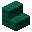
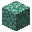
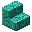
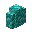
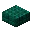
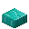
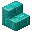

---
<!-- prismarine_crystals__from__crafting_shapeless__use__sea_lantern.md -->

<!-- zh_cn -->

## 海晶砂粒 | 工作台: 无序 | 海晶灯

<table>
	<tablebody>
		<tr>
			<td colspan="5">工作台: 无序</td>
		</tr>
		<tr>
			<td></td>
			<td></td>
			<td></td>
			<td colspan="2"></td>
		</tr>
		<tr>
			<td></td>
			<td></td>
			<td></td>
			<td></td>
			<td></td>
		</tr>
		<tr>
			<td></td>
			<td></td>
			<td></td>
			<td colspan="2"></td>
		</tr>
	</tablebody>
</table>
<table>
	<tablebody>
		<tr>
			<td></td>
			<td>图标</td>
			<td>名称</td>
			<td>标签</td>
			<td>数量</td>
		</tr>
		<tr>
			<td></td>
			<td></td>
			<td>海晶砂粒</td>
			<td>prismarine_crystals</td>
			<td>9</td>
		</tr>
		<tr>
			<td></td>
			<td></td>
			<td>海晶灯</td>
			<td>sea_lantern</td>
			<td>1</td>
		</tr>
	</tablebody>
</table>

---
<!-- prismarine_crystals__from__crafting_shapeless__use__prismarine_shard.md -->

<!-- zh_cn -->

## 海晶砂粒 | 工作台: 无序 | 海晶碎片

<table>
	<tablebody>
		<tr>
			<td colspan="5">工作台: 无序</td>
		</tr>
		<tr>
			<td></td>
			<td></td>
			<td></td>
			<td colspan="2"></td>
		</tr>
		<tr>
			<td></td>
			<td></td>
			<td></td>
			<td></td>
			<td></td>
		</tr>
		<tr>
			<td></td>
			<td></td>
			<td></td>
			<td colspan="2"></td>
		</tr>
	</tablebody>
</table>
<table>
	<tablebody>
		<tr>
			<td></td>
			<td>图标</td>
			<td>名称</td>
			<td>标签</td>
			<td>数量</td>
		</tr>
		<tr>
			<td></td>
			<td></td>
			<td>海晶砂粒</td>
			<td>prismarine_crystals</td>
			<td>1</td>
		</tr>
		<tr>
			<td></td>
			<td></td>
			<td>海晶碎片</td>
			<td>prismarine_shard</td>
			<td>1</td>
		</tr>
	</tablebody>
</table>

---
<!-- prismarine_shard__from__smelting__use__prismarine_crystals.md -->

<!-- zh_cn -->

## 海晶碎片 | 熔炉 | 海晶砂粒

<table>
	<tablebody>
		<tr>
			<td colspan="3">熔炉</td>
			<td>时长</td>
			<td>经验</td>
		</tr>
		<tr>
			<td></td>
			<td></td>
			<td></td>
			<td>100</td>
			<td>1</td>
		</tr>
	</tablebody>
</table>
<table>
	<tablebody>
		<tr>
			<td></td>
			<td>图标</td>
			<td>名称</td>
			<td>标签</td>
			<td>数量</td>
		</tr>
		<tr>
			<td></td>
			<td></td>
			<td>海晶砂粒</td>
			<td>prismarine_crystals</td>
			<td>1</td>
		</tr>
		<tr>
			<td></td>
			<td></td>
			<td>海晶碎片</td>
			<td>prismarine_shard</td>
			<td>1</td>
		</tr>
	</tablebody>
</table>

---
<!-- prismarine_shard__from__blasting__use__prismarine_crystals.md -->

<!-- zh_cn -->

## 海晶碎片 | 高炉 | 海晶砂粒

<table>
	<tablebody>
		<tr>
			<td colspan="3">高炉</td>
			<td>时长</td>
			<td>经验</td>
		</tr>
		<tr>
			<td></td>
			<td></td>
			<td></td>
			<td>50</td>
			<td>1</td>
		</tr>
	</tablebody>
</table>
<table>
	<tablebody>
		<tr>
			<td></td>
			<td>图标</td>
			<td>名称</td>
			<td>标签</td>
			<td>数量</td>
		</tr>
		<tr>
			<td></td>
			<td></td>
			<td>海晶砂粒</td>
			<td>prismarine_crystals</td>
			<td>1</td>
		</tr>
		<tr>
			<td></td>
			<td></td>
			<td>海晶碎片</td>
			<td>prismarine_shard</td>
			<td>1</td>
		</tr>
	</tablebody>
</table>

---
<!-- prismarine_shard__from__crafting_shapeless__use__dark_prismarine.md -->

<!-- zh_cn -->

## 海晶碎片 | 工作台: 无序 | 暗海晶石

<table>
	<tablebody>
		<tr>
			<td colspan="5">工作台: 无序</td>
		</tr>
		<tr>
			<td></td>
			<td></td>
			<td></td>
			<td colspan="2"></td>
		</tr>
		<tr>
			<td></td>
			<td></td>
			<td></td>
			<td></td>
			<td></td>
		</tr>
		<tr>
			<td></td>
			<td></td>
			<td></td>
			<td colspan="2"></td>
		</tr>
	</tablebody>
</table>
<table>
	<tablebody>
		<tr>
			<td></td>
			<td>图标</td>
			<td>名称</td>
			<td>标签</td>
			<td>数量</td>
		</tr>
		<tr>
			<td></td>
			<td></td>
			<td>海晶碎片</td>
			<td>prismarine_shard</td>
			<td>8</td>
		</tr>
		<tr>
			<td rowspan="2"></td>
			<td></td>
			<td>暗海晶石</td>
			<td>dark_prismarine</td>
			<td rowspan="2">1</td>
		</tr>
		<tr>
			<td></td>
			<td>暗海晶石楼梯</td>
			<td>dark_prismarine_stairs</td>
		</tr>
	</tablebody>
</table>

---
<!-- prismarine_shard__from__crafting_shapeless__use__prismarine.md -->

<!-- zh_cn -->

## 海晶碎片 | 工作台: 无序 | 海晶石

<table>
	<tablebody>
		<tr>
			<td colspan="5">工作台: 无序</td>
		</tr>
		<tr>
			<td></td>
			<td></td>
			<td></td>
			<td colspan="2"></td>
		</tr>
		<tr>
			<td></td>
			<td></td>
			<td></td>
			<td></td>
			<td></td>
		</tr>
		<tr>
			<td></td>
			<td></td>
			<td></td>
			<td colspan="2"></td>
		</tr>
	</tablebody>
</table>
<table>
	<tablebody>
		<tr>
			<td></td>
			<td>图标</td>
			<td>名称</td>
			<td>标签</td>
			<td>数量</td>
		</tr>
		<tr>
			<td></td>
			<td></td>
			<td>海晶碎片</td>
			<td>prismarine_shard</td>
			<td>4</td>
		</tr>
		<tr>
			<td rowspan="5"></td>
			<td></td>
			<td>海晶石</td>
			<td>prismarine</td>
			<td rowspan="5">1</td>
		</tr>
		<tr>
			<td></td>
			<td>海晶石楼梯</td>
			<td>prismarine_stairs</td>
		</tr>
		<tr>
			<td></td>
			<td>海晶石墙</td>
			<td>prismarine_wall</td>
		</tr>
		<tr>
			<td></td>
			<td>暗海晶石台阶</td>
			<td>dark_prismarine_slab</td>
		</tr>
		<tr>
			<td></td>
			<td>海晶石砖台阶</td>
			<td>prismarine_brick_slab</td>
		</tr>
	</tablebody>
</table>

---
<!-- prismarine_shard__from__crafting_shapeless__use__prismarine_bricks.md -->

<!-- zh_cn -->

## 海晶碎片 | 工作台: 无序 | 海晶石砖

<table>
	<tablebody>
		<tr>
			<td colspan="5">工作台: 无序</td>
		</tr>
		<tr>
			<td></td>
			<td></td>
			<td></td>
			<td colspan="2"></td>
		</tr>
		<tr>
			<td></td>
			<td></td>
			<td></td>
			<td></td>
			<td></td>
		</tr>
		<tr>
			<td></td>
			<td></td>
			<td></td>
			<td colspan="2"></td>
		</tr>
	</tablebody>
</table>
<table>
	<tablebody>
		<tr>
			<td></td>
			<td>图标</td>
			<td>名称</td>
			<td>标签</td>
			<td>数量</td>
		</tr>
		<tr>
			<td></td>
			<td></td>
			<td>海晶碎片</td>
			<td>prismarine_shard</td>
			<td>9</td>
		</tr>
		<tr>
			<td rowspan="2"></td>
			<td></td>
			<td>海晶石砖</td>
			<td>prismarine_bricks</td>
			<td rowspan="2">1</td>
		</tr>
		<tr>
			<td></td>
			<td>海晶石砖楼梯</td>
			<td>prismarine_brick_stairs</td>
		</tr>
	</tablebody>
</table>

---
<!-- prismarine_shard__from__crafting_shapeless__use__prismarine_slab.md -->

<!-- zh_cn -->

## 海晶碎片 | 工作台: 无序 | 海晶石台阶

<table>
	<tablebody>
		<tr>
			<td colspan="5">工作台: 无序</td>
		</tr>
		<tr>
			<td></td>
			<td></td>
			<td></td>
			<td colspan="2"></td>
		</tr>
		<tr>
			<td></td>
			<td></td>
			<td></td>
			<td></td>
			<td></td>
		</tr>
		<tr>
			<td></td>
			<td></td>
			<td></td>
			<td colspan="2"></td>
		</tr>
	</tablebody>
</table>
<table>
	<tablebody>
		<tr>
			<td></td>
			<td>图标</td>
			<td>名称</td>
			<td>标签</td>
			<td>数量</td>
		</tr>
		<tr>
			<td></td>
			<td></td>
			<td>海晶碎片</td>
			<td>prismarine_shard</td>
			<td>2</td>
		</tr>
		<tr>
			<td></td>
			<td></td>
			<td>海晶石台阶</td>
			<td>prismarine_slab</td>
			<td>1</td>
		</tr>
	</tablebody>
</table>

