---
<!-- red_sand__from__stonecutting__use__red_sandstone.md -->

<!-- zh_cn -->

## 红沙 | 切石机 | 红砂岩

<table>
	<tablebody>
		<tr>
			<td colspan="6">切石机</td>
		</tr>
		<tr>
			<td colspan="2"></td>
			<td>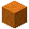</td>
			<td></td>
			<td></td>
			<td></td>
		</tr>
		<tr>
			<td>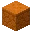</td>
			<td></td>
			<td></td>
			<td></td>
			<td></td>
			<td></td>
		</tr>
		<tr>
			<td colspan="2"></td>
			<td></td>
			<td></td>
			<td></td>
			<td></td>
		</tr>
	</tablebody>
</table>
<table>
	<tablebody>
		<tr>
			<td></td>
			<td>图标</td>
			<td>名称</td>
			<td>标签</td>
			<td>数量</td>
		</tr>
		<tr>
			<td></td>
			<td></td>
			<td>红砂岩</td>
			<td>red_sandstone</td>
			<td>1</td>
		</tr>
		<tr>
			<td></td>
			<td>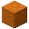</td>
			<td>切制红砂岩</td>
			<td>cut_red_sandstone</td>
			<td>1</td>
		</tr>
		<tr>
			<td></td>
			<td>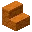</td>
			<td>红砂岩楼梯</td>
			<td>red_sandstone_stairs</td>
			<td>1</td>
		</tr>
		<tr>
			<td></td>
			<td>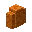</td>
			<td>红砂岩墙</td>
			<td>red_sandstone_wall</td>
			<td>1</td>
		</tr>
		<tr>
			<td></td>
			<td>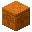</td>
			<td>錾制红砂岩</td>
			<td>chiseled_red_sandstone</td>
			<td>1</td>
		</tr>
		<tr>
			<td></td>
			<td>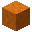</td>
			<td>平滑红砂岩</td>
			<td>smooth_red_sandstone</td>
			<td>1</td>
		</tr>
		<tr>
			<td></td>
			<td>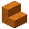</td>
			<td>平滑红砂岩楼梯</td>
			<td>smooth_red_sandstone_stairs</td>
			<td>1</td>
		</tr>
		<tr>
			<td></td>
			<td></td>
			<td>红沙</td>
			<td>red_sand</td>
			<td>4</td>
		</tr>
	</tablebody>
</table>

---
<!-- red_sand__from__stonecutting__use__red_sandstone_slab.md -->

<!-- zh_cn -->

## 红沙 | 切石机 | 红砂岩台阶

<table>
	<tablebody>
		<tr>
			<td colspan="6">切石机</td>
		</tr>
		<tr>
			<td colspan="2"></td>
			<td></td>
			<td></td>
			<td></td>
			<td></td>
		</tr>
		<tr>
			<td>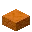</td>
			<td></td>
			<td></td>
			<td></td>
			<td></td>
			<td></td>
		</tr>
		<tr>
			<td colspan="2"></td>
			<td></td>
			<td></td>
			<td></td>
			<td></td>
		</tr>
	</tablebody>
</table>
<table>
	<tablebody>
		<tr>
			<td></td>
			<td>图标</td>
			<td>名称</td>
			<td>标签</td>
			<td>数量</td>
		</tr>
		<tr>
			<td></td>
			<td></td>
			<td>红砂岩台阶</td>
			<td>red_sandstone_slab</td>
			<td>1</td>
		</tr>
		<tr>
			<td></td>
			<td>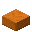</td>
			<td>切制红砂岩台阶</td>
			<td>cut_red_sandstone_slab</td>
			<td>1</td>
		</tr>
		<tr>
			<td></td>
			<td>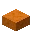</td>
			<td>平滑红砂岩台阶</td>
			<td>smooth_red_sandstone_slab</td>
			<td>1</td>
		</tr>
		<tr>
			<td></td>
			<td></td>
			<td>红沙</td>
			<td>red_sand</td>
			<td>2</td>
		</tr>
	</tablebody>
</table>

---
<!-- sand__from__stonecutting__use__sandstone.md -->

<!-- zh_cn -->

## 沙子 | 切石机 | 砂岩

<table>
	<tablebody>
		<tr>
			<td colspan="6">切石机</td>
		</tr>
		<tr>
			<td colspan="2"></td>
			<td>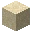</td>
			<td></td>
			<td></td>
			<td></td>
		</tr>
		<tr>
			<td>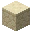</td>
			<td></td>
			<td></td>
			<td></td>
			<td></td>
			<td></td>
		</tr>
		<tr>
			<td colspan="2"></td>
			<td></td>
			<td></td>
			<td></td>
			<td></td>
		</tr>
	</tablebody>
</table>
<table>
	<tablebody>
		<tr>
			<td></td>
			<td>图标</td>
			<td>名称</td>
			<td>标签</td>
			<td>数量</td>
		</tr>
		<tr>
			<td></td>
			<td></td>
			<td>砂岩</td>
			<td>sandstone</td>
			<td>1</td>
		</tr>
		<tr>
			<td></td>
			<td>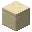</td>
			<td>切制砂岩</td>
			<td>cut_sandstone</td>
			<td>1</td>
		</tr>
		<tr>
			<td></td>
			<td>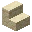</td>
			<td>砂岩楼梯</td>
			<td>sandstone_stairs</td>
			<td>1</td>
		</tr>
		<tr>
			<td></td>
			<td>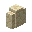</td>
			<td>砂岩墙</td>
			<td>sandstone_wall</td>
			<td>1</td>
		</tr>
		<tr>
			<td></td>
			<td>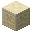</td>
			<td>錾制砂岩</td>
			<td>chiseled_sandstone</td>
			<td>1</td>
		</tr>
		<tr>
			<td></td>
			<td>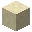</td>
			<td>平滑砂岩</td>
			<td>smooth_sandstone</td>
			<td>1</td>
		</tr>
		<tr>
			<td></td>
			<td>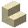</td>
			<td>平滑砂岩楼梯</td>
			<td>smooth_sandstone_stairs</td>
			<td>1</td>
		</tr>
		<tr>
			<td></td>
			<td></td>
			<td>沙子</td>
			<td>sand</td>
			<td>4</td>
		</tr>
	</tablebody>
</table>

---
<!-- sand__from__stonecutting__use__sandstone_slab.md -->

<!-- zh_cn -->

## 沙子 | 切石机 | 砂岩台阶

<table>
	<tablebody>
		<tr>
			<td colspan="6">切石机</td>
		</tr>
		<tr>
			<td colspan="2"></td>
			<td></td>
			<td></td>
			<td></td>
			<td></td>
		</tr>
		<tr>
			<td>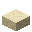</td>
			<td></td>
			<td></td>
			<td></td>
			<td></td>
			<td></td>
		</tr>
		<tr>
			<td colspan="2"></td>
			<td></td>
			<td></td>
			<td></td>
			<td></td>
		</tr>
	</tablebody>
</table>
<table>
	<tablebody>
		<tr>
			<td></td>
			<td>图标</td>
			<td>名称</td>
			<td>标签</td>
			<td>数量</td>
		</tr>
		<tr>
			<td></td>
			<td></td>
			<td>砂岩台阶</td>
			<td>sandstone_slab</td>
			<td>1</td>
		</tr>
		<tr>
			<td></td>
			<td>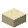</td>
			<td>切制砂岩台阶</td>
			<td>cut_sandstone_slab</td>
			<td>1</td>
		</tr>
		<tr>
			<td></td>
			<td>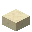</td>
			<td>平滑砂岩台阶</td>
			<td>smooth_sandstone_slab</td>
			<td>1</td>
		</tr>
		<tr>
			<td></td>
			<td></td>
			<td>沙子</td>
			<td>sand</td>
			<td>2</td>
		</tr>
	</tablebody>
</table>

