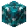
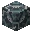
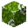

---
<!-- black_glazed_terracotta__from__crafting_shapeless__use__tag_glazed_terracotta.md -->

<!-- zh_cn -->

## 黑色带釉陶瓦 | 工作台: 无序 | 带釉陶瓦

<table>
	<tablebody>
		<tr>
			<td colspan="5">工作台: 无序</td>
		</tr>
		<tr>
			<td></td>
			<td></td>
			<td></td>
			<td colspan="2"></td>
		</tr>
		<tr>
			<td></td>
			<td></td>
			<td></td>
			<td></td>
			<td></td>
		</tr>
		<tr>
			<td></td>
			<td></td>
			<td></td>
			<td colspan="2"></td>
		</tr>
	</tablebody>
</table>
<table>
	<tablebody>
		<tr>
			<td></td>
			<td>图标</td>
			<td>名称</td>
			<td>标签</td>
			<td>数量</td>
		</tr>
		<tr>
			<td></td>
			<td></td>
			<td>黑色带釉陶瓦</td>
			<td>black_glazed_terracotta</td>
			<td>1</td>
		</tr>
		<tr>
			<td></td>
			<td></td>
			<td><a>带釉陶瓦</a></td>
			<td><a>glazed_terracotta</a></td>
			<td>1</td>
		</tr>
		<tr>
			<td></td>
			<td></td>
			<td>黑色染料</td>
			<td>black_dye</td>
			<td>1</td>
		</tr>
	</tablebody>
</table>

[带釉陶瓦](../../../zh_cn/tags/tag__glazed_terracotta.md)

---
<!-- blue_glazed_terracotta__from__crafting_shapeless__use__tag_glazed_terracotta.md -->

<!-- zh_cn -->

## 蓝色带釉陶瓦 | 工作台: 无序 | 带釉陶瓦

<table>
	<tablebody>
		<tr>
			<td colspan="5">工作台: 无序</td>
		</tr>
		<tr>
			<td></td>
			<td></td>
			<td></td>
			<td colspan="2"></td>
		</tr>
		<tr>
			<td></td>
			<td></td>
			<td></td>
			<td></td>
			<td></td>
		</tr>
		<tr>
			<td></td>
			<td></td>
			<td></td>
			<td colspan="2"></td>
		</tr>
	</tablebody>
</table>
<table>
	<tablebody>
		<tr>
			<td></td>
			<td>图标</td>
			<td>名称</td>
			<td>标签</td>
			<td>数量</td>
		</tr>
		<tr>
			<td></td>
			<td></td>
			<td>蓝色带釉陶瓦</td>
			<td>blue_glazed_terracotta</td>
			<td>1</td>
		</tr>
		<tr>
			<td></td>
			<td></td>
			<td><a>带釉陶瓦</a></td>
			<td><a>glazed_terracotta</a></td>
			<td>1</td>
		</tr>
		<tr>
			<td></td>
			<td></td>
			<td>蓝色染料</td>
			<td>blue_dye</td>
			<td>1</td>
		</tr>
	</tablebody>
</table>

[带釉陶瓦](../../../zh_cn/tags/tag__glazed_terracotta.md)

---
<!-- brown_glazed_terracotta__from__crafting_shapeless__use__tag_glazed_terracotta.md -->

<!-- zh_cn -->

## 棕色带釉陶瓦 | 工作台: 无序 | 带釉陶瓦

<table>
	<tablebody>
		<tr>
			<td colspan="5">工作台: 无序</td>
		</tr>
		<tr>
			<td></td>
			<td></td>
			<td></td>
			<td colspan="2"></td>
		</tr>
		<tr>
			<td></td>
			<td></td>
			<td></td>
			<td></td>
			<td></td>
		</tr>
		<tr>
			<td></td>
			<td></td>
			<td></td>
			<td colspan="2"></td>
		</tr>
	</tablebody>
</table>
<table>
	<tablebody>
		<tr>
			<td></td>
			<td>图标</td>
			<td>名称</td>
			<td>标签</td>
			<td>数量</td>
		</tr>
		<tr>
			<td></td>
			<td></td>
			<td>棕色带釉陶瓦</td>
			<td>brown_glazed_terracotta</td>
			<td>1</td>
		</tr>
		<tr>
			<td></td>
			<td></td>
			<td><a>带釉陶瓦</a></td>
			<td><a>glazed_terracotta</a></td>
			<td>1</td>
		</tr>
		<tr>
			<td></td>
			<td></td>
			<td>棕色染料</td>
			<td>brown_dye</td>
			<td>1</td>
		</tr>
	</tablebody>
</table>

[带釉陶瓦](../../../zh_cn/tags/tag__glazed_terracotta.md)

---
<!-- cyan_glazed_terracotta__from__crafting_shapeless__use__tag_glazed_terracotta.md -->

<!-- zh_cn -->

## 青色带釉陶瓦 | 工作台: 无序 | 带釉陶瓦

<table>
	<tablebody>
		<tr>
			<td colspan="5">工作台: 无序</td>
		</tr>
		<tr>
			<td></td>
			<td></td>
			<td></td>
			<td colspan="2"></td>
		</tr>
		<tr>
			<td></td>
			<td></td>
			<td></td>
			<td></td>
			<td></td>
		</tr>
		<tr>
			<td></td>
			<td></td>
			<td></td>
			<td colspan="2"></td>
		</tr>
	</tablebody>
</table>
<table>
	<tablebody>
		<tr>
			<td></td>
			<td>图标</td>
			<td>名称</td>
			<td>标签</td>
			<td>数量</td>
		</tr>
		<tr>
			<td></td>
			<td></td>
			<td>青色带釉陶瓦</td>
			<td>cyan_glazed_terracotta</td>
			<td>1</td>
		</tr>
		<tr>
			<td></td>
			<td></td>
			<td><a>带釉陶瓦</a></td>
			<td><a>glazed_terracotta</a></td>
			<td>1</td>
		</tr>
		<tr>
			<td></td>
			<td></td>
			<td>青色染料</td>
			<td>cyan_dye</td>
			<td>1</td>
		</tr>
	</tablebody>
</table>

[带釉陶瓦](../../../zh_cn/tags/tag__glazed_terracotta.md)

---
<!-- gray_glazed_terracotta__from__crafting_shapeless__use__tag_glazed_terracotta.md -->

<!-- zh_cn -->

## 灰色带釉陶瓦 | 工作台: 无序 | 带釉陶瓦

<table>
	<tablebody>
		<tr>
			<td colspan="5">工作台: 无序</td>
		</tr>
		<tr>
			<td></td>
			<td></td>
			<td></td>
			<td colspan="2"></td>
		</tr>
		<tr>
			<td></td>
			<td></td>
			<td></td>
			<td></td>
			<td></td>
		</tr>
		<tr>
			<td></td>
			<td></td>
			<td></td>
			<td colspan="2"></td>
		</tr>
	</tablebody>
</table>
<table>
	<tablebody>
		<tr>
			<td></td>
			<td>图标</td>
			<td>名称</td>
			<td>标签</td>
			<td>数量</td>
		</tr>
		<tr>
			<td></td>
			<td></td>
			<td>灰色带釉陶瓦</td>
			<td>gray_glazed_terracotta</td>
			<td>1</td>
		</tr>
		<tr>
			<td></td>
			<td></td>
			<td><a>带釉陶瓦</a></td>
			<td><a>glazed_terracotta</a></td>
			<td>1</td>
		</tr>
		<tr>
			<td></td>
			<td></td>
			<td>灰色染料</td>
			<td>gray_dye</td>
			<td>1</td>
		</tr>
	</tablebody>
</table>

[带釉陶瓦](../../../zh_cn/tags/tag__glazed_terracotta.md)

---
<!-- green_glazed_terracotta__from__crafting_shapeless__use__tag_glazed_terracotta.md -->

<!-- zh_cn -->

## 绿色带釉陶瓦 | 工作台: 无序 | 带釉陶瓦

<table>
	<tablebody>
		<tr>
			<td colspan="5">工作台: 无序</td>
		</tr>
		<tr>
			<td></td>
			<td></td>
			<td></td>
			<td colspan="2"></td>
		</tr>
		<tr>
			<td></td>
			<td></td>
			<td></td>
			<td></td>
			<td></td>
		</tr>
		<tr>
			<td></td>
			<td></td>
			<td></td>
			<td colspan="2"></td>
		</tr>
	</tablebody>
</table>
<table>
	<tablebody>
		<tr>
			<td></td>
			<td>图标</td>
			<td>名称</td>
			<td>标签</td>
			<td>数量</td>
		</tr>
		<tr>
			<td></td>
			<td></td>
			<td>绿色带釉陶瓦</td>
			<td>green_glazed_terracotta</td>
			<td>1</td>
		</tr>
		<tr>
			<td></td>
			<td></td>
			<td><a>带釉陶瓦</a></td>
			<td><a>glazed_terracotta</a></td>
			<td>1</td>
		</tr>
		<tr>
			<td></td>
			<td></td>
			<td>绿色染料</td>
			<td>green_dye</td>
			<td>1</td>
		</tr>
	</tablebody>
</table>

[带釉陶瓦](../../../zh_cn/tags/tag__glazed_terracotta.md)

---
<!-- light_blue_glazed_terracotta__from__crafting_shapeless__use__tag_glazed_terracotta.md -->

<!-- zh_cn -->

## 淡蓝色带釉陶瓦 | 工作台: 无序 | 带釉陶瓦

<table>
	<tablebody>
		<tr>
			<td colspan="5">工作台: 无序</td>
		</tr>
		<tr>
			<td></td>
			<td></td>
			<td></td>
			<td colspan="2"></td>
		</tr>
		<tr>
			<td></td>
			<td></td>
			<td></td>
			<td></td>
			<td></td>
		</tr>
		<tr>
			<td></td>
			<td></td>
			<td></td>
			<td colspan="2"></td>
		</tr>
	</tablebody>
</table>
<table>
	<tablebody>
		<tr>
			<td></td>
			<td>图标</td>
			<td>名称</td>
			<td>标签</td>
			<td>数量</td>
		</tr>
		<tr>
			<td></td>
			<td></td>
			<td>淡蓝色带釉陶瓦</td>
			<td>light_blue_glazed_terracotta</td>
			<td>1</td>
		</tr>
		<tr>
			<td></td>
			<td></td>
			<td><a>带釉陶瓦</a></td>
			<td><a>glazed_terracotta</a></td>
			<td>1</td>
		</tr>
		<tr>
			<td></td>
			<td></td>
			<td>淡蓝色染料</td>
			<td>light_blue_dye</td>
			<td>1</td>
		</tr>
	</tablebody>
</table>

[带釉陶瓦](../../../zh_cn/tags/tag__glazed_terracotta.md)

---
<!-- light_gray_glazed_terracotta__from__crafting_shapeless__use__tag_glazed_terracotta.md -->

<!-- zh_cn -->

## 淡灰色带釉陶瓦 | 工作台: 无序 | 带釉陶瓦

<table>
	<tablebody>
		<tr>
			<td colspan="5">工作台: 无序</td>
		</tr>
		<tr>
			<td></td>
			<td></td>
			<td></td>
			<td colspan="2"></td>
		</tr>
		<tr>
			<td></td>
			<td></td>
			<td></td>
			<td></td>
			<td></td>
		</tr>
		<tr>
			<td></td>
			<td></td>
			<td></td>
			<td colspan="2"></td>
		</tr>
	</tablebody>
</table>
<table>
	<tablebody>
		<tr>
			<td></td>
			<td>图标</td>
			<td>名称</td>
			<td>标签</td>
			<td>数量</td>
		</tr>
		<tr>
			<td></td>
			<td></td>
			<td>淡灰色带釉陶瓦</td>
			<td>light_gray_glazed_terracotta</td>
			<td>1</td>
		</tr>
		<tr>
			<td></td>
			<td></td>
			<td><a>带釉陶瓦</a></td>
			<td><a>glazed_terracotta</a></td>
			<td>1</td>
		</tr>
		<tr>
			<td></td>
			<td></td>
			<td>淡灰色染料</td>
			<td>light_gray_dye</td>
			<td>1</td>
		</tr>
	</tablebody>
</table>

[带釉陶瓦](../../../zh_cn/tags/tag__glazed_terracotta.md)

---
<!-- lime_glazed_terracotta__from__crafting_shapeless__use__tag_glazed_terracotta.md -->

<!-- zh_cn -->

## 黄绿色带釉陶瓦 | 工作台: 无序 | 带釉陶瓦

<table>
	<tablebody>
		<tr>
			<td colspan="5">工作台: 无序</td>
		</tr>
		<tr>
			<td></td>
			<td></td>
			<td></td>
			<td colspan="2"></td>
		</tr>
		<tr>
			<td></td>
			<td></td>
			<td></td>
			<td></td>
			<td></td>
		</tr>
		<tr>
			<td></td>
			<td></td>
			<td></td>
			<td colspan="2"></td>
		</tr>
	</tablebody>
</table>
<table>
	<tablebody>
		<tr>
			<td></td>
			<td>图标</td>
			<td>名称</td>
			<td>标签</td>
			<td>数量</td>
		</tr>
		<tr>
			<td></td>
			<td></td>
			<td>黄绿色带釉陶瓦</td>
			<td>lime_glazed_terracotta</td>
			<td>1</td>
		</tr>
		<tr>
			<td></td>
			<td></td>
			<td><a>带釉陶瓦</a></td>
			<td><a>glazed_terracotta</a></td>
			<td>1</td>
		</tr>
		<tr>
			<td></td>
			<td></td>
			<td>黄绿色染料</td>
			<td>lime_dye</td>
			<td>1</td>
		</tr>
	</tablebody>
</table>

[带釉陶瓦](../../../zh_cn/tags/tag__glazed_terracotta.md)

---
<!-- magenta_glazed_terracotta__from__crafting_shapeless__use__tag_glazed_terracotta.md -->

<!-- zh_cn -->

## 品红色带釉陶瓦 | 工作台: 无序 | 带釉陶瓦

<table>
	<tablebody>
		<tr>
			<td colspan="5">工作台: 无序</td>
		</tr>
		<tr>
			<td></td>
			<td></td>
			<td></td>
			<td colspan="2"></td>
		</tr>
		<tr>
			<td></td>
			<td></td>
			<td></td>
			<td></td>
			<td></td>
		</tr>
		<tr>
			<td></td>
			<td></td>
			<td></td>
			<td colspan="2"></td>
		</tr>
	</tablebody>
</table>
<table>
	<tablebody>
		<tr>
			<td></td>
			<td>图标</td>
			<td>名称</td>
			<td>标签</td>
			<td>数量</td>
		</tr>
		<tr>
			<td></td>
			<td></td>
			<td>品红色带釉陶瓦</td>
			<td>magenta_glazed_terracotta</td>
			<td>1</td>
		</tr>
		<tr>
			<td></td>
			<td></td>
			<td><a>带釉陶瓦</a></td>
			<td><a>glazed_terracotta</a></td>
			<td>1</td>
		</tr>
		<tr>
			<td></td>
			<td></td>
			<td>品红色染料</td>
			<td>magenta_dye</td>
			<td>1</td>
		</tr>
	</tablebody>
</table>

[带釉陶瓦](../../../zh_cn/tags/tag__glazed_terracotta.md)

---
<!-- orange_glazed_terracotta__from__crafting_shapeless__use__tag_glazed_terracotta.md -->

<!-- zh_cn -->

## 橙色带釉陶瓦 | 工作台: 无序 | 带釉陶瓦

<table>
	<tablebody>
		<tr>
			<td colspan="5">工作台: 无序</td>
		</tr>
		<tr>
			<td></td>
			<td></td>
			<td></td>
			<td colspan="2"></td>
		</tr>
		<tr>
			<td></td>
			<td></td>
			<td></td>
			<td></td>
			<td></td>
		</tr>
		<tr>
			<td></td>
			<td></td>
			<td></td>
			<td colspan="2"></td>
		</tr>
	</tablebody>
</table>
<table>
	<tablebody>
		<tr>
			<td></td>
			<td>图标</td>
			<td>名称</td>
			<td>标签</td>
			<td>数量</td>
		</tr>
		<tr>
			<td></td>
			<td></td>
			<td>橙色带釉陶瓦</td>
			<td>orange_glazed_terracotta</td>
			<td>1</td>
		</tr>
		<tr>
			<td></td>
			<td></td>
			<td><a>带釉陶瓦</a></td>
			<td><a>glazed_terracotta</a></td>
			<td>1</td>
		</tr>
		<tr>
			<td></td>
			<td></td>
			<td>橙色染料</td>
			<td>orange_dye</td>
			<td>1</td>
		</tr>
	</tablebody>
</table>

[带釉陶瓦](../../../zh_cn/tags/tag__glazed_terracotta.md)

---
<!-- pink_glazed_terracotta__from__crafting_shapeless__use__tag_glazed_terracotta.md -->

<!-- zh_cn -->

## 粉红色带釉陶瓦 | 工作台: 无序 | 带釉陶瓦

<table>
	<tablebody>
		<tr>
			<td colspan="5">工作台: 无序</td>
		</tr>
		<tr>
			<td></td>
			<td></td>
			<td></td>
			<td colspan="2"></td>
		</tr>
		<tr>
			<td></td>
			<td></td>
			<td></td>
			<td></td>
			<td></td>
		</tr>
		<tr>
			<td></td>
			<td></td>
			<td></td>
			<td colspan="2"></td>
		</tr>
	</tablebody>
</table>
<table>
	<tablebody>
		<tr>
			<td></td>
			<td>图标</td>
			<td>名称</td>
			<td>标签</td>
			<td>数量</td>
		</tr>
		<tr>
			<td></td>
			<td></td>
			<td>粉红色带釉陶瓦</td>
			<td>pink_glazed_terracotta</td>
			<td>1</td>
		</tr>
		<tr>
			<td></td>
			<td></td>
			<td><a>带釉陶瓦</a></td>
			<td><a>glazed_terracotta</a></td>
			<td>1</td>
		</tr>
		<tr>
			<td></td>
			<td></td>
			<td>粉红色染料</td>
			<td>pink_dye</td>
			<td>1</td>
		</tr>
	</tablebody>
</table>

[带釉陶瓦](../../../zh_cn/tags/tag__glazed_terracotta.md)

---
<!-- purple_glazed_terracotta__from__crafting_shapeless__use__tag_glazed_terracotta.md -->

<!-- zh_cn -->

## 紫色带釉陶瓦 | 工作台: 无序 | 带釉陶瓦

<table>
	<tablebody>
		<tr>
			<td colspan="5">工作台: 无序</td>
		</tr>
		<tr>
			<td></td>
			<td></td>
			<td></td>
			<td colspan="2"></td>
		</tr>
		<tr>
			<td></td>
			<td></td>
			<td></td>
			<td></td>
			<td></td>
		</tr>
		<tr>
			<td></td>
			<td></td>
			<td></td>
			<td colspan="2"></td>
		</tr>
	</tablebody>
</table>
<table>
	<tablebody>
		<tr>
			<td></td>
			<td>图标</td>
			<td>名称</td>
			<td>标签</td>
			<td>数量</td>
		</tr>
		<tr>
			<td></td>
			<td></td>
			<td>紫色带釉陶瓦</td>
			<td>purple_glazed_terracotta</td>
			<td>1</td>
		</tr>
		<tr>
			<td></td>
			<td></td>
			<td><a>带釉陶瓦</a></td>
			<td><a>glazed_terracotta</a></td>
			<td>1</td>
		</tr>
		<tr>
			<td></td>
			<td></td>
			<td>紫色染料</td>
			<td>purple_dye</td>
			<td>1</td>
		</tr>
	</tablebody>
</table>

[带釉陶瓦](../../../zh_cn/tags/tag__glazed_terracotta.md)

---
<!-- red_glazed_terracotta__from__crafting_shapeless__use__tag_glazed_terracotta.md -->

<!-- zh_cn -->

## 红色带釉陶瓦 | 工作台: 无序 | 带釉陶瓦

<table>
	<tablebody>
		<tr>
			<td colspan="5">工作台: 无序</td>
		</tr>
		<tr>
			<td></td>
			<td></td>
			<td></td>
			<td colspan="2"></td>
		</tr>
		<tr>
			<td></td>
			<td></td>
			<td></td>
			<td></td>
			<td></td>
		</tr>
		<tr>
			<td></td>
			<td></td>
			<td></td>
			<td colspan="2"></td>
		</tr>
	</tablebody>
</table>
<table>
	<tablebody>
		<tr>
			<td></td>
			<td>图标</td>
			<td>名称</td>
			<td>标签</td>
			<td>数量</td>
		</tr>
		<tr>
			<td></td>
			<td></td>
			<td>红色带釉陶瓦</td>
			<td>red_glazed_terracotta</td>
			<td>1</td>
		</tr>
		<tr>
			<td></td>
			<td></td>
			<td><a>带釉陶瓦</a></td>
			<td><a>glazed_terracotta</a></td>
			<td>1</td>
		</tr>
		<tr>
			<td></td>
			<td></td>
			<td>红色染料</td>
			<td>red_dye</td>
			<td>1</td>
		</tr>
	</tablebody>
</table>

[带釉陶瓦](../../../zh_cn/tags/tag__glazed_terracotta.md)

---
<!-- white_glazed_terracotta__from__crafting_shapeless__use__tag_glazed_terracotta.md -->

<!-- zh_cn -->

## 白色带釉陶瓦 | 工作台: 无序 | 带釉陶瓦

<table>
	<tablebody>
		<tr>
			<td colspan="5">工作台: 无序</td>
		</tr>
		<tr>
			<td></td>
			<td></td>
			<td></td>
			<td colspan="2"></td>
		</tr>
		<tr>
			<td></td>
			<td></td>
			<td></td>
			<td></td>
			<td></td>
		</tr>
		<tr>
			<td></td>
			<td></td>
			<td></td>
			<td colspan="2"></td>
		</tr>
	</tablebody>
</table>
<table>
	<tablebody>
		<tr>
			<td></td>
			<td>图标</td>
			<td>名称</td>
			<td>标签</td>
			<td>数量</td>
		</tr>
		<tr>
			<td></td>
			<td></td>
			<td>白色带釉陶瓦</td>
			<td>white_glazed_terracotta</td>
			<td>1</td>
		</tr>
		<tr>
			<td></td>
			<td></td>
			<td><a>带釉陶瓦</a></td>
			<td><a>glazed_terracotta</a></td>
			<td>1</td>
		</tr>
		<tr>
			<td></td>
			<td></td>
			<td>白色染料</td>
			<td>white_dye</td>
			<td>1</td>
		</tr>
	</tablebody>
</table>

[带釉陶瓦](../../../zh_cn/tags/tag__glazed_terracotta.md)

---
<!-- yellow_glazed_terracotta__from__crafting_shapeless__use__tag_glazed_terracotta.md -->

<!-- zh_cn -->

## 黄色带釉陶瓦 | 工作台: 无序 | 带釉陶瓦

<table>
	<tablebody>
		<tr>
			<td colspan="5">工作台: 无序</td>
		</tr>
		<tr>
			<td></td>
			<td></td>
			<td></td>
			<td colspan="2"></td>
		</tr>
		<tr>
			<td></td>
			<td></td>
			<td></td>
			<td></td>
			<td></td>
		</tr>
		<tr>
			<td></td>
			<td></td>
			<td></td>
			<td colspan="2"></td>
		</tr>
	</tablebody>
</table>
<table>
	<tablebody>
		<tr>
			<td></td>
			<td>图标</td>
			<td>名称</td>
			<td>标签</td>
			<td>数量</td>
		</tr>
		<tr>
			<td></td>
			<td></td>
			<td>黄色带釉陶瓦</td>
			<td>yellow_glazed_terracotta</td>
			<td>1</td>
		</tr>
		<tr>
			<td></td>
			<td></td>
			<td><a>带釉陶瓦</a></td>
			<td><a>glazed_terracotta</a></td>
			<td>1</td>
		</tr>
		<tr>
			<td></td>
			<td></td>
			<td>黄色染料</td>
			<td>yellow_dye</td>
			<td>1</td>
		</tr>
	</tablebody>
</table>

[带釉陶瓦](../../../zh_cn/tags/tag__glazed_terracotta.md)

