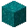

---
<!-- crimson_fungus__from__crafting_shapeless__use__nether_wart_block.md -->

<!-- zh_cn -->

## 绯红菌 | 工作台: 无序 | 下界疣块

<table>
	<tablebody>
		<tr>
			<td colspan="5">工作台: 无序</td>
		</tr>
		<tr>
			<td></td>
			<td></td>
			<td></td>
			<td colspan="2"></td>
		</tr>
		<tr>
			<td></td>
			<td></td>
			<td></td>
			<td></td>
			<td></td>
		</tr>
		<tr>
			<td></td>
			<td></td>
			<td></td>
			<td colspan="2"></td>
		</tr>
	</tablebody>
</table>
<table>
	<tablebody>
		<tr>
			<td></td>
			<td>图标</td>
			<td>名称</td>
			<td>标签</td>
			<td>数量</td>
		</tr>
		<tr>
			<td></td>
			<td></td>
			<td>绯红菌</td>
			<td>crimson_fungus</td>
			<td>1</td>
		</tr>
		<tr>
			<td></td>
			<td></td>
			<td>下界疣块</td>
			<td>nether_wart_block</td>
			<td>1</td>
		</tr>
		<tr>
			<td></td>
			<td></td>
			<td>木棍</td>
			<td>stick</td>
			<td>1</td>
		</tr>
	</tablebody>
</table>

---
<!-- warped_fungus__from__crafting_shapeless__use__warped_wart_block.md -->

<!-- zh_cn -->

## 诡异菌 | 工作台: 无序 | 诡异疣块

<table>
	<tablebody>
		<tr>
			<td colspan="5">工作台: 无序</td>
		</tr>
		<tr>
			<td></td>
			<td></td>
			<td></td>
			<td colspan="2"></td>
		</tr>
		<tr>
			<td></td>
			<td></td>
			<td></td>
			<td></td>
			<td></td>
		</tr>
		<tr>
			<td></td>
			<td></td>
			<td></td>
			<td colspan="2"></td>
		</tr>
	</tablebody>
</table>
<table>
	<tablebody>
		<tr>
			<td></td>
			<td>图标</td>
			<td>名称</td>
			<td>标签</td>
			<td>数量</td>
		</tr>
		<tr>
			<td></td>
			<td></td>
			<td>诡异菌</td>
			<td>warped_fungus</td>
			<td>1</td>
		</tr>
		<tr>
			<td></td>
			<td></td>
			<td>诡异疣块</td>
			<td>warped_wart_block</td>
			<td>1</td>
		</tr>
		<tr>
			<td></td>
			<td></td>
			<td>木棍</td>
			<td>stick</td>
			<td>1</td>
		</tr>
	</tablebody>
</table>

