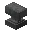
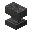

---
<!-- anvil__from__smithing__use__chipped_anvil.md -->

<!-- zh_cn -->

## 铁砧 | 锻造台 | 开裂的铁砧

<table>
	<tablebody>
		<tr>
			<td colspan="5">锻造台</td>
		</tr>
		<tr>
			<td></td>
			<td></td>
			<td></td>
			<td></td>
			<td></td>
		</tr>
	</tablebody>
</table>
<table>
	<tablebody>
		<tr>
			<td></td>
			<td>图标</td>
			<td>名称</td>
			<td>标签</td>
			<td>数量</td>
		</tr>
		<tr>
			<td></td>
			<td></td>
			<td>开裂的铁砧</td>
			<td>chipped_anvil</td>
			<td>1</td>
		</tr>
		<tr>
			<td></td>
			<td></td>
			<td>铁粒</td>
			<td>iron_nugget</td>
			<td>1</td>
		</tr>
		<tr>
			<td></td>
			<td></td>
			<td>铁砧</td>
			<td>anvil</td>
			<td>1</td>
		</tr>
	</tablebody>
</table>

---
<!-- anvil__from__smithing__use__damaged_anvil.md -->

<!-- zh_cn -->

## 铁砧 | 锻造台 | 损坏的铁砧

<table>
	<tablebody>
		<tr>
			<td colspan="5">锻造台</td>
		</tr>
		<tr>
			<td></td>
			<td></td>
			<td></td>
			<td></td>
			<td></td>
		</tr>
	</tablebody>
</table>
<table>
	<tablebody>
		<tr>
			<td></td>
			<td>图标</td>
			<td>名称</td>
			<td>标签</td>
			<td>数量</td>
		</tr>
		<tr>
			<td></td>
			<td></td>
			<td>损坏的铁砧</td>
			<td>damaged_anvil</td>
			<td>1</td>
		</tr>
		<tr>
			<td></td>
			<td></td>
			<td>铁粒</td>
			<td>iron_nugget</td>
			<td>1</td>
		</tr>
		<tr>
			<td></td>
			<td></td>
			<td>铁砧</td>
			<td>anvil</td>
			<td>1</td>
		</tr>
	</tablebody>
</table>

