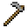
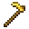
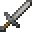

---
<!-- golden_axe__from__smithing__use__stone_axe.md -->

<!-- zh_cn -->

## 金斧 | 锻造台 | 石斧

<table>
	<tablebody>
		<tr>
			<td colspan="5">锻造台</td>
		</tr>
		<tr>
			<td></td>
			<td></td>
			<td></td>
			<td></td>
			<td></td>
		</tr>
	</tablebody>
</table>
<table>
	<tablebody>
		<tr>
			<td></td>
			<td>图标</td>
			<td>名称</td>
			<td>标签</td>
			<td>数量</td>
		</tr>
		<tr>
			<td></td>
			<td></td>
			<td>石斧</td>
			<td>stone_axe</td>
			<td>1</td>
		</tr>
		<tr>
			<td></td>
			<td></td>
			<td>金锭</td>
			<td>gold_ingot</td>
			<td>1</td>
		</tr>
		<tr>
			<td></td>
			<td></td>
			<td>金斧</td>
			<td>golden_axe</td>
			<td>1</td>
		</tr>
	</tablebody>
</table>

---
<!-- golden_hoe__from__smithing__use__stone_hoe.md -->

<!-- zh_cn -->

## 金锄 | 锻造台 | 石锄

<table>
	<tablebody>
		<tr>
			<td colspan="5">锻造台</td>
		</tr>
		<tr>
			<td></td>
			<td></td>
			<td></td>
			<td></td>
			<td></td>
		</tr>
	</tablebody>
</table>
<table>
	<tablebody>
		<tr>
			<td></td>
			<td>图标</td>
			<td>名称</td>
			<td>标签</td>
			<td>数量</td>
		</tr>
		<tr>
			<td></td>
			<td></td>
			<td>石锄</td>
			<td>stone_hoe</td>
			<td>1</td>
		</tr>
		<tr>
			<td></td>
			<td></td>
			<td>金锭</td>
			<td>gold_ingot</td>
			<td>1</td>
		</tr>
		<tr>
			<td></td>
			<td></td>
			<td>金锄</td>
			<td>golden_hoe</td>
			<td>1</td>
		</tr>
	</tablebody>
</table>

---
<!-- golden_pickaxe__from__smithing__use__stone_pickaxe.md -->

<!-- zh_cn -->

## 金镐 | 锻造台 | 石镐

<table>
	<tablebody>
		<tr>
			<td colspan="5">锻造台</td>
		</tr>
		<tr>
			<td></td>
			<td></td>
			<td></td>
			<td></td>
			<td></td>
		</tr>
	</tablebody>
</table>
<table>
	<tablebody>
		<tr>
			<td></td>
			<td>图标</td>
			<td>名称</td>
			<td>标签</td>
			<td>数量</td>
		</tr>
		<tr>
			<td></td>
			<td></td>
			<td>石镐</td>
			<td>stone_pickaxe</td>
			<td>1</td>
		</tr>
		<tr>
			<td></td>
			<td></td>
			<td>金锭</td>
			<td>gold_ingot</td>
			<td>1</td>
		</tr>
		<tr>
			<td></td>
			<td></td>
			<td>金镐</td>
			<td>golden_pickaxe</td>
			<td>1</td>
		</tr>
	</tablebody>
</table>

---
<!-- golden_shovel__from__smithing__use__stone_shovel.md -->

<!-- zh_cn -->

## 金锹 | 锻造台 | 石锹

<table>
	<tablebody>
		<tr>
			<td colspan="5">锻造台</td>
		</tr>
		<tr>
			<td></td>
			<td></td>
			<td></td>
			<td></td>
			<td></td>
		</tr>
	</tablebody>
</table>
<table>
	<tablebody>
		<tr>
			<td></td>
			<td>图标</td>
			<td>名称</td>
			<td>标签</td>
			<td>数量</td>
		</tr>
		<tr>
			<td></td>
			<td></td>
			<td>石锹</td>
			<td>stone_shovel</td>
			<td>1</td>
		</tr>
		<tr>
			<td></td>
			<td></td>
			<td>金锭</td>
			<td>gold_ingot</td>
			<td>1</td>
		</tr>
		<tr>
			<td></td>
			<td></td>
			<td>金锹</td>
			<td>golden_shovel</td>
			<td>1</td>
		</tr>
	</tablebody>
</table>

---
<!-- golden_sword__from__smithing__use__stone_sword.md -->

<!-- zh_cn -->

## 金剑 | 锻造台 | 石剑

<table>
	<tablebody>
		<tr>
			<td colspan="5">锻造台</td>
		</tr>
		<tr>
			<td></td>
			<td></td>
			<td></td>
			<td></td>
			<td></td>
		</tr>
	</tablebody>
</table>
<table>
	<tablebody>
		<tr>
			<td></td>
			<td>图标</td>
			<td>名称</td>
			<td>标签</td>
			<td>数量</td>
		</tr>
		<tr>
			<td></td>
			<td></td>
			<td>石剑</td>
			<td>stone_sword</td>
			<td>1</td>
		</tr>
		<tr>
			<td></td>
			<td></td>
			<td>金锭</td>
			<td>gold_ingot</td>
			<td>1</td>
		</tr>
		<tr>
			<td></td>
			<td></td>
			<td>金剑</td>
			<td>golden_sword</td>
			<td>1</td>
		</tr>
	</tablebody>
</table>

