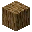

---
<!-- acacia_log__from__crafting_shaped__use__acacia_wood.md -->

<!-- zh_cn -->

## 金合欢原木 | 工作台: 有序 | 金合欢木

<table>
	<tablebody>
		<tr>
			<td colspan="5">工作台: 有序</td>
		</tr>
		<tr>
			<td></td>
			<td></td>
			<td></td>
			<td colspan="2"></td>
		</tr>
		<tr>
			<td></td>
			<td></td>
			<td></td>
			<td></td>
			<td></td>
		</tr>
		<tr>
			<td></td>
			<td></td>
			<td></td>
			<td colspan="2"></td>
		</tr>
	</tablebody>
</table>
<table>
	<tablebody>
		<tr>
			<td></td>
			<td>图标</td>
			<td>名称</td>
			<td>标签</td>
			<td>数量</td>
		</tr>
		<tr>
			<td></td>
			<td></td>
			<td>金合欢原木</td>
			<td>acacia_log</td>
			<td>4</td>
		</tr>
		<tr>
			<td></td>
			<td></td>
			<td>金合欢木</td>
			<td>acacia_wood</td>
			<td>3</td>
		</tr>
	</tablebody>
</table>

---
<!-- birch_log__from__crafting_shaped__use__birch_wood.md -->

<!-- zh_cn -->

## 白桦原木 | 工作台: 有序 | 白桦木

<table>
	<tablebody>
		<tr>
			<td colspan="5">工作台: 有序</td>
		</tr>
		<tr>
			<td></td>
			<td></td>
			<td></td>
			<td colspan="2"></td>
		</tr>
		<tr>
			<td></td>
			<td></td>
			<td></td>
			<td></td>
			<td></td>
		</tr>
		<tr>
			<td></td>
			<td></td>
			<td></td>
			<td colspan="2"></td>
		</tr>
	</tablebody>
</table>
<table>
	<tablebody>
		<tr>
			<td></td>
			<td>图标</td>
			<td>名称</td>
			<td>标签</td>
			<td>数量</td>
		</tr>
		<tr>
			<td></td>
			<td></td>
			<td>白桦原木</td>
			<td>birch_log</td>
			<td>4</td>
		</tr>
		<tr>
			<td></td>
			<td></td>
			<td>白桦木</td>
			<td>birch_wood</td>
			<td>3</td>
		</tr>
	</tablebody>
</table>

---
<!-- dark_oak_log__from__crafting_shaped__use__dark_oak_wood.md -->

<!-- zh_cn -->

## 深色橡木原木 | 工作台: 有序 | 深色橡木

<table>
	<tablebody>
		<tr>
			<td colspan="5">工作台: 有序</td>
		</tr>
		<tr>
			<td></td>
			<td></td>
			<td></td>
			<td colspan="2"></td>
		</tr>
		<tr>
			<td></td>
			<td></td>
			<td></td>
			<td></td>
			<td></td>
		</tr>
		<tr>
			<td></td>
			<td></td>
			<td></td>
			<td colspan="2"></td>
		</tr>
	</tablebody>
</table>
<table>
	<tablebody>
		<tr>
			<td></td>
			<td>图标</td>
			<td>名称</td>
			<td>标签</td>
			<td>数量</td>
		</tr>
		<tr>
			<td></td>
			<td></td>
			<td>深色橡木原木</td>
			<td>dark_oak_log</td>
			<td>4</td>
		</tr>
		<tr>
			<td></td>
			<td></td>
			<td>深色橡木</td>
			<td>dark_oak_wood</td>
			<td>3</td>
		</tr>
	</tablebody>
</table>

---
<!-- jungle_log__from__crafting_shaped__use__jungle_wood.md -->

<!-- zh_cn -->

## 丛林原木 | 工作台: 有序 | 丛林木

<table>
	<tablebody>
		<tr>
			<td colspan="5">工作台: 有序</td>
		</tr>
		<tr>
			<td></td>
			<td></td>
			<td></td>
			<td colspan="2"></td>
		</tr>
		<tr>
			<td></td>
			<td></td>
			<td></td>
			<td></td>
			<td></td>
		</tr>
		<tr>
			<td></td>
			<td></td>
			<td></td>
			<td colspan="2"></td>
		</tr>
	</tablebody>
</table>
<table>
	<tablebody>
		<tr>
			<td></td>
			<td>图标</td>
			<td>名称</td>
			<td>标签</td>
			<td>数量</td>
		</tr>
		<tr>
			<td></td>
			<td></td>
			<td>丛林原木</td>
			<td>jungle_log</td>
			<td>4</td>
		</tr>
		<tr>
			<td></td>
			<td></td>
			<td>丛林木</td>
			<td>jungle_wood</td>
			<td>3</td>
		</tr>
	</tablebody>
</table>

---
<!-- oak_log__from__crafting_shaped__use__oak_wood.md -->

<!-- zh_cn -->

## 橡木原木 | 工作台: 有序 | 橡木

<table>
	<tablebody>
		<tr>
			<td colspan="5">工作台: 有序</td>
		</tr>
		<tr>
			<td></td>
			<td></td>
			<td></td>
			<td colspan="2"></td>
		</tr>
		<tr>
			<td></td>
			<td></td>
			<td></td>
			<td></td>
			<td></td>
		</tr>
		<tr>
			<td></td>
			<td></td>
			<td></td>
			<td colspan="2"></td>
		</tr>
	</tablebody>
</table>
<table>
	<tablebody>
		<tr>
			<td></td>
			<td>图标</td>
			<td>名称</td>
			<td>标签</td>
			<td>数量</td>
		</tr>
		<tr>
			<td></td>
			<td></td>
			<td>橡木原木</td>
			<td>oak_log</td>
			<td>4</td>
		</tr>
		<tr>
			<td></td>
			<td></td>
			<td>橡木</td>
			<td>oak_wood</td>
			<td>3</td>
		</tr>
	</tablebody>
</table>

---
<!-- spruce_log__from__crafting_shaped__use__spruce_wood.md -->

<!-- zh_cn -->

## 云杉原木 | 工作台: 有序 | 云杉木

<table>
	<tablebody>
		<tr>
			<td colspan="5">工作台: 有序</td>
		</tr>
		<tr>
			<td></td>
			<td></td>
			<td></td>
			<td colspan="2"></td>
		</tr>
		<tr>
			<td></td>
			<td></td>
			<td></td>
			<td></td>
			<td></td>
		</tr>
		<tr>
			<td></td>
			<td></td>
			<td></td>
			<td colspan="2"></td>
		</tr>
	</tablebody>
</table>
<table>
	<tablebody>
		<tr>
			<td></td>
			<td>图标</td>
			<td>名称</td>
			<td>标签</td>
			<td>数量</td>
		</tr>
		<tr>
			<td></td>
			<td></td>
			<td>云杉原木</td>
			<td>spruce_log</td>
			<td>4</td>
		</tr>
		<tr>
			<td></td>
			<td></td>
			<td>云杉木</td>
			<td>spruce_wood</td>
			<td>3</td>
		</tr>
	</tablebody>
</table>

---
<!-- crimson_stem__from__crafting_shaped__use__crimson_hyphae.md -->

<!-- zh_cn -->

## 绯红菌柄 | 工作台: 有序 | 绯红菌核

<table>
	<tablebody>
		<tr>
			<td colspan="5">工作台: 有序</td>
		</tr>
		<tr>
			<td></td>
			<td></td>
			<td></td>
			<td colspan="2"></td>
		</tr>
		<tr>
			<td></td>
			<td></td>
			<td></td>
			<td></td>
			<td></td>
		</tr>
		<tr>
			<td></td>
			<td></td>
			<td></td>
			<td colspan="2"></td>
		</tr>
	</tablebody>
</table>
<table>
	<tablebody>
		<tr>
			<td></td>
			<td>图标</td>
			<td>名称</td>
			<td>标签</td>
			<td>数量</td>
		</tr>
		<tr>
			<td></td>
			<td></td>
			<td>绯红菌柄</td>
			<td>crimson_stem</td>
			<td>4</td>
		</tr>
		<tr>
			<td></td>
			<td></td>
			<td>绯红菌核</td>
			<td>crimson_hyphae</td>
			<td>3</td>
		</tr>
	</tablebody>
</table>

---
<!-- warped_stem__from__crafting_shaped__use__warped_hyphae.md -->

<!-- zh_cn -->

## 诡异菌柄 | 工作台: 有序 | 诡异菌核

<table>
	<tablebody>
		<tr>
			<td colspan="5">工作台: 有序</td>
		</tr>
		<tr>
			<td></td>
			<td></td>
			<td></td>
			<td colspan="2"></td>
		</tr>
		<tr>
			<td></td>
			<td></td>
			<td></td>
			<td></td>
			<td></td>
		</tr>
		<tr>
			<td></td>
			<td></td>
			<td></td>
			<td colspan="2"></td>
		</tr>
	</tablebody>
</table>
<table>
	<tablebody>
		<tr>
			<td></td>
			<td>图标</td>
			<td>名称</td>
			<td>标签</td>
			<td>数量</td>
		</tr>
		<tr>
			<td></td>
			<td></td>
			<td>诡异菌柄</td>
			<td>warped_stem</td>
			<td>4</td>
		</tr>
		<tr>
			<td></td>
			<td></td>
			<td>诡异菌核</td>
			<td>warped_hyphae</td>
			<td>3</td>
		</tr>
	</tablebody>
</table>

