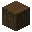
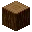

---
<!-- stripped_acacia_log__from__stonecutting__use__acacia_log.md -->

<!-- zh_cn -->

## 去皮金合欢原木 | 切石机 | 金合欢原木

<table>
	<tablebody>
		<tr>
			<td colspan="6">切石机</td>
		</tr>
		<tr>
			<td colspan="2"></td>
			<td></td>
			<td></td>
			<td></td>
			<td></td>
		</tr>
		<tr>
			<td></td>
			<td></td>
			<td></td>
			<td></td>
			<td></td>
			<td></td>
		</tr>
		<tr>
			<td colspan="2"></td>
			<td></td>
			<td></td>
			<td></td>
			<td></td>
		</tr>
	</tablebody>
</table>
<table>
	<tablebody>
		<tr>
			<td></td>
			<td>图标</td>
			<td>名称</td>
			<td>标签</td>
			<td>数量</td>
		</tr>
		<tr>
			<td></td>
			<td></td>
			<td>金合欢原木</td>
			<td>acacia_log</td>
			<td>1</td>
		</tr>
		<tr>
			<td></td>
			<td></td>
			<td>去皮金合欢原木</td>
			<td>stripped_acacia_log</td>
			<td>1</td>
		</tr>
	</tablebody>
</table>

---
<!-- stripped_birch_log__from__stonecutting__use__birch_log.md -->

<!-- zh_cn -->

## 去皮白桦原木 | 切石机 | 白桦原木

<table>
	<tablebody>
		<tr>
			<td colspan="6">切石机</td>
		</tr>
		<tr>
			<td colspan="2"></td>
			<td></td>
			<td></td>
			<td></td>
			<td></td>
		</tr>
		<tr>
			<td></td>
			<td></td>
			<td></td>
			<td></td>
			<td></td>
			<td></td>
		</tr>
		<tr>
			<td colspan="2"></td>
			<td></td>
			<td></td>
			<td></td>
			<td></td>
		</tr>
	</tablebody>
</table>
<table>
	<tablebody>
		<tr>
			<td></td>
			<td>图标</td>
			<td>名称</td>
			<td>标签</td>
			<td>数量</td>
		</tr>
		<tr>
			<td></td>
			<td></td>
			<td>白桦原木</td>
			<td>birch_log</td>
			<td>1</td>
		</tr>
		<tr>
			<td></td>
			<td></td>
			<td>去皮白桦原木</td>
			<td>stripped_birch_log</td>
			<td>1</td>
		</tr>
	</tablebody>
</table>

---
<!-- stripped_dark_oak_log__from__stonecutting__use__dark_oak_log.md -->

<!-- zh_cn -->

## 去皮深色橡木原木 | 切石机 | 深色橡木原木

<table>
	<tablebody>
		<tr>
			<td colspan="6">切石机</td>
		</tr>
		<tr>
			<td colspan="2"></td>
			<td></td>
			<td></td>
			<td></td>
			<td></td>
		</tr>
		<tr>
			<td></td>
			<td></td>
			<td></td>
			<td></td>
			<td></td>
			<td></td>
		</tr>
		<tr>
			<td colspan="2"></td>
			<td></td>
			<td></td>
			<td></td>
			<td></td>
		</tr>
	</tablebody>
</table>
<table>
	<tablebody>
		<tr>
			<td></td>
			<td>图标</td>
			<td>名称</td>
			<td>标签</td>
			<td>数量</td>
		</tr>
		<tr>
			<td></td>
			<td></td>
			<td>深色橡木原木</td>
			<td>dark_oak_log</td>
			<td>1</td>
		</tr>
		<tr>
			<td></td>
			<td></td>
			<td>去皮深色橡木原木</td>
			<td>stripped_dark_oak_log</td>
			<td>1</td>
		</tr>
	</tablebody>
</table>

---
<!-- stripped_jungle_log__from__stonecutting__use__jungle_log.md -->

<!-- zh_cn -->

## 去皮丛林原木 | 切石机 | 丛林原木

<table>
	<tablebody>
		<tr>
			<td colspan="6">切石机</td>
		</tr>
		<tr>
			<td colspan="2"></td>
			<td></td>
			<td></td>
			<td></td>
			<td></td>
		</tr>
		<tr>
			<td></td>
			<td></td>
			<td></td>
			<td></td>
			<td></td>
			<td></td>
		</tr>
		<tr>
			<td colspan="2"></td>
			<td></td>
			<td></td>
			<td></td>
			<td></td>
		</tr>
	</tablebody>
</table>
<table>
	<tablebody>
		<tr>
			<td></td>
			<td>图标</td>
			<td>名称</td>
			<td>标签</td>
			<td>数量</td>
		</tr>
		<tr>
			<td></td>
			<td></td>
			<td>丛林原木</td>
			<td>jungle_log</td>
			<td>1</td>
		</tr>
		<tr>
			<td></td>
			<td></td>
			<td>去皮丛林原木</td>
			<td>stripped_jungle_log</td>
			<td>1</td>
		</tr>
	</tablebody>
</table>

---
<!-- stripped_oak_log__from__stonecutting__use__oak_log.md -->

<!-- zh_cn -->

## 去皮橡木原木 | 切石机 | 橡木原木

<table>
	<tablebody>
		<tr>
			<td colspan="6">切石机</td>
		</tr>
		<tr>
			<td colspan="2"></td>
			<td></td>
			<td></td>
			<td></td>
			<td></td>
		</tr>
		<tr>
			<td></td>
			<td></td>
			<td></td>
			<td></td>
			<td></td>
			<td></td>
		</tr>
		<tr>
			<td colspan="2"></td>
			<td></td>
			<td></td>
			<td></td>
			<td></td>
		</tr>
	</tablebody>
</table>
<table>
	<tablebody>
		<tr>
			<td></td>
			<td>图标</td>
			<td>名称</td>
			<td>标签</td>
			<td>数量</td>
		</tr>
		<tr>
			<td></td>
			<td></td>
			<td>橡木原木</td>
			<td>oak_log</td>
			<td>1</td>
		</tr>
		<tr>
			<td></td>
			<td></td>
			<td>去皮橡木原木</td>
			<td>stripped_oak_log</td>
			<td>1</td>
		</tr>
	</tablebody>
</table>

---
<!-- stripped_spruce_log__from__stonecutting__use__spruce_log.md -->

<!-- zh_cn -->

## 去皮云杉原木 | 切石机 | 云杉原木

<table>
	<tablebody>
		<tr>
			<td colspan="6">切石机</td>
		</tr>
		<tr>
			<td colspan="2"></td>
			<td></td>
			<td></td>
			<td></td>
			<td></td>
		</tr>
		<tr>
			<td></td>
			<td></td>
			<td></td>
			<td></td>
			<td></td>
			<td></td>
		</tr>
		<tr>
			<td colspan="2"></td>
			<td></td>
			<td></td>
			<td></td>
			<td></td>
		</tr>
	</tablebody>
</table>
<table>
	<tablebody>
		<tr>
			<td></td>
			<td>图标</td>
			<td>名称</td>
			<td>标签</td>
			<td>数量</td>
		</tr>
		<tr>
			<td></td>
			<td></td>
			<td>云杉原木</td>
			<td>spruce_log</td>
			<td>1</td>
		</tr>
		<tr>
			<td></td>
			<td></td>
			<td>去皮云杉原木</td>
			<td>stripped_spruce_log</td>
			<td>1</td>
		</tr>
	</tablebody>
</table>

---
<!-- stripped_crimson_stem__from__stonecutting__use__crimson_stem.md -->

<!-- zh_cn -->

## 去皮绯红菌柄 | 切石机 | 绯红菌柄

<table>
	<tablebody>
		<tr>
			<td colspan="6">切石机</td>
		</tr>
		<tr>
			<td colspan="2"></td>
			<td></td>
			<td></td>
			<td></td>
			<td></td>
		</tr>
		<tr>
			<td></td>
			<td></td>
			<td></td>
			<td></td>
			<td></td>
			<td></td>
		</tr>
		<tr>
			<td colspan="2"></td>
			<td></td>
			<td></td>
			<td></td>
			<td></td>
		</tr>
	</tablebody>
</table>
<table>
	<tablebody>
		<tr>
			<td></td>
			<td>图标</td>
			<td>名称</td>
			<td>标签</td>
			<td>数量</td>
		</tr>
		<tr>
			<td></td>
			<td></td>
			<td>绯红菌柄</td>
			<td>crimson_stem</td>
			<td>1</td>
		</tr>
		<tr>
			<td></td>
			<td></td>
			<td>去皮绯红菌柄</td>
			<td>stripped_crimson_stem</td>
			<td>1</td>
		</tr>
	</tablebody>
</table>

---
<!-- stripped_warped_stem__from__stonecutting__use__warped_stem.md -->

<!-- zh_cn -->

## 去皮诡异菌柄 | 切石机 | 诡异菌柄

<table>
	<tablebody>
		<tr>
			<td colspan="6">切石机</td>
		</tr>
		<tr>
			<td colspan="2"></td>
			<td></td>
			<td></td>
			<td></td>
			<td></td>
		</tr>
		<tr>
			<td></td>
			<td></td>
			<td></td>
			<td></td>
			<td></td>
			<td></td>
		</tr>
		<tr>
			<td colspan="2"></td>
			<td></td>
			<td></td>
			<td></td>
			<td></td>
		</tr>
	</tablebody>
</table>
<table>
	<tablebody>
		<tr>
			<td></td>
			<td>图标</td>
			<td>名称</td>
			<td>标签</td>
			<td>数量</td>
		</tr>
		<tr>
			<td></td>
			<td></td>
			<td>诡异菌柄</td>
			<td>warped_stem</td>
			<td>1</td>
		</tr>
		<tr>
			<td></td>
			<td></td>
			<td>去皮诡异菌柄</td>
			<td>stripped_warped_stem</td>
			<td>1</td>
		</tr>
	</tablebody>
</table>

