---
<!-- stripped_acacia_wood__from__stonecutting__use__acacia_wood.md -->

<!-- zh_cn -->

## 去皮金合欢木 | 切石机 | 金合欢木

<table>
	<tablebody>
		<tr>
			<td colspan="6">切石机</td>
		</tr>
		<tr>
			<td colspan="2"></td>
			<td>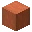</td>
			<td></td>
			<td></td>
			<td></td>
		</tr>
		<tr>
			<td>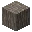</td>
			<td></td>
			<td></td>
			<td></td>
			<td></td>
			<td></td>
		</tr>
		<tr>
			<td colspan="2"></td>
			<td></td>
			<td></td>
			<td></td>
			<td></td>
		</tr>
	</tablebody>
</table>
<table>
	<tablebody>
		<tr>
			<td></td>
			<td>图标</td>
			<td>名称</td>
			<td>标签</td>
			<td>数量</td>
		</tr>
		<tr>
			<td></td>
			<td></td>
			<td>金合欢木</td>
			<td>acacia_wood</td>
			<td>1</td>
		</tr>
		<tr>
			<td></td>
			<td></td>
			<td>去皮金合欢木</td>
			<td>stripped_acacia_wood</td>
			<td>1</td>
		</tr>
	</tablebody>
</table>

---
<!-- stripped_birch_wood__from__stonecutting__use__birch_wood.md -->

<!-- zh_cn -->

## 去皮白桦木 | 切石机 | 白桦木

<table>
	<tablebody>
		<tr>
			<td colspan="6">切石机</td>
		</tr>
		<tr>
			<td colspan="2"></td>
			<td>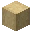</td>
			<td></td>
			<td></td>
			<td></td>
		</tr>
		<tr>
			<td>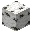</td>
			<td></td>
			<td></td>
			<td></td>
			<td></td>
			<td></td>
		</tr>
		<tr>
			<td colspan="2"></td>
			<td></td>
			<td></td>
			<td></td>
			<td></td>
		</tr>
	</tablebody>
</table>
<table>
	<tablebody>
		<tr>
			<td></td>
			<td>图标</td>
			<td>名称</td>
			<td>标签</td>
			<td>数量</td>
		</tr>
		<tr>
			<td></td>
			<td></td>
			<td>白桦木</td>
			<td>birch_wood</td>
			<td>1</td>
		</tr>
		<tr>
			<td></td>
			<td></td>
			<td>去皮白桦木</td>
			<td>stripped_birch_wood</td>
			<td>1</td>
		</tr>
	</tablebody>
</table>

---
<!-- stripped_dark_oak_wood__from__stonecutting__use__dark_oak_wood.md -->

<!-- zh_cn -->

## 去皮深色橡木 | 切石机 | 深色橡木

<table>
	<tablebody>
		<tr>
			<td colspan="6">切石机</td>
		</tr>
		<tr>
			<td colspan="2"></td>
			<td>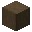</td>
			<td></td>
			<td></td>
			<td></td>
		</tr>
		<tr>
			<td>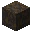</td>
			<td></td>
			<td></td>
			<td></td>
			<td></td>
			<td></td>
		</tr>
		<tr>
			<td colspan="2"></td>
			<td></td>
			<td></td>
			<td></td>
			<td></td>
		</tr>
	</tablebody>
</table>
<table>
	<tablebody>
		<tr>
			<td></td>
			<td>图标</td>
			<td>名称</td>
			<td>标签</td>
			<td>数量</td>
		</tr>
		<tr>
			<td></td>
			<td></td>
			<td>深色橡木</td>
			<td>dark_oak_wood</td>
			<td>1</td>
		</tr>
		<tr>
			<td></td>
			<td></td>
			<td>去皮深色橡木</td>
			<td>stripped_dark_oak_wood</td>
			<td>1</td>
		</tr>
	</tablebody>
</table>

---
<!-- stripped_jungle_wood__from__stonecutting__use__jungle_wood.md -->

<!-- zh_cn -->

## 去皮丛林木 | 切石机 | 丛林木

<table>
	<tablebody>
		<tr>
			<td colspan="6">切石机</td>
		</tr>
		<tr>
			<td colspan="2"></td>
			<td>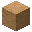</td>
			<td></td>
			<td></td>
			<td></td>
		</tr>
		<tr>
			<td>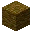</td>
			<td></td>
			<td></td>
			<td></td>
			<td></td>
			<td></td>
		</tr>
		<tr>
			<td colspan="2"></td>
			<td></td>
			<td></td>
			<td></td>
			<td></td>
		</tr>
	</tablebody>
</table>
<table>
	<tablebody>
		<tr>
			<td></td>
			<td>图标</td>
			<td>名称</td>
			<td>标签</td>
			<td>数量</td>
		</tr>
		<tr>
			<td></td>
			<td></td>
			<td>丛林木</td>
			<td>jungle_wood</td>
			<td>1</td>
		</tr>
		<tr>
			<td></td>
			<td></td>
			<td>去皮丛林木</td>
			<td>stripped_jungle_wood</td>
			<td>1</td>
		</tr>
	</tablebody>
</table>

---
<!-- stripped_oak_wood__from__stonecutting__use__oak_wood.md -->

<!-- zh_cn -->

## 去皮橡木 | 切石机 | 橡木

<table>
	<tablebody>
		<tr>
			<td colspan="6">切石机</td>
		</tr>
		<tr>
			<td colspan="2"></td>
			<td>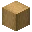</td>
			<td></td>
			<td></td>
			<td></td>
		</tr>
		<tr>
			<td>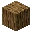</td>
			<td></td>
			<td></td>
			<td></td>
			<td></td>
			<td></td>
		</tr>
		<tr>
			<td colspan="2"></td>
			<td></td>
			<td></td>
			<td></td>
			<td></td>
		</tr>
	</tablebody>
</table>
<table>
	<tablebody>
		<tr>
			<td></td>
			<td>图标</td>
			<td>名称</td>
			<td>标签</td>
			<td>数量</td>
		</tr>
		<tr>
			<td></td>
			<td></td>
			<td>橡木</td>
			<td>oak_wood</td>
			<td>1</td>
		</tr>
		<tr>
			<td></td>
			<td></td>
			<td>去皮橡木</td>
			<td>stripped_oak_wood</td>
			<td>1</td>
		</tr>
	</tablebody>
</table>

---
<!-- stripped_spruce_wood__from__stonecutting__use__spruce_wood.md -->

<!-- zh_cn -->

## 去皮云杉木 | 切石机 | 云杉木

<table>
	<tablebody>
		<tr>
			<td colspan="6">切石机</td>
		</tr>
		<tr>
			<td colspan="2"></td>
			<td>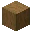</td>
			<td></td>
			<td></td>
			<td></td>
		</tr>
		<tr>
			<td>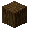</td>
			<td></td>
			<td></td>
			<td></td>
			<td></td>
			<td></td>
		</tr>
		<tr>
			<td colspan="2"></td>
			<td></td>
			<td></td>
			<td></td>
			<td></td>
		</tr>
	</tablebody>
</table>
<table>
	<tablebody>
		<tr>
			<td></td>
			<td>图标</td>
			<td>名称</td>
			<td>标签</td>
			<td>数量</td>
		</tr>
		<tr>
			<td></td>
			<td></td>
			<td>云杉木</td>
			<td>spruce_wood</td>
			<td>1</td>
		</tr>
		<tr>
			<td></td>
			<td></td>
			<td>去皮云杉木</td>
			<td>stripped_spruce_wood</td>
			<td>1</td>
		</tr>
	</tablebody>
</table>

---
<!-- stripped_crimson_hyphae__from__stonecutting__use__crimson_hyphae.md -->

<!-- zh_cn -->

## 去皮绯红菌核 | 切石机 | 绯红菌核

<table>
	<tablebody>
		<tr>
			<td colspan="6">切石机</td>
		</tr>
		<tr>
			<td colspan="2"></td>
			<td></td>
			<td></td>
			<td></td>
			<td></td>
		</tr>
		<tr>
			<td></td>
			<td></td>
			<td></td>
			<td></td>
			<td></td>
			<td></td>
		</tr>
		<tr>
			<td colspan="2"></td>
			<td></td>
			<td></td>
			<td></td>
			<td></td>
		</tr>
	</tablebody>
</table>
<table>
	<tablebody>
		<tr>
			<td></td>
			<td>图标</td>
			<td>名称</td>
			<td>标签</td>
			<td>数量</td>
		</tr>
		<tr>
			<td></td>
			<td></td>
			<td>绯红菌核</td>
			<td>crimson_hyphae</td>
			<td>1</td>
		</tr>
		<tr>
			<td></td>
			<td></td>
			<td>去皮绯红菌核</td>
			<td>stripped_crimson_hyphae</td>
			<td>1</td>
		</tr>
	</tablebody>
</table>

---
<!-- stripped_warped_hyphae__from__stonecutting__use__warped_hyphae.md -->

<!-- zh_cn -->

## 去皮诡异菌核 | 切石机 | 诡异菌核

<table>
	<tablebody>
		<tr>
			<td colspan="6">切石机</td>
		</tr>
		<tr>
			<td colspan="2"></td>
			<td></td>
			<td></td>
			<td></td>
			<td></td>
		</tr>
		<tr>
			<td></td>
			<td></td>
			<td></td>
			<td></td>
			<td></td>
			<td></td>
		</tr>
		<tr>
			<td colspan="2"></td>
			<td></td>
			<td></td>
			<td></td>
			<td></td>
		</tr>
	</tablebody>
</table>
<table>
	<tablebody>
		<tr>
			<td></td>
			<td>图标</td>
			<td>名称</td>
			<td>标签</td>
			<td>数量</td>
		</tr>
		<tr>
			<td></td>
			<td></td>
			<td>诡异菌核</td>
			<td>warped_hyphae</td>
			<td>1</td>
		</tr>
		<tr>
			<td></td>
			<td></td>
			<td>去皮诡异菌核</td>
			<td>stripped_warped_hyphae</td>
			<td>1</td>
		</tr>
	</tablebody>
</table>

