<table>
	<tablebody>
		<tr>
			<td>图标</td>
			<td>名称</td>
			<td>标签</td>
		</tr>
		<tr>
			<td>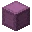</td>
			<td>潜影盒</td>
			<td>shulker_box</td>
		</tr>
		<tr>
			<td>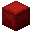</td>
			<td>红色潜影盒</td>
			<td>red_shulker_box</td>
		</tr>
		<tr>
			<td>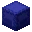</td>
			<td>蓝色潜影盒</td>
			<td>blue_shulker_box</td>
		</tr>
		<tr>
			<td></td>
			<td>青色潜影盒</td>
			<td>cyan_shulker_box</td>
		</tr>
		<tr>
			<td>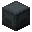</td>
			<td>灰色潜影盒</td>
			<td>gray_shulker_box</td>
		</tr>
		<tr>
			<td></td>
			<td>黄绿色潜影盒</td>
			<td>lime_shulker_box</td>
		</tr>
		<tr>
			<td>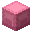</td>
			<td>粉红色潜影盒</td>
			<td>pink_shulker_box</td>
		</tr>
		<tr>
			<td></td>
			<td>黑色潜影盒</td>
			<td>black_shulker_box</td>
		</tr>
		<tr>
			<td>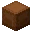</td>
			<td>棕色潜影盒</td>
			<td>brown_shulker_box</td>
		</tr>
		<tr>
			<td>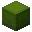</td>
			<td>绿色潜影盒</td>
			<td>green_shulker_box</td>
		</tr>
		<tr>
			<td>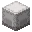</td>
			<td>白色潜影盒</td>
			<td>white_shulker_box</td>
		</tr>
		<tr>
			<td></td>
			<td>橙色潜影盒</td>
			<td>orange_shulker_box</td>
		</tr>
		<tr>
			<td>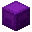</td>
			<td>紫色潜影盒</td>
			<td>purple_shulker_box</td>
		</tr>
		<tr>
			<td></td>
			<td>黄色潜影盒</td>
			<td>yellow_shulker_box</td>
		</tr>
		<tr>
			<td>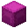</td>
			<td>品红色潜影盒</td>
			<td>magenta_shulker_box</td>
		</tr>
		<tr>
			<td></td>
			<td>淡蓝色潜影盒</td>
			<td>light_blue_shulker_box</td>
		</tr>
		<tr>
			<td>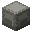</td>
			<td>淡灰色潜影盒</td>
			<td>light_gray_shulker_box</td>
		</tr>
	</tablebody>
</table>